# `just-dna-enricher` — the network tier

The package reference for **`just-dna-enricher`**: the only tier in the workspace allowed to fetch. It
*produces* the source-independent resolution table (`resolution.csv`) that the compiler *consumes*, and
carries the publisher surface for pushing compiled modules to HuggingFace. New in 0.5.

**Enrichment is partly validation, and that is a goal rather than a side effect.** Filling in what a
module left out is only half of what this tier does; the other half is checking what the module
*asserted* against what the sources actually say. It is the only tier that can: the format and compiler
tiers are inject-only by charter (Principle 2) and hold no reference to check anything against. So
surfacing a discrepancy — an authored `ref` that contradicts the genome, a source id that disagrees with
a locally-minted one, an rsID that maps somewhere else — is part of the job. Two rules govern every such
check: it **reports and never repairs** (silently rewriting an authored value destroys the evidence that
something upstream is wrong, and turns a loud data problem into a quiet one), and its **severity follows
the mode** (`best_effort` warns and carries on; `strict` refuses). What exists today:

| Check | Compares | Where |
|---|---|---|
| **Reference allele** | authored `ref` vs the actual reference sequence | `sequences.verify_reference_alleles` |
| **Wrong build** | a ref-mismatched row vs the same coordinate on GRCh37 (0.6) | `grch37.diagnose_wrong_build` (**warns in both modes**) |
| **VRS cross-check** | a source's own `vrs_id` vs the locally-minted one | `vrs.mint_resolution_rows` |
| **rsid↔coordinate** | an authored pair vs what the reference says | `compiler/resolution.py::_verify` over the injected table (warning), and `enrich()` against the injected Ensembl snapshot (`resolver.check_rsid_coordinates`, warning in both modes) — one question, two tiers, so one attestation name, and the enricher's half is the one that attests |
| **Ambiguous back-fill** | ≥2 rsIDs for one exact allele → recorded, never guessed | `resolver._lookup_rsid_candidates` |
| **Clinical significance** | authored `clin_sig` vs **every annotation authority** consulted — ClinVar and, since 0.7, PubMind — allele-exactly | `clinical.verify_clin_sig` (**warns in both modes**), persisted as the N-authority concordance record by `clinical.clin_sig_concordance` (0.7, RM130 + RM134 § B) |
| **Answered-call currency** | an authority's call **now** vs what it said when the author's `overrides.csv` answer was written (0.7, RM151) | `clinical.answered_call_shift` → `concordance.shifted_authority_calls` (**warns in both modes**; the baseline is the previous run's `clin_sig_authority_calls.csv`, so it is read before the commit rewrites it and a move is observable exactly once) |
| **PGx evidence level** | authored `evidence_level` vs ClinPGx's own for that annotation | `clinpgx.enrich_clinpgx` (**refuses in `strict`** — the only enricher cross-check that does) |
| **Citation existence** | a cited `pmid` vs PubMed | `literature.enrich_literature` |
| **Identifier agreement** | an authored `doi` vs the registry's for that PMID | `literature.enrich_literature` |
| **PMC id agreement** | an authored `PMC…` in the `pmid` cell vs PubMed's for that record (0.6) | `literature._pmcid_conflicts` (attested under `citation_identifier`, the same question one registry over) |
| **Article licence** | the cited article's own terms, recorded per article (0.6) | `literature.enrich_literature` → `licensing.article_terms` |
| **Provenance quote** | `provenance_quote`/`provenance_regex` vs open-access fulltext | `literature.enrich_literature` (warning; partial coverage) |
| **rsID currency** | an authored rsID vs dbSNP (live / merged / absent) | `identifiers.check_rsids` |
| **Trait currency** | `trait_efo_id` vs OLS4 (obsolete + replacement) | `identifiers.OntologyClient.trait` (attested by `check-identifiers` since RM72) |
| **Gene symbol currency** | `gene` vs HGNC approved / previous symbols | `identifiers.OntologyClient.gene` (attested by `check-identifiers` since RM72) |
| **Gene ↔ locus agreement** | the row's `gene` vs the chromosome its variant sits on (0.5.4) | `identifiers.check_identifiers` → `GeneLocusConflict` (attested since RM72) |
| **ACMG secondary findings** | authored `acmg_sf` vs the published SF gene list (v3.3 via `--sf-list`; the scraped v3.2 page reports `unverifiable`) | `acmg.check_acmg_sf` (attested by `check-acmg` since RM72) |
| **Allele function** | authored `function_status` vs PharmVar and CPIC | `pgx.enrich_pgx` (**warns in both modes**) |
| **Declared use** | the caller's `--use` vs a source's terms | `licensing.check_declared_use` (**refuses in both modes**) |
| **Drafted vs authored rows** | a source's current row vs the one already in the CSV | `just_dna_compiler.draft.append_rows` (reports `differs`; never rewrites) |
| **Source coverage** | is the locus inside the source's callset at all? `not_covered` ≠ `not_found` | `gnomad.covers_locus` → `frequencies.enrich_frequencies` (**not** a `strict` failure) |
| **Dataset currency** | a recorded `SourceRow.dataset` vs the release that source publishes **now** (0.7) | `currency.check_dataset_currency` → `enrich()` (reports; `strict` refuses over a superseded release, never over an unreachable source) |

**Every check that runs records what it did — `verification.json` (RM45, 0.6).** Until 0.6 the table
above described work whose result died with the process: a check's findings reached a log line and an
`EnrichmentResult` field, and the compiled module could not say whether the check had been put at all.
`just_dna_enricher.verification.record_verification` is the load-merge-write that closes that, in the
same shape `licensing.record_source_terms` has and for the same reason — a count of call sites goes
stale, one function does not. Four things to hold onto when wiring a new pass into it:

- **A record carries two counts and a closed skip key.** `ran(check, subjects=…, findings=…)` when it
  ran (`subjects=0` is a legitimate answer meaning nothing was in scope) and
  `skipped(check, reason, detail=…)` when it did not. Both vocabularies are closed
  (`VALID_VERIFICATION_CHECKS`, `VALID_VERIFICATION_SKIPS`); the human sentence rides in `detail`,
  beside the machine key and never instead of it.
- **The denominator comes from the check, never from the caller.** `verify_reference_alleles` returns
  a `RefCheck` and `compare_clin_sig` a `ClinSigComparison` (or `None`), so the count travels with the finding
  it belongs to: a count recomputed beside a check can disagree with it, and then the manifest's own
  two halves disagree. `_verification_records` deliberately takes neither `variants` nor `rows` — a
  function that cannot see the tables cannot be tempted to count them. Wiring this up surfaced a real
  hole in two passes: each had an *internal* skip (no sequence access; a snapshot present but not
  queryable) returning an empty list indistinguishable from a clean pass, which is S4's defect
  surviving inside the machinery S4 built.
- **The denominator is what was EXAMINED, not what existed.** The wrong-build pass is bounded
  (`DEFAULT_DIAGNOSIS_LIMIT`), so on a panel authored wholesale on hg19 it asks about a sample;
  recording `total` there would claim rows it chose not to ask about. `sampled` is why the two can
  differ, and the record's `detail` says so when they do.
- **A downstream check inherits the reason its upstream did not run.** The wrong-build pass reads the
  ref-mismatch list, and `diagnose_wrong_build([])` answers `no_ref_mismatches` for an empty list
  *whatever emptied it* — a ref check that ran clean, or one that never ran. Recording the first
  unconditionally publishes "no authored ref disagreed with the reference" beside a `reference_allele`
  record saying nothing was compared: one document contradicting itself, and the false half is the
  answered-absence-versus-unasked-question collapse S20 exists to prevent.
- **Every early return records its skip — as long as the check APPLIES.** `enrich_clinpgx` is the
  worked example: a licensing refusal and a missing snapshot both go through one `_attest` helper,
  because each says "this check applies to your module and did not run", and a pass that records its
  findings while staying silent about not having run leaves the manifest unable to tell those apart.
  Two paths deliberately attest nothing. A `strict` refusal raises, so no artifact was produced and
  there is nothing to attest a check against. And a module carrying no `pharm_variants.csv` is not a
  skip at all — the check does not apply, there is no claim to have an opinion about, and recording one
  would mine a nonce and create a `verification.json` on a module that never asked for one.
  `nothing_to_check` stays for a table that is present with no row in scope, which is a real answer.
  RM72's two commands follow that line exactly: **no `variants.csv` attests nothing** (`acmg_sf`,
  `gene` and `trait_efo_id` are all columns of it, so the check does not apply), while a failed
  lookup attests `unreachable` — the run with no report to print is the one where a reader most needs
  the record. `check-acmg` distinguishes the two ways it can raise for that purpose:
  `AcmgListUnavailable` carries the skip member (`unreachable` for a request that never answered,
  `no_reference` for a source that was there and carried no readable list), while a **`strict`
  refusal stays the plain exception and attests nothing** — the list was read and the question was
  answered, so recording a skip would say it was never put. When an attestation fails on the way out
  of an already-failing run it is reported, not raised: the reason the source could not be read is the
  sentence the author needs, and a layout complaint replacing it points at the wrong problem.
- **Two authorities answering one check still make one record, and the counts have to follow.**
  `allele_function` is compared against PharmVar *and* CPIC, so three things differ from the
  single-source passes. `subjects` is the alleles an authority **named back**, never the authored rows:
  a curator may state a function for an allele a point-in-time slice does not list, and counting that
  row would publish a comparison nobody put (the shortfall is named in `detail` instead). `findings`
  counts **alleles in dispute, not conflicts** — one authored status contradicted by both panels is one
  allele reported twice, and `VerificationRecord` rightly refuses `findings > subjects`. And `source`
  is filled only when exactly one authority is implicated, because it is a single join key into the
  licensing table: naming one of two would hide the other, and a comma-joined value would break the
  join the column exists for. With no leg answering, the reason is picked by precedence
  (`not_permitted` → `offline` → `unreachable` → `not_requested`) and the sentence names every absent
  leg — a licensing refusal is cleared by a *declaration*, so reporting it as `offline` would send a
  reader hunting a network problem that does not exist.
- **A check whose input has no producer records the skip, not the pass's own numbers.** `vrs mint`
  ends with a number out of a number, and that number is coverage, not a comparison: `vrs_allele_id`
  names the cross-check of a *source's* own `ga4gh:VA.…` against the locally minted one, whose input is
  `mint_resolution_rows(source_ids=…)` — and `resolution.csv` records ids without recording where an id
  came from, so no caller in the workspace fills that map. The command therefore records
  `nothing_to_check` with the coverage in `detail`, grouped by reason class. Recording the alleles it
  *named* as `subjects` would assert a comparison that was never made, which is exactly the trap the
  reference-allele pass fell into on an unbuilt assembly. (The coverage numbers are published already,
  by the compiler, as `manifest.compilation.vrs_alleles` / `vrs_alleles_identified` — this record is
  not their second home.)
- **A check with no lookup of its own still needs a reason ladder.** The rsid↔coordinate pass costs no
  request: it widens the rsID batch the resolver chain was already sending and compares the authored
  pairs against what came back (`resolver.check_rsid_coordinates`, one direction — the converse needs a
  position→id lookup at `chrom:start:ref` granularity, and the reverse map `enrich()` holds is
  allele-exact, so asking it would report a spelling difference as a contradiction). The verdict is
  three-valued and compared at `chrom:start`: `ref` is optional on the PGx models — `pgx_draft` writes
  exactly that shape — and a `ref` that disagrees with the reference is the reference-allele check's
  finding, so including it would give one defect two names. A differing position is a contradiction
  only where every side is a **substitution**; an indel re-anchors legitimately (RM31), so that pair is
  undecided rather than reported. What the cheapness pays back is ways not to run: no row authoring
  both halves (`nothing_to_check`, tested first — a module with no pair has no assembly question
  either), a non-GRCh38 module (`unsupported`, since every resolver link is gated on the build), no
  snapshot opened (`offline` or `no_reference`), and a snapshot that settles none of the pairs —
  `no_reference` again, never `ran(0, 0)`, because a record of a check that ran over nothing reads as a
  clean bill. Everything not compared stays **outside** the denominator and inside the record's
  `detail`, grouped by reason.
- **One proof-of-work per call, so a pass collects its records and writes once.** `enrich()` writes all
  five of its checks at the end of the run, `enrich_literature` its three, `check-identifiers` its
  three. The merge is what keeps every command in one document, replacing per check and never erasing
  a check this run did not put — and until `literature` was wired in there was no second writer at
  all, so the merge was machinery tested only against a document nothing produced.
- **A skip does not displace an answer the document already holds (RM72, 0.6) — while the authored
  bytes stand still.** The merge was unconditional newest-wins, so `check-acmg --offline` after a real
  run, or `check-identifiers --no-traits` after a full one, rewrote a true `subjects=13, findings=0`
  verdict to `subjects=0, skipped=offline`: an answer turned into "never asked" by a run that learned
  nothing. The argument is the merge's own, one step further out — a skip **is** a run that did not
  put the question, the same fact as an absent check spelled as a record instead of as a silence, so
  the protection that already covered the absent check covers this one. Newest-wins still holds
  between two records of the same disposition. This mattered more than it looked: every check wired
  after it merges through the same function, so wiring four more members into a rule that can silently
  downgrade them multiplies the defect by four. **The condition is what keeps the fix from being a
  regression**: an answer earns protection by still describing *this* module, so once the authored
  bytes have moved (`VerificationDoc.module_hash` against the current binding) a fresh "could not ask"
  wins — which is exactly what `literature` relies on when a module's citations change, and a stale
  finding no authored edit could clear is a defect this project has removed elsewhere. The
  counter-argument — that a reader may want to know today's run could not reach the source — is
  answered rather than dismissed: that is a fact about the **run**, and this is a per-check document,
  so it would need a run-level place, which is a different question and is not opened.
- **The merge carries the author's CLOSURE across, and only while the authored bytes stand still
  (RM73, 0.6).** `just-dna-compiler close` writes a `closure` block into the same document, so this
  pass — which rebuilds it rather than editing it — would have dropped a field it did not know about,
  silently and on every run. Enrichment writes only *derived* sidecars, which are outside the binding,
  so the ordinary case is that nothing the author closed has changed and un-closing it would train an
  author to stop closing. Where the authored bytes **have** moved, the closure is dropped rather than
  re-bound: carrying it would have this pass assert *a human declared these bytes final* about bytes
  that human never saw. Only the author may make that claim again. This is the never-clobber trap one
  column over from `SourceRow.dataset` and `draft_digest`, and the rule generalizes — when another
  tier starts writing into a document this one rebuilds, ask what the rebuild silently discards.
- **A pass has ONE subject set, and the gate and the record both read it.** `literature` is the worked
  example and it got this wrong three ways at once, all the same shape. `literature.csv` is the pin —
  merge-not-clobber means a re-run refetches nothing — so anything counted inside the fetch loop is a
  count of *this run's requests*: the `strict` gates saw an empty list and refused nothing while the
  attestation, reading the rows, reported the finding, so **whether `--strict` refused depended on how
  many times `--best-effort` had run first**, and the module could ship a manifest naming a defect its
  own strict compile had just blessed. The subject set is now the citations the module makes *now*,
  answered by the rows the sidecar holds *now*, and every number — CLI report, refusal, record — comes
  off it. Two consequences worth copying. A comparison the sidecar does not pin is **re-made over every
  row** rather than over the fetched ones (that is how an existing `literature.csv` came to hide every
  DOI/PMC id conflict). And the set is the **cited** rows, not the whole file: the sidecar keeps a row
  for a citation the author has since deleted, and counting it produced a finding no authored edit
  could clear, which this project treats as a defect wherever else it appears.
- **A no-op run records nothing; it does not record a zero.** `literature --offline` fetches nothing
  and re-examines nothing, so on a module that already carries a `literature.csv` pinning the
  citations it makes now, it writes no records at all and the earlier ones stand: a run that has said
  nothing has nothing to record. With no pin covering those citations there is no answer this run
  could protect, so the three skips are written and say why — and after an online run that state is
  reached only by the citations having changed, which is the case the merge rule above deliberately
  lets a skip win. (This bullet used to argue the silence from the merge replacing per check. That was
  the merge's defect rather than an argument, and RM72 fixed it.)
- **`literature` puts three questions with three different denominators, and one record cannot carry
  them.** Every citation gets an existence verdict; only some carry an authored DOI or PMC id to
  compare; fewer still carry a quote whose article could be read. So `provenance_quote` counts the
  quotes a retrieved text *settled* — never the quotes authored — with the remainder in `detail`, and
  it is a **skip** (`no_reference`) rather than `subjects=0` when nothing was settled at all, since a
  zero out of zero on a check that could not run is exactly the clean-looking pass this whole item
  exists to stop. An abstract-only search settles a hit and nothing else. The remainder itself splits
  in two and the two must not be one sentence: an article whose text could not be read, and a quote
  **nobody went looking for** because the sidecar's pinned counts do not describe the quotes the
  module carries now. Only the second is cleared by deleting the sidecar, and calling it a retrieval
  failure is flatly false for an open-access article that was read on the previous run. The pinned
  count has to *match*, not merely be non-zero — a row pinned at two quotes says nothing attributable
  about the one that is left, so the whole row goes unexamined rather than carrying a finding about a
  quote the module no longer makes. Same rule on the identifier check: a citation drops out of the
  comparison because PubMed named no identifier *or* because a curator wrote that row, and reporting
  the second as the first is a claim about PubMed nobody established. And a DOI has **three** states
  rather than two: resolved, a pinned verdict about a DOI the module no longer cites
  (`LiteratureRow.doi_checked` is what makes that visible — without it, correcting a bad DOI made the
  finding follow the correction), and one no run ever put the question for, which is what a
  `--no-doi` run followed by a plain one leaves behind. Both ride in `detail` rather than shrinking
  the denominator, since the PubMed half of those citations really was answered.
- **The attestation is bound to the module's authored bytes.** Edit `variants.csv` afterwards and the
  compiler drops the block with a warning — correctly, because the checks were put against rows that no
  longer exist. Re-running the pass re-attests. Currency of the *source* is a different question and is
  read off each record's own `release`.

**Which of these attest, and which are recording passes rather than checks.** `VALID_VERIFICATION_CHECKS`
has eighteen members and sixteen have an emitter — `test_verification_record.py` walks the vocabulary
and names the two that are reserved without one, so read the count off that test rather than off this
sentence, which has been wrong twice. `enrich()` attests six (reference allele, wrong build, clinical
significance, rsID currency, rsid↔coordinate, dataset currency), `enrich_literature` three (citation existence,
identifier agreement, provenance quote), `check-identifiers` three (gene symbol currency, trait
currency, gene↔locus agreement), and `enrich_clinpgx`, `pgx`, `vrs mint` and `check-acmg` one each.
The last four members were wired in **RM72** (0.6): the two check commands put a real
authored-versus-source question, reported it to stdout, and let the record die with the process, which
is the sentence RM45 exists to end. What blocked them was their own printed promise to *write
nothing*; that promise is now the narrower and truer one — **writes no authored cell, and records
that the question was put** — because there is no other home for *was this check run*. It cannot be
offloaded downstream (a consumer holding the artifact cannot tell "asked and clean" from "never
asked", which is the whole of RM45) and it cannot go in the authored section (an author does not
attest to a check they did not run). The record is **unconditional**, with no `--attest` flag: an
optional record is ambiguous between *the check was not run* and *it ran without the flag*, which
reintroduces the two-readings-of-one-absence defect the skip vocabulary was built to end. Filling
`acmg_sf` or a gene symbol from the registry being asked about it stays refused whatever the
attestation does — that is `hints.REDUNDANCY_BEARING`, and it is why these are open-ended checks
rather than an apply route. The **two remaining members are reserved, and each says so in the code**
(`vocab.VALID_VERIFICATION_CHECKS`): `gene_disease_validity` and `dosage_sensitivity` have no emitter
because `enrich_gene_validity` and `enrich_dosage_sensitivity` *record* ClinGen/GenCC verdicts into a
derived table and compare nothing authored. Wiring them would report a check where no question was
put. The line
that decides whether a pass belongs in `VALID_VERIFICATION_CHECKS` at all is whether it compares
something the module **asserts** — so `gene_validity.csv` and `clinical_assertions.csv`, which record
what ClinGen and ClinVar say and adjudicate nothing, have no check name and must not gain one: a
member for them would let a manifest report a check where no question was put. `frequencies.csv`,
`gene_metrics.csv` and the per-article licence columns are the same class. The three rows in the table
above that are recording rather than comparing — **Ambiguous back-fill**, **Article licence** and
**Source coverage** — are kept here because a reader wants the whole surface in one place, and they are
named as the exception rather than left to be inferred.

**Two of these break the severity rule in opposite directions, and both are deliberate.** The
allele-function check joins the clinical cross-check in warning under `strict` too: PharmVar and CPIC
are different expert panels — one assigns a molecular function, the other a clinical one — and they
genuinely disagree about some alleles, so failing a compile would make the format arbitrate between
the two authorities it depends on. The declared-use gate goes the other way and **refuses in both
modes**, because it is not a finding about the data at all: it is a statement that the fetch is not
permitted, and `best_effort` means "resolve what you can", never "take what you may not".

**The clinical cross-check warns in `strict` too.** Every other check compares an authored value against a *fact* — the
genome's bases, a deterministic digest, a registry's own id — where the source is simply right. A
`clin_sig` disagreement is two opinions differing, and ClinVar is not truth: a curator who has read the
primary literature and disagrees with a one-star submission is doing their job. Failing the compile
would make the format arbitrate a clinical dispute, which the data-agnostic charter forbids. The
finding therefore carries ClinVar's review-star count so a reader can weigh it themselves.

The division of labour with the compiler is a consequence of Principle 2, not a coincidence: a check
that can be settled by **computation over injected data** belongs in the compiler (it runs on every
compile, offline, and cannot be bypassed), while a check that needs **a reference** can only live here.
`ref` validation is the clean example — the compiler can catch two rows contradicting *each other*
about a reference base, and only the enricher can catch a row contradicting *the genome*. See
[COMPILER.md § what the compiler can and cannot validate](COMPILER.md) for the full division, including
the blind spots neither tier can close.

The dependency arrow points **inward** — `enricher → compiler → format` — so `httpx` / `tenacity` /
`huggingface_hub` never enter the compile path. `just-dna-format` and `just-dna-compiler` stay strictly
inject-only (CONSTITUTION Principle 2). HuggingFace is permitted **only here** (the 0.5 amendment scopes
the Non-goal HF ban to format + compiler); the compiler reaches this package solely through a *guarded
lazy import* on its deprecated `ensembl_cache` path — it declares no dependency on the enricher.

> Companion docs: **[COMPILER.md](COMPILER.md)** (what consumes `resolution.csv`),
> **[SCHEMAS.md](SCHEMAS.md)** (`ResolutionRow` and the three hashes), **[CONSTITUTION.md](CONSTITUTION.md)**
> (the 0.5 amendment). Import from the submodule where a symbol lives; `__init__.py` has no re-exports.

## Read beside this: the 2026-08-18 code-first re-derivation

**A second reading of this tier, written from the code alone on 2026-08-18, is in
[audit/ENRICHER_FROM_CODE.md](audit/ENRICHER_FROM_CODE.md)** — all 37 commands, the resolver chain with
what `--offline` changes per pass, and the six caches. It found RM97–RM100, all fixed in 0.6.1.
Evidence, not contract: this document is the maintained one.

## Install

```
pip install just-dna-enricher          # runtime: enrich (caches, live Ensembl, live gnomAD, VRS minting)
pip install 'just-dna-enricher[dev]'   # + publisher surface (module/reference upload), snapshot builders (polars), tests
```

`ga4gh.vrs` is a **core** dependency, not an extra. Minting a *substitution*'s VRS allele id is stdlib
and lives in the format tier, but justifying an **indel** needs the reference sequence — and reading
sequence is network access, which is this tier's whole job. The plan for this work budgeted for
`ga4gh.vrs[extras]` (`seqrepo` + `pysam` + `hgvs`: a compiled extension plus a multi-gigabyte local
sequence store) on the assumption that a *local* seqrepo was required. Probing showed it is not — core
`ga4gh.vrs` with the seqrepo **REST** data proxy normalizes indels over HTTP for 14 pure-Python
packages and no compiled dependencies. At that price there is no reason to make complete allele
identity opt-in, so it is the default and `--offline` is the only thing that turns it off.

Requires Python `>=3.13` (the compiler's floor — deliberately **not** ensembl-mcp's `>=3.14`; the query
core was ported, not depended on, dropping `fastmcp`/`eliot`). In the workspace:
`uv sync --package just-dna-enricher --group dev`.

## Module map

| Module | Role | Notable deps |
|---|---|---|
| `enrich` | orchestration: `enrich()` runs the resolver chain, writes `resolution.csv` | compiler `_load_csv_rows`, format `ResolutionRow` |
| `transaction` | **0.7** (RM128): the run's durability — staged answers beside the target, the advisory `flock` over the read-modify-write window, and the `(done, total)` progress unit | format `atomic_writer`, stdlib `fcntl` |
| `resolver` | the DuckDB rsid↔coord resolver (moved from the compiler in 0.5) | `duckdb`, format |
| `clinvar` | the DuckDB ClinVar resolver link (`lookup_loci`) + the annotation reader (`lookup_clin_sig`) | `duckdb`, format |
| `clinical` | the `clin_sig` cross-check over the ClinVar snapshot (offline, reports only) | format |
| `clin_sig` | **0.7**: the one raw-significance → `VALID_CLIN_SIG` normalizer, shared by every source that reports one. Dependency-free on purpose, so a runtime pass reads it without the `[dev]` extra | format `VALID_CLIN_SIG` |
| `net` | shared HTTP politeness: `PacingGate`, `batched`, `dedupe` | stdlib |
| `eutils` | NCBI E-utilities client (esummary), shared by the literature and rsID checks | `httpx`, `tenacity` |
| `literature` | pass 4: a module's citations (`studies.csv` + binning `pmid`s) → `literature.csv` (PubMed + Europe PMC), fulltext quote match, per-article licence, PMCID→PMID | `httpx`, `tenacity` |
| `identifiers` | rsID / trait-CURIE / gene-symbol currency (dbSNP, OLS4, HGNC) | `httpx`, `tenacity` |
| `licensing` | per-source terms + the declared-use gate; emits `SourceRow` | format `SourceRow` |
| `clingen` | ClinGen dosage sensitivity → `gene_metrics.csv` rows (CC0, so a module stays sellable) | `httpx`, format |
| `gene_validity` | RM24: curated gene–disease assertions → `gene_validity.csv` (ClinGen expert panels, GenCC's aggregate; both CC0) | `httpx`, format |
| `assertions` | RM25: `resolution.csv` + the ClinVar snapshot → `clinical_assertions.csv` (the call **and** the review tier) | `duckdb` via `clinvar`, format |
| `gwas` | RM90: the GWAS Catalog REST API → `gwas_effects.csv` (published effect sizes **with their units**). Fills no `weight` | `httpx`, format |
| `pgx_draft` | the first drafting provider: CPIC → `haplotypes`/`allele_function`/`diplotypes` rows | `cpic`, compiler `draft` |
| `clinpgx_draft` | RM26: ClinPGx snapshot → `pharm_variants.csv` rows (offline, inject-only) | `clinpgx`, compiler `draft` |
| `clinvar_draft` | RM26: ClinVar snapshot → `variants.csv` **partial** rows; genotype left to a human | `clinvar`, compiler `draft` |
| `clinvar_build` | `[dev]`: VCF → snapshot parquet; `var_citations.txt` → `citations/` (+ its own `release.json` block) | `polars`, `httpx` |
| `lookup` | authoring lookups — rsID validity/loci, ref/alts + populations, which paper a PMID names. **Writes nothing** | every client above, compiler `hints` |
| `pharmvar` | star-allele definitions + function (`Api-Key` header, 2 rps) | `httpx`, `tenacity` |
| `cpic` | allele function, diplotype→phenotype, defining variants (PostgREST) | `httpx`, `tenacity` |
| `pgx` | pass 5: cross-check star-allele tables, write the licence table | the three above |
| `clinpgx_build` | `[dev]`: `clinicalAnnotations.zip` → snapshot parquet + pinned `LICENSE.txt` | `polars`, `httpx` |
| `clinpgx` | pass 6: evidence-level cross-check over the snapshot (offline) | `duckdb` (core, not polars) |
| `clinvar_build` | **`[dev]`** builder: ClinVar VCF → per-chromosome parquet snapshot + `release.json` | `polars` (lazy), `httpx` |
| `gnomad` | live gnomAD GraphQL: batched + paced rsid resolution, frequency, gene constraint | `httpx`, `tenacity` |
| `frequencies` | pass 2: `resolution.csv` → `frequencies.csv` (per-ancestry-group AC/AN) | compiler `load_csv_rows`, format |
| `gene_metrics` | pass 3: the module's genes → `gene_metrics.csv` (snapshot first, live API second) | `duckdb`, format |
| `constraint_build` | **`[dev]`** builder: gnomAD constraint TSV → gene-level parquet + `release.json` | `polars` (lazy), `httpx` |
| `vrs` | GA4GH VRS allele-id minting onto `resolution.csv` (substitutions stdlib, indels normalized) | `ga4gh.vrs` |
| `sequences` | reference-sequence access (cached) + the reference-allele check | `ga4gh.vrs` |
| `locations` | cache-location resolution for all **seven** snapshots + `.env` (moved from the compiler) | `platformdirs`, `python-dotenv` |
| `download` | HuggingFace **snapshot** download (Ensembl, ClinVar, constraint, ClinPGx, CPIC; footer-checked, atomic). **No PharmVar and no PubMind** — see *The caches* | `huggingface_hub` (lazy) |
| `cpic_build` | **`[dev]`** builder (0.5.1): the whole CPIC PostgREST database → five parquets + `release.json` | `polars` (lazy), `cpic` |
| `pharmvar_build` | **`[dev]`** builder (0.5.1): `/genes` → alleles + defining variants. Operator-built, never published | `polars` (lazy), `pharmvar` |
| `pubmind_build` | **`[dev]`** builder (0.7, RM134): the ANNOVAR-distributed PubMind table → one parquet + `release.json`. Operator-built, and `pubmind publish` **refuses** | `polars` (lazy), `httpx`, `clin_sig` |
| `ensembl` | live Ensembl: V2 GraphQL → V1 REST fallback, tenacity | `httpx`, `tenacity` |
| `upload` | publisher surface — push a compiled module or a reference snapshot to HF (`[dev]`) | `huggingface_hub` (lazy) |
| `cli` | Typer app: `enrich`, `frequencies`, `gene-metrics`, `gene-validity`, `assertions`, `enrich-and-compile`, `upload`, `cache status`/`pull`, `clinvar`/`gnomad constraint`/`cpic`/`clinpgx`/`pharmvar`/`pubmind` builders — `build+publish` for the first four, **`build` only** for `pharmvar` (there is no `pharmvar publish` and there will not be) and `pubmind`, whose `publish` exists and refuses with its reason, `vrs mint` | `typer` |

## Rate limits (public APIs)

Every live client that can fire more than a handful of requests goes through `net.PacingGate`
(injectable clock, pace-before-retry). Snapshot / one-shot downloads are listed too so the full
egress surface is in one place. **Published** is what the service documents; **our pace** is what
the client actually waits; when the source publishes nothing, the gate is a courtesy, not a claim
that the ceiling is known.

**One `PacingGate` is safe to share across threads, and that is now a stated contract rather than an
accident of who happened to call it** (S15). It matters because the injection API asks for sharing:
`LookupClients` tells callers to hold a client and reuse it — a fresh one per question would discard
exactly this state — so a server running blocking work through a thread pool ends up with several
workers on one gate by following our own advice. Until 0.5.4 `wait()` read `last`, slept, then wrote it
with no lock, so two workers could both find the interval elapsed, both skip the sleep, and turn a
published 3/s budget into 6/s — a budget somebody else enforces by blocking the operator's IP. The lock
covers the bookkeeping only: each caller reserves the next free slot and waits for it alone, so N
callers get N slots spaced one interval apart and no worker is blocked by another's sleep.
Single-threaded behaviour is unchanged, and `test_net.py` proves the spacing on a frozen clock without
really sleeping.

| Service | Used by | Published budget | Our pace / batching | Auth / identity |
|---|---|---|---|---|
| **gnomAD GraphQL** | `gnomad` (resolve, frequencies, live constraint) | **10 req / IP / 60 s** | `min_request_interval=6.0` (exactly that budget); GraphQL alias batches of **20** (25 worked live; 29 → HTTP 400) ≈ 200 variants/min | none |
| **NCBI E-utilities** | `eutils` → literature + rsID currency | **3 req/s** without a key; **10 req/s** with `NCBI_API_KEY` | `1/3 s` or `1/10 s` from whether the key is present; esummary batches of **200** | `tool=just-dna-enricher`; `email` from `JUST_DNA_CONTACT_EMAIL` when set; key optional |
| **PharmVar** | `pharmvar` / `pgx` | **2 req/s** (OpenAPI “Limitations”) | `PHARMVAR_MIN_INTERVAL=0.5` | `Api-Key` header from `PHARMVAR_API_KEY` (personal; never written to a module) |
| **Crossref** | `literature.CrossrefClient` (DOI existence) | **polite pool**: 10 req/s single-DOI (5 public); concurrency 3 polite / 1 public (Crossref docs, Dec 2025 revision) | `min_request_interval=0.1` (10/s — polite single-DOI ceiling) | User-Agent `just-dna-enricher (mailto:…)` when `JUST_DNA_CONTACT_EMAIL` is set → polite pool; omitted rather than invented |
| **Europe PMC** | `literature.EuropePmcClient` (OA fulltext + abstracts + per-article licence) | no durable official figure on the developer pages (community reports vary) | `min_request_interval=0.5` (2/s), batches of **25** on `search` | none |
| **PMC ID converter** | `literature.PmcIdConverterClient` (PMCID → PMID, reporting only) | no published figure; the service documents a **200-id** batch ceiling | `min_request_interval=0.5` (2/s), batches of **200** | `tool=just-dna-enricher`; `email` from `JUST_DNA_CONTACT_EMAIL` when set |
| **OLS4 + HGNC** | `identifiers.OntologyClient` | neither publishes a documented limit | `min_request_interval=0.2` (courtesy — GET-per-id, unbatched) | `Accept: application/json` |
| **Ensembl REST** (`rest.ensembl.org`) | `ensembl` V1 fallback | **15 req/s** per IP, **~55 000 / rolling hour**; 429 + `Retry-After` / `X-RateLimit-*` | **no `PacingGate`** — live path is the last link after cache/snapshot, so volume stays low; tenacity on transport only | none |
| **Ensembl GraphQL** (`beta.ensembl.org`) | `ensembl` V2 first try | unpublished (beta) | **no `PacingGate`**; 5xx falls through to REST | none |
| **CPIC** (`api.cpicpgx.org`) | `cpic` / `pgx_draft` | unpublished | **no `PacingGate`** — coarse PostgREST GETs (gene-scoped), not per-allele loops | none |
| **ClinPGx** | `clinpgx` / `clinpgx_draft` | n/a at runtime | **offline snapshot only** for the check/draft path — no live poll budget | none (live API retired → snapshot) |
| **seqrepo REST** (`services.genomicmedlab.org`) | `sequences` / VRS indel mint | unpublished | **no `PacingGate`**; in-process memo of window reads | none |
| **GWAS Catalog REST** (`www.ebi.ac.uk/gwas/rest/api`) | `gwas` | **none established** — EBI publishes no numeric budget for this API, unlike gnomAD's real and load-bearing 10/60s | `DEFAULT_REQUEST_INTERVAL=1.0` — a **courtesy, not a transcribed limit**. Cost is `1 + 2N` per variant (the study/trait facts sit behind `_links`); measured at **382 requests for one real module**, and `--no-study-facts` drops it to one per variant | none |
| **ClinGen** dosage TSV | `clingen` | n/a (one file) | single download, then local parse | none |
| **ClinGen** gene-validity CSV | `gene_validity` | n/a (one file, ~1 MB) | single download, then local parse | none |
| **GenCC** submissions CSV | `gene_validity` | n/a (one file, ~28 MB) | single download, then local parse; the client's timeout is 180 s because one response *is* the whole export | none |
| **ACMG SF list** | `acmg` | n/a | one HTML GET (~75 KB) or a local `--sf-list` workbook | none |
| **Hugging Face Hub** | `download` (snapshots), `upload` (modules / references) | **5-minute fixed windows**, three buckets — see below | **no custom gate**; `huggingface_hub` handles 429 via `RateLimit` / `RateLimit-Policy` headers (smart retry in 1.2+) | `HF_TOKEN` / `hf auth login` — anonymous shares a per-IP pool; a free token is the usual fix |

### Hugging Face Hub tiers (as of Sep 2025)

Quotas are per **5-minute** window. Snapshot provisioning (`ensure_*`) and publisher upload both hit
**API** (listing / commits) and **Resolvers** (`/resolve/` file bytes). Pages is the website and is
not on our path. Numbers marked `*` are subject to change with platform health.

| Plan | API | Resolvers | Pages |
|---|---|---|---|
| Anonymous (per IP) | 500 * | 3,000 * | 100 * |
| Free user | 1,000 * | 5,000 * | 200 * |
| PRO | 2,500 | 12,000 | 400 |
| Team org | 3,000 | 20,000 | 400 |
| Enterprise | 6,000 | 50,000 | 600 |
| Enterprise Plus | 10,000 | 100,000 | 1,000 |
| Enterprise Plus + org IP ranges | 100,000 | 500,000 | 10,000 |
| Academia Hub org | 3,000 | 20,000 | 400 |

Org limits apply **per member**, not shared. Source of truth:
[huggingface.co/docs/hub/rate-limits](https://huggingface.co/docs/hub/en/rate-limits). Always pass
`HF_TOKEN` for snapshot download when possible — anonymous traffic is the usual cause of a “stuck”
`ensure_snapshot` (the client is sleeping on a 429, not hanging).

### Rules that follow from the table

- **Pace before retry.** `tenacity` backs off on transport / 429, but a blind retry spends the same
  budget that caused the 429; every gated client waits first.
- **Reuse clients.** A `PacingGate` is per-client state — constructing a fresh gnomAD / eutils client
  per lookup throws the interval away (`lookup` holds them for that reason).
- **Batch where the API allows it.** gnomAD aliases (20) and NCBI esummary (200) exist because the
  published ceilings make one-id-per-request unusable; PharmVar is the opposite — 2 rps forces
  gene-scoped endpoints, never per-allele.
- **No response cache for the live clients.** NCBI / PharmVar / gnomAD GraphQL / Crossref / Europe PMC
  / OLS4 / HGNC / live Ensembl are paced only. Persistence is the authored sidecars
  (`resolution.csv`, `frequencies.csv`, …) and the HF parquet snapshots (Ensembl, ClinVar, gnomAD
  constraint) — delete a sidecar to force a refetch. Note which entries in that list are also the
  **licence-gated** ones: CPIC and PharmVar are paced-only *and* forbid sale, so they are the two RM38
  gives a snapshot (see *On a host, or in a service* below).
- **A shared IP shares one budget.** Every figure above is per-IP or per-token, never per caller, so a
  hosted deployment multiplies its users onto one allowance rather than getting one each. This is a
  *separate* reason from licensing for reaching a source through a snapshot, and it applies to ungated
  sources too — it just happens that the gated ones are where both reasons land at once.
- **`--offline`** clamps to local caches / sidecars; it does not invent a budget for a live API.
- **The retry ceiling is a floor a deployment can raise — `$JUST_DNA_HTTP_RETRY_ATTEMPTS` (RM42).**
  Three attempts is right for the audience the CLI was written for: a person who would rather see a
  failure in ten seconds than wait out a flapping upstream. It is wrong for the other shape the 0.5
  tiering created — a **server** running `enrich()` inside an unattended publish, where giving up on a
  transient 502 costs the publisher a whole re-upload rather than ten seconds. Two callers wanting
  opposite things from one constant is a knob, and it was an import-time decorator argument with no
  parameter, so a consumer's only route was to walk the package and reassign `policy.stop`.

  `net.attempt_floor(n)` resolves per call. It **raises** each client to at least the configured value
  and never lowers one, so the deliberate per-client tuning survives — gnomAD and eutils sit at 4
  because their budgets are tightest, and a value that *set* every client would flatten that. Safe to
  raise precisely because every gated client paces *before* it retries: an extra attempt spends a slot
  of the published budget rather than bursting past it. Only a bare `stop_after_attempt` is replaced —
  a composed `stop_after_attempt(3) | stop_after_delay(60)` means *both*, and raising one term would
  silently change a policy whose author meant the conjunction. None of the nine is composed today.

## The author's overlay, read but never written (RM136, 0.7)

The compiler applies `overrides.csv` before any check reads a row — a check must report on what the
module **asserts**. Until 0.7 this tier did not, so an author who corrected a `resolution.csv` cell
through the overlay went on being told the same finding on every run, with no way to clear it and
nothing saying the correction had been recorded and honoured one tier over.

Three rules, and each has a refused alternative worth knowing:

* **Read-only.** The enricher never *writes* through the overlay. An overlay row is the author's answer
  to a difference, never this tier's (RM83).
* **Input reads only.** `licensing.overlaid_input_rows` is called where a pass reads a derived table as
  an **input to something else** — `frequencies`, `assertions`, and `identifiers`' gene-locus check all
  read `resolution.csv` that way. **Every merge baseline stays raw**: a pass that reads its own output
  file to merge against it writes that file back, and post-overlay rows would bake the correction into
  the derived table. Read the file you write, and write what you read.
* **Per field.** `licensing.overlay_answers(spec_dir, table)` returns the `(subject, field)` pairs an
  `update` names. A finding is answered when the overlay corrects the very cell the finding is about,
  so a coordinate correction silences the coordinate check and leaves an unrelated `clin_sig` finding
  standing. Per *row* was cheaper and was refused — it would silence findings the author never looked
  at, which is the silent-suppress hole the overlay's own design calls its worst case.

**There is no second implementation of the overlay**, deliberately: `compiler.load_overlay` is public
for this, and `overlaid_input_rows` calls the same `apply_overrides` the compiler calls. Two copies
would drift on the normalization seam that produced a silent P7 break in this feature's first week, and
a test compares the helper's output against `apply_overrides` directly so a future copy would show.

**Answered is not agreed.** The rsid↔coordinate check is the one wired to this today, and an answered
pair **leaves `disagreements` while staying inside `subjects`**, counted by `PairCheck.answered` and
reported as one INFO line naming what happened. The comparison ran and found a difference; removing it
from the denominator would publish a cleaner module than there is. Only `update` counts — an `insert`
answers no prior finding, and a `suppress` is already reported in its own right by RM131.

Wiring a further check to the answered set is deliberate rather than automatic, because *which cells
does this comparison read* is a per-check fact (`resolver._COORDINATE_FIELDS` is the first one written
down) and guessing it wrong silences a finding nobody answered.

**A second answered-set reader arrived with RM151, and it reads the overlay the other way round.**
`licensing.overlay_answered_subjects(spec_dir, table)` returns the `(subject, member)` pairs the
overlay names — **every operation and every field**, which is the opposite rule from `overlay_answers`
above and is right for the opposite direction. `overlay_answers` decides whether a finding may be
*silenced*, so it insists the overlay touched the very cell the finding is about; anything looser
silences findings the author never looked at. `overlay_answered_subjects` *raises* a finding, and what
goes stale there is the `reason` — mandatory on every overlay row whatever the row does — so a
per-field rule would have to name a column the reason does not live in. A finding raised too widely
costs a reader one line; one silenced too widely costs them the finding.

## `enrich()` — the resolver chain

```python
enrich(spec_dir, *, mode="best_effort", offline=False, ensembl_cache=None,
       clinvar_cache=None, use_clinvar=True, use_gnomad=True, download=True,
       genome_build=None, write=True, mint_vrs=True,
       verify_ref=True, verify_clinsig=True, verify_rsids=True, verify_datasets=True,
       keep_par_twin=False, rederive=False, keep_staging=False, progress=None,
       resolver=None, gnomad_client=None, grch37_client=None,
       release_probes=None) -> EnrichmentResult
```

**`genome_build=None` means "read the module's declaration"** (`spec_genome_build`), not "assume
GRCh38". It defaulted to the literal `"GRCh38"` and no caller ever passed anything else, which made every
`genome_build == "GRCh38"` gate below — and the warning saying a non-GRCh38 module resolves nothing —
unreachable: a `genome_build: GRCh37` module was resolved against GRCh38 Ensembl and the GRCh38
coordinate written into its `resolution.csv` under the label `GRCh38`, silently. Enrichment is
GRCh38-bound (RM15), so for any other build it now warns, runs **no** link, and records **no lookup
result** — not even `not_found`, which would claim the source was asked. Authored coordinates are still
transcribed verbatim, under the module's own build. An explicit value stays the inject-only override.

Reads **every table that can ask for a coordinate** — `variants.csv`, `pharm_variants.csv` and
`haplotypes.csv` — computes which rows still need work (`need_pos` = rsid but no coord; `need_rsid` =
coord but no rsid), runs a **first-hit-wins chain**, and writes/merges `resolution.csv` (sorted by
`(variant_key, locus_index)`), stamping each row's `source`/`status`. The chain:

1. **Existing / human rows** — a `resolution.csv` already beside the spec is authoritative and never
   clobbered; a `variant_key` it already covers is skipped by the chain.
2. **Local cache** (offline) — `locations.resolve_ensembl_reference` locates a cache; `resolver.lookup_loci`
   runs the DuckDB lookups (`rsid → [loci]`, `pos → rsid`). Source `cache`.
3. **HF snapshot** — if no cache is present and not `offline`/`download=False`, `download.ensure_snapshot`
   fetches the parquet slice (populates the cache read in step 2). The snapshot is *a static slice of
   popular rsIDs*, not a canonical reference — same pains as any source (incompleteness, versions,
   reachability), so a miss falls through.
4. **ClinVar cache** (offline, `use_clinvar`) — for the variants the Ensembl cache/snapshot missed,
   `clinvar.lookup_loci` runs the same DuckDB lookups over the ClinVar snapshot
   (`locations.resolve_clinvar_reference`, or `download.ensure_clinvar_snapshot` when absent and
   online). Source `clinvar`. It sits **after** the Ensembl cache on purpose: `alts` is a resolution
   *fact* (it flows into `weights.parquet` → `artifact.digest`), and ClinVar carries only its submitted
   alleles while Ensembl carries every dbSNP allele — so a variant both caches know keeps the Ensembl
   `alts` and `source="cache"`, and **no already-compiled module's `artifact.digest` moves**. ClinVar
   is a complementary reference (4.4M clinically-curated records, 1.54M with no rsid) that makes an
   offline clinical enrich possible without provisioning the 14 GB dbSNP cache.
5. **Live Ensembl** — for rsIDs every cache missed, `ensembl.EnsemblResolver.resolve_rsid`
   (V2 GraphQL → V1 REST fallback). Sources `ensembl-graphql` / `ensembl-rest`. It has **three**
   outcomes, not two: loci, an answered `[]`, or `None` for could-not-ask — see *Live Ensembl* below,
   and note that an unreachable rsID leaves **no `resolution.csv` row at all**.
6. **Live gnomAD** (`use_gnomad`) — the last link, for whatever nothing else could resolve.
   `gnomad.GnomadClient.resolve_rsids` batches the leftovers. Source `gnomad`. It goes last for exactly
   the reason ClinVar goes after the Ensembl cache: gnomAD reports only the alleles **observed in
   gnomAD**, not every allele dbSNP knows, so promoting it would narrow some already-compiled module's
   `alts` and move its `artifact.digest`. Last place makes the link strictly additive — it can only
   ever add variants nothing else had. A failure here is logged and skipped, never fatal.

After the chain settles, `vrs.mint_resolution_rows` stamps `vrs_id`/`vrs_spec` onto every mintable row
(`mint_vrs=True`). An existing id is never overwritten.

### The run is a transaction (0.7, RM128)

`enrich()` used to persist nothing until its tail: a single `if write:` block at the bottom, everything
above it in memory, so a run killed at minute 29 had written **zero bytes** and the thirty minutes were
gone (S66). The obvious repair — checkpoint the table as it goes — trades away a property somebody may
be relying on, that a refused `strict` run leaves the module exactly as it was. **The trade is
unnecessary.** The run is a transaction, which keeps the promise absolutely and recovers the work.

* **Staged answers, in the target's own directory.** As each live link answers, the raw answer
  (`rsid → [locus]`, plus which link said so) is written to `.<name>.staging/answers.csv` beside the
  table — `transaction.ResolutionJournal`, `transaction.staging_dir_for`. Same directory is the
  *correctness condition*, not a convenience: `os.replace` is atomic only within one filesystem, and
  `shutil.move` across a partition degrades to copy-then-delete. Staging beside the target makes a
  cross-device move structurally impossible rather than merely avoided, and a test asserts the sibling
  relationship rather than trusting the prose.
* **What is staged is the answer, never the row.** Everything downstream of an answer — the
  allele-aware hosting filter, the pseudoautosomal selection, `locus_index`, the minted ids — recomputes
  on the resumed run, so a flag that changed between the kill and the resume changes the table exactly
  as it would have on a first run, and the journal cannot carry a stale derivation. What it cannot
  survive is a different `genome_build`, which is checked and, on a mismatch, discarded whole with a
  warning. Only **positive** answers are staged: a request that failed is unchecked rather than absent,
  and freezing that into the journal would make a transient outage permanent.
* **Seeded between the caches and the live links**, so a snapshot provisioned between the kill and the
  resume still wins the variant it would have won on a first run — and the live request is not made
  twice. That placement is what makes *a resumed run produces the table an uninterrupted run produces*
  a property rather than a hope; it is the item's P7 obligation and it has a test.
* **A staged answer is honoured only if the link that produced it would run this time.** The seeding
  reads the *same two booleans* that decide whether the live Ensembl and gnomAD blocks execute, so a
  `--no-gnomad` or `--offline` resume drops what that link had already answered instead of stamping a
  `source="gnomad"` row a first run with those flags could never have written. `alts` is in
  `RESOLUTION_FACT_FIELDS`, so honouring a switched-off link would move the compiled digest too. The
  dropped answers are logged, and their subjects go back to the chain.
* **The gate commits.** Every refusal (`ref` mismatches, withdrawn rsIDs, stale rsIDs, unresolved keys)
  raises **before** the write block, so *a refused `strict` run changes nothing* is now a written
  promise rather than an accident of statement order. The test asserts it on the bytes on disk of a
  pre-existing table, not on a return value. The staged answers are left behind by a refusal, which is
  the point: the next run resumes.
* **`keep_staging=True` / `--keep-staging`** leaves the staged answers after a successful commit, for
  debugging, and logs where they are. The default removes them.
* **Not mode-conditional.** `write=True` meaning "at the end" under `strict` and "as we go" under
  `best_effort` was refused in advance — a flag must mean the same thing in every function that takes
  one. Under a transaction it does, because committing is the only write. `write=False` stages nothing
  and takes no lock: with nothing written there is no window to exclude.

### The advisory lock, and how it degrades

The transaction does not close the concurrency window. Two runs can each stage and each commit, last
writer winning over a merge with neither knowing — the reported incident is the sharp form, where a
client-side kill did not stop the worker, a zombie run reached the write and overwrote a restored
330-row table with 162 rows, and the module then validated, closed and compiled green. Nothing
downstream could see it: the three branches that deliberately write **no row** for an unanswerable
subject make a shorter table indistinguishable from a module whose author resolved less, and those
branches are correct.

So the whole read-modify-write window is held under `fcntl.flock` on the spec directory's own
descriptor (`transaction.spec_lock`). **No lockfile**, because one left behind by exactly the kill this
item is about would block every subsequent run — a worse unattended failure than the one it prevents —
and the staleness rule that would fix it is a clock. `flock` dies with the process, so there is nothing
to expire. The lock is **non-blocking**: a second run refuses with a pinned message rather than waiting
half an hour behind a zombie, and the refusal is accurate by construction since the lock is only ever
held by a live process.

`spec_lock` is the **first** thing `enrich()` does, ahead of every loader, so a `spec_dir` that is not
an openable directory meets it before anything else. It refuses with `EnrichmentError` rather than
letting `os.open`'s own exception past the pass that owns the call.

**The degradation is documented rather than silent.** Without `fcntl` (a non-POSIX platform), or on a
filesystem that refuses the call — a network mount may answer `ENOLCK`/`EOPNOTSUPP`, or emulate `flock`
in a way that excludes nothing — the run proceeds and logs `Advisory locking is unavailable for …, so
this run is NOT excluded from a concurrent one`. **`flock` is untested here on the network filesystems
a consumer may use**; serialize enrichment of one spec directory yourself where that matters. Both
degradation branches are exercised by tests, because an unreached branch is not an API.

### `progress` — `(done, total)` over subjects

`progress: Callable[[int, int], None] | None = None`. Two integers, no object, no event vocabulary to
keep working forever. The unit is argued rather than guessed, because P3 keeps a leaf working:

* **The incident is an idle timeout.** Both reported runs died at 1800 s with essentially every variant
  resolved, so what the caller needs first is a keepalive with monotonic progress — which rules out
  *phases*, since a 29-minute phase emits nothing and the timeout fires anyway.
* **`total` must be known up front** for the number to mean anything to a caller rendering it. The
  subject count is; the link count is not, since it depends on what resolution finds.
* **Subjects are the only unit the author's mental model already has.** Links are an implementation
  detail of the batched resolver, and publishing one would make a refactor of `resolver.py` a contract
  change.

`(0, total)` is reported before any work starts. `done` is the size of a set that only grows, so
monotonicity is structural rather than promised, and the assembly loop touches every subject, so the
last report is always `(total, total)`. The callback's exceptions are not swallowed — under the
transaction an abort there leaves the staged answers exactly as a kill does.

### `rederive` — the drift canary, performed (0.7, RM83's residue)

An ordinary run gap-fills and never re-asks about a recorded subject, so a source that silently
*revised* an answer moves no `fetched_at`, no fact signature and no digest: MODULE_LIFECYCLE § 5.1's
canary was an instrument that could not fire. `rederive=True` / `--rederive` re-asks **every** subject
and reports which recorded ones came back different, as `EnrichmentResult.rederived`.

It composes with the transaction rather than adding machinery: the recorded table is already in memory
and the fresh one has not been committed, so both sides exist at the commit boundary and the comparison
is free. The comparison is over `RESOLUTION_FACT_FIELDS` only — read off the registry rather than
restated — because the provenance columns move on every run by design.

* **`None` is not `[]`.** `None` says nobody re-derived; `[]` says every recorded subject was re-asked
  and every one still answers the same. Only the second is a clean bill, and only a real difference is
  printed — an empty comparison must not announce a zero as though it were evidence.
* **A recorded subject this run could not ask about keeps its recorded rows.** Otherwise re-deriving
  would be a way to *shorten* the table, which is the reported incident wearing a new flag; an offline
  `--rederive` would replace a full table with an empty one. Answered-and-absent is an answer and does
  replace (it writes a `not_found` row); could-not-ask is not. The carry-forward warns, naming the
  subjects it kept.
* **A re-derivation resumes only another re-derivation.** After a gap-filling run commits, its staged
  answers are exactly what produced the recorded table — so a later `--rederive` seeded from them
  would compare that table against its own provenance and report a clean bill for precisely the
  subjects it was asked to re-check. The journal records which run wrote each row, a `--rederive` run
  skips the gap-filling ones and says how many it skipped, and the reverse direction is allowed
  because an answer a re-derivation obtained is still an answer. `--keep-staging` is the door this
  closes: without the rule, a file kept for debugging silences the canary.
* **The honest limit.** `rm resolution.csv` plus a re-run re-derives just as correctly and reports
  **nothing**: it destroys the old values before the fresh ones arrive, so nothing holds both sides.
* **What is not built**, and each looks obvious from the headline: a `--refresh` command, a diffs file
  or table, a proposed table beside the current one, a pass that *applies* the newer value to an
  authored or curator-set cell (that destroys the evidence of the upstream change — still the rule), and
  re-asking every subject on *every* run (it would put the full resolution time on every pass to buy
  drift detection nobody asked to run continuously).
* **Put the cheap question first.** `--verify-datasets` below asks the same *has the world moved* about
  the release **label** and costs one request per source, so it is what tells you whether re-asking
  every subject is worth the run. A module whose recorded release is still the one its source publishes
  has had no upstream revision to detect — and one whose release has moved is exactly the module worth
  re-deriving.

### `verify_datasets` — has your source published since? (0.7, RM85)

`SourceRow.dataset` has recorded which release a module's rows came from since RM4, and two things read
it — the tautology skip, and `licensing.withdraw_stale_dataset` when a module ends up mixing two.
Neither answers the question an author who has forgotten, or a curator who inherited the module,
actually has: *has ClinVar published since this was drafted?* `currency.check_dataset_currency` is that
comparison, run at the end of `enrich()` and attested as `dataset_currency`.

It is a comparison and **not a column**. The column-shaped repair — a field saying what this module was
made from and what would age it — was refused one table over in RM71 on the grounds that it restates
`dataset` and then rots where `dataset` is maintained. This reads `sources.csv` and writes nothing at
all; repairing a stale label is a re-draft, which is an author's decision and a different command.

* **Three states, and the third is the item.** `DatasetCurrency.behind` is `True` (the source has
  published since, with both labels named), `False` (still current), or **`None`** — nobody could ask.
  `None` is never `False`. `--offline` is where that bites: an offline run makes no request, so every
  recorded release is `unchecked`, and a check that reported a clean bill for a source it never reached
  would be S4's defect wearing the badge of the mechanism S4 built.
* **The denominator is what was compared.** `subjects` counts the legs asked *and answered comparably*;
  an unreachable or unaskable source is named in the record's `detail` instead of being counted, because
  counting it would publish coverage of a fraction the record does not state. With no leg settled the
  pass records a **skip** rather than `ran(0, 0)`.
* **Comparability is tri-state too.** `clinvar_dataset_label` has two forms — `clinvar_2026-08-25` from
  the VCF header and `clinvar_sha256:…` for a snapshot whose VCF stated no date. They name one release
  space and equality across the two forms means nothing, so a digest against a stated date is
  *uncomparable* (`no_reference`), not *behind*.
* **Severity follows the mode, over `behind` alone.** `strict` refuses on a superseded release and
  **never** on an unchecked one: an unreachable source and an `--offline` run both leave every leg
  unchecked, and escalating those would make `--offline --strict` impossible forever over something no
  author can edit — the `unreachable_rsids` rule, which warns in both modes and escalates in neither.
* **One probe ships, deliberately: ClinVar.** It is the source the item is about and the only one this
  tier can ask for a release label in the namespace it already records —
  `currency.ClinVarReleaseClient` streams the live VCF, reads `##fileDate=` through the same reader
  `clinvar_build` uses on a downloaded file, and abandons the stream after 256 kB rather than asking for
  a byte range a server may ignore. One definition of the label, because two spellings would not fail:
  they would simply never match, and the check would report every ClinVar module as behind forever.
  Every other source is honestly `unsupported`. `currency.PROBE_SOURCES` is the set, derived from
  `default_probes` rather than restated beside it; `release_probes=` injects a wider registry, and the
  injected one — never `PROBE_SOURCES` — decides who can be asked.
* **One request per source, not per row.** `sources.csv` is keyed `(source, layer)` and *"what does
  ClinVar publish now"* has one answer whatever a module used it for, so the two layers share it and
  can never be told different things.
* **It cannot agree with itself.** The rows it reads are the ones on disk before this run's commit, and
  the licence rows `enrich()` writes are at the `resolution` layer with no `dataset` at all — so
  nothing here is comparing the module against something this same run derived. That is the trap next
  door: `--rederive` seeded from its own staged answers would have reported a clean bill for exactly
  the subjects it was re-checking.

### Which tables ask for a coordinate

The chain was never variant-specific; only its input was. Until 0.5 it read `variants.csv` alone, so a
**PGx module — which by design carries none** (one CSV = one concern) — enriched to an empty
`resolution.csv` and shipped with no coordinates at all. `enrich._collect_subjects` normalizes every
eligible row to a `_Subject` and feeds it through the unchanged chain, caches, ordering and back-fill:

| Table | Identity | Allele constraint fed to `hosting_verdict` |
|---|---|---|
| `variants.csv` | frozen `variant_key` (**with** `alts`) | `genotype` |
| `pharm_variants.csv` | `variant_key` property (**without** `alts`) | `genotype` (optional — `None` keeps every locus) |
| `haplotypes.csv` | derived the same way, without `alts` | the defining `allele` |
| `heteroplasmy.csv` (0.5.3) | `variant_key` property, **with** `alts` — it mints one exactly as `VariantRow` does | none: a measurement band over a locus is not a claim about a genotype |

A `HaplotypeRow` reuses the *same* membership predicate rather than a parallel one: its defining
allele is the one-allele form of the question a genotype asks of two. Subjects are deduped by
`variant_key` with **`variants.csv` first**, so when two tables name one variant the SNP row wins — it
is the only one carrying `alts`, a resolution fact, and letting a PGx row win would move an
already-compiled module's `artifact.digest`. The PGx tables key **without** `alts` deliberately: a
pharm annotation or haplotype junction matches a variant at `chrom:start:ref` regardless of allele.

**`heteroplasmy.csv` joined the list in 0.5.3, and it is the one row here that is build-dependent.**
Its coordinates are optional exactly as the PGx ones are, so an rsid-authored heteroplasmy module
resolved to nothing at all — the same gap PGx had before 0.5, found from the other end when the
compiler started reporting which tables a VCF cannot join (COMPILER.md § Scope). Because its
`variant_key` carries `alts`, it can mint a `ga4gh:VA.…`, so that load **passes the module's
`genome_build`** where the two PGx loads rightly do not — the RM36 trap, one call site further on.

**What the enricher resolves is not what the compiler applies.** These subjects all land in
`resolution.csv`, and the compiler applies that table to `variants.csv` only; a PGx or heteroplasmy
table is materialized verbatim. So enriching a PGx module is still worth doing — the table records the
coordinates, and a consumer can join them itself — but the parquet keeps the author's nulls until
RM43.

### Multi-allelic snapshot rows

The Ensembl snapshot stores a multi-allelic site as **one row whose `alt` is pipe-joined** (`A|C|T`),
while live Ensembl, ClinVar and gnomAD all emit comma-separated lists. `resolver._snapshot_alleles`
normalizes at that one boundary so a locus dict's `alts` has a single canonical shape.

This is load-bearing, not tidying. The hosting predicate splits alleles on commas, so an un-normalized `A|C|T`
collapsed into one opaque "allele", no genotype was ever a subset of `{ref} ∪ alts`, and the
allele-aware filter dropped **every** locus — a cache-resolved `rs4244285` with the ordinary genotype
`A/G` resolved to `not_found`. The reverse back-fill had the mirror bug, comparing an authored alt
against the whole joined cell with `!=`. Both are pinned by tests that fail on the pre-fix code.

A **located but unusable** cache (a stale snapshot, or a parquet some other tool left in the cache
directory) is treated as a miss, with a warning — one optional link's bad data must not sink an
enrichment the other links can still complete.

`--offline` clamps the chain to the local caches (steps 2 and 4 — Ensembl and ClinVar; **guaranteed
zero egress**). Every filled row records the link that won in `source`, so the compiler can surface
`resolution_sources` in the manifest.

**Modes.** `best_effort` fills what it can and records the rest as `status="not_found"` rows (a warning,
not a failure). `strict` raises `EnrichmentError` unless every in-scope variant resolves to a position —
the network analogue of the compiler's `strict=True` — **and** unless every authored `ref` agrees with
the reference sequence. The reference check is raised *first*, deliberately: a row contradicting the
genome is a worse diagnosis than a row the chain could not find, so it should be the error the author
sees. `EnrichmentResult` carries `rows`,
`unresolved` (variant_keys with no position), `sources`, `mode`, and a `fully_resolved` property.

**A `not_found` row is written only where a source actually answered (S20, 0.5.4).** `enrich()` used to
write `ResolutionRow(status="not_found", source="ensembl")` for a request that *failed*, stating in the
injected table that Ensembl was asked and does not have the rsID. It now writes nothing for that key —
the key stays `unresolved`, so `strict` still refuses and `best_effort` still warns, but nothing claims
a source said no — and **`EnrichmentResult.unreachable_rsids`** names them. That list is deliberately
separate from `unresolved`, which says a key has no position and is silent about why: a key that failed
because egress broke and one with genuinely no locus to find are the same entry there, and only one of
them is worth re-running. Empty under `--offline`, since nothing was asked. It warns in **both** modes
and `strict` does not escalate it — no authored edit clears a failed request (P5), and the `not_covered`
and VRS-coverage findings are the same class. The argument was already four lines below in the same
function, where the non-GRCh38 branch declines to write `not_found` for precisely this reason.

**A `not_found` row also says something false when the source ANSWERED and the alleles did not match
(S85, 0.7).** That is a fourth state, and until it was named the row was byte-identical to a genuine
absence: `enrich` asked, the source returned loci, the allele-aware filter rejected every one, and the
row went out as `status="not_found"` — *this source has no record of your rsID* — about an rsID the
source demonstrably has. The reported case is the common one: a paper's supplementary published against
GRCh37/hg19 spells the submitted strand, so its `G/A` meets GRCh38's `C/T` and five subjects of a
64-variant module read as unknown to Ensembl when Ensembl returns all five immediately.

**`EnrichmentResult.allele_mismatches`** carries it, as `AlleleMismatch(rsid, genotype, loci, offered,
strand_flip)` — the shape `ref_mismatches` and `stale_rsids` already have. It completes the family the
RM98 round started: `unreachable_rsids` means the request was made and failed, `unconsulted_rsids` that
nobody looked, `unresolved` that a key has no position while staying silent about why, and this one that
the asking *succeeded* and the answer did not match. `strand_flip` is the single cause this tier can
settle from the allele strings alone, and it is `False` for *not established* rather than *established
otherwise* — an allele that cannot be complemented withholds it.

**The row itself is unchanged, deliberately, and that is not a half-fix.** Adding a
`VALID_RESOLUTION_STATUS` member would change a wire vocabulary every reader of a published
`resolution.csv` shares; dropping the row would move `resolution_signature`, since `variant_key` and
`rsid` are `RESOLUTION_FACT_FIELDS` while `status` is provenance and is not. The row was never the
untruth — it is honestly unresolved either way — only the reason it gave, so what moved is the reason.
The run warns once, in both modes, naming the rsIDs and saying the source *has* them: an author who greps
the artifact for `not_found` is the person this finding exists for.

**The per-locus warning stopped asserting a cause it had not established.** `hosting_verdict` returns a
confident `False` from two arms — a substitution/MNV locus (no flank, so no spelling freedom) and an
event length the locus does not offer — and the message gave the second arm's reason for both, so a
strand-flipped SNV was reported as *"The event sizes differ, which re-anchoring cannot change"* about two
1 bp substitutions. `compiler.resolution.contradiction_reason` is now the `False` twin of
`undecided_reason` and supplies *which*, the same repair that function received for `None`'s five causes.

**`EnrichmentResult.vrs` is the `MintResult` this call computed (RM40, 0.5.1).** It carries exactly the
two counters `compile_module` later stamps into `manifest.compilation.vrs_alleles` /
`vrs_alleles_identified`, plus `unmintable_reasons` — the grouped-by-reason breakdown that is the
*actionable* half, where *"no refget table for build 'GRCh37'"* and *"needs the reference sequence"*
live. It used to be logged and dropped, so a consumer reading coverage **before** a compile — which is
what a publish dry run is — had to re-implement the counting, and get two non-obvious rules right to
agree with the manifest a publish would produce: count per **ALT slot** (`vrs_id` is a parallel array of
`alts`), and treat an *absent* cell as `len(alts)` unnamed slots rather than zero, or a table where
nothing minted reports flawless coverage out of a denominator of nothing. `None` when `mint_vrs=False`
— never a coverage of zero.

### Resolution is allele-aware in **both** directions

A rsID is a *position/multi-allelic* dbSNP tag, so one id routinely names several genuinely different
records. Both directions of resolution therefore match on the allele, not just the position — and the
forward direction only caught up in this round, which is why the asymmetry is worth naming.

**Forward (rsid→loci).** A candidate locus whose `{ref} ∪ alts` cannot host the module's authored
`genotype` is reported and **left out of `resolution.csv`**. In the committed HBB example
`rs281864532` names `G>GT`, `GT>G` *and* `GTT>G` at one position, and `rs613985` names records at two
positions 254 bp apart; the authored genotype says which are meant. Recording the rest would hand the
compiler a locus it can only drop — and a dropped locus makes the compile unreproducible from the
injected table, which `--strict` refuses. This **selects, it does not repair**: no authored value is
touched, and every skipped record is logged. (The compiler applies the same predicate as a safety net
for hand-authored or stale tables — `resolution.hosting_verdict` is shared, so the two cannot drift.)

### Reverse (position→rsid) back-fill is allele-aware

A coordinate-only variant (rsid `None`, coordinate authored) can have an rsid back-filled from the
reference — but the lookup is **allele-aware**: it matches the exact allele `(chrom, start, ref, alt)`
via the shared `resolver._lookup_rsid_candidates`, not just `(chrom, start, ref)`. This matters because
an rsid is a **position/multi-allelic-level** dbSNP tag, not a per-allele one — e.g. `rs33922842` at one
HBB locus tags `C>A` (pathogenic), `C>G` (benign) *and* `C>T` (uncertain). An allele-blind match would
let an un-rs'd insertion inherit a co-located SNV's rsid. So:

- **0 allele-exact candidates** → `rsid` stays `null`, `source="authored"` (the coordinate is the
  identity; never guess a label).
- **1** → attach it (`status="resolved"`).
- **≥2 for the same allele** (a genuine dbSNP merge) → deterministic pick in `rsid`, `status="ambiguous"`,
  and the full candidate list in `ResolutionRow.rsid_alternates` — recorded, never silently chosen.

### A pseudoautosomal locus is one place, recorded as the X spelling (RM32)

PAR1 and PAR2 are shared between X and Y, so dbSNP maps one rsID to both contigs and the expansion above
would emit two rows for one finding. `enrich()` keeps the **X** spelling and reports the Y twin it left
out; `--keep-par-twin` (`keep_par_twin=True`) records both, for a consumer whose reference is not
analysis-set masked.

**This records the sources' convention, not the consumer's reference** — which is what makes it this
tier's call rather than a data-agnostic violation (P2 makes the enricher the only tier permitted to hold a
source convention). Probed 2026-08-04: ClinVar holds **no** variant in either PAR on Y (all 677 of its Y
records lie outside them), gnomAD v4 excludes the Y PAR from its callset (`region(chrom:"X",
640000-641500)` serves 880 variants; the same interval on Y serves none), and the ClinGen Allele Registry
does mint a separate Y allele id but leaves that record a bare dbSNP cross-reference. Only Ensembl/dbSNP
reports both contigs. There is therefore no external **place identity** to adopt — the Registry minting
two CA ids is what closed that direction — and none is invented here.

Three properties worth knowing:

- **The pairing is an offset, not an equality.** `vrs.par_partner` (format tier, stdlib) maps PAR1 at
  offset 0 and PAR2 at 98,813,480, from the interval table. PAR1 shares coordinates between the contigs
  and PAR2 does not, so a "same base on X and Y" shortcut would pass a PAR1 module and silently fail a
  PAR2 one.
- **Allele agreement is required.** A twin is dropped only when the partner position carries the same
  `ref`/`alts`. Partner coordinates say "same place"; they do not say "same variant", and a same-place
  different-allele pair is a real finding that survives whole.
- **The verdict is per locus.** `XG` runs out of PAR1 and `SPRY3` runs into PAR2, so a gene- or
  module-scoped policy would misclassify half of either. `reference_examples/par_boundary/` is that case,
  and it demonstrates the round-trip fixed point — which is exactly why this belongs here and a `--par`
  compiler flag would be P7-illegal: `resolution.csv` travels with the module, a flag would not.

Relatedly, the frozen identity now carries the allele: `base.derive_variant_key` keys a coordinate
variant as `chrom:start:ref:alts` (normalized) when an alt is present, so distinct alleles at one locus
are distinct identities. Together these make the compiler's `compile → reverse → compile` a **full
fixpoint** (`artifact.digest`, `content_signature`, and the provisional `resolution_signature`). See
[SCHEMAS.md](SCHEMAS.md) (`derive_variant_key`, `ResolutionRow.rsid_alternates`) and
`reference_examples/pathogenic_clinvar/README.md` (the ClinVar dogfood these fixes came from).

## Live Ensembl — V2 GraphQL + V1 REST fallback (`ensembl.py`)

`EnsemblResolver.resolve_rsid(rsid) -> (list[locus] | None, source | None)` tries two backends in order:

- **V2 — beta GraphQL** (`_graphql_rsid`, `DEFAULT_GRAPHQL_ENDPOINT`): the endpoint + variant-query shape
  leeched from ensembl-mcp, `eliot.start_action` swapped for stdlib `logging`.
- **V1 — legacy REST** (`_rest_rsid`, `DEFAULT_REST_ENDPOINT` = `rest.ensembl.org/variation/{species}/{rsid}`):
  newly written for this repo (it did not exist in ensembl-mcp); parses GRCh38 `mappings` into loci.

`resolve_rsid` falls back V2→V1 on a status in `_FALLBACK_STATUS = {500, 502, 503, 504}` (or a
GraphQL/transport error, or an empty V2 result). **`tenacity`** (`@retry`, exponential jitter, 3 attempts,
on `httpx.TransportError`/timeout) wraps *each* backend independently, so an endpoint is retried before
the fallback triggers.

**Three outcomes, because two of them used to be one (S20, 0.5.4).** A non-empty list is an answer; `[]`
is *also* an answer — Ensembl was reached and has no GRCh38 locus for this rsID — and **`None` means
Ensembl could not be asked at all**, so its answer is unchecked rather than empty. Fusing the last two
into `([], None)` made a failed request read as a definite negative, and `loci: []` beside *"live
Ensembl has no GRCh38 locus for it either"* is exactly the fingerprint of a fabricated identifier: a
consumer checking which rsIDs in a machine-written document were real put two published variants
(`rs6567160`, a long-standing MC4R BMI locus, and `rs13010010`) in the fabricated pile, and caught it
only because five-of-seven succeeding looked more like flaky egress than a 30%-honest document. This is
the tri-state rule the rest of the tree keeps — an unreachable source reports unknown, never the
negative.

Two boundaries. **A 4xx is an answer**, not a failure: Ensembl 400s on rsIDs it cannot resolve
(`rs3216883`, which dbSNP reports as merged), so only a 5xx, a transport error or a timeout returns
`None`. And an **answered-empty carries its source**, so `hint.checked` records `ensembl-rest` when
Ensembl was reached and said nothing — the old code's only trace of that case was a *missing* element in
a set, which is unreadable in practice.

> **Honest caveat (bare rsID).** The beta variation GraphQL wants a composite `region:pos:rsid` id, so a
> *bare* rsID typically won't resolve through V2 and **falls through to V1 REST, which does the real
> work** — mirroring ensembl-mcp itself. Today V1 is the workhorse; V2 is wired, retried, and first in
> line but mostly hands off. Adding a REST→composite-id step (a follow-up) would make V2 a genuine first
> responder. Endpoints and the human GRCh38 genome id are configurable via `EnsemblSettings`.

## The caches

**Seven parquet snapshots, one base directory, one rule: locate, never download — except where you ask.**
Every live source this tier reaches has (or can have) a local copy, and the whole reason is in the rate
table above: *a shared IP shares one budget.* An author on their own machine can go live for everything;
a **host** cannot, and for the three licence-gated sources it should not (see *On a host, or in a
service* below). Pre-provisioning is therefore a deployment step, not an optimization.

| Cache | Subdir | Override | `ensure_*` | Published at | Serves |
|---|---|---|---|---|---|
| **Ensembl** | `ensembl_variations/` | `$JUST_DNA_ENSEMBL_CACHE` | `ensure_snapshot` | `just-dna-seq/ensembl_variations` | rsID → coordinate (`enrich`) |
| **ClinVar** | `clinvar/` | `$JUST_DNA_CLINVAR_CACHE` | `ensure_clinvar_snapshot` | `just-dna-seq/clinvar` | records + `citations/` (`enrich`, `draft-panel`) |
| **gnomAD constraint** | `gnomad_constraint/` | `$JUST_DNA_GNOMAD_CONSTRAINT_CACHE` | `ensure_constraint_snapshot` | `just-dna-seq/gnomad_constraint` | v4.1 gene constraint (`gene-metrics`) |
| **ClinPGx** 🔒 | `clinpgx/` | `$JUST_DNA_CLINPGX_CACHE` | `ensure_clinpgx_snapshot` | `just-dna-seq/clinpgx` | clinical annotations (`clinpgx check`) |
| **CPIC** 🔒 | `cpic/` | `$JUST_DNA_CPIC_CACHE` | `ensure_cpic_snapshot` | `just-dna-seq/cpic` | alleles / diplotypes / recommendations (`pgx`, `draft`) |
| **PharmVar** 🔒 | `pharmvar/` | `$JUST_DNA_PHARMVAR_CACHE` | **none, by design** | **never published** | star alleles (`pgx`) |
| **PubMind** ❓ | `pubmind/` | `$JUST_DNA_PUBMIND_CACHE` | **none, by design** | **never published** | literature-derived verdicts (RM134) |
| **CIViC** ✅ | `civic/` | `$JUST_DNA_CIVIC_CACHE` | **none yet** | CC0 — publishable, none built | curated cancer interpretations, **`direction` axis only** (RM152) |

🔒 = licence-gated (`commercial_use=False`). ❓ = terms **unestablished** (`commercial_use=None`), which
is a different state and not a weaker one: unknown is not permissive. The three 🔒 rows are RM38, new in
0.5.1; the ❓ row is RM134, new in 0.7.

**One base, so a single just-dna-lite deployment's cache serves all of them.** Each subdir sits under
`$JUST_DNA_PIPELINES_CACHE_DIR`, or platformdirs' user cache for `just-dna-pipelines`
(`~/.cache/just-dna-pipelines` on Linux) when that is unset. Precedence per cache is **explicit argument
→ its own `$JUST_DNA_*_CACHE` → the base**, and a `.env` beside the working directory is loaded
automatically (`locations.load_env`, walking up from CWD). Every resolver returns `None` rather than
guessing when nothing is there.

**That load writes into `os.environ`, and it is a library path rather than a CLI one — pass
`load_dotenv_file=False` if that is not wanted.** `load_dotenv` sets every variable the file holds, not
only the cache ones, so a process that merely asks where the ClinVar cache is inherits whatever
credentials sit in the nearest `.env` above its working directory. `override=False` means a variable
already **present** is kept — which reads as the safe direction and has one sharp edge: *deleting* a
variable is what lets the file supply it, so a test isolating itself with `del os.environ[...]` (or
`monkeypatch.delenv`) is un-isolated by the next resolve. Set it empty instead; that is the same rule
the enricher's own tests follow. Every resolver and every `default_*_cache_dir` takes
`load_dotenv_file`, and since 0.6.3 (in the tree, uncut) passing `False` really does reach the load —
before that it reached none of the six, because the default directory is computed as an *argument* and
loaded the file on its own way in (S39). The credential paths — `net`, `eutils`, `literature`,
`pharmvar` — call `load_env()` with no flag at all, so a caller who wants nothing loaded anywhere still
has to neutralize the loader; **RM102** is the open item for the whole question.

Inside a cache the layout is fixed, because **four parties have to agree on it** — builder writes,
publisher uploads, provisioner fetches, reader queries — and every past disagreement was silent:

```
<base>/<subdir>/
  data/*.parquet          # the records; the readers glob exactly this
  citations/*.parquet     # optional sidecar, a SIBLING of data/ (ClinVar only)
  release.json            # which release this is — what reference_sha256 pins against (RM4)
  LICENSE.txt             # the terms, for a snapshot that ships its own (ClinPGx)
```

### Pre-caching the published snapshots from HuggingFace

```bash
just-dna-enricher cache status                       # what is present, where, which release
just-dna-enricher cache pull                         # the ungated three
just-dna-enricher cache pull --use non-commercial    # …and the gated ones you may hold
just-dna-enricher cache pull --only clinvar --only cpic --use non-commercial
```

`cache pull` is **re-runnable and cheap**: a complete cache is trusted without touching the network, and
only an empty or corrupt one refetches. One snapshot failing does not sink the rest — each reports its
own line, and the command exits 1 if any failed.

Four things worth knowing before you run it on a server:

- **Set `HF_TOKEN`.** Anonymous traffic shares a per-IP pool (500 API / 3,000 resolver calls per 5-minute
  window); a free token roughly doubles it. The usual symptom of not having one is an `ensure_*` that
  looks hung — the client is sleeping on a 429, not stuck.
- **`--use` is required for the gated pair, and it is not ceremony.** ClinPGx and CPIC forbid sale, and
  under a data-usage policy the terms are accepted when the data is **taken** — so downloading is the
  act being gated. `unstated` skips them with a reason, `commercial` refuses, `non-commercial`
  proceeds. Same three states as everywhere else; the tool will not assert a purpose for you.
- **`just-dna-seq/cpic` and `just-dna-seq/clinpgx` have to exist first.** They are new with 0.5.1, so
  until somebody publishes them `cache pull` reports `repository not found` for those two — which is
  honest rather than a bug. Build and publish them once (below), or point at a locally built directory.
- **A published dataset accumulates.** Each `ensure_*` fetches only the files its own snapshot is made
  of, because the ClinVar repo still carries a 159 MB `clinvar.parquet` from the single-file era whose
  columns are raw VCF INFO fields. The readers glob `data/*.parquet`, so one foreign file puts two
  schemas under one DuckDB relation and every query dies on `Referenced column "clin_sig" not found`.

If you prefer the Hub CLI, the layout is plain and the same files are all there is:

```bash
hf download just-dna-seq/clinvar --repo-type dataset \
    --include 'data/clinvar-*.parquet' 'citations/*.parquet' 'release.json' \
    --local-dir "$JUST_DNA_PIPELINES_CACHE_DIR/clinvar"
```

Note the `--include`: `data/*.parquet` alone would drag in the stale flat file above. In Python it is
`from just_dna_enricher.download import ensure_clinvar_snapshot; ensure_clinvar_snapshot()`, which does
the filtering, the footer check and the atomic rename for you.

### Building the four that are not (fully) published

```bash
# CPIC — open and unauthenticated, so this is about a host's shared budget, not access.
just-dna-enricher cpic build --out ./cpic --use non-commercial      # 132 genes, ~120k rows, ~256 KB
just-dna-enricher cpic publish ./cpic --repo <org>/cpic             # optional; redistribution is granted

# ClinPGx — the bulk archive; its LICENSE.txt is extracted and travels with the parquet.
just-dna-enricher clinpgx build --out ./clinpgx --use non-commercial
just-dna-enricher clinpgx publish ./clinpgx --repo <org>/clinpgx

# PharmVar — needs YOUR key, and there is no publish command.
PHARMVAR_API_KEY=… just-dna-enricher pharmvar build --out ./pharmvar --use non-commercial

# PubMind — no key and no `--use` flag; `pubmind publish` exists and refuses (see below).
just-dna-enricher pubmind build --download --out ./pubmind        # or --table hg38_pubmind_db.txt.gz
```

Then point at them, or move them under the base directory so the default resolvers find them:

```bash
export JUST_DNA_CPIC_CACHE=./cpic
export JUST_DNA_PHARMVAR_CACHE=./pharmvar
just-dna-enricher pgx spec/ --offline --use non-commercial   # zero egress, both legs answered
```

**Why PharmVar has no publish command, and will not get one.** Its bulk data is pulled under a key its
terms §2 make **personal and non-transferable**, and no axis `SourceTerms` records covers passing that
on — `redistribution=True` describes the CC BY-SA grant over the *content*, not a clause about the
*account*. An unestablished permission is never a permission, the same `None` ≠ `False` rule that
governs `share_alike` and `commercial_use`. So the snapshot is operator-built and inject-only, its
`release.json` says so (`"redistributable": false`), and the build command prints the same warning.

**Why PubMind has no publish command either, and why its reason is a different one (RM134).** PharmVar's
bytes arrive under terms that bar passing them on; PubMind's arrive under **no stated terms at all**. Two
things are licensed and only one clearly: CHOP's `LICENSE.md` covers the *software* (academic,
non-commercial, tech-transfer for anything else), the paper is CC BY-NC-ND 4.0, and the
ANNOVAR-redistributed coordinate table — the only per-variant channel there is — publishes nothing. Under
the house rule that is unknown, not permissive, so `PUBMIND_TERMS` records `None` on every axis and the
snapshot is operator-built and inject-only.

`pubmind publish` therefore **exists in order to refuse**, rather than being absent: a missing command
reads as an oversight somebody will helpfully add. It exits non-zero and names the reason, the PharmVar
precedent, and what would lift it — an answer in writing from WGLab and CHOP's Office of Technology
Transfer, which is the only thing that can.

**Unknown terms warn; they never gate, and that is why `pubmind build` has no `--use` flag.**
`taints_commercial_use` requires `commercial_use is False`, so a module carrying PubMind values compiles,
lands `pubmind` in `manifest.sources.unknown_terms_sources`, and drives the module-wide verdict to `None`
— undetermined, never permitted. `check_declared_use(PUBMIND_TERMS, …)` returns a skip reason for *every*
declaration, so wiring the flag in the way `pharmvar build` does would refuse every build; a flag feeding
a gate that never gates is a flag that does nothing. What the terms would gate is **publishing** a module
carrying those bytes, which is RM27's undesigned redistribution axis rather than this source's problem.

### Snapshot-first, live second, `--offline` first-only

Every pass follows one of two shapes, and which one it follows depends on whether a live route exists
at all:

| Pass | With a snapshot | Without one, online | Without one, `--offline` |
|---|---|---|---|
| `enrich` | cache | provision, else live Ensembl/ClinVar/gnomAD | cache only |
| `gene-metrics` | snapshot (v4.1) | provision, else live API (**v2.1.1** — `dataset` says which) | snapshot only |
| `pgx` | snapshot | live PharmVar/CPIC | **skipped, with a reason** |
| `draft` | snapshot | live CPIC | skipped, with a reason |
| `clinpgx check` | snapshot | provision (no live route exists — the API was retired) | skipped, with a reason |
| `dosage`, `literature`, `frequencies` | — | live | no-op + warning (no snapshot exists) |

The asymmetry in the middle column is deliberate. `clinpgx` provisions automatically because there is
no live fallback to degrade to; `pgx` and `draft` fall back to live because there is one, and pulling a
whole database to answer one gene would be the wrong default for an author on a laptop. Neither adds a
second flag — **`--offline` is the switch**, and an explicit `--*-cache` / `--snapshot` path is the
inject-only escape hatch, never second-guessed.

Which route actually answered is **recorded, not implied**: `PgxResult.routes` reports `snapshot` or
`live` per source, and a snapshot stamps its own release into `SourceRow.dataset` (`cpic_snapshot_<12
hex>`), exactly as the two gnomAD constraint routes already distinguish themselves. A consumer must be
able to tell a pinned file from a live API, because the two can differ by a release.

A pass that could run *neither* way is a third state, never a silent pass: `PgxResult.skipped_offline`
and `ClinGenResult.skipped_offline` carry the reason, distinct both from "ran and found nothing" and
from a failure.

### Two caches that are not in the table

- **The ACMG secondary-findings snapshot** (`acmg build` → `check-acmg --sf-list`) is inject-only and
  has no `locations` entry: it is a single small CSV an author points at, not a shared reference. It is
  also the one list with no machine-readable upstream — see the ACMG section.
- **No response cache for the live clients.** NCBI, PharmVar's live path, gnomAD GraphQL, Crossref,
  Europe PMC, OLS4, HGNC and live Ensembl are **paced only**. Persistence is the authored sidecars
  (`resolution.csv`, `frequencies.csv`, …) — delete a sidecar to force a refetch, because `enrich()`
  treats an existing one as authoritative and merges into it rather than clobbering it.

### When something is wrong with a cache

| Symptom | Cause | Fix |
|---|---|---|
| `Referenced column "clin_sig" not found` | a foreign parquet in `data/` (stale layout, or an old builder) | `cache status`, then move the file aside and rebuild |
| "present but not queryable" | as above, or a truncated download | remove the file; `cache pull` refetches it |
| `ensure_*` appears to hang | anonymous 429 backoff | set `HF_TOKEN` |
| a pass says a source was "skipped: --offline and no built snapshot" | exactly what it says | `cache pull`, or `<source> build` |
| `repository not found` for cpic/clinpgx | nobody has published that snapshot yet | build it locally and point `$JUST_DNA_*_CACHE` at it |


## CIViC — the direction axis, and a source whose coordinates are all on the wrong build (RM152)

```bash
just-dna-enricher civic build --release 01-Aug-2026 --out ./civic
just-dna-enricher draft-panel spec/ --gene VHL --source civic --civic-cache ./civic
```

**It writes `direction`, never `clin_sig`, and the inversion is the finding.** CIViC was proposed as a
second clinical-significance concordance authority. Measured, its germline subset carries five
ACMG-tier calls and **zero benign-class**, so `discordant` is unsayable about anything and the check
would read `single` or `concordant` by construction. What it does carry is 1,458 germline rows on
`Predisposition`/`Protectiveness` — this format's `direction` (`risk`/`protective`) — where the `NA`
count is **0**, against 812 on `clin_sig`. Every number is in
[CIVIC_SURVEY.md](probes/CIVIC_SURVEY.md).

**The build reads the dated bulk TSVs, not the GraphQL API**, and the two are different sources. Only
the download side has dated releases, and a snapshot that cannot name its input cannot be reproduced.
The cost is that the TSV is `accepted`-only at 4,903 rows while the API defaults to `NON_REJECTED` at
11,518 — **2.35× apart, declared by neither** — so `release.json` records `status_basis` and a count
from one surface must never be compared with a count from the other.

Three input files are required and the third is not padding: without
`MolecularProfileSummaries.tsv`, a profile naming two variants and a profile naming none are one
blurred drop reason instead of two different facts.

**Coordinates are GRCh37 or absent, never GRCh38 — and nothing is lifted over.** 2,189 gene variants
are GRCh37, 2,433 carry no build, two are GRCh38. The snapshot places rows by reading the identity
CIViC publishes *beside* the coordinate: an rsID, or a GRCh38 RefSeq accession inside ClinVar's HGVS.
That is RM48's rule applied rather than circumvented — and better than RM48 hoped, because a
**published** rs-number is an independent value ordinary resolution cross-examines, where a *recovered*
one would have resolution verify Ensembl against Ensembl. Scoring an accession needs the
per-chromosome map: `NC_000001.11` is GRCh38 while `NC_000002.11` is GRCh37. What carries neither
identifier is dropped by count, and [RM153](ROADMAP.md) is what to do about it.

**Identity comes from the registry where CIViC states none, and never from a liftover.** A row whose
only route is a ClinGen `allele_registry_id` is *kept* in the snapshot as `identity_derivation="caid"`
— a route to an identity rather than an identity — and `draft-panel --source civic` walks that route:
the registry returns an rs-number (preferred, because Ensembl then verifies it and two authorities
make the check real) or a GRCh38 coordinate. **One-sided indels are anchored VCF/Picard-style**: the
registry states an insertion with an empty reference allele and a deletion with an empty allele, and
prefixing both sides with the reference base before the event is the left-aligned form VCF requires.
That takes recovery from 48% of the direction set to **82%**. `--offline` withholds those rows as
`caid_unresolved` — unplaced, not unplaceable — and an unreadable anchor withholds under its own
reason rather than being guessed at. Liftover was measured and refused: its ceiling is 13 rows, and
the one precise event in the class lifts exactly to the *wrong allele*.

**A refutation is kept and its direction withheld.** `Does Not Support` removes a claim without
establishing the opposite one, so the row keeps its raw words and states no `direction` — an unknown
is withheld, never negated. The drafter reports how many it held back and why.

**Every drop is counted, and the somatic majority is the point of that.** Roughly three quarters of
CIViC describes tumour tissue no germline genotype can satisfy. A filter whose scope is narrower than
its name is what this adoption was designed against, so `input_rows == record_count + sum(dropped)` is
asserted as an equality over a walked registry and every reason lands in `release.json`.

**There is no `--use` flag on `civic build`.** CIViC is CC0 on every axis, so a declared-use gate would
permit every build unconditionally, and a flag feeding a gate that never gates is a flag that does
nothing.


## Cache internals — locations, resolver, download

- **`locations.py`** (moved from `just_dna_compiler.cache`) — `resolve_ensembl_reference` locates a usable
  reference by precedence (explicit arg → `$JUST_DNA_ENSEMBL_CACHE` → `$JUST_DNA_PIPELINES_CACHE_DIR` →
  platformdirs), and `default_ensembl_cache_dir`/`load_env`. It **never downloads** — location only.
- **`resolver.py`** (moved from `just_dna_compiler.resolver`) — the DuckDB engine: `_connect`/
  `_view_over_parquet` over a `.duckdb` file or a `data/*.parquet` dir, `resolve_variants` (fill/expand/
  verify with the one-to-many `ORDER BY id, chrom, start, ref` expansion), and the public `lookup_loci`
  the enricher and (until 1.0) the compiler's deprecated path share so they never drift.
- **`resolver.probe_table` — a batch lookup must HASH its probe, and this is why a panel used to never
  finish (0.5.2).** DuckDB cannot fold a disjunction of equality *conjunctions* into a hash probe, so
  `WHERE (chrom=? AND start=? AND ref=? AND alt=?) OR …` is evaluated against every row of the
  reference: cost grows with `alleles × rows`, quadratically in the module. A 297-gene panel ran two
  hours at 12% CPU with no I/O and looked like a deadlock. Measured on the 4,431,781-record snapshot,
  same 5,000 alleles, same connection: **88 s** OR-chained against **0.21 s** joined against a temp
  table. Three call sites moved (`clinvar.lookup_clin_sig`, `resolver._lookup_rsid_candidates`, and
  `clinvar.select_by_gene`, which is single-column and became `gene IN (…)` — 20.9 s → 6.6 s, since
  `IN` is pushed into the parquet reader and an OR-chain is not). `_lookup_positions_by_rsid` and
  `citations_for` already used `IN` and were left alone.

  Two things about it that must not be "simplified". **The probe rows are rendered as SQL literals**,
  escaped the way `_connect` escapes the parquet path, because DuckDB's Python *parameter binding* is
  where the remaining time goes — same query, same data: literals **0.21 s**, a composite-key
  `IN (?, …)` **1.04 s**, a parameterized `UNNEST(?::VARCHAR[])` **3.51 s**, `executemany` **8.6 s**.
  Parameterizing it back gives up most of the win, so re-measure before changing it. And every caller
  keeps its own `ORDER BY`: a join reorders nothing by itself, and emitted row order is digest-visible
  (Principle 7). A regression guard lives in `test_query_shapes.py` — it asserts the *plan* contains a
  hash join (no clock involved) and, separately, times both shapes in one process so a slow runner
  moves both numbers together.
- **ClinVar cache location** — `locations.resolve_clinvar_reference` mirrors the Ensembl ladder
  (explicit arg → `$JUST_DNA_CLINVAR_CACHE` → `$JUST_DNA_PIPELINES_CACHE_DIR`/platformdirs, under a
  `clinvar/` subdir), also **never downloading**. The ClinVar snapshot ships as parquet only (no prebuilt
  `.duckdb`).
- **One resolver body, six callers.** `_resolve_parquet_cache(explicit, env_var, default_dir)` is that
  ladder, written once: it was copied per snapshot and the copies had already drifted (ClinVar's silently
  lacked the bare-`.parquet` case its constraint sibling had). `accept_bare_file=True` is the one
  difference, and only the single-file constraint snapshot wants it. `_cache_dir(subdir)` reads
  `$JUST_DNA_PIPELINES_CACHE_DIR` **at call time**, not at import, so a `.env` loaded by `load_env` can
  still change the answer — **and since 0.5.2 it calls `load_env()` itself**, which is the fix for a
  family of "the cache is right there" reports. `_resolve_parquet_cache` loads the environment inside
  itself, but each `resolve_*_reference` passes `default_*_cache_dir()` as an *argument*, evaluated
  before the call: with the base set only in `.env`, the **first** resolve in a process computed its
  default from platformdirs and returned `None`, and every later one was correct. That asymmetry
  produced three separate bug reports — `cache pull` writing into `~/.cache` while `cache status`
  looked in the configured directory and called the snapshot absent moments after a successful pull,
  `draft-panel --offline` refusing with *"no ClinVar snapshot found"* for a snapshot `cache status`
  reported present, and a test module whose first skip-guard silently skipped. One load, six resolvers,
  both CLI paths; `override=False`, so a real environment variable still wins.

  **The same argument-position evaluation made `load_dotenv_file=False` a knob that did nothing, in all
  six resolvers, until 0.6.3 (S39).** The load above was unconditional, so it ran before the resolver
  had looked at its own flag — and a caller passing `False` still had the whole `.env` written into
  `os.environ`. The flag is now threaded through `_cache_dir` and the six `default_*_cache_dir`
  helpers rather than the load being removed: the unconditional load is the repair described above, and
  the `True` path is byte-identical. `test_locations.py` pins both directions **and** walks the two
  families asserting each takes the parameter, so a seventh snapshot's resolver cannot quietly reopen
  it. Same shape as the watcher's `${BRANCH:-main}`: a knob's disabling value is its own case and needs
  its own probe, not a reading.
- **`locations.read_release(reference)`** — a snapshot's `release.json` as a dict, or `None` when it is
  absent or unreadable. Written by every builder and, until 0.5.2, read by nothing but `cache status`;
  it is what lets `enrich()` compare a module's `panel:` pin against the snapshot in front of it. `None`
  for both absence and corruption on purpose: a caller must not be able to mistake "this snapshot does
  not say" for a release id.
- **`download.py`** — `ensure_snapshot`, `ensure_clinvar_snapshot` and `ensure_constraint_snapshot` pull
  the parquet slice from the HF datasets (`just-dna-seq/ensembl_variations` / `just-dna-seq/clinvar` /
  `just-dna-seq/gnomad_constraint`) via one shared footer-checked/atomic body. A complete parquet
  begins/ends with the `PAR1` magic; downloads go to a `.part` temp and rename only after the footer
  verifies, and a corrupt/truncated file is removed and refetched rather than skipped forever.
  `huggingface_hub` is a **guarded lazy import** — a missing wheel fails with a clear diagnosis pointing
  at the install or the `--*-cache` flag. Every pass that wants a snapshot provisions through these:
  `enrich` for Ensembl + ClinVar, `gene_metrics` for constraint. **A published dataset accumulates**, so
  each `ensure_*` fetches only the files its snapshot is *made of* — `clinvar-*.parquet` and not the
  159 MB `clinvar.parquet` the repo still carries from the single-file era, whose columns are the raw VCF
  INFO fields. The reader globs `data/*.parquet`, so importing that one file would put two schemas under
  one DuckDB relation and every query would die on `Referenced column "clin_sig" not found`. A foreign
  file *already* in a local cache is reported, never deleted, and the message names it and the fix.
  `release.json` comes down with the data, so a provisioned snapshot can state its own release — it is
  what a drafted module's recorded `dataset` is derived from (RM4), and a cache that cannot state its
  release is one a drafted module cannot name. A repo without one still provisions; absence is not an error.
  **`LICENSE.txt` rides along on the same rule, and it did not until 0.5.1.** `upload`'s allow-patterns
  were `data/*.parquet`, `citations/*.parquet` and `release.json`, so publishing a share-alike snapshot
  silently dropped the one file the pinned-licence design exists for — `clinpgx_build` extracts ClinPGx's
  terms out of the very archive the data came from precisely so a *holder of the snapshot* can read what
  governs the bytes, and `license_sha256` pins nothing for someone who never received them. Both halves
  are fixed: the publisher sends it and the provisioner fetches it. Absence stays normal (only ClinPGx
  ships one).

## gnomAD v4.1 — three roles, one endpoint (`gnomad.py`)

gnomAD enters in three deliberately different kinds of role: a **resolution link** (above), an
**allele-frequency pass**, and a **gene-constraint pass**. One GraphQL endpoint serves all three.

**Rate limiting is the design constraint.** gnomAD allows **10 requests per IP per 60 seconds**, so a
request per variant is unusable. Everything is batched by GraphQL field aliasing: probed live, batches
of 20 and 25 succeeded and 29 returned HTTP 400, so `batch_size=20` with a **6 second** pacing gate —
exactly the stated budget, about 200 variants/minute. Pacing comes *before* retry: `tenacity` retries
transport errors, timeouts and 429s, but a blind retry spends the same budget that caused the 429.

**Partial failures never sink a batch.** GraphQL puts per-alias errors in `errors[]` and still returns
`data` for the rest (a probed 20-alias batch came back `resolved=17, errors=3`), so every parser reads
both halves. An error with no alias path is different — that is *our* broken query, and it raises.

**A multi-allelic rsID cannot be looked up by rsID.** `variant(rsid: "rs334")` answers only
"Multiple variants found, query using variant ID to select one." — and `rs334` is sickle-cell, exactly
the kind of variant a module carries. Those rsIDs are collected and retried through `variant_search`,
which returns every matching variant id. The frequency pass never meets the problem: it keys on the
already-resolved `chrom-pos-ref-alt`.

### Pass 2 — allele frequency (`frequencies.py`, online only)

`enrich_frequencies(spec_dir, *, mode, offline, populations, dataset, write, client)` reads the
coordinates in `resolution.csv` and writes `frequencies.csv`: **one row per (allele, ancestry group)**
carrying AC/AN. Existing rows are authoritative and merged, never clobbered.

Three things the raw payload does that the pass undoes, all visible in the committed recording:

- it carries **sex splits** (`nfe_XX`) beside ancestry groups — a second axis (Principle 5), dropped;
- it lists `XX`/`XY` **twice** — deduplicated;
- it names the whole-dataset row with a **bare empty id** — mapped to `global`.

Server order is not preserved (it is not promised, and the table must be byte-stable): rows are sorted
by `(variant_key, alt, population_order)`. **Per-population `af` is not exposed** by the API at all —
frequency is AC/AN and we compute it, which is why the CSV stores integers and `allele_frequency` is
derived. `faf95` is a single value with a named owning group, so it lands on that group's row only.

This is the **first online-only link in the whole chain**, and it will stay that way: the v4.1 sites
VCFs are 58 GB (exomes) and 742 GB (genomes), so there is no slice to ship. `--offline` makes the pass
a no-op with a warning rather than a failure — and that is not a reproducibility hole, because once
`frequencies.csv` is written it *is* the pin, and every later compile reads it offline.

**`status` has three members, and the third exists because gnomAD's callset has a hole.**
`VALID_FREQUENCY_STATUS` is `{resolved, not_found, not_covered}`:

- `resolved` — the source served counts.
- `not_found` — the source was asked and has no such allele. A **fact** about a locus it does cover.
- `not_covered` — the source does not cover the locus, so it has no answer and none can be inferred.

The third was added after the pass was found writing `not_found` for a **Y pseudoautosomal** locus, whose
comment claimed the row was a fact ("gnomAD was asked and does not have this allele"). It is not: gnomAD
hard-masks the Y PAR — those bases duplicate the X PAR — so it never looked, and before PAR selection
landed a one-to-many expansion handed this pass ten such loci per SHOX panel. That is the `None` ≠ `False`
rule: an unknown may not be recorded as a negative. `gnomad.covers_locus` decides it (three-valued, and
the *source convention* lives there while the PAR *geometry* stays in `vrs`), and such a locus is now not
queried at all — the request would spend a slot of a 10-per-minute budget to learn nothing, and asking is
what produced the false absence.

`not_covered` rather than `unchecked`, which is this codebase's word for a question that was never *put*
(`acmg.py`: the row named no gene, the list could not be reached). This is the stronger statement that the
source's scope excludes the locus. `FrequencyResult` reports them in `uncovered`, kept apart from
`missing`, and they are **outside the `strict` gate** on purpose: a locus gnomAD cannot cover is perfectly
reproducible, so refusing would make a pseudoautosomal module uncompilable for a reason no authored edit
could fix. (`FrequencyRow.status` also gained a validator here — until 0.5 it was free text on a fact
table.)

### Pass 3 — gene constraint (`gene_metrics.py`, offline capable)

`enrich_gene_metrics(spec_dir, *, mode, offline, constraint_cache, dataset, download, write, client)`
takes the `gene` column of `variants.csv` (deduplicated in first-occurrence order) and writes
`gene_metrics.csv`: pLI, LOEUF, missense Z and friends, one row per gene. Snapshot first, live API second.

This is the one gnomAD role that works with **zero egress**, and the difference from frequency is
purely size: gene-level constraint is one row per gene, single-digit MB as parquet.

**The snapshot is provisioned, not merely hoped for.** With no local snapshot and not `offline`, the pass
calls `download.ensure_constraint_snapshot` before it considers the API — the same shape `enrich()` uses
for the Ensembl and ClinVar snapshots, with `--offline` as the only switch (there is deliberately no
second flag). That wiring was missing until 0.5: `ensure_constraint_snapshot` had existed since the
download body was generalized and **had no caller**, so a plain install fell straight through to the live
API and quietly recorded **v2.1.1** numbers — then warned about the release difference for a snapshot it
had never tried to fetch. A provisioning failure degrades to the API rather than sinking the pass (HF has
gone dark mid-demo), and the warning names the consequence: older numbers, not no numbers.

> **The two routes are different releases, and the table says so.** Checked against both: for BRCA1 the
> bulk v4.1 file gives pLI 1.55e-34 / LOEUF 0.885 / mis_z 2.338, while the live API gives 5.52e-38 /
> 0.928 / 1.734 — same gene, same MANE transcript. The live `gnomad_constraint` field serves **v2.1.1**
> constraint; v4.1 ships only in the bulk file. So a row records which release it came from:
> `gnomad_v4.1_constraint` from the snapshot, `gnomad_v2.1.1_constraint` from the API, and the fallback
> logs a warning. `dataset` is inside the fact set precisely so these cannot be confused — labelling
> both as v4.1 would record a false fact and make the fact-hash claim two different tables identical.

### gnomAD constraint snapshot (`constraint_build.py`, `[dev]`)

`download_constraint_tsv` + `build_snapshot` reduce gnomAD's per-transcript constraint TSV to the
gene-level parquet the pass reads. The source is **95.5 MB** (not the 4.2 MB some aggregator pages
claim, which comes from an explicitly illustrative demo listing) at `release/4.1/`, **not**
`release/v4.1/` — anonymous bucket listing is disabled on both the GCS and S3 mirrors, so the path came
from the UCSC track makedoc and was verified directly.

**The row pick is load-bearing, not cosmetic.** The TSV is per-transcript, 55 columns, and mixes RefSeq
with Ensembl rows for the same gene — and **both carry `mane_select=true`**:

```
A1BG   1                 NM_130786.4       canonical=true  mane_select=true    <- RefSeq
A1BG   ENSG00000121410   ENST00000263100   canonical=true  mane_select=true    <- Ensembl
A1BG   ENSG00000121410   ENST00000600966   canonical=false mane_select=false
```

BRCA1 and MYH7 show the same shape, so this is the file's general structure. A naive "first
`mane_select` row wins" returns whichever the file happens to list first — for A1BG the RefSeq row,
whose `gene_id` is the bare NCBI id `1`, useless as a stable identity. The rule is **`mane_select` AND
an `ENSG`-shaped `gene_id`**, falling back to `canonical` on ENSG, else the gene is dropped as
unresolved rather than guessed. The test feeds the real rows in **both orders** and demands the same
answer, which is precisely what the naive implementation fails.

### The reference-allele check (`sequences.py`)

`verify_reference_alleles(rows, *, sequences, offline)` compares each row's `ref` against the actual
bases at its coordinate and returns the disagreements. It runs inside `enrich()` by default
(`--verify-ref/--no-verify-ref`) and its findings land on `EnrichmentResult.ref_mismatches`.

**Why it has to exist.** A VRS allele id is built from *which sequence*, *which interval*, and *what
replaces it*. The reference allele is **not** a component — the refget accession plus the interval
already determine it, since `sequence[start:end]` has exactly one answer. That is correct and
deliberate (a content-addressed identity must be a function of the allele, not of the claim about it,
or two records for one allele could get two ids and the whole scheme collapses). But it means minting
never looks at the authored `ref`, and VCF's free consistency check — which catches liftover slips,
off-by-ones and wrong-assembly errors — is gone. VCF can afford `REF` because its `CHROM` is a *name*
rather than a digest, so `REF` is genuinely load-bearing there. VRS traded that redundancy for
canonicality. This check buys it back on the one tier that has the sequence to do it with.

**Two failure modes, and the claimed length decides which.** The actual bases are always read at the
*claimed* length, so the two cannot be told apart by comparing lengths:

- **a single-base claim** — absorbed. `11:5227002 C>A` and the true `T>A` mint the **same** id, so the
  minted identity is still correct and nothing downstream could ever notice the bad row. Only this
  check reveals it.
- **a multi-base claim** — corrupting. The claimed length *sets the interval*, so a wrong `ref` makes
  the id span the wrong bases and name an event the author did not intend. `RefMismatch.distorts_the_allele_id`
  reports which case a finding is.

**`RefMismatch.shift` is the field to surface first, and it names a third cause.** A mismatch does not
only mean the `ref` cell is wrong; far more often in the wild the *position* is wrong and `ref` was
right all along for the variant the author meant. `shift` is the offset, in bases, at which the
authored `ref` **is** the reference sequence — `+1` meaning the variant sits one base right of the
authored `start`, which is exactly what subtracting one from a 1-based VCF `POS` produces. It is
`None` when no neighbour explains it, so nothing is claimed; `diagnosis` renders whichever cause was
established and is the grouping key for a run's summary. The distinction is not cosmetic. Reporting a
shifted coordinate as a bad `ref` sends the author to the wrong column while leaving them to wonder
why their coordinate validated against dbSNP — and a shifted row **always** distorts the allele id
whatever its length, because the id is minted at the authored position, so the compiler's VRS pass
recomputes the same wrong id and reports it *verified*.

**It reports; it never repairs.** The row is left exactly as authored. Rewriting it would destroy the
evidence that something upstream is wrong and silence a problem the author needs to decide about.

Rows with no coordinate, and rows whose `ref` is not plain ACGT (a symbolic allele, RM5), are not
checked — abstaining beats inventing a verdict. Reads are cached by `(accession, start, end)`, so a
module asking about one locus repeatedly costs one round trip, and the same `SequenceProxy` is shared
with indel minting so a run builds one proxy in total. Needs sequence access, so `--offline` skips it:
a check that cannot run is not a check that passed, and the run says so rather than implying success.

### The old assembly: rs-number recovery and a wrong-build diagnosis (`grch37.py`, RM48)

An author curating from older literature has hg19/GRCh37 coordinates and the module must be GRCh38.
Nothing in these four packages converts, so the conversion happens off-tool and lands as an ordinary
authored coordinate with no provenance at all. The compiler refuses the coordinates that are provably
impossible; this module answers the ones that are merely *wrong*.

**No chain file, no provisioned asset, no new licence.** The roadmap's stated blocker was that
recovering an rs-number needs "either an hg19-keyed dbSNP surface or a chain file … i.e. the whole
snapshot apparatus for one authoring convenience". Probed 2026-08-13 and false: Ensembl runs a
**permanent GRCh37 REST service** at `grch37.rest.ensembl.org` with the same API shape, serving both
dbSNP variants (`/overlap/region`) and reference bases (`/sequence/region`). The same request that
answers "which rs-numbers sit here on GRCh37" also discriminates the builds outright —
`7:140453135..140453137` is `CAC` on GRCh37 and `GTT` on GRCh38.

**Recovery, never liftover, and the reporter argued their own request down.** If the paper gives an
rs-number, liftover is unnecessary *and strictly worse*: authoring the rs-number **produces** the
independent second value `resolution._verify` cross-examines. So liftover is only reachable where there
is no rs-number and only an old coordinate — and in exactly that case the lifted coordinate becomes the
row's **sole identity with nothing to check it against**, a generator of unverifiable-by-construction
identities. That is the hazard class behind this tree's 3,038-row off-by-one, where a content-addressed
id was a correct digest of the wrong input and every offline gate passed, `--strict` included.

`recover_rsid(chrom, start, *, ref, alts, client, offline)` answers with one of **four** outcomes.
Three of them — `recovered` / `ambiguous` / `none` — are the ones `pyliftover` fuses, reporting "no
result" both for a position that maps nowhere and for one that maps to several. The fourth is
`unchecked`, on the other axis: S20 established in this same resolution path that an unreachable source
is unchecked rather than absent. A **4xx is an answer** (the service 400s on an unknown contig and on a
position past the end of one); only a 5xx, a transport error or a timeout is `unchecked`. `--offline`
reports `skipped_offline`, never a pass.

The match is **anchored on the authored position**: a candidate must start exactly there, carry the
authored `ref`, and contain every authored alt. Anchoring is what keeps it honest — at
`7:140453136` seven features overlap the base, two merely span it, one is an HGMD record with no
rs-number, and four dbSNP records genuinely start there, which is why a position-only query is
`ambiguous` rather than under-specified. The consequence to know: an indel authored in VCF's padded
spelling (POS on the base *before* the event) will not match Ensembl's unpadded record and comes back
`none` with that said, rather than wrong.

`diagnose_wrong_build(mismatches, *, client, offline)` runs **only over rows the reference-allele check
already rejected**, which is the whole cost control — a module whose refs agree makes no request here.
`verify_reference_alleles` skips any build `refget_accession` has no table for, so a `RefMismatch` only
ever exists for a GRCh38 module, which makes "the other assembly" always GRCh37 rather than a parameter.
Three tiers of evidence, and the message says which one it has:

| Tier | Evidence | What it licenses |
|---|---|---|
| `single_base_match` | one authored base equals the GRCh37 base there | suggestive only — one base in four agrees by chance, and VCF 4.4 §1.6.1.4 requires an ambiguous reference base to be reduced to the first alphabetically, so an authored `A` may be a lossily reduced `R` |
| `multi_base_match` | several consecutive bases agree | chance does not explain it |
| `dbsnp_corroborated` | the bases agree **and** GRCh37 dbSNP records a variant starting there | the strongest, and the only one that names the rs-number to author instead |

The two strong tiers **supersede the ±1 neighbour reading**, and that is not decoration. On the real
HFE pair — `6:26093141` and `6:26091179`, authored from the GRCh37 literature into a GRCh38 module —
`_read_with_neighbours` reports "coordinate shifted 1 base to the right" for *both*, confidently and
wrongly: the true variants are 228 and 411 bases away, and a neighbouring base equal to the authored
ref is a one-in-four event. Two explanations printed side by side with nothing to order them is the
shape this codebase keeps fixing, so the summary says which wins. A single-base match does **not**
supersede a shift — both rest on one agreeing base, and ordering them would invent a verdict.

`BuildDiagnosisResult.not_checked` carries the reason when the pass did not run (`skipped_offline`,
`no_ref_mismatches`) and is `None` exactly when it did, for the same reason `clin_sig_not_checked`
exists: an empty list otherwise says both "asked, and nothing points at another build" and "never
asked". The diagnosis travels **inside** the `strict` refusal rather than beside it, because a strict
run raises and returns nothing, so a result-object-only answer would be visible to the mode that does
not need it and invisible to the one whose whole output is that sentence.

**It writes nothing.** `just-dna-enricher hint recover --chrom 7 --start 140453136 --ref A --alts T`
reports `rs113488022` as an advisory `Alteration` with `applied=False` and `refusal="identity_bearing"`
— the sharpest refusal in the table, because an rs-number *is* the row's identity and a machine filling
one performs an identity migration by network lookup with no authored edit anywhere. Several candidates
are reported and never picked. The author types the rs-number into `variants.csv` and drops the old
coordinate; a later `enrich` places it on whichever build the module declares, and `resolution.csv`'s
`source` column records which link answered. That is where provenance goes — never into an ordinary
authored coordinate.

## GA4GH VRS allele identity (`vrs.py`)

`mint_resolution_rows(rows, *, minter, offline, source_ids)` stamps `vrs_id`/`vrs_spec` onto resolved
rows by three routes:

1. **stdlib** — a substitution, via the format tier's `derive_vrs_allele_id`. Zero egress, zero heavy
   dependency, and byte-identical to what `ga4gh.vrs` and the live gnomAD API produce.
2. **normalized** — an indel/MNV, justified against the reference through the seqrepo REST data proxy.
   Needs the network, so `--offline` skips it.
3. **null** — an indel offline, an unreachable sequence service, an off-assembly contig, or an allele
   that names no sequence at all. A missing id is honest; an unjustified one would be a `ga4gh:VA.…`
   that *looks* interoperable and is not.

A source's own id (gnomAD serves one) is **cross-checked, never trusted over** the minted value — the
point of a content-addressed identity is that it does not depend on which sources happened to answer.

**An allele that names no sequence is a permanent class, and it used to be a crash.** RM5's symbolic
alleles (`<DEL:4977>`), RM58's `.` and RM59's `*` are legal cells the mint pass routed to indel
normalization like any other non-substitution — and `ga4gh.vrs`'s `LiteralSequenceExpression` accepts
`^[A-Z*\-]*$`, so the first two raised an unhandled `pydantic.ValidationError` that killed a whole
enrich run over one row, while `*` passed the pattern and would have been handed a content-addressed
id for a state that is not a sequence. `vrs._sequence_free_reason` decides the class once, for both
`mint` and `why_not`, so the verdict and the sentence cannot drift: the row keeps no id, the run
carries on (the `UnsupportedBuildError` guard beside it is the same shape), and the reason says the
id is unreachable on **any** run rather than offering the `--offline` re-run that used to be the
crash. One constant string per class, because `unmintable_reasons` groups on it. Still a warning in
both modes — no authored edit makes a symbolic allele mintable (P5).

## Publisher surface — module upload (`upload.py`, `[dev]`)

The author/publisher half of the enricher's HF use (snapshot *download* is a runtime path; module
*upload* is for republishing, e.g. the Gen-I `v1-port` recreation). Extracted from
`just_dna_pipelines.v1_port.publish` so lite has a canonical home to adopt.

```python
ensure_repo(repo_id, token=None)                                       # create-or-update (create_repo exist_ok=True)
plan_upload(module_dir, name, repo_id=None) -> UploadPlan              # dry-run; validates artifacts present
upload_module(module_dir, name, repo_id=None, token=None, commit_message=None) -> UploadPlan
plan_reference_snapshot(snapshot_dir, repo_id=None) -> SnapshotPlan     # dry-run for a reference snapshot
publish_reference_snapshot(snapshot_dir, repo_id=None, token=None, commit_message=None) -> SnapshotPlan
```

`upload_module` uploads **every parquet the compiled artifact carries** + `manifest.json` + optional
logo and readme to `datasets/<repo>/data/<name>/` (default repo `just-dna-seq/annotators`), matching
just-dna-lite's discovery layout, **and the same files again to `data/<name>/v<version>/`** (RM84 —
see below). The parquet half of the allowlist is `just_dna_compiler.compiler.ARTIFACT_PARQUETS`,
imported rather than restated — see *what publishes, and what refuses* below for why that is a rule
rather than a tidiness. `publish_reference_snapshot` uploads a built `data/*.parquet` + its
parquet **sidecars** + `release.json` to the **root** of a dataset repo (default `just-dna-seq/clinvar`),
matching the `download.ensure_*_snapshot` layout. Both go through `ensure_repo` — one
create-or-update-then-upload pathway (`create_repo` was added here; the origin `v1_port.publish` assumed
the repo pre-existed).

> **The sidecar was the gap, and it made downloaded snapshots second-class.** ClinVar's `citations/` was
> built and published nowhere, so a consumer who *provisioned* the snapshot had no PMIDs while one who
> *built* it did — and `draft-panel` cannot produce a compilable module without them, because
> `studies.csv` is mandatory. The layout lives once in `locations`
> (`SNAPSHOT_DATA_DIRNAME` / `SNAPSHOT_SIDECAR_DIRNAMES` / `CITATIONS_DIRNAME` / `RELEASE_FILENAME`)
> because four parties have to agree on those names — builder, publisher, provisioner, reader — and every
> disagreement so far has been silent. A sidecar stays a **sibling** of `data/`: the readers glob
> `data/*.parquet`, so a two-column citations table inside it is the same poisoning a stale
> single-file `clinvar.parquet` causes. Absence is normal (only ClinVar has one, only after
> `clinvar citations`), so neither end treats it as an error.
Each needs a write token (`hf auth login` or `HF_TOKEN`) — a missing one raises `PermissionError`;
`huggingface_hub` is a guarded lazy import.

### What publishes, and what refuses (RM89)

Until 0.6 the publisher demanded `weights`/`annotations`/`studies.parquet` and uploaded those three and
nothing else. Both halves were written when a module *meant* a SNP core; RM2 made the SNP core optional
in 0.4 and the constants stayed. Measured against the sixteen reference examples on 2026-08-17: **seven
could not be published at all**, and **eight of the remaining nine published an artifact whose
`manifest.artifact.files` attests parquets that were never uploaded** — so the `artifact.digest` in the
manifest cannot be reproduced from what arrived. Only `grch37_build`, a bare SNP core with no sidecar
and no 0.4-family table, was correct. Reported as S35 by just-dna-lite, who found the `sources.parquet`
half of it from the other end: their report footer renders *"Not stated"* for a module's licence terms
because the table carrying them was dropped at upload.

- **The allowlist is derived, never hand-kept.** `_ALLOW_PATTERNS` is
  `just_dna_compiler.compiler.ARTIFACT_PARQUETS` plus `manifest.json`, the two logo spellings and
  `README_CANDIDATES`. A new table kind therefore reaches the publisher in the commit that adds it. The
  hand-kept version of this list is the same defect as a hand-kept `fieldnames` — `@fieldnames-from-model`
  one tier further out, and the consumer named the property they most wanted preserved as *"adding a
  family becomes one edit that discovery and the publisher learn together"*.
- **Three positive rules replace the required triple**, ordered most specific first so a refusal names
  the actual fault:

  | rule | refuses | why it is not the old rule |
  | --- | --- | --- |
  | the plan carries every file `manifest.artifact.files` attests | a deleted parquet; an allowlist that has fallen behind the compiler | the artifact's own attestation is the comparator, so it needs no list of its own |
  | `weights.parquet` never travels alone | a half-finished SNP-core compile | scoped to the weights-led shape — a `pharm_variants`-led module legitimately has neither companion |
  | at least one **lead** parquet (`LEAD_PARQUETS`: `weights` + the nine 0.4 families) | a directory of `manifest.json` + README with no data | this is what discovery actually probes to decide a directory is a module |

- **The first rule is a self-check as much as a module check**, which is why it is worth having on top
  of a derived allowlist: it compares what would be sent against what the artifact says it contains, so
  the two can never drift apart silently again.
- **An unreadable or absent `manifest.json` withholds, it does not refuse.** Same tri-state as
  `version_unknown_reason` below, and the same reason: a manifest that cannot say what the artifact
  contains has said *unknown*. A directory with no manifest is still publishable, exactly as before.
- **Nothing that published before stops publishing.** The change is a widening on both axes — more
  module shapes accepted, more files sent — and the only new refusals are the two shapes that were
  never a publishable module (weights alone; no lead table at all).

### A module is published twice, and the second path is the one that can name a release (RM84)

On the discovery path there is no version in the path, no manifest fetch and no digest check, so a
republished module keeps the same URL and a cached copy shadows it — the only invalidation a consumer
has is keyed on *its own* package version, which makes the identity of "the module changed" a property
of the reader. The half this tier owns is the layout, and it is written twice now:

| path | what it means | when it is written |
| --- | --- | --- |
| `data/<name>/` | **latest** — the deployed path, unchanged in meaning, and what discovery scans | always |
| `data/<name>/v<version>/` | *this release* — a subdirectory **inside** the flat path, not a sibling | when the manifest states a version |

- **`v<version>` verbatim, never a bare `vN`.** `v0.6.0`, not `v0`. A bare major segment throws the
  rest away, so two patch releases of one module would collide at one path — the defect being fixed
  rather than a smaller version of it.
- **A module with no version gets the flat path alone, and says which of four reasons applies.**
  `Identity.version` is `str | None` and stays null unless `module_spec.yaml` states a canonical SemVer
  (the registry stamps one on publish), so most locally-compiled modules have none. `UploadPlan` carries
  `versioned_path_in_repo=None` plus `version_unknown_reason` — *no `manifest.json`*, *not readable as
  JSON*, *no `identity.version`*, or *not `MAJOR.MINOR.PATCH`* — so a caller reads the reason as a field
  and `--dry-run` prints it before anything is sent. A `data/<name>/vNone/` directory is never
  constructed.
- **One field is read out of the JSON, not the whole manifest through `read_manifest`.** Validating the
  full `ModuleManifest` to reach one string lets an unrelated defect — a hyphen in `identity.name`, an
  `icon_set` outside the vocabulary — withhold a version that is right there and legible, and the
  refusal then names neither field nor value. The SemVer gate is `identity.is_valid_version`, the same
  predicate `Identity.version`'s own validator calls, which is also what keeps a stray `/` out of a path
  segment.
- **It never refuses.** `manifest.json` is in the allow-patterns and **not** in the required set, so a
  directory without one has always been publishable; RM84 is not a licence to tighten what the publisher
  accepts. An unreadable manifest is a withheld version, not a failed upload.
- **Two commits, not one — and the docs say so rather than implying an atomicity the code lacks.**
  `upload_folder` commits per call, so a reader can briefly see the flat path refreshed while the
  versioned copy is not there yet. The flat path goes first, because it is the one anything reads today.
  If the second call fails, the first has already landed: latest is the new release and the versioned
  copy is absent until a re-run, which is idempotent. Making it atomic means `create_commit` over an
  explicit operation list, a different shape from the allow-pattern plumbing every publish here uses; it
  was not worth holding the fix for, and if the window ever matters that is the change to make.
- **A versioned path is only as stable as the author's `version:` is.** Nothing reads the remote before
  writing, so re-publishing without bumping the version overwrote `data/<name>/v<version>/` with
  different bytes — the same overwrite the flat path has always done, but under a name that invites
  caching. **Closed in 0.6.1 (RM88): the versioned path refuses unless `--force`.** Before either
  write, the published `manifest.json` at that path is read and its `artifact.digest` compared with
  this module's; a *different* digest raises `PublishCollisionError`, and the CLI reports it as
  `ALREADY PUBLISHED` rather than `UPLOAD FAILED`, because the module is fine and the remote is what
  disagrees. Four things about the gate that are decisions rather than details:
  - **Identical bytes are not a collision.** The comparator is the digest, not presence — a presence
    check would refuse exactly the re-run this section documents as the recovery when the second
    commit fails.
  - **The flat path is not guarded.** It means *latest*; overwriting it is what it is for, and the
    whole point of the versioned copy is that it is the one that does not move.
  - **It fails open.** An unreadable published manifest is an *unknown*, and nothing established a
    collision, so the publish proceeds with a warning. Failing closed would make a network flake
    demand `--force` and train an author to pass it by default.
  - **A recompile under a newer compiler trips it**, correctly: P4 scopes byte-reproducibility to a
    fixed `compiler_version`, so the path really would come to hold different bytes than the ones it
    was published with. The refusal says so, because *"but I changed nothing"* is the first thing its
    first user will think.
- **`upload_folder` adds and replaces; it never removes — so a republish leaves a union of two
  releases.** A recompile that stops emitting a table leaves the previous release's parquet at the
  path beside a manifest that does not attest it, and this happens on the **flat path, every time**.
  The format's answer is that an unattested file is not part of the module — `manifest.artifact.files`
  says which parquets are, and `artifact.digest` is a Merkle root over exactly those — so a
  manifest-first reader never sees it. What stops that being true is the reader:
  [MODULE_LIFECYCLE § 6.8](MODULE_LIFECYCLE.md#68-what-a-consumer-sees-when-v2-lands) records that the
  discovery path fetches no manifest and probes named files, so there a fossil parquet is
  indistinguishable from a live one and the module reads as the wrong *kind*. **`delete_patterns` was
  considered and declined**: it cleans nothing on a module nobody republishes, does nothing for a
  consumer that probes rather than reads, and is one wildcard away from dangerous — HuggingFace filters
  those patterns with `fnmatch`, whose `*` crosses path separators, so a single `*.parquet` in the
  allowlist would delete every archived version's parquets. The allowlist is literal basenames today
  and the archive survives by that accident. The fix that closes it is the reader's, and it is asked
  explicitly in [INTEGRATION_0_6 § 2.8](INTEGRATION_0_6.md#28-the-publisher-path-marketplace--registry).
- **Nothing already published moves.** The flat path keeps being written, so every module published
  under the old layout stays exactly where it is and keeps resolving. That is the argument for writing
  both rather than migrating.

- **Nothing prunes the versioned copies.** The dual write leaves one full artifact set per release in
  the collection forever, which a consumer mirroring it pays for. Raised by just-dna-lite in
  [S35](CONSUMER_SUGGESTIONS_HISTORY.md) as a consequence rather than an objection — it does not affect
  discovery — and recorded here rather than fixed, because a retention policy is the collection owner's
  decision and not the publisher's.

> **Both questions above were answered by just-dna-lite on 2026-08-17**
> ([S35](CONSUMER_SUGGESTIONS_HISTORY.md)), and the segment spelling is settled: **`v<version>`
> verbatim stays.**
> 1. **Their scan matches only `v`-plus-integer** (`^v(\d+)$`, compared with `int()`), so `v1.0.0` does
>    not match and `v10` would sort under `v9` — but the correction that decides it is that the fallback
>    lives only in their *generic fsspec* branch. HuggingFace has its own discovery branch with no
>    version fallback at all, so on this path no spelling is read today and the segment cannot be chosen
>    to suit one. A bare `vN` would collide two patch releases at one path and buy nothing, so verbatim
>    it stays. Both halves of their fix are theirs, and they are unscheduled: teach the HF branch a
>    versioned fallback, and replace the regex with `just_dna_format.identity.Version`, which already
>    parses and orders.
> 2. **No, and by construction.** Both of their discovery branches call `fs.ls` at exactly one level,
>    never `fs.find`, a `**` glob or a recursive listing, and their probe asks `fs.exists` on named files
>    rather than listing the directory — so a nested `data/<name>/v<version>/` is never enumerated.
>    Verified in their tree by search rather than assumed.
>
> Until their discovery half lands, the versioned directory is written-but-not-yet-read: the flat path
> is unchanged and remains *latest*, so following it is still correct.

## ClinVar reference snapshot (`clinvar_build.py`, `[dev]`)

ClinVar is a second, **complementary** reference beside the Ensembl snapshot: ~4.4M clinically-curated
GRCh38 records (~200 MB gz), 1.54M of them carrying **no rsid**, so a clinical module can enrich offline
without provisioning the 14 GB dbSNP cache. Build (`[dev]`, `polars`) and download (core) split the same
way the Ensembl snapshot does:

```mermaid
flowchart LR
  ncbi["NCBI clinvar.vcf.gz GRCh38"] --> build["clinvar_build.py (dev)"]
  build --> pq["clinvar/data/*.parquet + release.json"]
  pq --> hf["HF datasets/just-dna-seq/clinvar"]
  hf --> cache["local cache"]
  cache --> link["clinvar.py lookup_loci (core)"]
  link --> chain["enrich() chain"]
  chain --> res["resolution.csv (source=clinvar)"]
  res --> comp["compiler: weights.parquet"]
```



`build_snapshot(vcf, out_dir)` turns the NCBI ClinVar GRCh38 VCF into the per-chromosome parquet
snapshot the `clinvar` link reads (`out_dir/data/clinvar-chr{N}.parquet`, same layout as the Ensembl
snapshot so one DuckDB view shape serves both). **One row per ACGT ALT allele** (symbolic/structural and
`>50 bp` alleles are skipped and counted), with the columns:

```
chrom, start, ref, alt, rsid, variation_id, allele_id, gene, genes, clin_sig, clin_sig_raw,
review_status, review_stars, condition, molecular_consequence, variant_type, origin
```

The resolver link reads only `chrom/start/ref/alt`; the rest is annotation the parquet carries for RM4
(it never enters `resolution.csv` — orthogonal axes, P5). `clin_sig` is folded into `vocab.VALID_CLIN_SIG`
by an explicit **severity order** (a multi-valued `CLNSIG` picks the most severe, splitting on `|`/`/`/`,`
so `Pathogenic,_low_penetrance` is recognised) while `clin_sig_raw` keeps the verbatim `CLNSIG`
(lossless, auditable). **Since 0.7 the fold itself lives in `clin_sig.py`, not here** — see below.
 A `release.json` records provenance (`clinvar_file_date` from the VCF `##fileDate`,
`source_url`, `source_sha256`, `record_count`, `built_at`, `builder_version`) — the values
`clinvar.clinvar_dataset_label` turns into the `dataset` a drafted module's licence row records (RM4),
which is what the clinical cross-check reads back to know it would be comparing a value against itself.

**Coordinate convention — no shift.** `start` is the **1-based VCF POS**, passed through unchanged; the
Ensembl snapshot uses the same convention, so a variant resolved by either reference lands on the same
coordinate. (`ResolutionRow.start`'s field doc was corrected from "0-based" to 1-based accordingly.)

The parquet is **byte-reproducible** across rebuilds (rows sorted per chromosome; only `release.json`'s
`built_at` varies). `polars` is a `[dev]`, guarded import — the runtime `clinvar` link is polars-free.
`download_clinvar_vcf` streams the NCBI VCF with the core `httpx` (atomic `.part` rename, sha256 while
streaming). VCF-parsing idioms are leeched from just-dna-lite's `v1_port.clinvar`.

### One significance normalizer, shared (`clin_sig.py`, 0.7 — RM134)

`normalize_clin_sig(raw)` is the single raw-token → `VALID_CLIN_SIG` fold, and it moved out of
`clinvar_build` the moment a second source started reporting a significance. The reason is not tidiness:
a concordance check's entire output is a comparison of two *normalized* calls, so two hand-written maps
make any drift between them read as a disagreement between the authorities rather than between our own
tables. The module imports `VALID_CLIN_SIG` and nothing else, so a runtime pass reads it without the
`[dev]` extra the builders need.

**Two defects were fixed on the way out, and neither is visible from ClinVar's side.** The map's keys
are underscored because that is how ClinVar spells `CLNSIG`; PubMind spells the same concepts with
spaces, so two of its six tokens fell through to `other`:

| Token | before | after |
|---|---|---|
| `Uncertain significance` | `other` | `uncertain_significance` |
| `Conflicting` | `other` | `conflicting` |

ClinVar's own `Uncertain_significance` and `Conflicting_classifications_of_pathogenicity` mapped
correctly all along, so the two sources would have been reported as disagreeing where they agree — on
the largest disagreeing class in the measured corpus join. The repair is a whitespace→underscore step
in the tokenizer, an **identity on every existing key**, plus a bare `conflicting` key. Both registries
are asserted as equalities at import: `set(CLIN_SIG_SEVERITY) == VALID_CLIN_SIG` and
`set(CLIN_SIG_MAP.values()) == VALID_CLIN_SIG`.

**A composite is still resolved by severity, and PubMind gets ClinVar's answer.** `Benign/Likely benign`
folds to `likely_benign`, exactly as ClinVar's `Benign/Likely_benign` does. `PUBMIND_ASSESSMENT.md`
wrote that mapping as `benign` while it still proposed a second map; teaching one spelling a different
answer from the other is the drift the single map exists to remove, so the assessment's line is
superseded here rather than implemented.

One more tightening rode along: a whitespace-only or token-less value is `not_provided` rather than
`other`. "The source states no classification" and "the source stated something we do not model" are
different answers, and only the second is a disagreement. No ClinVar `CLNSIG` takes that shape, so
nothing built to date moves.

### The clinical cross-check (`clinical.py`, offline)

`verify_clin_sig(variants, resolution_rows, *, reference)` compares each authored `clin_sig` against
the ClinVar snapshot's own and returns the disagreements. It runs inside `enrich()` by default
(`--verify-clinsig/--no-verify-clinsig`) and lands on `EnrichmentResult.clin_sig_conflicts`.

**Tier note, because the obvious reading puts it in the wrong place.** This check needs no network at
all — the snapshot is local — yet it belongs here rather than in the compiler. The boundary is not
online-vs-offline but *does the check need a reference*: the compiler is inject-only by charter and
holds no ClinVar. Reading "offline ⇒ compiler" would put it in the tier that cannot host it.

**Allele-exact, never rsID-level**, and the snapshot itself shows why: `rs334` at 11:5227002 carries
`T>A` as **pathogenic** (2 stars) *and* `T>G` as **likely_benign** (1 star). One rsID, one locus, two
opposite calls. Comparing by rsID would report a module that is simply right. The allele the annotation
is *about* is taken from `effect_allele` when set, otherwise from the genotype allele that is not the
reference; when neither pins it down, the comparison falls back to the whole locus and reports only if
**no** record there supports the authored call.

**What counts as a disagreement** is coarser than the vocabulary: `pathogenic` vs `likely_pathogenic`
is a difference of confidence inside one conclusion, not a conflict, and anything paired with
`uncertain_significance`/`conflicting`/`not_provided` is not a conflict either — ClinVar has no opinion
to disagree with. Opposed calls (pathogenic-class vs benign-class) are the finding worth acting on and
are flagged as such.

**A module drafted from this very snapshot is not checked, and the run says so (0.5.2).** Where the
`clin_sig` came out of `draft_gene_panel`, the comparison is a value against itself: a consumer
measured 27.1 s with the check on and 2.6 s with it off on a 7,818-row panel, byte-identical output,
and 0 conflicts either way — necessarily 0. That zero is the problem rather than the cost: it looks
like evidence and is none.

**A pass that contributes nothing records no terms (RM142, 0.7).** Every fact pass writes the licence
row for the source it consulted — that rule is unchanged and is what the compile gate reads. What it
means is *this module uses this source*, so the row belongs to a pass that actually put a row in a
table, never to one that merely ran. The family already worked that way by construction:
`gene_metrics`, `frequencies`, `assertions` and `gene_validity` pass `{row.source for row in out}` to
`record_source_terms`, so an empty pass records nothing. `clingen.py` built a fixed row and wrote it
unconditionally, and a single-variant module on a gene ClinGen does not curate therefore shipped a
ClinGen obligation and warned about a licence disagreement it had no part in.

The predicate is **what this run covered** — not the table's contents, which include what an earlier
run merged in and already recorded, and not the absence of missing genes, which would drop the
declaration from any module carrying one uncurated gene beside a curated one. The compiler cannot check
this: its orphan warning exempts the `annotation` layer deliberately (RM46), so only the pass knows.
`ClinGenResult.source_row` is still returned whatever happened, because the terms of what was consulted
are a real fact with a different meaning.

**The marker is machine-written, not authored (RM4, 0.6).** `clinvar_draft` stamps the release it
copied the rows out of into the `dataset` column of the `clinvar`/`annotation` row it already had to
write in the licence table — `clinvar_2026-06-27`, from `clinvar.clinvar_dataset_label`, which prefers
`release.json`'s `clinvar_file_date` and falls back to its `source_sha256`. `clinical.tautology_reason`
recomputes that same label from the snapshot in hand and compares. **Both sides call the one function**,
so the writer and the reader cannot drift apart — and this drift would be silent, since a disagreement
about the label does not fail, it just never matches.

**Widening a panel from a newer snapshot withdraws the label rather than re-writing it.**
`merge_sources_csv` is never-clobber so a curator's hand-written terms survive a re-run, and `dataset`
inherited that protection the moment RM4 made it load-bearing — leaving the row naming the older
release while half the rows came from a newer one, in the column `manifest.sources` publishes.
`licensing.withdraw_stale_dataset` blanks it instead, and only when rows were actually added: a module
carrying two releases has no single release to name, so the honest value is unknown, and an empty
`dataset` skips nothing. The terms on the row are untouched. Re-labelling to the newer release was the
other candidate and it is the same false claim pointing the other way.

It keys on `dataset` rather than on the module's `panel:` block because the claim is *provenance* —
these rows came from this snapshot — and the tool that copied them is the authority on it. Asking an
author to maintain a declaration whose only reader is one skip is bureaucracy the enricher exists to
remove. **`panel:` is deprecated in 0.6 and reads nothing here any more**; a 0.5 module whose pin
matches gets the check *run*, which is the safe direction. Only an **established match** skips: no
licence table, a ClinVar row with no `dataset`, a different release, or a `release.json` that cannot be
read all leave the check running. The row must be at the **`annotation`** layer — `enrich()` writes a
second `clinvar` row at the `resolution` layer for the coordinates it looked up, and a coordinate is
not a copied clinical call.

**The release label is half the question; the drafter's digest is the other half (RM73, 0.6).** A
matching release says the rows *were* copied out of this snapshot. It says nothing about whether they
still are — a cell edited by hand after the draft is no longer a copy of anything, and no module-level
fact can see that. RM4 shipped that hole knowingly and put an expensive per-row audit behind `strict`
to recover what the marker was blind to.

`clinvar_draft` now also stamps `SourceRow.draft_digest`: a hash of `variants.csv` projected onto
`(rsid, chrom, start, ref, alts) → clin_sig`, the identity cells and the column this check reads.
`clinical.tautology_reason` recomputes it. **Skipping requires both** — this release **and** an
unmoved digest — and either half missing runs the check in full.

| what the module records | what happens |
|---|---|
| no licence row, no `dataset`, a different release, an unreadable `release.json` | the check runs |
| this release, **no digest** (hand-written label, or a module drafted before 0.6) | the check runs |
| this release **and** a digest that still matches | skipped as a tautology, in **both** modes |
| this release, digest **moved** — someone edited a `clin_sig` | the check runs, over the whole table |

**Same in both modes, and that is the RM4 ladder collapsing.** `strict` used to pay for a per-row
look-up because deciding whether a value was still a copy *was* the look-up; the digest answers it
offline, so there is nothing left for a mode to switch on. `EnrichmentResult.clin_sig_audit` and its
copied/authored/no_record split are **gone** — what remains is `clin_sig_comparison`, carrying
`compared`, `no_record` and the conflicts. `strict` still does not escalate a conflict into a failure;
that is this check's standing exception and it is unchanged.

**Why the digest is scoped to the column and not the row.** A ClinVar-drafted module *always* has
edited rows: `genotype` is a placeholder the human is required to fill, so a whole-row hash would be
invalidated on every drafted module and the skip would never fire once. Scoped to `clin_sig`, filling
the stub leaves it alone and editing the call moves it — exactly as sensitive as the question.

**The limit that remains, stated rather than left to be found.** The digest covers the whole table, so
it means *no checked value has changed since the drafter last wrote*. A row hand-authored **before** a
later re-draft is covered by the new stamp along with the drafted rows, and escapes the check. That is
strictly narrower than what it replaces — the module-level marker let every hand-edit escape — and any
later edit re-enables the check.

**The same mechanism, the same way, for the other two providers.** `pgx_draft` writes
`function_status` out of CPIC and `pgx._function_conflicts` compares that column against CPIC;
`clinpgx_draft` writes `evidence_level` out of ClinPGx and the ClinPGx check compares that. Both were
tautologies nobody had filed, both publishing a structurally guaranteed `findings=0`. In `enrich_pgx`
the skip is **per leg**: the CPIC leg records `tautology` while PharmVar, an independent authority,
still runs and the record aggregates both.

The skip carries its reason on `EnrichmentResult.clin_sig_not_checked`, because an empty
`clin_sig_conflicts` says two opposite things on its own ("compared everything, nothing disagreed" and
"never compared"), and a consumer reading the first when the second happened has been told a check
passed that was never put. Its values are `not_requested` (the author's own `--no-verify-clinsig`),
`no_snapshot`, `unusable_snapshot` (present but not queryable — `compare_clin_sig` returns `None` rather
than a comparison of zeros), the tautology sentence, or `None` when the check really ran. Where a **human**
typed the `clin_sig`, nothing changes — that is the case this check exists for.

### The concordance record (`concordance.py`, offline) — RM130 + RM134 § B

The check above counts its findings and, until 0.7, kept none of them. `clin_sig_concordance(variants,
resolution_rows, *, reference, pubmind_reference=None, sources=None, spec_dir=None, checked_at=None,
clinvar_comparison=None)` in `clinical.py` consults every authority and returns a `ConcordanceRecord`
whose two tables `concordance.write_concordance_tables` puts beside the spec. `enrich()` calls it once
per run and commits both tables **at the gate**, so a refused `strict` run leaves none behind.

| file | key | carries |
| --- | --- | --- |
| `clin_sig_concordance.csv` | `(variant_key, genotype)` | `authority_concordance`, `authored_position`, `opposed`, and the module's own call |
| `clin_sig_authority_calls.csv` | `(variant_key, genotype, authority)` | that authority's normalized `clin_sig`, its raw token, and its confidence in its own units |

`None` rather than two empty tables when **no authority could be consulted at all**, and the
distinction is the whole tri-state: two empty tables are a claim (*nothing here is contested*), while
`None` says the question was never put. A caller must not write a file that says the first when the
second happened, and `enrich()` writing nothing on `None` is what leaves an earlier record readable
instead of overwriting it with a comparison nobody made.

**The three-way check subsumes the two-way rather than running beside it.** With no PubMind snapshot
that authority's call reads `unchecked` on every subject, and the degenerate case is exactly the
ClinVar-only finding: the same subjects are contested, the same conflicts are logged in the same
words, and no author meets one disagreement twice. What changes is what the record *withholds* —
`authority_concordance` reads `unchecked` rather than `single`, because one authority speaking while
another was never asked is not corroboration.

**Each authority is a leg, and a leg has three states** (`clinical.AUTHORITY_LEG_STATES`):

| state | means | contributes |
| --- | --- | --- |
| `consulted` | a snapshot answered | that authority's call per subject |
| `unchecked` | no snapshot, or one present that would not answer | an `unchecked` call per subject — never an absence, never agreement |
| `tautological` | this module's rows were drafted out of this very snapshot and have not moved | **nothing at all**; the reason is on the leg and reported separately |

`AUTHORITY_ORDER` is `(clinvar, pubmind)` and it is walked rather than restated: it fixes the order
the detail rows come out in, which matters because the table becomes a parquet whose bytes depend on
row order.

**PubMind's several PVIDs over one allele fold to one call, and the camp guard runs first.** The
detail table is keyed `(variant_key, genotype, authority)`, so a subject carries one row per
authority and something has to stand for the set. Where the records straddle the pathogenic/benign
line there is no representative call: `fold_authority_records` answers `conflicting`, the
vocabulary's own word for it, which sits in the `undecided` camp and so opposes nothing. Folding by
severity there would silently answer `pathogenic` — a winner picked by an ordering nobody defined.
Within one camp the fold **is** the shared normalizer's own severity rule, the same one that resolves
a composite token, so `Benign` and `Likely benign` in two rows fold exactly as `Benign/Likely benign`
does in one cell. Confidence is withheld unless exactly one record stands behind the call: PubMind's
0–3 count is per record, and any function of two of them is an arithmetic nobody defined. The
multiplicity is counted on the record (`multi_record_subjects`, `internally_contested`) rather than
discarded.

**Not merge-not-clobber, and it is the one derived sidecar that is not.** Every other one gap-fills
because a recorded row might carry a curator's judgement; this one carries none, since the judgement
about a contested subject goes in `overrides.csv`. Merging would be actively wrong: a subject the
archive stopped contesting has to *leave* the record, because a conflict that stops being reported is
exactly how an author learns the archive caught up with them.

**`classify_concordance` is a pure function over N authority outcomes**, and it knows nothing about
ClinVar. That is what makes the arity property testable at the three and five authorities the
vocabularies were designed against rather than at the one the producer reaches today. `CLIN_SIG_CAMP`
moved here from `clinical.py` for the neighbouring reason: the record and the two-way check must draw
the opposed-versus-differing line in the same place, and two maps for one distinction is how a drift
in our own code comes to read as a disagreement between two archives.

**The tautology skip reaches the record too, and since 0.7 it is decided per LEG.** Where a module's
`clin_sig` column was drafted out of a snapshot it would be compared against and has not moved since,
that comparison is a value against itself and is guaranteed to find nothing — so writing two empty
tables would publish *nothing here is contested* on no evidence, which is the `findings: 0` defect
wearing a new file. But skipping the *whole* check would be the opposite error once there are two
authorities: a module drafted from ClinVar still gets a real comparison out of PubMind, which copied
nothing, and throwing that away to suppress the hollow half is what `enrich_pgx` already learned.

So `clinical.is_tautological_leg(sources, authority, dataset, spec_dir)` states the conjunction once —
the licence row names **this** release of **this** source, **and** the drafter's digest over the
checked column still matches — and every leg calls it with its own label. The checked column comes
from `DRAFT_PROJECTIONS`, derived rather than restated, so a drafting provider added later says which
cell it copied without this module learning about it. `tautology_reason` is the ClinVar instantiation
and keeps its shipped wording, because a warning's text is an API. Omitting `sources`/`spec_dir`
establishes nothing and the comparison runs: an unknown is never a permission to skip.

**The subject list is built from the comparison that already ran**, never from a second pass over the
snapshot. A subject that produced a conflict is rendered from that conflict's own record, so the
verdict and the finding are one fact told twice rather than two computations that can drift — and
re-asking would cost the whole comparison again.

**`ClinSigConflict` no longer names its authority in a field name.** It carried `clinvar: str` until
0.7; `authority` and `authority_clin_sig` replace it, with `clinvar` kept as a read-only alias so an
existing caller keeps working. The rename is the point: a finding whose field is named after one
archive costs a rename — major-only work — the moment a second one arrives.

**One thing the record makes visible that the two-way check cannot.** At a single authority every
reported conflict is `opposed` by construction, because the check only reports where both sides are
opinionated and their camps differ, and `pathogenic`/`benign` are the only two opinionated camps. So
the *differing-but-not-opposed* case had no producer at N=1 — `_clin_sig_detail`'s second group was
unreachable. It became reachable the moment PubMind arrived: two authorities can disagree with each
other while neither contradicts the module, which is `discordant` + `matches_some` and is what the
record was shaped for.

**Severity: warning-tier in both modes, escalating in neither** (`@clinsig-never-escalates`), with
more force at two authorities than at one. A disagreement with a literature miner's aggregate over
the field is a statement about that extraction's limits at least as often as about the module — the
measured corpus join agreed 62 % of the time — so `discordant` is a fact about the field rather than
a defect to gate on. `clinical.concordance_sentences` produces the warnings, each carrying its
denominator and the authorities that answered; `clinical.concordance_notes` produces the info-tier
lines for the legs that did not run, because a leg that silently did not run reads as a leg that
found nothing. A run that found nothing contested emits neither: a check that cannot fail reports no
zero, and neither does one that ran and found nothing. The two warning stems a consumer greps, pinned
by test because a warning's text is an API:

```
{n} of {m} subject(s) put to the authorities are contested, {k} of them on opposed calls
{n} of {m} contested subject(s) are a disagreement between the authorities themselves
```

The leg notes are info-tier and deduped against the two-way skip's own sentence — the ClinVar
tautology's prose comes out of `tautology_reason` on both paths, so a drafted module would otherwise
read it twice in one run. Matched on the sentence, not on the skip key, so a reword stays deduped.

**Nothing resolves a split, at two authorities or at five.** There is no `majority`, no consensus
call and no resolved winner, and `module_spec.yaml`'s optional `authority_precedence:` is recorded
and **computed with by nothing** — it says whose call the curator weighted while deciding, so a
consumer can see the stance, and no tier reads it. Choosing between a declared order and a majority
needs a weighting model this workspace has declined to invent three times.

#### Has the disagreement you answered moved? (RM151, 0.7)

RM117 shipped the first of two signals about an answer an author has already recorded: a subject that
has **left** the record, which the compiler computes offline because the record holds contested
subjects only and is rewritten whole. This is the second, and it lives here because it needs the
archive's value *now* against its value *at record time* — the first of those requires a consultation.

**An `overrides.csv` row against `clin_sig_concordance.csv` is a judgement about a particular
disagreement**: the archive said X, the author says Y, and the `reason` column explains why. If the
archive later says Z, that reason was written about a value that is no longer there. Nothing in the
record distinguished a justification that still describes the disagreement on file from one that
describes a disagreement since replaced by a different one.

**The baseline is the previous run's `clin_sig_authority_calls.csv`, and it is the only one this
format keeps.** That table records what each authority actually said — `clin_sig`, the verbatim
`clin_sig_raw`, and the `dataset` it came from — keyed `(variant_key, genotype, authority)`, so the
comparison is recorded-call against fresh-call per authority. **Do not expect this for a table that
records no prior value** (`@probe-names-the-table`): an overlay row against `frequencies.csv` or
`resolution.csv` has no recorded baseline at all, so a general *the value moved* check would be
answerable for one table and silently absent for every other. The finding names its table for that
reason.

**It is read before the commit, and that ordering is the whole feature.** `write_concordance_tables`
replaces the file whole, so the previous run's rows exist only until this run commits.
`clinical.answered_call_shift` is called in the staging phase — the same phase every other product of
the run is computed in, for the unrelated reason that a refused `strict` run must change nothing — and
an AST guard pins the read above the write, because no assertion over a return value can see statement
order.

**A move is therefore observable exactly once**, by the run that notices; the run after that compares
against the new baseline and is silent. That is a limit rather than a bug, and it is the honest shape
for an *observation*: binding an overlay row to the value it justifies is a mechanism this format does
not have, and RM117's three objections to giving `outranks` a severity consequence all turned on
exactly that missing binding. None of them is an objection to noticing that the value moved.

**Three states, and the third is what the check is for.** A call `recorded` on both sides with the
same classification is unchanged, `dataset` moved or not — a re-released archive saying the same thing
has not moved the disagreement. A call that moved, or that went `recorded → no_record` (or back), is a
**shift**. Everything else is **withheld** and reported as a note rather than as agreement:
`no_prior_record` (this run is writing the first record, the previous one would not parse, or the
authority was `unchecked` when the answer was written) and `unchecked_now` (nobody could ask this
run). Neither ever reads as *nothing moved*.

**A move this tier's own normalizer made is reported apart from the archive's.** When both sides
recorded the same verbatim `clin_sig_raw` and only the normalized member differs, what changed is how
`clin_sig.py` reads the token — a fact about our code, with nothing for an author to do. Folding it in
with the archive's revisions would accuse a source of a change we made.

**A subject that left the record entirely is not this finding.** It is `overlay_answer_vindicated`,
which the compiler reports as good news, and hanging a second and gloomier finding on the same overlay
row is exactly the *already firing with the wrong words* failure RM117 was.

**Warning-tier in both modes, escalating in neither**, with more force than the record itself: nothing
here is even a disagreement, it is a note that the record an author reasoned over was rewritten
underneath their reasoning, and gating on it would make an artifact refuse over an archive's release
schedule. Silent on a module with no overlay answers, which is every module today. The two warning
stems, pinned by test:

```
{n} of {m} answered subject(s) rest on an authority call that has moved since the answer was recorded
{n} answered call(s) differ only after this release's own normalization
```

**The wording observes and never adjudicates**, and that is a test rather than a convention: a
word-boundary grep refuses `correct`, `wrong`, `mistaken`, `vindicated`, `confirmed` and their
siblings in every message. *The disagreement you answered is not the one on record now* is a statement
about the record; *your answer may be wrong* is a verdict, and this format does not put a verdict under
a check that cannot see the reasoning.

### PubMind as the second authority (`pubmind.py`, offline) — RM134 § B

`pubmind.py` is the runtime reader over the snapshot `pubmind_build` writes: duckdb, in the ordinary
install, mirroring `clinvar.py`'s split against `clinvar_build.py` (`@duckdb-vs-polars`).
`lookup_pubmind_calls(reference, alleles)` answers *what does PubMind say about this allele*, and
`pubmind_dataset_label(reference)` reads the release label back out of `release.json`.

**There is deliberately no `lookup_loci` beside it.** PubMind's coordinates are PyEnsembl
back-mappings of text an LLM extracted, so they are annotation and never resolution: nothing it
produces may enter `resolution.csv`, whose `authority` column is a different word for a different
thing (`@source-vs-authority`).

The snapshot is located by `locations.resolve_pubmind_reference` — explicit path →
`$JUST_DNA_PUBMIND_CACHE` → the default cache directory — and there is **no `ensure_pubmind_snapshot`
to pair with it**: the snapshot is operator-built, `pubmind publish` refuses, and a missing one is
`unchecked` rather than a download a run should attempt. `enrich(pubmind_cache=…)` overrides the
lookup, and `just-dna-enricher enrich --pubmind-cache <dir>` is the same override from the
command line. The flag was owed for a release: § B built the check while `cli.py` belonged to
the sibling lane, so the second authority shipped reachable only from Python or the
environment variable.

## PubMind snapshot (`pubmind_build.py`, `[dev]`) — RM134 § A

PubMind (Wang & Wang, *Nat Commun* 2026, doi:10.1038/s41467-026-76834-4) extracts
variant–disease–pathogenicity assertions from 41.7 M abstracts and 5.4 M full texts with an LLM. It is a
**source**, of the same kind ClinVar is: an authoritative *annotation* source. Nothing it produces may
enter `resolution.csv` — its coordinates are PyEnsembl back-mappings of extracted text, and
`resolution.csv`'s `authority` column is a different word for a different thing.

**There is exactly one per-variant channel.** The web API has two endpoints, neither takes a variant,
and both state that per-record detail is withheld; the per-record `LLM_reasoning` and evidence passages
— the genuinely novel part — are reachable only through CHOP's licensed full database. So the input is
the ANNOVAR-redistributed `hg38_pubmind_db.txt.gz`, whose columns are **VCF-style despite the ANNOVAR
packaging**: no `-` alleles, a one-base deletion written `1 1014264 1014265 CC C` with the anchor base
retained, and `Start` the 1-based POS. A join needs no coordinate translation.

`build_snapshot(table, out_dir)` writes one `out_dir/data/pubmind.parquet` plus `release.json`:

```
chrom, start, ref, alt, pvid, clin_sig, clin_sig_raw, pathogenicity_score, confidence, derivation
```

**The names are unprefixed on purpose** — `clin_sig`, not `pubmind_sig`. The ClinVar snapshot already
uses them, the source is the file, and one column vocabulary across every snapshot is what lets a check
read N authorities with no per-source mapping. `pathogenicity_score` is nullable and **null means not
computed, never 0.0**; `confidence` is PubMind's own 0–3 evidence-depth count and is deliberately *not*
normalized against ClinVar's `review_stars` — different instruments, and folding them into one number
would be three axes in one field.

**Two thirds of the file is not a genotypable position, and every dropped row is counted.** When PubMind
recovers only a protein change from the text it back-maps through the transcript and writes out every
codon that could encode it. `derivation` records what survived:

| `derivation` | What it is |
|---|---|
| `direct` | the source row was already one base against one base |
| `codon` | an equal-length block differing at exactly one position, decomposed onto that base |
| `indel` | a length-changing row, kept but marked — upstream left-normalization is **unverified** |

and `PUBMIND_DROP_REASONS` records what did not: `off_target_chrom`, `non_acgt` (16 rows in the
2026-08-24 file whose alt is `0` or `N`), `ref_equals_alt` (523), `no_pvid`, `unparsable_position`,
`multi_substitution` (a block needing two or three simultaneous changes — a statement about the
protein, not a position), and `identical_duplicate` (two codon rows decomposing onto one row identical
in every column). The registry is walked, so `input_rows == record_count + sum(dropped.values())` is an
equality over it: silent truncation reads as full coverage.

`no_pvid` earns its place twice over. The PVID is PubMind's *record* id, and the whole snapshot is
organised around record identity — a verdict with no id cannot be attributed, cannot be deduped against
its twin, and cannot join the multiplicity accounting; carrying one as a null would also merge distinct
records under `identical_duplicate`, which compares whole rows. A **bad cell is different from a bad
row**: a malformed `pathogenicity_score` or `confidence` withholds that one value as null and counts it
in `unparsable_score` / `unparsable_confidence`, keeping the row. `NaN` and `inf` count as unparsable
rather than being stored, because `float()` accepts both and they would otherwise poison every
comparison downstream; a non-integral confidence is withheld rather than truncated, since `2` is a
definite count the source did not state.

**A contested coordinate keeps every PVID as its own row, and that is the finding.** Consolidation into a
PVID is keyed on the *text* the model extracted, never on a coordinate, so one physical variant fragments
into many records whose verdicts disagree — at chr6:26092913 (HFE C282Y) the table holds eight, split
across four verdicts, one of which pairs `rs1800562` with *TMPRSS6* and is exactly the shape
`_gene_locus_conflicts` catches. Collapsing them would mean choosing a winner by an ordering nobody
defined, which is `mode()` over an unsorted group. `release.json` records `multi_pvid_keys`,
`max_pvids_per_key` and `contested_keys` — the last being how many of those coordinates actually
disagree, which is why the multiplicity may not be tidied away.

The parquet is **byte-reproducible** across rebuilds (rows sorted by chromosome in karyotype order, then
`start, ref, alt, pvid`); only `release.json`'s `built_at` varies. `release.json` also carries the
source's sha256 **and** its `ETag` and `Last-Modified` — all three available, all three recorded, so an
upstream revision becomes a finding rather than a silent change of answer — plus `redistributable: false`
and the reason. A local `--table` establishes neither header **nor the URL**, so all three are recorded
as `null`: unknown rather than absent, and never a default the build did not establish.
`download_pubmind_table` translates `httpx` into `PubMindUnavailable`, a **subclass** of
`PubMindBuildError`, so one `except` arm catches a moved bulk URL as well as a malformed table while a
caller who needs to tell an outage from bad data still can (`@client-exception-contract`; the subclass
makes a caller's `except` **order** load-bearing). `polars` is a `[dev]`, guarded import.

## Gene–disease validity (`gene_validity.py`, online only) — RM24

`enrich_gene_validity(spec_dir, *, source, mode, offline, write, export_text, url)` takes the `gene`
column of `variants.csv` and writes `gene_validity.csv`: one row per **(gene, disease, mode of
inheritance, submitter)**. `just-dna-enricher gene-validity spec/ [--source clingen|gencc]`.

The question `gene_metrics.csv` cannot answer. Constraint says how intolerant of variation a gene
*looks* in a population sample; ClinGen's dosage rating says whether losing a copy causes disease;
neither says whether variation in *this* gene causes *this* disease, which is the claim a clinical
module most often rests on without recording anywhere.

**Two submitters, and they are different kinds of thing.** ClinGen publishes expert-panel curations —
one assertion per (gene, disease, MOI), each from a named Gene Curation Expert Panel working to a
numbered SOP. GenCC publishes an *aggregate* of nineteen submitters, ClinGen among them, plus
Orphanet, PanelApp and several laboratories; the same gene–disease pair routinely carries several
submitters at different strengths, and that disagreement is the data.

**Three things established by reading the real files** (2026-08-13 downloads: ClinGen 3,659 rows,
GenCC 30,410), each of which decided part of the shape:

- **Mode of inheritance is part of the key.** 59 (gene, disease) pairs in ClinGen carry two rows
  differing only there. `(gene, disease, moi)` has zero collisions; `(gene, disease)` silently keeps
  one curation and drops the other.
- **`submitter` is in the key too**, or GenCC collapses to one arbitrary opinion per pair — the
  bare-triple mistake the ClinPGx cross-check paid for once already.
- **The two vocabularies disagree in spelling and agree in meaning**, so both are mapped onto
  `vocab.VALID_GENE_VALIDITY` / `VALID_INHERITANCE_MODE` at this boundary: `Disputed` and
  `Disputed Evidence` are one member, `AD` and `Autosomal dominant` are one member. A consumer
  filtering on one spelling would silently miss the other's rows. The submitter's wording survives in
  `classification_raw`, so the mapping stays auditable, and a wording this release does not model is
  left unset with **one aggregated warning** naming the distinct values — never one line per row.

**A gene the submitter has not curated gets no row**, and is reported in `missing`. That is
`clingen.py`'s rule and its reason: a curating body's silence means nobody has assessed the gene yet,
which is not a fact about the gene, so a `not_found` row would state one. (The ClinVar pass below goes
the other way, because ClinVar covers the genome — "asked and absent" really is a fact there.)

**`--offline` is a no-op with a warning** (`skipped_offline`), never a failure: neither submitter ships
a snapshot, and both files are small enough to fetch whole. An injected `export_text=` still wins,
because handing over bytes you already hold is not egress.

**Both sources are CC0**, so a module using this table stays sellable — `GENCC_TERMS` joins
`CLINGEN_TERMS` in `licensing.TERMS_BY_SOURCE`, and the pass records its `SourceRow` at the new
`gene_validity` layer. GenCC's attribution names *the contributing sources* as well as GenCC, because
crediting only the aggregator credits nobody who did the work.

> **HPO ships no route, and both reasons came from probing rather than from taste.** Its release
> declares `terms:license https://hpo.jax.org/app/license`; that URL answers **HTTP 404** with a
> JavaScript shell, and OBO Foundry records the licence as a bare label `hpo` with no SPDX id — so the
> terms cannot be established from any machine-readable source, and an unestablished permission is not
> a permission (the PharmVar rule). Recording it with `commercial_use=None` would flip every carrying
> module's manifest verdict to *undetermined*, which contradicts the sellability this table was
> designed to keep. Separately, the file the item named — `genes_to_phenotype.txt` — is gene × HP
> feature × frequency, a different grain from this table entirely; `genes_to_disease.txt` fits
> structurally, but its `association_type` (MENDELIAN / POLYGENIC / UNKNOWN, 8,288 of 15,944 rows
> UNKNOWN) is a **mechanism class, not an evidence grade**, and putting it in `classification` would
> overload the axis (P5). The row shape holds an HPO row perfectly well; what is missing is a link this
> tier may take the data over.

## Clinical assertions (`assertions.py`, offline capable) — RM25

`enrich_clinical_assertions(spec_dir, *, mode, offline, clinvar_cache, download, write)` reads
`resolution.csv` and the ClinVar snapshot and writes `clinical_assertions.csv`: one row per **(allele,
archive record)** carrying the clinical call, ClinVar's own review wording, the 0-to-4 star rating and
the VariationID. `just-dna-enricher assertions spec/`.

**The number this workspace was already computing and discarding.**
`clinical.ClinSigFinding.confidence` rendered the star rating into a warning string and kept nothing;
`clinvar_draft.draft_gene_panel` used it as a *filter* (default 2 — multiple submitters, no conflicts)
and kept nothing. So a compiled module flattened a one-star single submission and a practice guideline
to the same `clin_sig`, and every consumer that wanted the difference re-derived it. A number
recomputed downstream is a place to drift (RM40/RM41, a fourth time).

**It records; it does not adjudicate.** `clinical.verify_clin_sig` — comparing the *author's*
`clin_sig` against ClinVar's — is untouched, and still warns in **both** modes on purpose, because
failing would make the format arbitrate a clinical dispute. Escalating that check stays parked
deliberately, and nothing in this pass moves it.

Four mechanics worth keeping straight:

- **Structured like `enrich_frequencies`, because the input is the same.** It consumes `resolution.csv`
  rather than `variants.csv`: a clinical record is per *allele at a coordinate*, and the resolution
  table is where an rsID has already become `chrom-pos-ref-alt`. That also sidesteps the
  multi-allelic-rsID problem — one rsID at one locus legitimately carries a pathogenic, a benign and an
  uncertain allele (`rs33922842` in HBB), so looking clinical significance up by rsID would
  manufacture disagreements out of ClinVar agreeing with itself.
- **Snapshot-first and fully offline-capable**, unlike the frequency pass: ClinVar ships as a snapshot,
  so with one provisioned this pass never touches the network. With none found and not `offline` it
  calls `download.ensure_clinvar_snapshot` — the `enrich()` shape, `--offline` as the only switch — and
  with none reachable at all it is a **no-op with a warning** (`skipped_no_snapshot`), leaving any
  existing table as the pin.
- **`dataset` is the snapshot's own release**, read from `release.json` (the RM38 rule): a consumer
  must be able to tell a pinned file from whatever happened to be current, and a re-review is only
  visible against a stated release. A snapshot that cannot state one gets `clinvar_unknown` rather than
  a fabricated date.
- **A coordinate on another build is never queried.** ClinVar's lookup key is `(chrom, start, ref,
  alt)` and carries no assembly, so a GRCh37 coordinate is a well-formed query returning a *different
  variant's* clinical call under this module's key — the same failure the frequency pass had against
  gnomAD. Such rows are reported in `off_build`, kept apart from `missing` because nobody asked about
  them, and are **outside the `strict` gate**: a coordinate on another assembly is reproducibly out of
  this snapshot's reach, so refusing would make a GRCh37 module uncompilable for a reason no authored
  edit could fix.

`clinvar_build.review_stars` is the one place the CLNREVSTAT-to-rating convention lives, and it became
public and **tri-state** in 0.6: `None` for a record that states no review status *and* for a wording
this release does not model, `0` for ClinVar's own "no assertion criteria provided". It used to answer
`0` to all three, which files an unread record under the weakest rating available — a claim nobody
made. That is also why `ClinicalAssertionRow` stores the rating as a column instead of deriving it
from the prose beside it: the derivation is a **ClinVar convention**, and Principle 2 keeps source
conventions out of the schema tier entirely.

## The literature pack (`literature.py`, online only)

Pass 4: a module's citations in, `literature.csv` out. Three questions of decreasing coverage — does the
citation exist (PubMed `esummary`), do the identifiers agree (DOI/PMCID arrive in the same response),
and does the quoted passage appear in the article (Europe PMC fulltext, open-access subset only) — plus
the article's own **licence**, which arrives in the same Europe PMC response.

**`studies.csv` is one citation site of several, and this pass reads every one (RM47, RM132).** A
`pmid` on a binning row grounds the *threshold* it sits on; one on a `pharm_variants.csv` row grounds
that row's own drug and genotype claim, which `studies.csv` structurally cannot, since a study row
keys on `(variant_key, pmid)` and attaches to the whole variant. A module whose only citations come
from those tables is enriched exactly like one with a `studies.csv`; a module with none at all is
refused, since the relaxation is about *where* a citation may live and not about whether one is needed.

Those pointers are read through `just_dna_compiler.load_citing_rows` / `table_citations` — public for
the RM41 reason, because the alternatives were importing a private symbol or hand-keeping a second list
of the kinds here, and that list goes stale the next time a model declares a `pmid`. The compiler's set
is **derived** (`_CITING_TABLE_KINDS` is every table kind whose model declares the column), so this
tier gains a new citation site by doing nothing, and a test walks this module's own source to assert no
such roster is kept here. `load_binning_rows`/`binning_citations` still exist and still mean the
binning kinds only — a caller asking for those is asking about thresholds.

A citation reaching the pass only from such a row contributes no quote and no authored DOI (neither row
has those columns — `provenance_quote` deliberately did not follow the `pmid` to either site), so it
reads as *nothing to check* rather than as an unretrievable fulltext.

**The article's licence is recorded per article, and there is no `pubmed` row in the licence table
(RM46).** The pass writes `source="pubmed"` into every row it produces and `TERMS_BY_SOURCE` has no
entry for it — deliberately, and permanently: a literature source's terms are **per article, not per
source**. PubMed's metadata is one thing; the article belongs to its publisher, and Europe PMC's open
subset spans CC-BY, CC-BY-NC and bronze, so one `pubmed` row would be right for a module citing only
ids and a false all-clear for one carrying a `provenance_quote` lifted from a CC-BY-NC article — wrong
in the dangerous direction, since that quote is publisher text in the module's own *annotation* layer.
Four mechanics:

- **`license` is stored verbatim** as Europe PMC spells it (`cc by`, `cc by-nc`, `cc by-nc-nd` — probed
  over 100 records on 2026-08-13), and `licensing.article_terms` maps it to the three rights at **read**
  time, so a mapping correction reaches rows already written. Same rule as `cpic_build`.
- **The licence is independent of `is_open_access`** and is not derived from it: PMID 28546431 comes
  back `isOpenAccess: N` with `license: cc by`, because the flag describes Europe PMC's OA subset while
  the licence describes the article.
- **Three orthogonal axes, and `None` is never `False`.** CC BY-NC forbids sale and expressly allows
  sharing, which is why `redistribution` is its own column; a licence this tier has not read leaves all
  three null rather than guessing in either direction.
- **Quoting a non-commercial article warns and never gates.** The compiler reports it (reading the
  recorded fact, so it still owns no source convention), in both modes, aggregated by licence. It is
  the same call as the ClinVar `clin_sig` cross-check: refusing would make the format arbitrate a
  copyright question. And note the merge rule's consequence — rows written before 0.6 carry no
  `license`, and a re-run will not back-fill them, because merge-not-clobber cannot tell an absent
  value from a curator's deliberate blank. Delete `literature.csv` to re-derive.

**Coverage is partial by nature, and reporting it as a fraction is part of the check.** A pass that said
"0 quotes found" for an article it could not read would be describing its own reach as a defect in the
module, so `quotes_found` is **null** (not zero) when no fulltext could be read. The denominator counts
only citations that carry an authored quote: one that asks no question was not skipped for lack of an
answer. (That distinction is not hypothetical — it was a real bug, found by running the pass against
`reference_examples/pathogenic_clinvar/`, whose single citation is open access *and* quote-free, and
which the first wording therefore described as unretrievable.)

**A quote is an *attestation*, so no tool may write one — and retrieving the fulltext changes what the
check proves.** `provenance_quote`/`provenance_regex` mean *a curator read this passage in this paper*,
which is why both are registered in `hints.REDUNDANCY_BEARING` **and** in
`hints.ATTESTATION_BEARING`: the second names the sharper refusal, because filling `doi` from the
registry that checks it merely spends a comparison, while extracting a passage from a fulltext a tool has
just fetched states something false. The consequence for the check itself is worth being blunt about:
`quotes_found` is independent evidence only while the author and this pass read the article separately.
Once a machine has retrieved the text, a hit shows the quote **pairs with the PMID** — still worth
having, since it catches a passage filed against the wrong paper — but no longer that the claim is in the
article, because nothing establishes a human ever looked. (Reported as S11; the map had simply never
learned about the comparison this pass performs.)

**Existence and retrievability are different questions, and only the second is affected by a paywall.**
PubMed indexes paywalled work like any other, so `exists` is answered for it — PMID 12345678 is not in
PMC at all and `esummary` confirms it perfectly well. What a paywall blocks is the *fulltext*, and two
things close most of that gap:

- **The abstract.** Europe PMC serves it for non-open-access records, in the same `search` response the
  pass already makes — four of five probed non-OA papers carried one (the exception was a 1994
  non-research document). A quote **found** in the abstract is as conclusive as one found in the body;
  a quote **missing** from a 200-word abstract says nothing, so the row records `quote_source` and the
  miss still counts as unchecked. That asymmetry is the whole reason the column exists.
- **Crossref**, for the citations PubMed structurally cannot cover: preprints, books, theses, datasets
  have DOIs and no PMID. A probed bioRxiv DOI returns `type: posted-content`; a fabricated one 404s.
  It checks the **authored** DOI rather than the derived one — the registry's own exists by
  construction — and a transport failure records `None`, never `False`. This is also what makes the
  1.0 **doi-first** flip low-risk: when `pmid` becomes optional, existence checking already works
  without it.

**Google Scholar is not an option** and it is worth saying so rather than leaving it as an open idea:
it publishes no API, and automated querying violates its terms and is blocked in practice.

Both corrections below came from probing:

- **The PMC ID converter is not used *by this pass*, and the reason is directional.** `esummary` already
  returns `doi` and `pmc` in `articleids`, and Europe PMC's `search` returns them too, so calling the
  converter for **PMID → PMCID** is a third request for data already in hand. Worse, it answers a
  *different question*: for PMID 12345678 — a real, indexed PubMed record — it replies
  `status: error, "Identifier not found in PMC"`. Wired in as an existence check it would report every
  paywalled article as a broken citation. None of that says anything about **PMCID → PMID**, which is
  the direction the converter exists for and the one a curator has no other route to — see the PMC id
  section below.
- **Europe PMC is not an existence oracle.** Asked about three ids where one does not exist, it returns
  two results and silently omits the third — no error, no marker. PubMed decides existence; Europe PMC
  decides retrievability.

**PubMed and PubMed Central ids are one letter apart, and the outcome used to turn on a space (RM50).**
`StudyRow.pmid` is free-form and validated through `spec.extract_pmids`, whose pattern is `\b(\d{1,8})\b`
— so `PMC3110566` came back empty (no word boundary between `C` and a digit) while **`PMC 3110566` came
back `['3110566']`**, and 3110566 is a real PMID for an unrelated article, because PubMed ids are
densely allocated. One spelling of one mistake was refused with a message that never said "PMCID"; the
other was accepted as a confident citation of the wrong paper. Three things ship for it, all of them
diagnosis and none of them repair:

- **The schema refuses a digit run whose immediate context spells `PMC` in any spacing**
  (`spec.PMCID_PATTERN`, `spec.extract_pmcids`) and the message **names the id it saw** rather than the
  one it wanted. Narrow by construction: a cell carrying both (`21551363; PMC3110566`) still yields the
  real PMID and is accepted, so only a cell whose sole numeric content is a PMC id refuses — and that
  cell previously resolved to another article entirely.
- **`literature._pmcid_conflicts`** catches what the schema cannot see: a cell like
  `21551363 (PMC3110567)` carries a real PubMed id, so nothing refuses it, while the two halves name
  different articles. It costs no request — the PMC id is already in the `esummary` `articleids` block
  — and it is the `_doi_conflicts` shape, including `strict` refusing.
- **`lookup_citation(pmcid=…)` / `hint citation --pmcid`** resolves the other direction through NCBI's
  converter and then asks PubMed *which paper that is*, because a converter that hands back a number and
  stops is the same existence-is-not-identity failure one registry over. The resolved id comes back as
  an **advisory** (`applied=False`, `refusal="redundancy_bearing"`): filling `pmid` from NCBI would make
  `LiteratureRow.exists` compare NCBI with itself, which is the argument already made for `doi`. Four
  outcomes, spelled four ways — resolved, in PMC with no PubMed id, not in PMC, and never answered —
  because collapsing the last two would render a failed request as a definite negative (S20). The
  address is `pmc.ncbi.nlm.nih.gov/tools/idconv/api/v1/articles/`; the long-published
  `www.ncbi.nlm.nih.gov/pmc/utils/idconv/v1.0/` 301-redirects to it.

**On evaluating `provenance_regex` here.** The charter requires a linear-time/ReDoS-safe engine, written
when the match was specified as consumer-side. Here the pattern comes from the module being enriched and
the document from a public archive, on the author's own machine, so the risk is a curator writing a slow
pattern by accident. That is worth a bound rather than a compiled dependency — but the bound must be a
**child process**, not a thread. The thread version looks correct and is not: `re` cannot be interrupted,
threads cannot be killed, and the interpreter joins pool threads at exit, so a runaway pattern returns on
schedule and then hangs the process on the way out. A timeout is recorded as **not checked**, never as
not-found.

**Existence is not identity, so a citation lookup says *which* paper it found (S12, 0.5.4).** PMIDs are
densely allocated, so a recalled or invented eight-digit number is usually a real record for a
*different* article — which means `pmid_exists=True` could never catch a fabricated citation, and the
surrounding docs had been treating existence as the guard until a consumer's authoring skill had to
retract a rule this surface could not enforce. `literature.bibliographic(summary)` pulls
`title`/`journal`/`first_author`/`year` out of the **same `esummary` response** that answers existence —
no extra request — and `lookup.CitationHint` carries them, with an `info` finding naming the paper and
`hint citation --json` (which `hint variant` had and this did not). It is public rather than private
`_identifiers`-style for the RM41 reason: two tiers read it, and the alternative is a consumer
re-parsing a payload we already hold. Every value is `None` when the field is absent rather than an
empty string, and `year` is taken only from a leading four digits of the free-form `pubdate`
(`2017 Nov-Dec`), so nothing is invented. **No `title` column on `LiteratureRow`**: that table records
what was *checked*, not bibliography. Generalize it — when a check answers yes/no about an identifier,
ask whether "yes" could be true of the wrong thing.

## Identifier currency (`identifiers.py`, online)

The generalization of COMPILER.md's *"is the source stale?"* blind spot from datasets to identifiers.
A dbSNP merge, an EFO retirement and an HGNC rename all leave a module perfectly well-formed and quietly
out of date.

- **rsIDs** run inside `enrich()` (`--verify-rsids`), because the verdict lands on `resolution.csv`'s
  `rsid_current`/`rsid_status` columns. Three states from `esummary db=snp`: **live** (`snp_id` ==
  requested, `merged_sort='0'`), **merged** (`snp_id` != requested, `merged_sort='1'`), **absent**
  (`{'uid': …, 'error': 'cannot get document summary'}`).
- **Traits and gene symbols** are module-level with no sidecar column to fill, so they get their own
  command, `just-dna-enricher check-identifiers`. HGNC uses the **exact** `fetch/symbol` and
  `fetch/prev_symbol` endpoints, never `search/` — `search/BRCA1` is fuzzy and returns 19 hits including
  `ABRAXAS1`.
- **Gene ↔ locus agreement** (0.5.4) rides on the same command and is the first check here about a
  *relationship* between two identifiers rather than the currency of one. See below.

**NCBI is the oracle, not Ensembl.** Ensembl REST resolves *some* merges (`rs77121243` → `rs334`) and
returns HTTP 400 on others (`rs3216883`, which dbSNP reports as merged into `rs3051860`), so Ensembl
alone would misclassify a merged rsID as unresolvable.

**`absent` conflates two opposite meanings and no live endpoint separates them.** A *withdrawn* rsID
(`rs11273140`, retracted after a clustering error) returns a response byte-identical to a *never
assigned* one (`rs2000000000`). For an author these mean opposite things — fix the typo, versus the
variant itself was retracted and the annotation resting on it may be worthless — so the message names
both readings and asserts neither. Guessing "typo" would send an author to fix the wrong thing.

**`withdrawn` is nevertheless a real vocabulary member, and refuses in both modes.** Nothing automated
emits it today, which is a limitation of the API rather than of the model, and the member is kept for
two reasons: a curator who has established a retraction can record it in `resolution.csv` and have the
tooling honour it, and a future source that *can* tell the two apart starts producing it without a
vocabulary change — which Principle 3 would otherwise make a one-way door. Its severity is deliberately
not `absent`'s: a merged or absent rsID leaves the annotation intact (dated, or unserved), while a
retracted variant may leave it describing nothing, so `withdrawn` is the one resolution finding fatal
in `best_effort` too.

**Report, never repair, and here that is load-bearing.** `weights.parquet` carries both `variant_key`
and `rsid`; for an rsid-authored row they are the same label. Writing the merged-into id back would be
an *identity migration performed by a network lookup* — reverse would emit the new rsID, the next
compile would key on it, and `variant_key` would change with no authored edit anywhere. Severity is the
usual ladder (warn / fail in `strict`), and `strict` failing is the nudge toward the drift-proof key:
author the coordinate, and the VRS allele id cannot drift at all.

### Two true halves, one false row — gene ↔ locus (S24, 0.5.4)

`variants.csv` carries a `gene` column and nothing compared it to anything. The gene check above asks
HGNC whether a symbol is *approved*, which is a different question — `FTO` is approved whatever variant
sits beside it — so a row pairing a real gene with a variant on another chromosome passed everything,
because both halves were individually true and only the relationship was false. Four of one reporter's
seven rows were exactly that: real symbols beside invented rs numbers, which resolve anyway because
dbSNP is dense enough that almost any seven-digit number hits something. **Machine-written sources are a
real authoring input now, and this is the shape they fail in** — which is also why it belongs beside the
currency checks rather than among them: staleness is the world moving, and this is a claim that was
never true.

`check_identifiers` reports `GeneLocusConflict` per row and repairs nothing — which of the two halves is
wrong is not something this tier can know. Four design points:

- **Chromosome granularity only, and the stronger version is refused in the code using the reporter's
  own argument.** `rs1421085` sits in an FTO intron and acts on *IRX3*/*IRX5* megabases away, so a row
  may legitimately name any of the three; an interval check would fire on correct rows until someone
  switched it off. A test pins that the FTO row stays silent with the variant nowhere near the gene body.
  Chromosome disagreement has almost no legitimate cause, costs one comparison, and catches the whole
  fabrication class.
- **The join is against HGNC's cytoband** (`16q12.2` → `16`, `mitochondria` → `MT`), and anything
  unparsed yields `None` rather than a guess — a guess here becomes a false accusation about a row.
  Three-valued as everywhere else: an unknown symbol, an unparsed band and a row with no known
  chromosome all withhold.
- **Nothing is fetched for the coordinate.** For an rsID-only row the chromosome comes from an injected
  `resolution.csv` beside the spec — the table the compiler already consumes — because a currency check
  should not depend on a resolver.
- **A pseudoautosomal gene is exempt.** `XG` straddles the PAR1 boundary, so X/Y there is a spelling,
  not a contradiction (RM32).

`IdentifierReport.gene_loci_not_checked` carries the reason when the comparison could not run, for the
reason `EnrichmentResult.clin_sig_not_checked` exists — an empty conflict list otherwise says both
"compared everything, nothing disagreed" and "never compared". The CLI prints it.

## ACMG secondary findings (`acmg.py` + `acmg_build.py`) — `just-dna-enricher check-acmg`

`VariantRow.acmg_sf` has been materialized into `weights.parquet` since 0.4 and checked against
nothing. The compiler cannot hold a gene list (that is the un-injected reference RM21 taught), and no
pass here had one, so the column was assertable and unfalsifiable. This closes it.

**Read this part first: the scraped list is a release behind, and the check now says so.** ACMG
published **SF v3.3** in June 2025 — 84 genes over 100 gene-condition rows, adding `ABCD1`, `CYP27A1`
and `PLN` — and NCBI still serves its adaptation of **v3.2** (81/94). The five guards below all pass on
that page, because it is neither truncated nor re-laid-out; it is simply old. So the check reported
`acmg_sf=true but ABCD1 is not on ACMG SF v3.2` about a row that is right, which is precisely the
*short list* failure the guards exist to prevent, arriving where no guard could see it.

Two things changed, and the `--sf-list` half is the one to use:

```bash
# once, from ACMG's supplementary workbook (assets/acmg_sf_v3.3.xlsx, or your own download)
just-dna-enricher acmg build assets/acmg_sf_v3.3.xlsx --out data/interim/acmg
just-dna-enricher check-acmg spec/ --sf-list data/interim/acmg --offline
```

* **The list can be injected.** `acmg build` turns ACMG's workbook into `acmg_sf.csv` + `release.json`
  (declared `sf_version`, `source_sha256`, DOI, counts), and `load_acmg_snapshot` reads it with the
  standard library — so `check-acmg` is the first check here that works **`--offline`**. The workbook is
  the better artifact in every way that matters: version-pinned behind a DOI rather than
  hand-maintained, content-hashable, and carrying four columns the page does not (`Inheritance`,
  `Phenotype Category`, the release that first listed the gene, and ACMG's scope-of-reporting text).
  Only MedGen concept ids go the other way — they are on NCBI's page and not in ACMG's sheet, and no
  verdict reads them.
* **The scrape path carries a staleness tripwire.** `KNOWN_LATEST_SF_VERSION` is **one version string**,
  not a gene list. When the list actually read is older, every disagreement — both directions, since
  ACMG can remove entries as well as add them — is demoted to `unverifiable`: reported as a warning,
  never a `strict` refusal. A mismatch against a superseded list is a question, and answering it anyway
  is worse than saying nothing. The stale-constant risk is asymmetric on purpose: when v3.4 ships the
  constant under-warns, i.e. degrades to the previous release's behaviour, whereas a hand-kept gene list
  would make confident wrong claims about specific genes.

**The scrape stays, because it is the only zero-setup path.** Probed 2026-08-03: ClinGen's FTP publishes
gene-curation, region-curation, dosage and recurrent-CNV lists and **no secondary-findings list**;
ClinVar's FTP tree carries no ACMG flag (`gene_condition_source_id`, 13,478 rows, zero mentions). NCBI's
adaptation of ACMG's Table 1 at `/clinvar/docs/acmg/` is still the only *fetchable* form of the list, so
it remains the fallback with the guards that branch was conditional on — now with its version checked.

**The guards are load-bearing, and the naive parse really is wrong.** Splitting the table on `<tr>`
returns **78 of the 81 genes, silently**. The page is hand-maintained and shows it: two rows open with
a bare `<td>` after the previous `</tr>`, four leave a `<td>` unclosed with a stray trailing `</td>`,
and the gene cell links through **three** URL shapes (`/gtr/genes/324`, `/gtr/genes/4089/`,
`/gene/3949`). The three genes the naive split drops are `TP53`, `COL3A1` and `TPM1` — which is the
failure mode stated exactly: a short list makes correctly authored `acmg_sf=true` rows look wrong, and
it would have begun with the single most recognizable secondary-findings gene there is. So the parse
works in **cells**, not rows, and refuses rather than returning a short list:

| Guard | Catches |
|---|---|
| the page declares `ACMG SF vN.N` | a re-write, and it supplies the `dataset` label |
| one table carries all four `EXPECTED_HEADERS` | a re-layout, or a nav/footer table becoming "the list" |
| `<td>` count divides exactly by four | a column added or dropped |
| every four-cell group yields **exactly one** gene link | a gene cell that lost its link — a silent drop |
| at least `MIN_GENES` distinct genes survive | a truncated response, a JS shell, an error page |

`MIN_GENES` is a floor, not the real count. Hard-coding 81 would be the hand-transcribed gene list this
module exists to avoid, and it would go stale the day ACMG publishes v3.3 — **which it since has**, and
the version tripwire above is the answer that a count would not have been. The workbook parse reuses the
same floor and adds one guard of its own shape: ACMG's trailing **disclaimer sits in the Gene column**,
~1,200 characters of prose that a naive read counts as an 85th gene. It is skipped only when every other
cell in its row is empty; a symbol that cannot be read on a *populated* row refuses, because that is the
`<tr>` failure again.

**The list is richer than a set of symbols, and cells hold more than one of things.** Each row is a
gene–condition pair (94 pairs over 81 genes; `TRDN` is listed for two conditions), and a cell can carry
several MIMs and several MedGen concepts at once — `SDHB` names MIM 115310 *and* 171300 against MedGen
`C1861848, C0031511`, linking to a MedGen **search** rather than a concept. `disease_mims` and
`medgen_ids` are therefore tuples; taking the first of each would be a silent truncation of the same
family as the `<tr>` split.

**The verdicts are the house tri-state, and a blank cell is never a defect.** `agree` (either way
round) and `blank` are silent; `not_listed` (claimed true, gene absent) and `denied` (claimed false,
gene present) are findings that warn in `best_effort` and refuse in `strict`; `unverifiable` is either
of those two **against a superseded list**, which warns in both modes; `unstated` (blank, gene
listed) is a **note**, because blank means "not stated" and turning that into a defect is the
`None`-means-`False` collapse this codebase refuses everywhere else; `unchecked` covers a row naming no
gene and `--offline` *without* a `--sf-list`, which reports that nothing was asked rather than that
nothing was found.

**Findings group by gene, because that is what they are about.** Found by running the real thing: the
HFE reference example is 13 variants in one gene, and a per-row report printed the same 220-character
sentence 13 times. Same aggregation rule CPIC already taught (~600 identical lines for CYP2C19). The
per-row verdicts stay on the report for a caller that wants them; `AcmgReport.by_gene` is what a report
prints.

**Gene-level, and the column says so — but ACMG's own list is not purely gene-level.** `acmg_sf` is
documented as "True when the **gene** is on the ACMG secondary-findings list", so that is what is
compared. ACMG itself is finer-grained in at least one place: the `HFE` entry reads *"Hereditary
hemochromatosis (c.845G>A; p.C282Y homozygotes only)"*. The parse keeps that text and the `denied`
message points at it, telling an author to leave the cell **blank** rather than `false` when a row is
about a variant in a listed gene that is not itself a reportable finding. Reading the column as
per-variant reportability would make the format decide disclosure policy, which it does not do.

**This pass records no `SourceRow`**, the deliberate exception to "a pass that consults a source writes
one". That rule is about a module *carrying* a source's data. Nothing lands in the module here:
`acmg_sf` was authored by a human before this ran, exactly as a gene symbol was, and this asks a
registry whether the authored value is still right. It is `check-identifiers`' shape (HGNC and OLS4 go
unrecorded too), not `dosage`'s. The corollary is in the other direction: `acmg_sf` joins
`hints.REDUNDANCY_BEARING`, so no lookup or hint may fill it — a cell filled from the list this checks
against would make the check vacuous.

## Pharmacogenomics and data-source licensing (`pgx.py`, `licensing.py`, `pharmvar.py`, `cpic.py`)

Pass 5 cross-checks a module's star-allele tables against the nomenclature authorities and records
**what was consulted and on what terms** into the module's licence table. It is the first pass whose
primary output is provenance rather than facts.

**That file is `licensing.csv` since 0.6, and `sources.csv` is the deprecated spelling** (RM51,
removed at 1.0). No pass names either by hand: `licensing.sources_path` — and `sidecar_path` for the
other machine-written tables — resolves it through `just_dna_format.layout`, which also accepts a
`derived/` subdirectory (RM49). Two rules every pass inherits from that, and both matter:
**write to the file you read** (writing the current spelling onto a module carrying the older one, or
the root onto a module that is split, leaves two copies), and **two copies is a refusal naming both
paths**, raised as the calling pass's own error. Never a merge and never newest-wins — these tables
are hand-overridable, so two copies are two claims.

### The bottom line first: a PGx module is non-commercial only

**Every PGx upstream forbids sale, and PGx tables are the layer that taints, so one drafted row settles
it for the whole module.** ClinPGx, CPIC and PharmVar each carry CC BY-SA 4.0 *plus* a contractual bar on
selling the data, which `licensing.{CLINPGX,CPIC,PHARMVAR}_TERMS` each record as
`commercial_use=False`. The PGx tables —
`haplotypes.csv`, `allele_function.csv`, `diplotypes.csv`, `pharm_variants.csv` — are the module's own
authored annotation, so their `SourceRow` sits at the `annotation` layer, and that is the one layer
`sources.taints_commercial_use` treats as tainting. The verdict is **most-restrictive-wins, module-wide**:
mixing in a permissive source cannot launder a restricted one, and the compile refuses in **both** modes
unless the licence table records `declared_use=non_commercial` for every tainting source. `unstated` is not a
loophole — it is the absence of a declaration, which is exactly what the gate is looking for.

`reference_examples/cyp2c19_star_alleles/licensing.csv` is the shape: one CPIC row,
`commercial_use=false`, `declared_use=non_commercial`.
`reference_examples/pgx_slco1b1_simvastatin/licensing.csv` is the same with a licence hash pinned from the
bytes it was read out of (`license_sha256`, `dataset=clinpgx_2025-07-05`).

And **declaring is asserting, not proving** — the gate's own closing sentence says so. Recording
`non_commercial` states how the module will be used; nothing in the compiler can check that, and it does
not pretend to.

Two things the flat "non-commercial" summary does *not* say, both of which matter:

- **It is not "unrestricted if you give it away."** Sale and distribution are different rights.
  `redistribution` is a third recorded axis and it is deliberately **not gated** (RM27) — all three PGx
  sources record `redistribution=true`, since CC BY-SA expressly permits sharing under share-alike plus
  attribution, so nothing in this workspace trips it today. But the axis exists precisely because
  academic-use-only sources (OMIM, dbNSFP) permit neither, and "non-commercial" is the reading that would
  hide the difference.
- **PharmVar is stricter than any column can express.** Its recorded `notice` reads *research use only …
  not intended for direct diagnostic use or medical decision-making*, and its API key is **personal and
  non-transferable** under its terms §2. `commercial_use=False` is the nearest a column gets; the rest
  stays prose in `notice`, on purpose rather than by omission — a fourth licensing axis means a new
  `SourceRow` column, and that is a design round rather than a drive-by addition, so it
  is a **1.0** change and not a minor one. The restriction is therefore recorded and legible; it is not
  machine-enforced, and nobody should file the column as cheap.

### The licensing picture, probed 2026-08-02

| Source | Endpoint | Auth | Licence | Sellable |
|---|---|---|---|---|
| **ClinPGx** (ex-PharmGKB) | `api.clinpgx.org` | none | CC BY-SA 4.0 **+ no-sale clause** | ❌ |
| **CPIC** | `api.cpicpgx.org/v1` (PostgREST) | none | same policy | ❌ |
| **PharmVar** | `www.pharmvar.org/api-service` | `Api-Key` header, 2 rps | CC BY-SA 4.0 **+ research-use-only** | ❌ |
| Ensembl / dbSNP | already in the chain | none | unrestricted | ✅ |
| **PubMind** *(read 2026-08-28, RM134)* | `openbioinformatics.org/annovar/download/hg38_pubmind_db.txt.gz` | none | **none stated for the data** | **❓** |

PubMind is the only ❓ and the row is dated separately, because it was read almost four weeks after the
others and it is a different *kind* of answer. The 🔒 sources publish terms that forbid sale; PubMind
publishes no data terms at all. `LICENSE.md` covers the software (academic, non-commercial, CHOP
tech-transfer for anything else), the paper is CC BY-NC-ND 4.0, and the ANNOVAR-redistributed table —
the only per-variant channel — states nothing. So every axis is `None`: unknown is not permissive, and
`None` is not `False`. See *The caches* for what that does and does not gate.

Three things follow, and each shaped the code:

**`api.pharmgkb.org` is gone.** Retired 2026-07-20; the successor is `api.clinpgx.org` with paths and
formats unchanged. ClinPGx is the umbrella that merged PharmGKB, CPIC and PharmCAT.

**CPIC is not an escape hatch.** `cpicpgx.org/license/` 302-redirects to the ClinPGx data usage
policy, so CPIC carries ClinPGx's terms. Preferring PharmVar for the star-allele layer is a
*data-authority* choice — it is the naming authority for CYP star alleles — not a licensing one.

**No PGx source is sellable** — the consequence for a module is drawn out above. Each layers a
contractual bar on sale *on top of* the CC grant, so a bare "CC BY-SA 4.0" line is not permission to
sell; read the surrounding terms. Since the coordinate
layer is already covered by Ensembl/dbSNP, ClinPGx and CPIC are deliberately **never** wired as
resolution links — that keeps coordinates unrestricted and leaves nothing to declare there.

### `declared_use` — a third axis, not a mode

`--use` is `unstated` (default) | `non-commercial` | `commercial`, threaded to `enrich_pgx(declared_use=)`.
It is orthogonal to `mode` on purpose (Principle 5): `mode` says how hard to fail on a finding,
`declared_use` says who is using the data and why. A three-state string rather than a bool pair,
because a bool cannot express the default and defaulting either way would have the tool assert a
purpose on the user's behalf.

| Source terms | `--use unstated` | `--use non-commercial` | `--use commercial` |
|---|---|---|---|
| forbids sale | **skip** + warning | fetch, record the declaration | **refuse**, fetch nothing |
| unknown (`None`) | **skip** + warning | **skip** + warning | **skip** + warning |
| permits | fetch | fetch | fetch |

Unknown never becomes permission. A source whose terms could not be established has not been shown to
permit anything, and "we could not read the terms" is not a finding that they forbid anything either —
so it is skipped in every column, with a message that says which of the two it is.

The refusal lives **here, at acquisition**, because under a data-usage policy that is when the terms
are accepted, and because refusing here means nothing is fetched rather than merely nothing written.

### Where the terms come from

The per-source `SourceTerms` constants (`CPIC_TERMS`, `PHARMVAR_TERMS`, …, collected in
`licensing.TERMS_BY_SOURCE`) hold only the residue that cannot be read from a payload. Where a source ships its
own licence — ClinPGx bundles a `LICENSE.txt` inside every archive — the pass reads it from the same
bytes it took the data from and records `license_sha256`, which makes the recorded terms provably
contemporaneous with the recorded data instead of a lookup that was true once. Both halves of a static
table went stale inside one release (the retired hostname, the moved licence page); a hash turns the
next such change into a finding.

The compiler holds **no** source→licence map — that would give it a source convention (Principle 2)
and an un-injected reference. It reads only what the enricher recorded.

### On a host, or in a service — the gated sources need a cache (RM38)

Everything above assumes the shape this tier was written for: an author runs the enricher on their own
machine. That case is fine as it stands, and the reason is worth naming, because it is exactly what stops
being true elsewhere. The author accepts the source's terms themselves, spends their own rate budget, and
holds their own PharmVar key.

A **hosted** enricher — the same functions behind an HTTP endpoint, enriching modules for whoever is
calling — is a different act, for two independent reasons. Either one alone justifies the conclusion, and
they have different consequences, so they are worth keeping apart:

- **Terms and identity.** The operator's acceptance stands in for every end user's, and the operator's
  *personal, non-transferable* PharmVar key becomes the key third parties query on. There is no per-user
  switch: the presence of `PHARMVAR_API_KEY` in the server's environment *is* the switch.
- **One shared budget.** Every published figure in the rate table is **per IP**, so a server does not get
  a budget per caller — it multiplies its callers onto one allowance. PharmVar's 2 rps and gnomAD's
  10-per-60s are the whole deployment's, and an overspend limits the service rather than the caller who
  caused it.

**The resolution half always handled this, which is why only the gated sources were at issue.** Ensembl,
ClinVar and gnomAD constraint each have a snapshot, a `locations` resolver and an `ensure_*`, so a hosted
`enrich()` is cache-served and `--offline` is genuinely zero-egress — and all three are
`commercial_use=True`, so there is nothing to gate anyway. The gated set is precisely the three PGx
sources, and until 0.5.1 none of them had a working cache path:

| Gated source | Snapshot builder | `locations` resolver | `ensure_*` | Runtime pass |
|---|---|---|---|---|
| **ClinPGx** | `clinpgx_build.py` (shipped 0.5) | ✅ 0.5.1 | ✅ 0.5.1 | resolve → provision → skip with a reason |
| **CPIC** | ✅ `cpic_build.py` (0.5.1) | ✅ 0.5.1 | ✅ 0.5.1 | snapshot → live → skip with a reason |
| **PharmVar** | ✅ `pharmvar_build.py` (0.5.1) | ✅ 0.5.1 | **none, by design** | snapshot → live → skip with a reason |

Before that, `--offline` was a **no-op** for `pgx` (it warned and returned, because there was nothing to
fall back to) and was **absent entirely** from `draft`, so a hosted PGx path had two options — fetch, or
skip the check — and neither was the one it wanted. See *The caches* above for the operator's side.

**The rule this tier follows:** a hosted surface reaches a gated source through a snapshot the operator
built **once**, never live per request. `--offline` is the only switch and an explicit `--snapshot` /
`--*-cache` path is the inject-only escape hatch — the same shape the ClinVar and constraint snapshots
already use, and deliberately not a second flag.

**One asymmetry in publishing such a snapshot.** The recorded terms permit redistribution for all three,
so ClinPGx and CPIC snapshots follow the full ClinVar pattern — build, publish, `ensure_*`. PharmVar
cannot: bulk data pulled under a personal, non-transferable key is not covered by any axis the terms
record, and an unestablished permission is never a permission here — the same `None` ≠ `False` rule that
governs `share_alike` and `commercial_use`, applied to a clause no column models. A PharmVar snapshot
therefore stays operator-built and inject-only: a `resolve_pharmvar_reference` and a builder, and
deliberately no `ensure_pharmvar_snapshot` and no `pharmvar publish`.

**And a coordinate bug the snapshot turned from latent into written.** PharmVar publishes each defining
variant against **both** assemblies and lists GRCh37 first; `_merge_variants` was first-wins over any
`NC_` row, so **451 of the 739** rsID-keyed defining variants would have carried a GRCh37 position
(DPYD rs868235016 as chr1:97547910 rather than its GRCh38 place). The accession *version* cannot separate
them — chr10 is `.10`/`.11` and so is chr22 — but `referenceCollections` does, exactly. Nothing consumed
`PharmVarAllele.variants` before, which is why it never bit; a snapshot stores them. See
`pharmvar.PHARMVAR_GENOME_BUILD`.

**CPIC does publish a chromosome, on `gene.chr`.** An earlier probe read `sequence_location` alone — which
genuinely has none — and concluded CPIC publishes none at all, so the drafting provider skipped every
defining variant CPIC gives no rsID for: 18 in CYP2C9, 14 in TPMT, 4 in NUDT15. Joining `gene.chr` onto the
symbol the location row already carries is a lookup in CPIC's own tables, not the inference that probe
rightly refused, and `draft --gene CYP2C9` now writes 17 coordinate-only haplotype rows it used to drop.

### Every pass records what it consulted — and a link is not a source (RM33)

`licensing.record_source_terms(names, layer, path)` is the one place that turns "this pass consulted
these sources" into `sources.csv` rows. Three passes were missing it entirely, which is why
`VALID_SOURCE_LAYERS` had members nothing ever wrote:

| Pass | Layer | Sources recorded |
|---|---|---|
| `enrich` (resolution) | `resolution` | whichever of `ensembl` / `clinvar` / `gnomad` answered |
| `frequencies` | `frequency` | `gnomad` |
| `gene_metrics` | `gene_metrics` | `gnomad` (and `clingen` writes its own dosage row) |

None of these layers can taint a module — only `annotation` does, because a coordinate or an AC/AN is a
fact the source *reports* rather than expression it owns. So what these rows carry is **attribution**,
which gnomAD, Ensembl and ClinVar each request and none enforces, and that is as much what the table is
for as the prohibitions are. `declared_use` is `unstated`: none of them forbids sale, so these passes
never have to ask.

**`resolution.csv` records both a link and an authority.** `source` names *which link answered*
(`ensembl-rest`, `cache`, …) and `authority` names the licensed source it speaks for (`ensembl`), which
is what `sources.csv` joins on. `RESOLUTION_AUTHORITY_BY_LINK` is that map, and it lives here rather than
in the compiler for the reason stated one paragraph above. A link with no entry — `authored`, `reversed`,
`manual` — keeps an empty authority, because the module's own bytes are not a licensed source.
`gene_metrics.csv` had the same overloading and was fixed the other way: it records `gnomad`, and which
release answered stays in `dataset`, where the two-constraint-routes distinction already lived.

### A gene panel is drafted, never decided

`clinvar_draft.draft_gene_panel` is the provider RM4 waited for, in the shape the charter allows: it
drafts rows a human then owns, with no compile-time reference materialization. It was blocked on a
real problem rather than on effort. `VariantRow.genotype` is **required** and ClinVar publishes
**alleles, not genotypes** — whether carrying a pathogenic allele once is informative (a carrier, an
affected proband, neither) follows from the condition's inheritance mode, which ClinVar does not
state. Writing `A/G` because the alt is `G` would be a clinical claim the source never made;
`reference_examples/pathogenic_clinvar/` is a human having made that call by hand, row by row.

So the provider writes a **partial row**: everything ClinVar publishes, with `genotype` carrying
`vocab.TEMPLATE_PLACEHOLDER`, which no mode compiles. The panel is authored, in place, in gene order,
and loudly incomplete until someone decides. A re-draft after those decisions adds nothing, because a
partial row matches on the identity columns rather than on the natural key — that key runs straight
through the column still holding the stub.

**The alleles the author writes that genotype *from* stay in the report, and since 0.7 the report can
be asked again (RM71).** A drafted row is rsID-only, so `rs118203998` arrives with empty `ref`/`alts`
and the pair is stated only in the warning stream — one line per open row, uncapped, because each is a
task. Every place the alleles could legally be *written* is the wrong place: identity is filled whole
or not at all, `alts` is redundancy-bearing (filling it makes the compiler compare ClinVar with
ClinVar), a comment column is full cost on the most expensive table and rots at the next release, and
an unread sidecar becomes a permanent resident of every drafted module. So the repair is scope, not a
column. The worklist covers **every row in the file whose `genotype` is still the placeholder**, not
only the rows this run added, so a second `draft-panel` reprints it instead of falling silent — and
`--dry-run` obtains it without appending anything, meaning exactly what it means on `draft`. The
earlier narrowing survives for a better reason than scoping gave it: a row the model refused was never
written, and a row the author has settled no longer carries the stub. The `state` line moves with it,
since it reads as "these rows *also*". Where the run holds no record for an open row — usually another
gene, or a tighter `--clin-sig`/`--min-review-stars`, though the pass cannot tell which — the alleles
are genuinely unknown, so they are **withheld** and the rows are named by gene in one aggregated line
rather than guessed at or dropped from the count. The line states only that nothing this run selected
covers them; naming a cause it did not establish would be a guess dressed as a finding.

**A scaffolded template row is not drafting work.** `scaffold` writes a `variants.csv` row carrying
the placeholder in `rsid` as well as in `genotype`, and file scope would otherwise sweep it in — as an
inflated count, as a row supposedly belonging to some other gene, and as `<<REPLACE>>` in a list of
row labels. A row whose identity is itself the placeholder is skipped here: it has no identity to
match, so no run can ever hold its alleles, and the compiler already refuses it by name.

Two rules worth keeping in view. **Identity is filled whole or not at all**: the rsID, else the
complete coordinate, never a subset, because a lone `alts` on a position-only row makes
`derive_variant_key` mint a VRS `ga4gh:VA.…` id instead of `chrom:start:ref` — a partial coordinate
silently changes which variant the row is.

**An rsID is only usable as an identity when it names one allele event here, and the predicate that
decides that is `multi_allelic_rsids` — which keyed the site on `ref` until S41.** It grouped by
`(rsid, chrom, start, ref)` and fired on more than one alt inside that group, which reads as *more
than one alt at one position* and is not: an ordinary ClinVar dup/del mirror pair, `A>AT` beside
`ATT>A` at one position, is two groups of one alt each. So the rsID was never flagged, both records
took the same rsid-only identity, and `append_partial_rows` dropped the second as `already_present` —
a **silent** loss, since dedup is the normal case and nothing distinguishes it from a re-draft. The
event is now the whole `(chrom, start, ref, alt)`, so a differing `ref` and a differing position both
flag. Measured on the `2026-06-27` snapshot over BRCA1/BRCA2/ATM/MLH1/MSH2: 942 rsIDs flagged before
and 1,589 after, the 647 new ones exactly the 647 collapsing identities, 725 records recovered, no
record made unkeyable. **187 of those collapses had dropped the better-reviewed record** — a
consequence worth stating separately, because `select_by_gene` orders by `ref` before
`review_stars DESC`, so which of the pair survived was decided by allele spelling rather than by
evidence. Distinctness is over the allele *event* and not over records: a re-submission under a second
`variation_id` is one claim written twice, and coordinate identity could not separate those anyway.

**A re-draft repairs the omission and cannot retract the collapse — so the drafter now names what it
supersedes (S45).** *"Your module needs a re-draft"* reads as a complete instruction and is not one.

**The distinction that decides it: a drafting fix either *skipped* rows or *wrote them under an
identity that has since moved*, and only the second leaves anything behind.** S44's widened genotype
gate is the first kind — measured on the same afternoon, a stale ClinPGx module of 18,691 rows
re-drafts to **18,895 with 0 missing and 0 stale**, byte-for-byte a fresh draft, so it needs no caveat
at all. S41 is the second kind, and the two shipped in the same release, which invites a reader to
generalise the wrong remediation.
Drafting appends and never mutates, so re-running the fixed drafter over an existing spec adds the
coordinate-keyed rows **beside** the collapsed rsid-only row rather than replacing it: the module then
states both the right answer and the wrong one for the same locus, and the stale row is the one
carrying the mislabelled expansion. Reproduced on `MLH1` at `min_review_stars=2`: a stale module of
996 rows re-drafts to 1,061 against a fresh draft's 1,030 — **0 identities missing** (every dropped
record recovered) and **31 present that a fresh draft does not contain**.

Those 31 are invisible from inside the module: `_row_cells` writes no `rsid` on a coordinate-identity
row, so the obvious predicate — *an rsid-only row whose rsID also appears on a coordinate row* — finds
**0 of 31**. What can see it is the pass itself, which holds `ambiguous`: an rsid-only row carrying an
rsID this run is deliberately writing by coordinate is a row no current draft would produce.
`_superseded_rsid_rows` reports them, aggregated through `examples`, after the append.

**Reported, never removed**, and that is the reporter's own preference for the reason they gave: a
drafted row is authored material by the time a re-draft runs, a human may have curated its `genotype`,
`state` and `conclusion`, and deleting curated work to repair a drafting defect is a trade only the
author can make. Drafting-appends-never-mutates is the rule one file over, and a provider that started
deleting rows would be the exception to it. The cleaner remediation is still a **fresh directory**
reconciled against the old one; the notice exists for the author who did the other thing, which is
what the instruction invited. And `min_review_stars` defaults to **2**: a panel that
mixes a 0-star "no assertion criteria" submission with a 3-star expert-panel review without saying so
is worse than one that names its floor.

What it does not fill is as deliberate as what it does — no `weight`, `direction` or effect statistic
(ClinVar publishes none), no `trait_efo_id` (its `condition` is free text and MedGen, not EFO), no
`acmg_sf`, and no `curator`/`method` (the spec's `defaults:` block owns those).

**A non-diploid contig gets its genotype written, because there is no judgement there to protect
(0.5.2).** MT is haploid and chrY outside PAR1/PAR2 is hemizygous: exactly one genotype is expressible
per allele, so `sole_expressible_genotype` writes the ALT and the row arrives complete. The rule the
placeholder encodes is unchanged — it exists for a decision the source does not make — and this is the
case where that decision does not exist. Y is decided **per locus** through the same three-valued
`vrs.in_pseudoautosomal_region` the compiler's ploidy guard uses (`XG` and `SPRY3` straddle a
boundary), and both `True` (diploid) and `None` (no PAR table for this build) keep the stub, which is
the house rule about unknowns. The run reports what it committed to in **one aggregated line** naming
the contigs: those rows read as homoplasmic/hemizygous, and a heteroplasmic *level* is a different
question with its own table kind. Without this every consumer rediscovered it the hard way — one
wrote `A/G` and `A/A` across 264 mitochondrial loci in a genome-wide panel and 260 in a cardiac one,
each asserting a second copy that is not there.

**A citation ClinVar files under `PubMed` that is not a PMID is skipped and counted, never raised.**
218 of the 3,952,341 PubMed rows in the 2026-06-27 file carry a nine-digit id (Variation 12606 cites
`168335863`; PubMed is at eight), and `StudyRow.pmid` rightly refuses them — but the refusal used to
surface as an unhandled `ValidationError` that aborted a 297-gene draft over one row in one gene. The
builder now drops them at the snapshot boundary using the format's own `extract_pmids` grammar rather
than a second opinion restated here, and the drafter survives one anyway, since every snapshot already
published carries them. The two shortfalls are reported apart: `--max-citations` is a choice this run
made, an unusable id is a defect in the source.

**The snapshot is found, then provisioned — `--snapshot` used to be required (0.5).** `_resolve_snapshot`
runs the ladder `enrich()` uses: an explicit path is taken as given (the inject-only escape hatch, and
what an air-gapped run passes), else the cache locations, else the published snapshot is downloaded unless
`--offline`. Until this, the published snapshot could not reach an author at all — they had to build 4.4M
records from a 200 MB VCF or already know the cache path — which mattered most for the **citations**,
since they are what makes a drafted panel compilable and they only started travelling with the snapshot in
the same release. Verified end to end from an empty cache: `draft-panel --gene HFE` provisions
`data/` + `citations/` + `release.json` and drafts 12 variant rows with **33 grounded study rows carrying
real PMIDs**, then refuses to compile on the genotype placeholders — which is the designed state, not a
failure. No snapshot and `--offline` **raises** rather than drafting nothing: an empty draft would read as
"ClinVar has nothing for this gene".

### Drafting from PubMind — a source with no gene column (0.7, RM134 § C)

`draft-panel --source pubmind` writes the same rows into the same table from the same gene argument,
so it is **a flag on the existing command rather than a `draft-pubmind` beside it**. The parts that
are hard to get right — the genotype worklist, the placeholder guard, the dedup-against-the-file pass,
the refusal summary — are the parts a twin command would have to carry a second copy of, and the
worklist's file-scoped seam above is the one this release had to repair. `draft-clinpgx` is a separate
command because it writes *different* tables; this does not, so `pubmind_draft` imports the ClinVar
provider's machinery instead of restating it.

**PubMind names no gene, and this pass does not invent one.** The snapshot is
`(chrom, start, ref, alt)` and nothing else locational. Turning `--gene BRCA1` into positions needs a
gene→locus map, and this repo deliberately holds none — the compiler's own gene/locus check is
chromosome-granular for exactly that reason. So the map is **ClinVar's own per-record gene attribution
matched at the exact position**: every position ClinVar records for the gene, with no clinical or
review filter, because it is a locus universe rather than a selection and filtering it would narrow
what PubMind is even asked about, invisibly. A min/max span over those positions was refused: it
invents a boundary nobody defined and writes a `gene` cell that is a false claim wherever two genes
overlap. Both snapshots are therefore required, and each absence names its own switch —
`$JUST_DNA_PUBMIND_CACHE` or `--pubmind-cache` for one, the ClinVar ladder for the other. A missing
ClinVar snapshot raises **this** pass's `PubMindDraftError` rather than leaking ClinVar's, and the
message says what the second snapshot is wanted for: told "no ClinVar snapshot" by a PubMind command,
an author has otherwise been handed a puzzle.

The cost of that choice is stated rather than counted: **a PubMind verdict at a position ClinVar has
no record for cannot be reached by gene at all**, and that class is not countable, since attributing
it to a gene is precisely what there is no map for. It includes many of the codon-decomposed offsets.

**Identity is the whole coordinate or nothing.** The snapshot has no rsID column and most of the
source's rows carry no rs-number, so `chrom`/`start`/`ref`/`alts` go in together. The row still matches
on the same five identity columns a ClinVar-drafted row does, so a coordinate both sources speak about
is one row in the file rather than two.

**A position two requested genes both claim leaves `gene` empty, counted and named.** Both other
readings are wrong to write: `BRCA1, BRCA2` in that cell is not a symbol `check-identifiers` can
resolve, and picking one is the gene model this pass went to ClinVar precisely to avoid inventing. The
row is still drafted — `gene` is optional and the coordinate is the identity — and the author is told
which coordinates and which genes, so filling it stays their call.

**Five classes never become a row, and each is named at draft time.** A contested key, a
length-changing row, a call outside `--clin-sig`, a confidence below `--min-confidence`, and a
confidence the source never stated — that last one its own class, because `None` is not 0 and reading
an unstated confidence as 0 invents a reading. Every candidate key is drafted or withheld under
exactly one reason, and `candidates == drafted + Σ withheld` is an equality over the walked reason set.
A class that withheld nothing reports no zero.

**Contestation is decided over every PVID at the key, before either dial runs.** PubMind's record id
keys on the text a model extracted rather than on a coordinate, so one position carries several
records and their calls can disagree. Choosing one needs an ordering nobody defined — `mode()` over an
unsorted group. A `--clin-sig` or `--min-confidence` applied *first* would remove the dissenting record
and pick that winner just as effectively, so the filters run second and the coordinate, its PVIDs and
its competing calls are all reported instead. Where the records agree, one row is written and the
record count, the PVIDs and the best stated confidence stay visible in the transcription.

**No study row is drafted, and that is said out loud.** The ANNOVAR-redistributed channel carries no
PMID and their API withholds per-record detail, so a PubMind draft grounds nothing — `studies.csv` is
mandatory, so the run names the gap rather than leaving the author to meet it at compile.

**Unknown terms warn and never gate.** `check_declared_use` is a gate on *fetching* and its unknown
branch skips, which is right for a pass that would go and get data whose terms nobody can state.
Nothing is fetched here: there is deliberately no `ensure_pubmind_snapshot`, the operator built the
snapshot with `pubmind build`, and refusing to read it would make that command's output a file nothing
may consume. The reason is reported in the source's own words instead, and the licence row records
`None` on every term — which does not taint, because `taints_commercial_use` requires an explicit
`False`. What the unknown answer governs is *publishing* such a module.

**A module drafted from PubMind must not be able to confirm itself.** `pubmind` is in
`DRAFT_PROJECTIONS`, projected onto `clin_sig`, so the drafter stamps a digest of the column the
concordance check later reads and the check can establish the copy rather than assume it
(`@draft-digest`). Its `identity` is the coordinate and **not** the provider's `match_on`: the source
states no rs-number, so an rs-number an author later adds is a change to the row's spelling and not to
the call.

What it does not fill is as deliberate as what it does. No `clinvar`, `pathogenic` or `benign` — all
three are ClinVar flags by their own field descriptions, and a position appearing in ClinVar's gene map
says nothing about whether *this allele* is in ClinVar. No `phenotype`, because the channel carries no
condition. `state` is folded from the source's own call exactly as it is on the ClinVar path, and left
as a stub for any call the fold does not cover.

### Lookups answer, they never fill

`lookup.py` is the authoring counterpart to the passes above: same clients, same offline-capable
snapshots, and **no writes at all** — not a sidecar, not a cell. It answers what an author actually
asks. For an rsID: is it live, merged or absent (dbSNP is the oracle; Ensembl returns HTTP 400 on
some merged ids and would misclassify them), which coordinates it maps to, and — **on demand** —
whether that answer is ambiguous. For a coordinate: `ref`, `alts`, gnomAD populations with the
frequency computed as `allele_count / allele_number` (the API deliberately exposes no `af`),
ClinVar's own call, and — since 0.7 — PubMind's (RM134 § D). For a citation: whether PubMed has the record, plus the DOI and PMC id that
arrive free in the same response, with Crossref covering what PubMed does not index at all.

**The PubMind leg is three-valued, and it may not fill the cell it reports on.** `clin_sig` is what
the concordance check cross-examines, so a hint filling it from one of the authorities being compared
would make the check agree with the source it is checking (`@hint-redundancy-bearing`) — the same
defect `@draft-digest` handles one layer down, and here there is no digest to rescue it. So every
record comes back as an advisory with `applied=False`. No snapshot is *nobody asked* and says so,
naming `$JUST_DNA_PUBMIND_CACHE`: it is operator-built and there is nothing to download, so an empty
answer would otherwise read as "PubMind states nothing here". A snapshot holding no record at the
allele is the third state and is reported as an absence in their corpus — no paper survived their
triage, which is not a benign call and not a disagreement. Where their own records disagree, every one
is reported and none is picked. Unlike the ClinVar leg it also answers for a coordinate the caller
typed rather than only for one an rsID resolved to, because their channel is coordinate-keyed and most
of its rows carry no rs-number at all.


Every one of those comes back as an `Alteration` with `applied=False` and a `refusal` naming why the
value is the author's to type. That is not fastidiousness. `resolution._verify` compares an authored
coordinate against the table, `sequences.verify_reference_alleles` compares an authored `ref` against
the genome, `literature._doi_conflicts` compares an authored DOI against the registry — each has
force only because the human wrote the value independently of the oracle. Filling the cell from the
same source the checker consults makes the check vacuous, and for an rsid-only row `_verify` does not
run at all, so the row would move from honestly unverified to apparently verified. This package had
already made the argument for one field: Crossref is asked about the **authored** DOI because a
derived one "exists by construction".

Two operational notes. Clients are **injected and reused** (`LookupClients`) because each owns its
own `PacingGate` — gnomAD is one request per six seconds — and a fresh client per question discards
both the pacing state and the connection pool. And `--offline` yields `unchecked`, never `absent`:
a check that could not run is not a check that passed, and `None` is not `False` anywhere in the file.

**A cache miss falls through to live Ensembl (0.5), and until it did this surface was silently
weaker than the pass it advises on.** `hint variant --rsid rs1799945` answered *"not found in Ensembl,
position remains unset"* for HFE H63D — which live Ensembl serves at 6:26090951 — because the only
thing it had ever searched was a local snapshot that did not contain it. Two things were wrong and both
are fixed: the live link (V2 GraphQL → V1 REST) now runs on a miss, in `enrich()`'s own order so a
provisioned snapshot still costs no egress; and the snapshot's own warning stopped speaking for
Ensembl, saying *"not in the injected Ensembl snapshot"* — the thing it actually searched. Naming the
searched thing is the difference between "we did not look there" and "it is not there".

**That warning kept a second clause it had no standing to write, and RM125 removed it.** It read
*"not in the injected Ensembl snapshot, position remains unset"*, and the trailing half is a claim
about a leg that has not run: online the live link follows and usually fills the coordinate, so
`lookup_variant` returned rs4988235 at `2:135851076` beside a finding saying the position was unset.
That is the ordinary three-valued failure — at emission the outcome is genuinely *unknown*, and the
house rule is to withhold rather than guess. Each link now reports only what it searched, and
`lookup_variant`, the one caller that sees both halves, states *"{rsid}: position remains unset"* once
at the end when nothing placed the variant, guarded on there being an rsID at all (a position-only
question fills `rsid_candidates`, never `loci`). The snapshot miss stays on the record either way,
because knowing a local cache is incomplete is what tells an author whether to warm it.

`enrich()` is untouched by this: it discards both links' warning lists, so `lookup_variant` was the
only reader either sentence ever had. **The ClinVar twin needed the same repair and had not had the
first one** — `clinvar.lookup_loci` is documented as signature-identical to `resolver.lookup_loci`,
"one implementation, no drift", yet it still said *"not found in ClinVar, position remains unset"*,
speaking for the source exactly as the Ensembl half had before it was fixed. Both now say *"not in the
injected `<source>` snapshot"*. A pair described as one implementation is still two strings, and only
one of them was reviewed.

A live locus is **labelled live**. The advisory rows were hard-coded to `source="snapshot"`, which
became a lie the moment the live route landed: a network answer claimed to come from a pinned file, in
the one field an author reads to judge how reproducible the answer is. They now carry
`ensembl-graphql`/`ensembl-rest`, and a finding says re-running may differ as Ensembl advances. It is
still advisory — a live answer is not a licence to fill a redundancy-bearing cell.

### Generation is not automatic

The PGx tables are *authored* `_TABLE_KINDS`, not fact sidecars: they carry `AuthoredModel` semantics,
the reserved-namespace guard and raw-byte input hashing. A network pass writing them would blur the
authored/derived line the 0.5 rework drew, and hand the human author a file they never wrote but are
accountable for. So the automatic pass only ever **reads**, and scaffolding is an explicit,
separate step.

### PharmVar and CPIC gotchas

- **The header is `Api-Key`**, no `X-` prefix, documented per-endpoint in the service's own OpenAPI
  document (`docs/vendor/pharmvar_api_docs.json`) rather than in a `securityDefinitions` block. Every wrong
  spelling returns the *same* 401 as no key at all, so a wrong header is indistinguishable from a bad
  key — the error message says so rather than guessing.
- **The key is personal** (PharmVar terms §2), so it comes from `PHARMVAR_API_KEY` and is never
  written into a module, fixture, log or snapshot.
- **2 rps**, enforced by the shared `net.PacingGate` on an injectable clock. The unfiltered `/alleles`
  collection is ~25 MB and silently ignores a `geneSymbol` parameter it does not define; use
  `/genes/{symbol}`.
- **CPIC `variantallele` carries two shapes the allele grammar cannot hold, and they are different
  findings.** IUPAC ambiguity codes (`R` at CYP2C19 `*2`, `Y` at `*4`) are an *uncertainty CPIC
  recorded* — expanding `R` would invent two defining variants where CPIC recorded one — and will never
  be expressible. Deletion/insertion and repeat notations (`DELTCT`, `AAAGGGGCG(2)`, `GGA(1)`, 23 of them
  in CYP2D6) are a **grammar gap** a release could widen to cover — and note that RM5 was *not* it:
  0.6 widened the grammar to hold VCF's five **symbolic** structural alleles (`<DEL:1500>`), which is a
  different spelling from CPIC's `DELTCT`. Both are skipped, never coerced;
  `cpic.unusable_allele_reason` names which, and they are reported as two aggregated lines with counts.
  Calling the second kind an ambiguity code — which the message did until a real CYP2D6 draft — is a false
  claim that points an author at the wrong fix.
- **A large star-allele gene needs `--allele` (RM34).** `draft --gene CYP2D6` unfiltered is 16,290
  diplotype rows, 73% `Indeterminate`: faithful, and unreadable. `--allele` takes the set the consumer's
  caller can actually emit (*n* alleles is *n(n+1)/2* pairs, so six make 21 diplotypes) and applies it to
  **all three** tables at once, because a module that names an allele it never defines is what
  `_cross_validate_haplotype_definitions` exists to warn about. `*1` is always kept — it is defined by
  carrying no variants, so it costs nothing, and without it `*1/*2` could not be drafted. An unknown
  allele refuses with the list CPIC publishes; the flag needs a single `--gene`, since `*2` in CYP2C9 and
  `*2` in CYP2C19 are different alleles.
- **CPIC activity scores are inequality strings** (`"≥3.0"`, `"n/a"`), not numbers, so they do not drop
  into `MeasureBinRow`'s numeric bounds; the raw string is carried and the parsing left to a human.
- **Coordinates are 1-based** in both (verified against Ensembl for rs4244285 → chr10:94781859, which
  PharmVar, CPIC and our own resolution all agree on). Do not convert.
- **CPIC recommendations are keyed by (gene phenotype, drug, clinical context) and the contexts
  disagree** — and since 0.5 (RM29b) that is no longer a refusal. `draft --drug` used to stop and
  list the choices when CPIC scoped a pair to several settings, because `DiplotypeRow` had nowhere to
  put the distinction: writing all of them collided on the duplicate-row key, and writing one asserted
  a clinical setting the author never chose. `DiplotypeRow.clinical_context` is now part of that key,
  so every setting is drafted as its own row and the **consumer** picks — which indication a patient
  is being treated for is knowable at query time and not at authoring time. Drafted live,
  `--gene CYP2C19 --drug clopidogrel` yields 1,998 rows across `CVI ACS PCI`,
  `CVI non-ACS non-PCI` and `NVI`, and the disagreement is visible in them: `*2/*2` Poor Metabolizer
  is `strong` in the first and `moderate` in the other two, with different prescribing text for `NVI`.
  `--population` survives as a **filter** for an author who wants one setting; an unknown value is
  still an error, since drafting nothing on a typo would look like "CPIC has no recommendations here".
  Three of CPIC's sixteen live context values carry trailing whitespace, so the column strips on load
  — unstripped, `'CVI ACS PCI '` and `'CVI ACS PCI'` are two rows describing one setting.
  `recommendation_strength` is still CPIC's and `evidence_level` still PharmGKB's; a provider fills
  only its own.

### Pass 6 — ClinPGx clinical annotations (`clinpgx.py`, offline capable)

`pgx.py` asks the nomenclature authorities about star alleles over the network; this pass asks
ClinPGx about *clinical annotations* — which variant, which drug, at what evidence level — from a
local snapshot, exactly as the ClinVar cross-check does. `clinpgx_build` is the `[dev]` builder.

The snapshot is read with **duckdb**, not polars, and that is deliberate: polars is a `[dev]`
dependency here (only the builders need it) while duckdb is core, so reading with polars would leave
this runtime pass unusable on a plain `pip install just-dna-enricher`. `clinvar.py` reads its snapshot
the same way for the same reason — the builder may be dev-only, the pass may not.

**The snapshot pins its own licence.** ClinPGx ships a `LICENSE.txt` inside `clinicalAnnotations.zip`,
so the builder extracts it, records its sha256 in `release.json`, and the pass stamps that hash onto
the `SourceRow`. The recorded terms are provably the ones shipped with the recorded data — the
property a static source→licence map cannot offer.

**The snapshot's grain is (annotation, genotype)**, joining `clinical_annotations.tsv` to its
per-genotype child `clinical_ann_alleles.tsv`. `CREATED_<date>.txt` is the release id, because
ClinPGx publishes no version number and does not refresh its archives in lockstep —
`relationships.zip` was a year newer than `clinicalAnnotations.zip` when this was written.

**The cross-check keys on the annotation, not the triple, and that is a bug fix rather than a
nicety.** `(rsid, drug, genotype)` is *not* unique: rs4149056 + simvastatin is Metabolism/PK at 1A,
Efficacy at 3 and Toxicity at 1A. The first implementation indexed on the triple and reported all
three of the reference example's correctly-authored levels as stale. The lookup is now
`annotation_id` → `(rsid, drug, genotype, category)` → the bare triple, and when the bare triple
matches several annotations at *different* levels the row is reported as **unchecked** rather than
compared against an arbitrary one.

Severity follows the **mode ladder**, unlike the allele-function check beside it. An evidence level
is ClinPGx's own metadata about its own annotation, so a difference means the module is stale — not
that two expert panels disagree.

The declared-use gate still applies even though nothing is fetched: the terms were accepted when the
snapshot was *built*, and using it is the same act.

**`del/del` is skipped for a different reason since 0.6, and the old one became false.** `clinpgx_draft`
used to report ClinPGx's structural genotypes as something the format could not spell. RM5 widened the
grammar — `<DEL:1500>` is authorable now — so the block moved: ClinPGx publishes no **length**, and a
lengthless symbolic allele is a rule the compiler drops. The pass therefore still declines to write
those rows, because a provider must not hand an author work the next command in the documented workflow
undoes, and the warning now names the length rather than the grammar. `_CLINPGX_SYMBOLIC` maps the
source's dialect (`del` → `DEL`) and lives **here, at the boundary**, not in the schema — the `CC` →
`C/C` rule beside it is the precedent, and a grammar that accepted every source's spelling would owe
every consumer the union of them.

**But the rule beside it was narrower than the schema it writes into, and that cost two whole families
(S44).** `_authored_genotype` took only `CC` — two unseparated bases — on the argument that the general
case needs the resolved ref/alt to disambiguate. True of an unseparated cell; false of the two shapes
ClinPGx actually publishes beside it, and `validate_allele` accepts any `^[ACGT]+$` allele:

- **An already-separated call, `CTT/CTT`.** ClinPGx writes `/` wherever an allele runs past one base,
  so the source has already made the split and no decision arises. Declining it cost **CFTR F508del**
  among others — those annotations carry a `del`-spelled genotype *and* a pure-nucleotide one under the
  same `annotation_id`, so dropping the annotation for the first discarded the second with it. A module
  shipped 176 CFTR rows and the drug *elexacaftor / tezacaftor / ivacaftor* while omitting the most
  common CF variant.
- **A single haploid allele, `A` / `CCCCCCC`.** The hemizygous/homoplasmic form the grammar already
  holds, and how ClinPGx spells an **mtDNA** call. Declining it cost every MT-RNR1 annotation — 24
  annotations, 48 rows, 32 of them at evidence level **1A**: aminoglycoside-induced hearing loss, a
  CPIC guideline. The reasoning is `clinvar_draft.sole_expressible_genotype`'s, one source over: the
  placeholder protects a zygosity decision, and on a haploid contig there is none to protect.

Measured on the provisioned snapshot: **158 rows recovered**, 36 of them at 1A, across MT-RNR1 (48),
HTR2C, ACE, TYMS, IFNL4, GSTM3 and CFTR. The unseparated multi-base cell the original rule guarded
against does not exist in the snapshot — every multi-base call arrives slashed — and it is still
declined. The general rule is now a test rather than a comment: **every spelling this pass declines
must be one `PharmVariantRow` would also refuse**, walked over the accepted set, so a provider can
never again be narrower than the format. The converse stays allowed, which is what keeps `del/del`
skipped.

**And the terms are pinned now.** `SourceTerms.row` has taken `license_text=` all along; this caller
passed only `declared_use` and `dataset`, so a share-alike source was recorded with a null
`license_sha256` — the module named ClinPGx's licence without tying it to the text that governed the
bytes, which is the one thing that field exists for. `clinpgx_build` already extracts `LICENSE.txt`
beside the parquet, so the fix is to read it. Hashed from the file rather than copied from
`release.json`'s stated hash: the file is what the module is claiming, so a truncated copy cannot pin
to a value it does not have. Absent stays `None` and warns — an older snapshot predates the extractor,
and inventing a hash would be worse than the null it replaces.

## Exception contract — what a caller catches (RM97 + RM101)

**Two layers, and a caller only ever touches the outer one.** A *client* raises its own error type,
never `httpx`'s (RM97). A *pass* raises **its** own type, never the client's (RM101). A consumer calls
a pass, so the pass's type is the one to write in an `except`; before RM101 five call sites let the
client's type through and the documented handler was silent for exactly the failure it was written for.

| you call | catch | and for "the source could not be reached" |
| --- | --- | --- |
| `enrich_frequencies` | `FrequencyEnrichmentError` | `FrequencyUnavailable` |
| `enrich_literature` | `LiteratureEnrichmentError` | `LiteratureUnavailable` |
| `enrich_gene_metrics` | `GeneMetricsEnrichmentError` | `GeneMetricsUnavailable` |
| `check_rsids` / `check_identifiers` | `IdentifierCheckError` | `IdentifierUnavailable` |
| `enrich_dosage_sensitivity` | `ClinGenError` | `ClinGenUnavailable` |
| `enrich_gene_validity` | `GeneValidityError` | `GeneValidityUnavailable` |
| `verify_acmg_sf` | `AcmgSfError` | `AcmgListUnavailable` (carries `skip`) |
| `enrich_gwas` | `GwasError` | — client and pass share the type |
| `enrich_pgx` | `PgxEnrichmentError` | — degrades per leg instead of raising |
| `enrich()` | — | — degrades and withholds; see below |

**Every `*Unavailable` is a subclass of the type beside it**, so `except <Pass>Error` keeps catching
everything it did (P3, additive within a major) and the narrower catch is new capability rather than a
migration. The client's exception is chained, so `__cause__` still carries it — but it is no longer the
*only* way to tell the two apart, which is what the split is for.

**Being a subclass makes handler order load-bearing, and that is the one thing the split costs.** Two
separate `except` arms with the parent first leave the narrow arm dead — Python takes the first
matching clause — so a caller who wrote `except <Pass>Error` above `except <Pass>Unavailable` reports
an outage as an ordinary failure and never sets whatever an outage sets. It fails silently: nothing
raises, and a test asserting a status code sees a clean run. One tuple is unaffected, since both names
route to the same block. just-dna-registry lost three of four handlers this way on 0.6.2 (S38), which
is what `enricher/tests/test_shadowed_handlers.py` now walks the workspace for.

**What the distinction means.** The subclass says the source was **asked and never answered** —
nothing was established either way, so a caller records `unchecked` rather than a negative
(`@unreachable-not-absent`). The plain parent means the question *was* put and the answer is a
problem: a `strict` run with a variant that genuinely has no frequency, or a local sidecar that will
not parse. `ClinGenError` and `GeneValidityError` covered both histories with one type until RM101,
and the only way to separate them was reading `__cause__` — chained for the fetch, bare for the table.

**Do not separate them by message.** Neither string is in the pinned warning-text catalogue, so a
reword would silently flip a verdict from "unchecked" to "your table is broken". That is the argument
just-dna-registry made in S37 against their own first option, and it is why this is a type question.

**Two passes deliberately do not raise at all.** `enrich()` catches `GnomadError` on its last-resort
gnomAD link ("a last-resort link must not sink the whole enrichment") and answers an unreachable rsID
with `None` from the Ensembl leg; `enrich_pgx` degrades per leg so one dead source does not take the
other's answer down. Both are the tri-state **withhold**, which is the correct shape where a pass has
already produced work worth keeping — the opposite end of the same rule, not an exception to it.

**If you are adding a pass or a client**, `enricher/tests/test_client_exception_contract.py` and
`test_pass_exception_contract.py` both discover by walking the package rather than by a list, and
will fail naming your addition until it is covered or explicitly exempted. That is deliberate: RM97's
guard walked a hand-written tuple of eight module names, `identifiers` was not one of them, and
`OntologyClient` leaked raw `httpx` for a whole release as a result.

## CLI

```
just-dna-enricher enrich spec/ --strict            # write spec/resolution.csv, fail if unresolved
just-dna-enricher enrich spec/ --offline           # cache-only (Ensembl + ClinVar), zero egress
just-dna-enricher enrich spec/ --no-clinvar        # Ensembl links only
just-dna-enricher enrich spec/ --no-verify-ref     # skip the reference-allele check
just-dna-enricher enrich spec/ --no-verify-clinsig # skip the ClinVar clin_sig cross-check
just-dna-enricher enrich spec/ --no-verify-rsids   # skip the dbSNP merge/withdrawal check
just-dna-enricher enrich spec/ --no-verify-datasets # skip the recorded-release currency check
just-dna-enricher enrich spec/ --pubmind-cache pm/ # add PubMind as a second authority to the
                                                  # clin_sig check; without it that leg is unchecked
just-dna-enricher enrich spec/ --keep-par-twin   # record both contigs of a pseudoautosomal locus
just-dna-enricher enrich spec/ --rederive          # re-ask every recorded subject; report what moved
just-dna-enricher enrich spec/ --keep-staging      # keep the staged answers after a successful commit
just-dna-enricher literature spec/                 # pass 4: write spec/literature.csv (online only);
                                                   #   reads studies.csv AND any binning row's pmid
just-dna-enricher literature spec/ --no-fulltext   # existence + identifiers, skip the quote match
just-dna-enricher check-identifiers spec/          # trait CURIEs (OLS4) + gene symbols (HGNC) + gene/chromosome agreement
just-dna-enricher dosage spec/ --offline           # no-op with a warning (ClinGen has no snapshot)
just-dna-enricher gene-validity spec/              # RM24: ClinGen expert-panel gene-disease assertions
just-dna-enricher gene-validity spec/ --source gencc  # …or GenCC's aggregate of nineteen submitters
just-dna-enricher assertions spec/                 # RM25: ClinVar's call + review tier per allele
just-dna-enricher assertions spec/ --offline       # snapshot only; no snapshot → no-op with a warning

# Caches — provision once, then every gated pass runs with zero egress. See "The caches".
just-dna-enricher cache status                     # what is present, where, which release
just-dna-enricher cache pull                       # the ungated three, from HuggingFace
just-dna-enricher cache pull --use non-commercial  # …and ClinPGx + CPIC, which forbid sale
just-dna-enricher cache pull --only clinvar
just-dna-enricher cpic build --out cpic/ --use non-commercial     # whole CPIC → parquet ([dev])
just-dna-enricher cpic publish cpic/ --repo org/cpic              # redistribution is granted
just-dna-enricher clinpgx publish cp/ --repo org/clinpgx          # LICENSE.txt travels with it
just-dna-enricher pharmvar build --out pv/ --use non-commercial   # YOUR key; never published
just-dna-enricher pubmind build --download --out pm/             # literature verdicts; never published
just-dna-enricher pubmind publish                                # exits 1 and says why (by design)
just-dna-enricher pgx spec/ --offline --use non-commercial        # both legs off snapshots
just-dna-enricher pgx spec/ --cpic-cache cpic/ --pharmvar-cache pv/
just-dna-enricher draft spec/ --gene CYP2C9 --offline --use non-commercial
just-dna-enricher acmg build assets/acmg_sf_v3.3.xlsx --out acmg/   # once: the SF v3.3 snapshot
just-dna-enricher check-acmg spec/ --sf-list acmg/  # acmg_sf vs the ACMG SF gene list (offline-capable)

# Authoring — templating and drafting (the compiler owns the offline half; see COMPILER.md)
just-dna-enricher template repeat_alleles.csv       # header + required/one-of/never-empty defaults
just-dna-enricher draft spec/ --gene CYP2C19        # CPIC → haplotypes/allele_function/diplotypes
just-dna-enricher draft spec/ --gene CYP2D6 --allele '*1' --allele '*4' --allele '*10'  # 21 not 16,290
just-dna-enricher draft spec/ --gene CYP2C19 --drug clopidogrel   # + every clinical context, as rows
just-dna-enricher draft spec/ --gene CYP2C19 --drug clopidogrel --population NVI  # one context only
just-dna-enricher draft-clinpgx spec/ --snapshot cp/ --drug simvastatin --use non-commercial
just-dna-enricher draft-panel spec/ --gene MTHFR --gene BRCA1   # ClinVar gene panel (snapshot auto)
just-dna-enricher draft-panel spec/ --gene MTHFR --snapshot cv/ --offline   # a snapshot you built
just-dna-enricher draft-panel spec/ --gene MTHFR --no-download   # use a cached snapshot; fetch none
just-dna-enricher draft-panel spec/ --gene MTHFR --dry-run   # the genotype worklist, appending nothing
just-dna-enricher draft-panel spec/ --gene BRCA1 --source pubmind --pubmind-cache pm/  # literature verdicts
just-dna-enricher draft-panel spec/ --gene BRCA1 --source pubmind --min-confidence 2   # a deeper floor
just-dna-enricher clinvar citations --out cv/ --download   # add PMIDs so a panel can compile
just-dna-enricher clinvar publish cv/                     # data/ + citations/ + release.json

# Authoring — lookups. These WRITE NOTHING: every answer comes back advisory, with a reason.
just-dna-enricher hint variant --rsid rs1801133              # validity, loci, ref/alts
just-dna-enricher hint variant --rsid rs334 --ambiguity      # warn when the answer is not unique
just-dna-enricher hint variant --rsid rs1801133 --frequencies  # + gnomAD populations (paced ~6s)
just-dna-enricher hint variant --rsid rs1801133 --offline --json
just-dna-enricher hint variant --chrom 17 --start 43093220 --ref C --alts T --pubmind-cache pm/
just-dna-enricher hint citation --pmid 9545397               # which paper it is + the DOI/PMC id it carries (--json)
just-dna-enricher hint citation --pmcid PMC3110566           # the PubMed id for a PMC id — reported, never written
just-dna-enricher hint trait EFO_0004340                     # current | obsolete | absent
just-dna-enricher hint gene MTHFR                            # approved | retired | unknown
just-dna-enricher enrich-and-compile spec/ out/    # enrich, then compile from resolution.csv (offline)
just-dna-enricher upload out/coronary --dry-run    # plan a module HF upload ([dev]); names both paths
just-dna-enricher upload out/coronary              # push to data/coronary/ and data/coronary/v<version>/
just-dna-enricher clinvar build --vcf clinvar.vcf.gz --out cv/   # VCF → snapshot parquet ([dev])
just-dna-enricher clinvar build --download --out cv/            # fetch the NCBI VCF first, then build
just-dna-enricher clinvar publish cv/ --dry-run                 # plan the reference-snapshot upload
just-dna-enricher clinvar publish cv/                           # create-or-update datasets/just-dna-seq/clinvar
```

`enrich` takes the mode and cache flags (`--strict/--best-effort`, `--offline`, `--ensembl-cache`,
`--clinvar-cache`), the per-link toggles (`--clinvar/--no-clinvar`, `--gnomad/--no-gnomad`,
`--vrs/--no-vrs`), the four verify toggles above (`--verify-ref`, `--verify-clinsig`, `--verify-rsids`,
`--verify-datasets`), `--pubmind-cache`, `--keep-par-twin`, and the two transaction flags
`--rederive` / `--keep-staging`. **`enrich-and-compile` takes the mode, cache and link flags and none
of the rest** — it is the offline convenience wrapper, so the verify toggles and the transaction flags
are `enrich`'s alone. That distinction is the rule worth writing down; the enumeration is not, because
a flag list restated in prose rots the moment a flag is added, and **`--help` is the authority**.
`literature` takes
`--strict/--best-effort`, `--offline`, `--fulltext/--no-fulltext`; `check-identifiers` takes
`--strict`, `--traits/--no-traits`, `--genes/--no-genes` and, like `check-acmg`, **writes no authored
cell and records that the question was put**: there is no sidecar column for a module-level identifier
and filling one from the registry being asked about it would make the comparison vacuous
(`hints.REDUNDANCY_BEARING`), so the report is the whole output *apart from* the `verification.json`
attestation — three records for `check-identifiers`, one for `check-acmg`, unconditional, and an
attestation rather than a value; `upload` takes `--repo`, `--name`, `--message`,
`--dry-run`; `clinvar build` takes `--vcf`/`--download`/`--out`; `clinvar publish` takes `--repo`,
`--message`, `--dry-run`. `enrich-and-compile` runs `enrich` then `compile_module(..., ensembl_cache=None,
strict=…)`, so compilation consumes the just-written `resolution.csv` (path 1) with no reference and
no network.

### Command → Python API

Every command is a thin shell over a library function; nothing here is CLI-only logic. Use the API
directly to compose passes, inject clients, or run in-process.

| Command | Python API |
|---|---|
| `enrich` | `enrich.enrich` |
| `frequencies` | `frequencies.enrich_frequencies` |
| `gene-metrics` | `gene_metrics.enrich_gene_metrics` |
| `dosage` | `clingen.enrich_dosage_sensitivity` |
| `literature` | `literature.enrich_literature` |
| `pgx` | `pgx.enrich_pgx` |
| `check-identifiers` | `identifiers.check_identifiers` |
| `check-acmg` | `acmg.verify_acmg_sf` (+ `AcmgReport.by_gene` for the grouped view) |
| `cache status` / `cache pull` | `locations.resolve_*_reference` / `download.ensure_*_snapshot` |
| `cpic build` / `publish` | `cpic_build.build_snapshot` / `upload.publish_reference_snapshot` |
| `pharmvar build` | `pharmvar_build.build_snapshot` (no publish — see *The caches*) |
| `pubmind build` / `publish` | `pubmind_build.download_pubmind_table` + `build_snapshot` / **refuses**, `cli.PUBMIND_PUBLISH_REFUSAL` |
| `acmg build` | `acmg_build.build_acmg_snapshot` → `acmg.load_acmg_snapshot` |
| `draft` | `pgx_draft.draft_gene` |
| `draft-clinpgx` | `clinpgx_draft.draft_pharm_variants` |
| `draft-panel` | `clinvar_draft.draft_gene_panel` |
| `clinpgx build` / `clinpgx check` | `clinpgx_build.download_clinpgx_zip` + `build_snapshot` / `clinpgx.enrich_clinpgx` |
| `clinvar build` / `citations` / `publish` | `clinvar_build.download_clinvar_vcf` + `build_snapshot` / `download_var_citations` + `build_citations` / `upload.publish_reference_snapshot` |
| `gnomad constraint build` / `publish` | `constraint_build.download_constraint_tsv` + `build_snapshot` / `upload.publish_reference_snapshot` |
| `vrs mint` | `vrs.mint_resolution_rows` |
| `hint variant` / `citation` / `trait` / `gene` | `lookup.lookup_variant` / `lookup_citation` / `lookup_trait` / `lookup_gene` |
| `upload` | `upload.plan_upload` / `upload_module` |
| `template` | `just_dna_compiler.draft.blank_template` (cross-package convenience) |
| `enrich-and-compile` | `enrich.enrich` → `just_dna_compiler.compiler.compile_module` |

**Two library functions have no command, on purpose.** `clinical.verify_clin_sig` and
`sequences.verify_reference_alleles` are checks that run *inside* `enrich` (`--verify-clinsig`,
`--verify-ref`), because their verdicts land on `resolution.csv` and on the enrichment report. Running
either standalone would compute a finding with nowhere to put it.

**And two take rows rather than a `spec_dir` — both now take either (RM41, 0.5.1).**
`acmg.verify_acmg_sf` and `identifiers.check_identifiers` are the only passes whose input is a list of
`VariantRow`, which left every caller turning `variants.csv` into models itself — and the only thing that
does that correctly is `just_dna_compiler.load_csv_rows`, which was private until 0.5.1. Re-implementing
it is a trap rather than a chore: **an empty cell becomes `None` with the key kept** (so a defaulted-but-
not-`Optional` field like `MeasureBinRow.measure_kind` fails on type rather than taking its default),
and **`genome_build` is told to each row**, so a loader that omits it mints GRCh38 identities for a
GRCh37 module. `compiler.load_spec_variants(spec_dir)` does the load, the injection and the
`_restamp_for_build` in one call, and both checks accept `spec_dir=` alongside the existing `variants=`.
Exactly one, never both — two answers in mind, and silently preferring one is a guess.

Since 0.5.4 the two forms are no longer equivalent for `check_identifiers`, and the report says which
you got: the gene ↔ locus comparison needs a chromosome per row, and an rsID-only row has one only
after resolution, so `spec_dir=` lets it read the injected `resolution.csv` beside the spec while
`variants=` alone limits it to authored coordinates. Where that leaves nothing to compare,
`gene_loci_not_checked` names the reason rather than reporting a clean zero.

**Since 0.7 the roster is every authored table carrying the column, and only `spec_dir=` can reach
them (S86).** `check_identifiers` built its roster from `variants.csv` alone while **eleven** authored
models declare `trait_efo_id` or `gene` — `StudyRow` has carried the trait column since 0.3 — so a
module whose traits live in `studies.csv` reported nothing checked and nothing flagged, and could ship
a retired CURIE with every gate green. The set is derived from `DRAFTABLE` rather than listed
(`@registry-completeness`): nine tables carry `trait_efo_id`, nine carry `gene`, and a table kind added
later joins by existing. The three **derived** models that also carry these columns —
`GeneMetricsRow`, `GeneValidityRow`, `GwasEffectRow` — are deliberately outside it: they are
machine-written, so a stale id in one is the *source's* currency and no author can act on it.

**The unreadable `0` was the item, not the omission.** `traits checked: 0` said *this module declares
no trait* and *its traits are in a table nobody read* in the same breath, and a reader took the second
for the first. `IdentifierReport` now carries `trait_tables_read`/`trait_tables_not_read` and the gene
pair beside them, the CLI count names the tables it is out of, and a table that exists and will not
parse is reported as unread — an absent optional table is every module's normal shape and says
nothing, while an unreadable one means ids the module carries went unchecked. `report.clean` no longer
prints *"all identifiers current"* over an empty roster, which was the same vacuous pass one level up.
A caller passing `variants=` still gets the narrow roster and is told so in `*_tables_not_read`, since
rows in hand are all that form has.

**And since RM156 a module carrying no `variants.csv` can reach that roster at all.** The widening
left two gates in front of itself, both keyed on the one table it had stopped depending on:
`check_identifiers(spec_dir=)` loaded `variants.csv` unconditionally and raised
`variants.csv is invalid: ... not found`, and the command returned *"no variants.csv — nothing to
check"* before ever calling it. The table has never been mandatory, and four of the nine that carry
`gene` are the PGx kinds a module is built entirely out of — this repo ships four such reference
examples, and `cyp2c19_star_alleles` names CYP2C19 on every row it has. The rows are wanted for one
thing, placing a symbol against the chromosome its variant sits on, so an absent `variants.csv` is now
no rows and `gene_loci_not_checked` says why; a `variants.csv` that exists and will not parse still
raises, because that is a module whose rows exist and cannot be read. The command's guard is the
roster instead of a filename: nothing to check means **no id-bearing table was read**, and only then
is no attestation written, since with no question put there is nothing to record having asked.

**`template` is the one command that duplicates the compiler's**, and the other four offline authoring
commands (`stub`, `requirements`, `describe`, `hint`, `scaffold`) are deliberately *not* mirrored. The
offline authoring surface has an owner — `just-dna-compiler` — and the single mirror exists so a PGx
author working through this binary does not have to switch tools for a CSV header. See
[COMPILER.md § CLI](COMPILER.md) for the compiler's own table, including the three schema-tier
functions (`keygen`, `sign`, `reference`) that surface there because `just-dna-format` ships no CLI.

## A quote that is the article's own title (S54)

`quotes_found` checks a `provenance_quote` against the article's fulltext, and **a title appears in
its own fulltext** — so a quote copied from the article's metadata makes the check pass while
establishing nothing about whether any claim is in any paper. Four published modules are in exactly
that state: 3,668 rows, **one distinct quote per PMID**, each verbatim the title. A passage located
for a specific claim varies row to row, because different rows cite the same paper for different
findings; one string per paper repeated across every citing row is structurally a property of the
*article*, not of the claim.

The pass reports it. `LiteratureResult.titles_as_quotes` lists the PMIDs whose every
`provenance_quote` is the title, and the CLI prints it in yellow — a warning, never an exit code,
because whether a title is an acceptable locator for a claim is the author's decision and what the
tool can honestly say is that `quotes_found` is not evidence here.

**The discriminator is the metadata, not the shape of the string.** A minimum length does not
separate a title from a passage — seventeen words is an ordinary title and an ordinary sentence — and
requiring a `provenance_regex` instead is no help, since a regex is as copyable as a quote. The
comparison is against the title already held for that article (it arrives in the same `esummary`
response that answers existence), so it costs no request and it answers for a **paywalled** article
too, which is where `quotes_found` stays null and a reader has nothing else to go on.

Two deliberate narrownesses. Normalisation is case, whitespace and a trailing period and nothing
more — a quote that merely *contains* the title is a real quote of a paper that names itself, and an
aggressive normalizer would start rejecting located passages. And the report fires only when **every**
quote for a citation is the title: a module quoting the title on one row and a passage on another has
an author doing the work.

**It answers for a *pinned* row too, and that is the whole difference between working and not.**
`literature.csv` is merge-not-clobber, so a row an earlier pass wrote is never refetched — and on the
four modules that motivated this, every row is pinned, so a check living only in the fetch loop would
have fired on none of the 3,668 quotes. The summary is therefore fetched for **any cited PMID carrying
a quote**, pinned or not; `esummary` batches, so it costs no extra round trip in the common case. The
pinned row itself stays authoritative and untouched — the merge rule is not the thing that was wrong.

**One correction to the report, found against the recorded fulltext for PMC5753237.** A title appears
in its own fulltext *nearly* always rather than always: esummary gives it with a trailing period, the
JATS body carries it without, and `quote_matches` does not strip one — so that exact pair misses. The
substance is unaffected, since the miss is punctuation rather than evidence, and a module whose two
spellings agree gets the green check the report describes. Both states are pinned.

## What makes two rows of a sidecar the same row (S51)

Every derived sidecar is merge-not-clobber, so each pass holds an `existing` map and must decide when
an incoming row is one it already has. That decision **is published**: each row model declares
`_KEY_FIELDS`, `just_dna_format.base.merge_key(row)` is what every pass keys its map on, and
`just_dna_compiler.hints.key_fields(csv_name)` reports the same columns to a consumer holding only a
filename. The pass and the surface are one statement rather than two, which is the half that keeps them
from drifting — before 0.6.5 the key existed only as a dict-key expression inside each pass's body, so
a tool re-deriving a sidecar had to guess it, and the guess was coarse on exactly the two tables where
one subject legitimately carries several rows.

| file | key | rule | note |
|---|---|---|---|
| `resolution.csv` | `variant_key` | **subject** | one rsID resolves to several loci (`locus_index` orders them); the pass replaces the group whole, so several rows sharing this key is the normal shape and **not** a duplicate |
| `frequencies.csv` | `(variant_key, population)` | equality | one variant carries a row per ancestry group |
| `gene_metrics.csv` | `(gene, dataset)` | equality | two writers (gnomAD constraint, ClinGen dosage); one gene legitimately carries a row per authority |
| `gene_validity.csv` | `assertion_id`, falling back to `(gene, disease_id, moi, submitter, dataset)` | equality | the source's own id where it published one. Never `(gene, disease)` alone, which collapses 59 real ClinGen curations, and never without `submitter`, which collapses the disagreement GenCC exists to publish |
| `clinical_assertions.csv` | `(variant_key, variation_id)` | equality | a null `variation_id` is a **value**, carrying the `not_found` row that states the archive was consulted and holds no record |
| `gwas_effects.csv` | `association_id` | equality | per record, not per variant — a variant gains associations as papers publish |
| `literature.csv` | `pmid` | equality | one article, one row |
| `sources.csv` / `licensing.csv` | `(source, layer)` | equality | one source legitimately appears at two layers |

### What a re-run does since 0.7, and what it no longer costs (RM124)

Merge-not-clobber's *behaviour* is unchanged and deliberately so: a re-run **gap-fills** — it fills
subjects with no row and leaves recorded rows alone. Re-asking every subject on every pass was
rejected, because it would put the full resolution time on every run to buy drift detection nobody
asked to run continuously.

What changed is what leaving a recorded row alone risks, and the answer is now **nothing**. A
curator's correction to a covered derived table lives in `overrides.csv`
beside the spec, not inside the sidecar; the compiler applies it on every build. So every derived file
this tier writes is a pure build product, hand-editing one is not expected, and `rm` plus a re-run —
the crude form of a full re-derivation — costs nothing. Each writer's docstring says so at the point a
reader outside this repo actually meets it.

Two consequences for a pass author. A row this tier writes carries **no authored content**, so a pass
may reason about it as the source's answer and nothing else. And a difference between a fresh row and
a recorded one now means the source revised, full stop — the ambiguity that made "re-derive the machine
rows and keep the overrides" unimplementable is gone, because the tier never has to tell a curator's
edit from what the source said last time.

**Read `rule` as well as `columns`.** `resolution.csv` is the only `subject` table today, and treating
its key as a uniqueness constraint would report a legal one-to-many file as a duplicate. **And read
`fallback`** — `gene_validity.csv` is the only table with one, and a consumer ignoring it is right
about the other seven and wrong about the one where it matters. The two levels are tagged (`"id"` /
`"grain"`), so a grain tuple can never collide with an id that happens to equal it.

### A check's findings, and where each one's survive (S70)

`verification.json` records **counts**, and until S70 `clinical_significance` was the only one of
the checks `enrich()` puts whose findings then survived nowhere at all:

| check | where its findings survive |
|---|---|
| `reference_allele` | `detail=`, via `summarize_ref_mismatches` — grouped by diagnosis, three keys named per group plus *"and N more"* |
| `rsid_coordinate_agreement` | `detail=` — up to `DETAIL_LIMIT` disagreements, plus what was not compared and why |
| `rsid_currency` | **per row in `resolution.csv`** — `rsid_status` and `rsid_current` are columns of the written file |
| `genome_build_agreement` | count only, but its subjects *are* `reference_allele`'s mismatches, so the candidate rows are reachable |
| `clinical_significance` | `detail=` since S70, grouped on `opposed`. Before that: the logger, and nothing else |

The conflicts always existed at runtime — `compare_clin_sig` returns them and every one is logged —
but stderr survives the process and nothing else does, so a record reading `findings: 20,
detail: null` left an author able neither to defend the twenty nor correct them, and re-running to see
the log again costs the full ClinVar comparison. `_clin_sig_detail` groups on `ClinSigConflict.opposed`
because that is the distinction that decides what to do (an opposed pair is worth acting on, a
difference is worth knowing) and names **both** values, since the standing instruction on a mismatch is
to check both sides and a bare key cannot be checked at all.

**The compiler now says so too.** `_findings_warning` reports a non-zero `findings` at `validate` and
`compile`; nothing read `VerificationRecord.findings` before, so the counts reached
`manifest.verification.checks[]` and an author running the validator saw a green result. A record
reporting zero says nothing — a check that could not fail must not report one.

**The other half shipped in 0.7 as [RM130](ROADMAP_HISTORY.md#rm130--a-checks-findings-were-counted-and-not-kept-so-a-conflict-had-no-name-to-act-on):**
a `detail` makes the rows nameable to a human and not joinable, and the concordance record above is
what makes them joinable. RM124's question about whether one record serves both an overlay and
`outranks` was answered as a dated succession, so the record is the overlay's *input side* — a
conflict is a question and an `overrides.csv` row is the answer.

### How a sidecar is written, and why merge-not-clobber makes that load-bearing (S66)

**Every sidecar writer goes through `just_dna_format.layout.atomic_writer` / `atomic_write_text`** —
a temp file in the same directory, `fsync`, then `os.replace`. Same directory because `os.replace` is
only atomic within a filesystem; `fsync` before the rename so a machine losing power cannot expose an
empty file where a complete one used to be.

This sits under the merge table above rather than beside the writers because the merge is what makes
truncation dangerous. A writer that truncates in place leaves, on a kill, a file that is
**syntactically valid and simply short** — and a short `resolution.csv` is not detected as damaged by
anything, it is read back, keyed on `subject`, and *believed*. Three branches in `enrich()` write **no
row** for a subject nothing could answer (`@unreachable-not-absent`, and each is correct), so fewer
rows is a state the table reaches legitimately: a truncated table and a module whose author resolved
less are the same bytes. The reported incident is the sharp form — a run killed client-side kept going,
reached the write, and replaced a restored 330-row table with 162 rows, after which the module
validated, closed and compiled green.

`enricher/tests/test_atomic_sidecar_writes.py` walks the writers rather than testing one: three of the
nine were reported and the other six had the identical shape, so a fix scoped to the report would have
left the next writer inheriting whichever neighbour it was copied from.

**What this did not fix, and what [RM128](ROADMAP_HISTORY.md#rm128--enrich-persisted-nothing-until-its-tail-so-a-run-killed-at-minute-29-had-written-nothing) then did.** Atomic writing left `enrich()`
persisting nothing until its tail, so a run killed before the write had written nothing at all —
atomically. The lost-work half, the missing lock over a read-modify-write window that spans the entire
run, and the absent progress callback were each a decision rather than a missing line, and all three
shipped in 0.7: see *The run is a transaction* above.

## `resolution.csv` is provisional (0.5)

The table's shape (`ResolutionRow` — columns, keying, the `status` vocabulary, how one-to-many expansion
is encoded) is **new in unreleased 0.5** and **not yet frozen**: no 0.4 module carries it, so the
additive-within-a-major / digest obligations have not engaged. It is free to be refactored wholesale
during 0.5 development and is expected to take a few passes before it settles. See
[SCHEMAS.md § the resolution table](SCHEMAS.md#the-resolution-table-05-provisional). The compiler's
*consumption* contract (digest parity between the resolution.csv path and the DuckDB path, offline
round-trip) holds regardless of the table's internal shape.

## Downstream adoption (cross-repo)

The enricher is the single source of truth for variant resolution. The intended migrations, tracked in
[ROADMAP.md](ROADMAP.md), live in their own repos:

- **ensembl-mcp** keeps only its FastMCP wrapper and imports the query core from here.
- **just-dna-lite / just-dna-pipelines** drops its resolver shim + HF download/upload copies and imports
  the enricher (`just_dna_enricher.upload` is the canonical publisher API; pipelines still carries a local
  copy while it is pinned to format/compiler `<0.4` and cannot import the 0.5 enricher yet).

## Open questions the code does not answer

Written down because each was reached for and not found, and a reader who reaches for the same thing
deserves to know it is absent rather than hidden. None is a defect with a filed `RMn` — a defect is a
place where the code and a stated rule disagree, and these are places where nothing states a rule.

- **The Ensembl snapshot's builder and its `release.json`.** `download.ensure_snapshot` provisions
  `datasets/just-dna-seq/ensembl_variations/data/homo_sapiens-*.parquet` and `resolver.py` reads a fixed
  column set from it (`id`, `chrom`, `start`, `ref`, `alt`), but **nothing in this package builds that
  snapshot**, unlike the ClinVar and gnomAD ones. `enrich._snapshot_release` reads a `dataset` key no
  builder here writes, so `rsid_coordinate_agreement.release` is `None` in practice unless something
  outside this repo produces one. Worth knowing before treating that field as provenance.
- **What the ClinVar snapshot's `cache status` label should be.** `clinvar_build._write_release_json`
  writes no `dataset` key and `cache status` prints `release.get("dataset") or ""`, so a correctly built
  ClinVar snapshot shows a blank label. Whether that is intended — ClinVar has its own richer
  `clinvar_dataset_label` — or an oversight is not decidable from the code.
- **`enrich_gwas(mode=…)`.** Accepted, defaulted, never read; the CLI's `--strict` help promises a
  "severity ladder" and the pass docstring describes none. Whether the intent was a `strict` refusal on
  `missing` (as the sibling passes have) or no ladder at all is undetermined, and no test covers either.
  The dead parameter itself is filed as part of [RM100](ROADMAP_HISTORY.md#rm100--five-enricher-surface-defects-with-no-common-cause);
  what it *should* do is this question.
- **`identifiers.IdentifierCheckError`** is declared with a docstring and never raised anywhere, in
  `src` or in the tests.
- **`CpicClient.knows_drug`'s return type.** Annotated `bool | None`; the live client can only return
  `bool` or raise, and only `CpicSnapshotClient` returns `None`. `pgx_draft` handles all three, so the
  widening looks deliberate — the live client's docstring just does not say so.
- **Whether `check-identifiers` is meant to have an `--offline`.** `identifiers.verification_records`
  argues it must not; its sibling `check-acmg` has one. Self-consistent, undecided as policy.

## Testing

`uv run pytest enricher/tests`. All network-free: the cache side uses a tiny synthetic
`ensembl_variations` parquet; the live-Ensembl side uses an `httpx.MockTransport`; upload is tested
against a fake `HfApi`. Coverage includes offline enrich → compile matching the DuckDB digest, `--offline`
making zero network calls, the V2 503 → V1 REST fallback, tenacity retrying a transient error, strict
failure, one-to-many expansion, and the upload plan/token paths. Integration tests that need a real cache
are `@integration` (skipped without `JUST_DNA_ENSEMBL_CACHE`).

Two files carry an unusual shape on purpose. **`test_query_shapes.py`** guards the hash-join probe
(0.5.2): its load-bearing assertion is on the query *plan*, so it needs no clock at all, and its one
timing check runs the OR-chained shape and the joined shape in the same process against the same
synthetic snapshot — a relative bound, because an absolute one just measures the runner. And
**`test_locations.py`** runs every probe in a **subprocess** with a controlled cwd and environment: the
bug it pins is the *first* resolve in a process, and `load_env` mutates `os.environ` for the rest of the
session, so an in-process test would neither reproduce the defect nor stay isolated from the rest of the
suite. It also demonstrates the old arrangement failing rather than asserting that it used to.

The **gnomAD** tests are driven by **real recorded payloads** committed under `assets/`
(`gnomad_v4.1_variant_payload.json`, `gnomad_gene_constraint_payload.json`,
`gnomad_v4.1_constraint_slice.tsv`), replayed through `httpx.MockTransport`. Recording rather than
fabricating matters here: the quirks under test — the `"Multiple variants found"` error sitting beside
valid data, the duplicated `XX`/`XY` entries, the two `mane_select=true` rows per gene — are ones a
hand-written fixture would have quietly omitted, and the tests would then have passed against the naive
implementations they exist to catch. Coverage: batching and the pacing gate (on an injected clock, so
the suite never really sleeps six seconds), partial-error resilience, AC/AN against the payload's own
`exome.af`, `faf95` landing on one group only, the MANE pick fed in **both orders**, byte-identical
snapshot rebuild, the chain order (a both-links variant keeps `source="cache"`), `--offline` making zero
gnomAD calls, an unqueryable ClinVar cache degrading instead of crashing, VRS minting and the
snapshot-vs-API dataset labelling. Live queries and indel normalization are `@integration` and opt-in
via `JUST_DNA_NETWORK_TESTS=1`.

The **ClinVar** tests (`test_clinvar.py`) build against a small committed real slice
(`assets/clinvar_GRCh38_slice.vcf.gz`), computing expected values from that VCF at runtime: build
correctness (columns, `clin_sig ⊆ VALID_CLIN_SIG`, `clin_sig_raw` preserved), the cross-source
coordinate agreement / off-by-one guard, byte-identical rebuild, the ClinVar-after-Ensembl chain order
(no compiled digest moves), one-to-many expansion, the allele-aware back-fill + ambiguity marking, the
`compile → reverse → compile` fixpoint, and the mocked reference-snapshot publish. A full build against
the real local VCF is `@integration` (skipped when absent).

The **clinical cross-check** (`test_clinical.py`) builds a snapshot from that same slice and leans on a
coincidence in it that is too useful to be luck: the slice contains both of `rs334`'s opposed records
(`T>A` pathogenic, `T>G` likely_benign), so allele-exactness is provable on real data rather than on a
constructed pair. Coverage: an opposed call reported with its star count, the *same* call on the other
allele correctly staying silent, `uncertain_significance` not counting as disagreement, the locus-wide
fallback in both directions, `strict` not escalating, and a foreign parquet degrading instead of raising.

The **literature** and **identifier** tests replay recorded payloads from the live services
(`pubmed_esummary_payload.json`, `europepmc_search_payload.json`,
`europepmc_fulltext_PMC5753237.xml`, `dbsnp_esummary_payload.json`, `ols4_terms_payload.json`,
`hgnc_fetch_payload.json`). Each recording carries a quirk a hand-written fixture would have smoothed
away, and the tests exist to pin exactly those: a nonexistent PMID arriving as a normal-looking record
with an `error` key; a **real** PubMed record that is simply not in PMC (exists-yes, retrievable-no);
Europe PMC silently omitting ids it does not know; and — the one most worth guarding — `rs11273140`
(withdrawn) and `rs2000000000` (never assigned) returning **byte-identical** responses, asserted on the
recordings themselves so that a future dbSNP release which *does* separate them fails the test rather
than silently invalidating the design. The quote matcher is exercised against the real JATS fulltext
with a phrase read out of that same document, and the regex bound is demonstrated on a genuinely
catastrophic pattern (it must return *not checked*, never *not found*).

Each of these files also carries an opt-in live probe (`JUST_DNA_NETWORK_TESTS=1`) that re-asks the real
services the same questions, so a recording that has drifted away from reality fails loudly instead of
letting the unit tests pass against a fiction.

## GWAS effect sizes (`gwas.py`, online only) — RM90

`just-dna-enricher gwas <spec-dir>` fills `gwas_effects.csv` with the NHGRI-EBI GWAS Catalog's
published effect sizes for every rsID `variants.csv` names. **One row per published association**, not
per variant — rs1800562 alone carries 186 — keyed on the Catalog's own `association_id` and merged
never clobbered.

**It does not fill `weight`, and that is the point of the pass rather than a limitation of it.** A
consumer asked for exactly that (S36); `MODULE_LIFECYCLE` § Stage 3 names the cell, and every check
here reports rather than repairs. The effect sits beside the authored column and a consumer picks one
wholesale.

**Everything below came from probing the live API, not its documentation.**

* **The association payload is thin.** `pmid`, `study_accession`, `ancestry`, `trait` and
  `trait_efo_id` all sit behind `_links.study` and `_links.efoTraits`, so a complete row costs two
  extra requests and the pass is `1 + 2N` per variant. `_LinkCache` memoizes by resolved URL — and the
  measurement **refuted the prediction that motivated it**: on `hfe_hemochromatosis` it saved nothing,
  because rs1800562's 189 associations each name their own study. 382 requests, zero cache hits.
  `--no-study-facts` exists because of that number and drops the cost to one request per variant,
  keeping the effects and losing the linked metadata.
  **The loss is permanent for the rows it writes, and this is not the per-run trade the sentence above
  reads like** (S50). The merge is keyed on `association_id` alone, and the skip happens *before* the
  row is built — so a row written with `--no-study-facts` keeps `pmid`, `study_accession`, `ancestry`,
  `trait` and `trait_efo_id` null, and a later run **with** study facts skips it rather than filling
  it in. **Delete `gwas_effects.csv` to re-derive them.** Every other delete-to-regenerate case in this
  tier is about a *stale* value; this one is about a value that was never fetched, so the file looks
  complete — every column present, most cells populated — and cannot be repaired incrementally.
  Back-filling instead was considered and refused: it would make the pass rewrite existing rows, which
  is what merge-not-clobber exists to prevent, and a null `pmid` is not distinguishable from a study
  record that has none — the case `follow`'s 404 arm deliberately produces.
* **A 404 is the empty answer, not an outage.** The Catalog holds only variants with a published
  association, so it 404s on a rare clinical one. `GwasNotFound` keeps that typed: `associations_for`
  reports the empty answer (recorded as a `not_found` row), `follow` withholds one association's study
  facts and keeps the effect. The first version of this pass read a 404 as a transport failure and
  died on the first variant of the first real module it met.
* **`pvalue: 0.0` is an underflow the Catalog really publishes.** `p_value_num` is `gt=0` because such
  a value is not a probability; the pass withholds the number, keeps the verbatim `p_value` string, and
  **keeps the row** — an early version let the `ValidationError` discard a real published effect over
  one derived column (six on rs1800562; 189 rows became 195).
* **`riskAlleleName` is `rs4149056-?`** when a study never established which allele carries the effect.
  Null, never a guess, and the row is kept and counted — 42 of 195 on that module.

**Licensing.** `GWAS_CATALOG_TERMS` is the first entry here with **no named licence**: EBI states its
terms in prose (read 2026-08-17). `redistribution=True` is directly supported; **`commercial_use` stays
`None`** because the page permits "use" generally but conditions it on the original data owners' terms,
which for an aggregator of thousands of publications are not established. Unknown is neither permission
nor refusal — `taints_commercial_use` requires an explicit `False`, so a null warns rather than gating.
Do not tidy it to `True`; a test pins it.
