# `just-dna-enricher` — the network tier

The package reference for **`just-dna-enricher`**: the only tier in the workspace allowed to fetch. It
*produces* the source-independent resolution table (`resolution.csv`) that the compiler *consumes*, and
carries the publisher surface for pushing compiled modules to HuggingFace. New in 0.5.

**Enrichment is partly validation, and that is a goal rather than a side effect.** Filling in what a
module left out is only half of what this tier does; the other half is checking what the module
*asserted* against what the sources actually say. It is the only tier that can: the format and compiler
tiers are inject-only by charter (Principle 2) and hold no reference to check anything against. So
surfacing a discrepancy — an authored `ref` that contradicts the genome, a source id that disagrees with
a locally-minted one, an rsID that maps somewhere else — is part of the job. Two rules govern every such
check: it **reports and never repairs** (silently rewriting an authored value destroys the evidence that
something upstream is wrong, and turns a loud data problem into a quiet one), and its **severity follows
the mode** (`best_effort` warns and carries on; `strict` refuses). What exists today:

| Check | Compares | Where |
|---|---|---|
| **Reference allele** | authored `ref` vs the actual reference sequence | `sequences.verify_reference_alleles` |
| **VRS cross-check** | a source's own `vrs_id` vs the locally-minted one | `vrs.mint_resolution_rows` |
| **rsid↔coordinate** | an authored pair vs what the reference says | `compiler/resolution.py::_verify` (warning) |
| **Ambiguous back-fill** | ≥2 rsIDs for one exact allele → recorded, never guessed | `resolver._lookup_rsid_candidates` |
| **Clinical significance** | authored `clin_sig` vs the ClinVar snapshot's, allele-exactly | `clinical.verify_clin_sig` (**warns in both modes**) |
| **Citation existence** | a cited `pmid` vs PubMed | `literature.enrich_literature` |
| **Identifier agreement** | an authored `doi` vs the registry's for that PMID | `literature.enrich_literature` |
| **Provenance quote** | `provenance_quote`/`provenance_regex` vs open-access fulltext | `literature.enrich_literature` (warning; partial coverage) |
| **rsID currency** | an authored rsID vs dbSNP (live / merged / absent) | `identifiers.check_rsids` |
| **Trait currency** | `trait_efo_id` vs OLS4 (obsolete + replacement) | `identifiers.OntologyClient.trait` |
| **Gene symbol currency** | `gene` vs HGNC approved / previous symbols | `identifiers.OntologyClient.gene` |
| **ACMG secondary findings** | authored `acmg_sf` vs the published SF gene list | `acmg.check_acmg_sf` |
| **Allele function** | authored `function_status` vs PharmVar and CPIC | `pgx.enrich_pgx` (**warns in both modes**) |
| **Declared use** | the caller's `--use` vs a source's terms | `licensing.check_declared_use` (**refuses in both modes**) |
| **Drafted vs authored rows** | a source's current row vs the one already in the CSV | `just_dna_compiler.draft.append_rows` (reports `differs`; never rewrites) |

**Two of these break the severity rule in opposite directions, and both are deliberate.** The
allele-function check joins the clinical cross-check in warning under `strict` too: PharmVar and CPIC
are different expert panels — one assigns a molecular function, the other a clinical one — and they
genuinely disagree about some alleles, so failing a compile would make the format arbitrate between
the two authorities it depends on. The declared-use gate goes the other way and **refuses in both
modes**, because it is not a finding about the data at all: it is a statement that the fetch is not
permitted, and `best_effort` means "resolve what you can", never "take what you may not".

**The clinical cross-check warns in `strict` too.** Every other check compares an authored value against a *fact* — the
genome's bases, a deterministic digest, a registry's own id — where the source is simply right. A
`clin_sig` disagreement is two opinions differing, and ClinVar is not truth: a curator who has read the
primary literature and disagrees with a one-star submission is doing their job. Failing the compile
would make the format arbitrate a clinical dispute, which the data-agnostic charter forbids. The
finding therefore carries ClinVar's review-star count so a reader can weigh it themselves.

The division of labour with the compiler is a consequence of Principle 2, not a coincidence: a check
that can be settled by **computation over injected data** belongs in the compiler (it runs on every
compile, offline, and cannot be bypassed), while a check that needs **a reference** can only live here.
`ref` validation is the clean example — the compiler can catch two rows contradicting *each other*
about a reference base, and only the enricher can catch a row contradicting *the genome*. See
[COMPILER.md § what the compiler can and cannot validate](COMPILER.md) for the full division, including
the blind spots neither tier can close.

The dependency arrow points **inward** — `enricher → compiler → format` — so `httpx` / `tenacity` /
`huggingface_hub` never enter the compile path. `just-dna-format` and `just-dna-compiler` stay strictly
inject-only (CONSTITUTION Principle 2). HuggingFace is permitted **only here** (the 0.5 amendment scopes
the Non-goal HF ban to format + compiler); the compiler reaches this package solely through a *guarded
lazy import* on its deprecated `ensembl_cache` path — it declares no dependency on the enricher.

> Companion docs: **[COMPILER.md](COMPILER.md)** (what consumes `resolution.csv`),
> **[SCHEMAS.md](SCHEMAS.md)** (`ResolutionRow` and the three hashes), **[CONSTITUTION.md](CONSTITUTION.md)**
> (the 0.5 amendment). Import from the submodule where a symbol lives; `__init__.py` has no re-exports.

## Install

```
pip install just-dna-enricher          # runtime: enrich (caches, live Ensembl, live gnomAD, VRS minting)
pip install 'just-dna-enricher[dev]'   # + publisher surface (module/reference upload), snapshot builders (polars), tests
```

`ga4gh.vrs` is a **core** dependency, not an extra. Minting a *substitution*'s VRS allele id is stdlib
and lives in the format tier, but justifying an **indel** needs the reference sequence — and reading
sequence is network access, which is this tier's whole job. The plan for this work budgeted for
`ga4gh.vrs[extras]` (`seqrepo` + `pysam` + `hgvs`: a compiled extension plus a multi-gigabyte local
sequence store) on the assumption that a *local* seqrepo was required. Probing showed it is not — core
`ga4gh.vrs` with the seqrepo **REST** data proxy normalizes indels over HTTP for 14 pure-Python
packages and no compiled dependencies. At that price there is no reason to make complete allele
identity opt-in, so it is the default and `--offline` is the only thing that turns it off.

Requires Python `>=3.13` (the compiler's floor — deliberately **not** ensembl-mcp's `>=3.14`; the query
core was ported, not depended on, dropping `fastmcp`/`eliot`). In the workspace:
`uv sync --package just-dna-enricher --group dev`.

## Module map

| Module | Role | Notable deps |
|---|---|---|
| `enrich` | orchestration: `enrich()` runs the resolver chain, writes `resolution.csv` | compiler `_load_csv_rows`, format `ResolutionRow` |
| `resolver` | the DuckDB rsid↔coord resolver (moved from the compiler in 0.5) | `duckdb`, format |
| `clinvar` | the DuckDB ClinVar resolver link (`lookup_loci`) + the annotation reader (`lookup_clin_sig`) | `duckdb`, format |
| `clinical` | the `clin_sig` cross-check over the ClinVar snapshot (offline, reports only) | format |
| `net` | shared HTTP politeness: `PacingGate`, `batched`, `dedupe` | stdlib |
| `eutils` | NCBI E-utilities client (esummary), shared by the literature and rsID checks | `httpx`, `tenacity` |
| `literature` | pass 4: `studies.csv` → `literature.csv` (PubMed + Europe PMC), fulltext quote match | `httpx`, `tenacity` |
| `identifiers` | rsID / trait-CURIE / gene-symbol currency (dbSNP, OLS4, HGNC) | `httpx`, `tenacity` |
| `licensing` | per-source terms + the declared-use gate; emits `SourceRow` | format `SourceRow` |
| `clingen` | ClinGen dosage sensitivity → `gene_metrics.csv` rows (CC0, so a module stays sellable) | `httpx`, format |
| `pgx_draft` | the first drafting provider: CPIC → `haplotypes`/`allele_function`/`diplotypes` rows | `cpic`, compiler `draft` |
| `clinpgx_draft` | RM26: ClinPGx snapshot → `pharm_variants.csv` rows (offline, inject-only) | `clinpgx`, compiler `draft` |
| `clinvar_draft` | RM26: ClinVar snapshot → `variants.csv` **partial** rows; genotype left to a human | `clinvar`, compiler `draft` |
| `clinvar_build` | `[dev]`: VCF → snapshot parquet; `var_citations.txt` → `citations/` | `polars`, `httpx` |
| `lookup` | authoring lookups — rsID validity/loci, ref/alts + populations, citation existence. **Writes nothing** | every client above, compiler `hints` |
| `pharmvar` | star-allele definitions + function (`Api-Key` header, 2 rps) | `httpx`, `tenacity` |
| `cpic` | allele function, diplotype→phenotype, defining variants (PostgREST) | `httpx`, `tenacity` |
| `pgx` | pass 5: cross-check star-allele tables, write `sources.csv` | the three above |
| `clinpgx_build` | `[dev]`: `clinicalAnnotations.zip` → snapshot parquet + pinned `LICENSE.txt` | `polars`, `httpx` |
| `clinpgx` | pass 6: evidence-level cross-check over the snapshot (offline) | `duckdb` (core, not polars) |
| `clinvar_build` | **`[dev]`** builder: ClinVar VCF → per-chromosome parquet snapshot + `release.json` | `polars` (lazy), `httpx` |
| `gnomad` | live gnomAD GraphQL: batched + paced rsid resolution, frequency, gene constraint | `httpx`, `tenacity` |
| `frequencies` | pass 2: `resolution.csv` → `frequencies.csv` (per-ancestry-group AC/AN) | compiler `_load_csv_rows`, format |
| `gene_metrics` | pass 3: the module's genes → `gene_metrics.csv` (snapshot first, live API second) | `duckdb`, format |
| `constraint_build` | **`[dev]`** builder: gnomAD constraint TSV → gene-level parquet + `release.json` | `polars` (lazy), `httpx` |
| `vrs` | GA4GH VRS allele-id minting onto `resolution.csv` (substitutions stdlib, indels normalized) | `ga4gh.vrs` |
| `sequences` | reference-sequence access (cached) + the reference-allele check | `ga4gh.vrs` |
| `locations` | cache-location resolution + `.env` (moved from the compiler) | `platformdirs`, `python-dotenv` |
| `download` | HuggingFace **snapshot** download (Ensembl + ClinVar + gnomAD constraint; footer-checked, atomic) | `huggingface_hub` (lazy) |
| `ensembl` | live Ensembl: V2 GraphQL → V1 REST fallback, tenacity | `httpx`, `tenacity` |
| `upload` | publisher surface — push a compiled module or a reference snapshot to HF (`[dev]`) | `huggingface_hub` (lazy) |
| `cli` | Typer app: `enrich`, `frequencies`, `gene-metrics`, `enrich-and-compile`, `upload`, `clinvar`/`gnomad constraint` build+publish, `vrs mint` | `typer` |

## `enrich()` — the resolver chain

```python
enrich(spec_dir, *, mode="best_effort", offline=False, ensembl_cache=None,
       clinvar_cache=None, use_clinvar=True, use_gnomad=True, download=True,
       genome_build="GRCh38", write=True, mint_vrs=True,
       verify_ref=True, verify_clinsig=True, verify_rsids=True,
       resolver=None, gnomad_client=None) -> EnrichmentResult
```

Reads **every table that can ask for a coordinate** — `variants.csv`, `pharm_variants.csv` and
`haplotypes.csv` — computes which rows still need work (`need_pos` = rsid but no coord; `need_rsid` =
coord but no rsid), runs a **first-hit-wins chain**, and writes/merges `resolution.csv` (sorted by
`(variant_key, locus_index)`), stamping each row's `source`/`status`. The chain:

1. **Existing / human rows** — a `resolution.csv` already beside the spec is authoritative and never
   clobbered; a `variant_key` it already covers is skipped by the chain.
2. **Local cache** (offline) — `locations.resolve_ensembl_reference` locates a cache; `resolver.lookup_loci`
   runs the DuckDB lookups (`rsid → [loci]`, `pos → rsid`). Source `cache`.
3. **HF snapshot** — if no cache is present and not `offline`/`download=False`, `download.ensure_snapshot`
   fetches the parquet slice (populates the cache read in step 2). The snapshot is *a static slice of
   popular rsIDs*, not a canonical reference — same pains as any source (incompleteness, versions,
   reachability), so a miss falls through.
4. **ClinVar cache** (offline, `use_clinvar`) — for the variants the Ensembl cache/snapshot missed,
   `clinvar.lookup_loci` runs the same DuckDB lookups over the ClinVar snapshot
   (`locations.resolve_clinvar_reference`, or `download.ensure_clinvar_snapshot` when absent and
   online). Source `clinvar`. It sits **after** the Ensembl cache on purpose: `alts` is a resolution
   *fact* (it flows into `weights.parquet` → `artifact.digest`), and ClinVar carries only its submitted
   alleles while Ensembl carries every dbSNP allele — so a variant both caches know keeps the Ensembl
   `alts` and `source="cache"`, and **no already-compiled module's `artifact.digest` moves**. ClinVar
   is a complementary reference (4.4M clinically-curated records, 1.54M with no rsid) that makes an
   offline clinical enrich possible without provisioning the 14 GB dbSNP cache.
5. **Live Ensembl** — for rsIDs every cache missed, `ensembl.EnsemblResolver.resolve_rsid`
   (V2 GraphQL → V1 REST fallback). Sources `ensembl-graphql` / `ensembl-rest`.
6. **Live gnomAD** (`use_gnomad`) — the last link, for whatever nothing else could resolve.
   `gnomad.GnomadClient.resolve_rsids` batches the leftovers. Source `gnomad`. It goes last for exactly
   the reason ClinVar goes after the Ensembl cache: gnomAD reports only the alleles **observed in
   gnomAD**, not every allele dbSNP knows, so promoting it would narrow some already-compiled module's
   `alts` and move its `artifact.digest`. Last place makes the link strictly additive — it can only
   ever add variants nothing else had. A failure here is logged and skipped, never fatal.

After the chain settles, `vrs.mint_resolution_rows` stamps `vrs_id`/`vrs_spec` onto every mintable row
(`mint_vrs=True`). An existing id is never overwritten.

### Which tables ask for a coordinate

The chain was never variant-specific; only its input was. Until 0.5 it read `variants.csv` alone, so a
**PGx module — which by design carries none** (one CSV = one concern) — enriched to an empty
`resolution.csv` and shipped with no coordinates at all. `enrich._collect_subjects` normalizes every
eligible row to a `_Subject` and feeds it through the unchanged chain, caches, ordering and back-fill:

| Table | Identity | Allele constraint fed to `genotype_fits` |
|---|---|---|
| `variants.csv` | frozen `variant_key` (**with** `alts`) | `genotype` |
| `pharm_variants.csv` | `variant_key` property (**without** `alts`) | `genotype` (optional — `None` keeps every locus) |
| `haplotypes.csv` | derived the same way, without `alts` | the defining `allele` |

A `HaplotypeRow` reuses the *same* membership predicate rather than a parallel one: its defining
allele is the one-allele form of the question a genotype asks of two. Subjects are deduped by
`variant_key` with **`variants.csv` first**, so when two tables name one variant the SNP row wins — it
is the only one carrying `alts`, a resolution fact, and letting a PGx row win would move an
already-compiled module's `artifact.digest`. The PGx tables key **without** `alts` deliberately: a
pharm annotation or haplotype junction matches a variant at `chrom:start:ref` regardless of allele.

### Multi-allelic snapshot rows

The Ensembl snapshot stores a multi-allelic site as **one row whose `alt` is pipe-joined** (`A|C|T`),
while live Ensembl, ClinVar and gnomAD all emit comma-separated lists. `resolver._snapshot_alleles`
normalizes at that one boundary so a locus dict's `alts` has a single canonical shape.

This is load-bearing, not tidying. `genotype_fits` splits on commas, so an un-normalized `A|C|T`
collapsed into one opaque "allele", no genotype was ever a subset of `{ref} ∪ alts`, and the
allele-aware filter dropped **every** locus — a cache-resolved `rs4244285` with the ordinary genotype
`A/G` resolved to `not_found`. The reverse back-fill had the mirror bug, comparing an authored alt
against the whole joined cell with `!=`. Both are pinned by tests that fail on the pre-fix code.

A **located but unusable** cache (a stale snapshot, or a parquet some other tool left in the cache
directory) is treated as a miss, with a warning — one optional link's bad data must not sink an
enrichment the other links can still complete.

`--offline` clamps the chain to the local caches (steps 2 and 4 — Ensembl and ClinVar; **guaranteed
zero egress**). Every filled row records the link that won in `source`, so the compiler can surface
`resolution_sources` in the manifest.

**Modes.** `best_effort` fills what it can and records the rest as `status="not_found"` rows (a warning,
not a failure). `strict` raises `EnrichmentError` unless every in-scope variant resolves to a position —
the network analogue of the compiler's `strict=True` — **and** unless every authored `ref` agrees with
the reference sequence. The reference check is raised *first*, deliberately: a row contradicting the
genome is a worse diagnosis than a row the chain could not find, so it should be the error the author
sees. `EnrichmentResult` carries `rows`,
`unresolved` (variant_keys with no position), `sources`, `mode`, and a `fully_resolved` property.

### Resolution is allele-aware in **both** directions

A rsID is a *position/multi-allelic* dbSNP tag, so one id routinely names several genuinely different
records. Both directions of resolution therefore match on the allele, not just the position — and the
forward direction only caught up in this round, which is why the asymmetry is worth naming.

**Forward (rsid→loci).** A candidate locus whose `{ref} ∪ alts` cannot host the module's authored
`genotype` is reported and **left out of `resolution.csv`**. In the committed HBB example
`rs281864532` names `G>GT`, `GT>G` *and* `GTT>G` at one position, and `rs613985` names records at two
positions 254 bp apart; the authored genotype says which are meant. Recording the rest would hand the
compiler a locus it can only drop — and a dropped locus makes the compile unreproducible from the
injected table, which `--strict` refuses. This **selects, it does not repair**: no authored value is
touched, and every skipped record is logged. (The compiler applies the same predicate as a safety net
for hand-authored or stale tables — `resolution.genotype_fits` is shared, so the two cannot drift.)

### Reverse (position→rsid) back-fill is allele-aware

A coordinate-only variant (rsid `None`, coordinate authored) can have an rsid back-filled from the
reference — but the lookup is **allele-aware**: it matches the exact allele `(chrom, start, ref, alt)`
via the shared `resolver._lookup_rsid_candidates`, not just `(chrom, start, ref)`. This matters because
an rsid is a **position/multi-allelic-level** dbSNP tag, not a per-allele one — e.g. `rs33922842` at one
HBB locus tags `C>A` (pathogenic), `C>G` (benign) *and* `C>T` (uncertain). An allele-blind match would
let an un-rs'd insertion inherit a co-located SNV's rsid. So:

- **0 allele-exact candidates** → `rsid` stays `null`, `source="authored"` (the coordinate is the
  identity; never guess a label).
- **1** → attach it (`status="resolved"`).
- **≥2 for the same allele** (a genuine dbSNP merge) → deterministic pick in `rsid`, `status="ambiguous"`,
  and the full candidate list in `ResolutionRow.rsid_alternates` — recorded, never silently chosen.

Relatedly, the frozen identity now carries the allele: `base.derive_variant_key` keys a coordinate
variant as `chrom:start:ref:alts` (normalized) when an alt is present, so distinct alleles at one locus
are distinct identities. Together these make the compiler's `compile → reverse → compile` a **full
fixpoint** (`artifact.digest`, `content_signature`, and the provisional `resolution_signature`). See
[SCHEMAS.md](SCHEMAS.md) (`derive_variant_key`, `ResolutionRow.rsid_alternates`) and
`reference_examples/pathogenic_clinvar/README.md` (the ClinVar dogfood these fixes came from).

## Live Ensembl — V2 GraphQL + V1 REST fallback (`ensembl.py`)

`EnsemblResolver.resolve_rsid(rsid) -> (list[locus], source)` tries two backends in order:

- **V2 — beta GraphQL** (`_graphql_rsid`, `DEFAULT_GRAPHQL_ENDPOINT`): the endpoint + variant-query shape
  leeched from ensembl-mcp, `eliot.start_action` swapped for stdlib `logging`.
- **V1 — legacy REST** (`_rest_rsid`, `DEFAULT_REST_ENDPOINT` = `rest.ensembl.org/variation/{species}/{rsid}`):
  newly written for this repo (it did not exist in ensembl-mcp); parses GRCh38 `mappings` into loci.

`resolve_rsid` falls back V2→V1 on a status in `_FALLBACK_STATUS = {500, 502, 503, 504}` (or a
GraphQL/transport error, or an empty V2 result). **`tenacity`** (`@retry`, exponential jitter, 3 attempts,
on `httpx.TransportError`/timeout) wraps *each* backend independently, so an endpoint is retried before
the fallback triggers.

> **Honest caveat (bare rsID).** The beta variation GraphQL wants a composite `region:pos:rsid` id, so a
> *bare* rsID typically won't resolve through V2 and **falls through to V1 REST, which does the real
> work** — mirroring ensembl-mcp itself. Today V1 is the workhorse; V2 is wired, retried, and first in
> line but mostly hands off. Adding a REST→composite-id step (a follow-up) would make V2 a genuine first
> responder. Endpoints and the human GRCh38 genome id are configurable via `EnsemblSettings`.

## Cache, locations, and snapshot download

- **`locations.py`** (moved from `just_dna_compiler.cache`) — `resolve_ensembl_reference` locates a usable
  reference by precedence (explicit arg → `$JUST_DNA_ENSEMBL_CACHE` → `$JUST_DNA_PIPELINES_CACHE_DIR` →
  platformdirs), and `default_ensembl_cache_dir`/`load_env`. It **never downloads** — location only.
- **`resolver.py`** (moved from `just_dna_compiler.resolver`) — the DuckDB engine: `_connect`/
  `_view_over_parquet` over a `.duckdb` file or a `data/*.parquet` dir, `resolve_variants` (fill/expand/
  verify with the one-to-many `ORDER BY id, chrom, start, ref` expansion), and the public `lookup_loci`
  the enricher and (until 1.0) the compiler's deprecated path share so they never drift.
- **ClinVar cache location** — `locations.resolve_clinvar_reference` mirrors the Ensembl ladder
  (explicit arg → `$JUST_DNA_CLINVAR_CACHE` → `$JUST_DNA_PIPELINES_CACHE_DIR`/platformdirs, under a
  `clinvar/` subdir), also **never downloading**. The ClinVar snapshot ships as parquet only (no prebuilt
  `.duckdb`).
- **`download.py`** — `ensure_snapshot(ensembl_cache=None)` and `ensure_clinvar_snapshot(clinvar_cache=None)`
  pull the parquet slice from the HF datasets (`just-dna-seq/ensembl_variations` /
  `just-dna-seq/clinvar`) via one shared footer-checked/atomic body. A complete parquet begins/ends with
  the `PAR1` magic; downloads go to a `.part` temp and rename only after the footer verifies, and a
  corrupt/truncated file is removed and refetched rather than skipped forever. `huggingface_hub` is a
  **guarded lazy import** — a missing wheel fails with a clear diagnosis pointing at the install or the
  `--*-cache` flag.

## gnomAD v4.1 — three roles, one endpoint (`gnomad.py`)

gnomAD enters in three deliberately different kinds of role: a **resolution link** (above), an
**allele-frequency pass**, and a **gene-constraint pass**. One GraphQL endpoint serves all three.

**Rate limiting is the design constraint.** gnomAD allows **10 requests per IP per 60 seconds**, so a
request per variant is unusable. Everything is batched by GraphQL field aliasing: probed live, batches
of 20 and 25 succeeded and 29 returned HTTP 400, so `batch_size=20` with a **6 second** pacing gate —
exactly the stated budget, about 200 variants/minute. Pacing comes *before* retry: `tenacity` retries
transport errors, timeouts and 429s, but a blind retry spends the same budget that caused the 429.

**Partial failures never sink a batch.** GraphQL puts per-alias errors in `errors[]` and still returns
`data` for the rest (a probed 20-alias batch came back `resolved=17, errors=3`), so every parser reads
both halves. An error with no alias path is different — that is *our* broken query, and it raises.

**A multi-allelic rsID cannot be looked up by rsID.** `variant(rsid: "rs334")` answers only
"Multiple variants found, query using variant ID to select one." — and `rs334` is sickle-cell, exactly
the kind of variant a module carries. Those rsIDs are collected and retried through `variant_search`,
which returns every matching variant id. The frequency pass never meets the problem: it keys on the
already-resolved `chrom-pos-ref-alt`.

### Pass 2 — allele frequency (`frequencies.py`, online only)

`enrich_frequencies(spec_dir, *, mode, offline, populations, dataset, write, client)` reads the
coordinates in `resolution.csv` and writes `frequencies.csv`: **one row per (allele, ancestry group)**
carrying AC/AN. Existing rows are authoritative and merged, never clobbered.

Three things the raw payload does that the pass undoes, all visible in the committed recording:

- it carries **sex splits** (`nfe_XX`) beside ancestry groups — a second axis (Principle 5), dropped;
- it lists `XX`/`XY` **twice** — deduplicated;
- it names the whole-dataset row with a **bare empty id** — mapped to `global`.

Server order is not preserved (it is not promised, and the table must be byte-stable): rows are sorted
by `(variant_key, alt, population_order)`. **Per-population `af` is not exposed** by the API at all —
frequency is AC/AN and we compute it, which is why the CSV stores integers and `allele_frequency` is
derived. `faf95` is a single value with a named owning group, so it lands on that group's row only.

This is the **first online-only link in the whole chain**, and it will stay that way: the v4.1 sites
VCFs are 58 GB (exomes) and 742 GB (genomes), so there is no slice to ship. `--offline` makes the pass
a no-op with a warning rather than a failure — and that is not a reproducibility hole, because once
`frequencies.csv` is written it *is* the pin, and every later compile reads it offline.

### Pass 3 — gene constraint (`gene_metrics.py`, offline capable)

`enrich_gene_metrics(spec_dir, *, mode, offline, constraint_cache, dataset, write, client)` takes the
`gene` column of `variants.csv` (deduplicated in first-occurrence order) and writes `gene_metrics.csv`:
pLI, LOEUF, missense Z and friends, one row per gene. Snapshot first, live API second.

This is the one gnomAD role that works with **zero egress**, and the difference from frequency is
purely size: gene-level constraint is one row per gene, single-digit MB as parquet.

> **The two routes are different releases, and the table says so.** Checked against both: for BRCA1 the
> bulk v4.1 file gives pLI 1.55e-34 / LOEUF 0.885 / mis_z 2.338, while the live API gives 5.52e-38 /
> 0.928 / 1.734 — same gene, same MANE transcript. The live `gnomad_constraint` field serves **v2.1.1**
> constraint; v4.1 ships only in the bulk file. So a row records which release it came from:
> `gnomad_v4.1_constraint` from the snapshot, `gnomad_v2.1.1_constraint` from the API, and the fallback
> logs a warning. `dataset` is inside the fact set precisely so these cannot be confused — labelling
> both as v4.1 would record a false fact and make the fact-hash claim two different tables identical.

### gnomAD constraint snapshot (`constraint_build.py`, `[dev]`)

`download_constraint_tsv` + `build_snapshot` reduce gnomAD's per-transcript constraint TSV to the
gene-level parquet the pass reads. The source is **95.5 MB** (not the 4.2 MB some aggregator pages
claim, which comes from an explicitly illustrative demo listing) at `release/4.1/`, **not**
`release/v4.1/` — anonymous bucket listing is disabled on both the GCS and S3 mirrors, so the path came
from the UCSC track makedoc and was verified directly.

**The row pick is load-bearing, not cosmetic.** The TSV is per-transcript, 55 columns, and mixes RefSeq
with Ensembl rows for the same gene — and **both carry `mane_select=true`**:

```
A1BG   1                 NM_130786.4       canonical=true  mane_select=true    <- RefSeq
A1BG   ENSG00000121410   ENST00000263100   canonical=true  mane_select=true    <- Ensembl
A1BG   ENSG00000121410   ENST00000600966   canonical=false mane_select=false
```

BRCA1 and MYH7 show the same shape, so this is the file's general structure. A naive "first
`mane_select` row wins" returns whichever the file happens to list first — for A1BG the RefSeq row,
whose `gene_id` is the bare NCBI id `1`, useless as a stable identity. The rule is **`mane_select` AND
an `ENSG`-shaped `gene_id`**, falling back to `canonical` on ENSG, else the gene is dropped as
unresolved rather than guessed. The test feeds the real rows in **both orders** and demands the same
answer, which is precisely what the naive implementation fails.

### The reference-allele check (`sequences.py`)

`verify_reference_alleles(rows, *, sequences, offline)` compares each row's `ref` against the actual
bases at its coordinate and returns the disagreements. It runs inside `enrich()` by default
(`--verify-ref/--no-verify-ref`) and its findings land on `EnrichmentResult.ref_mismatches`.

**Why it has to exist.** A VRS allele id is built from *which sequence*, *which interval*, and *what
replaces it*. The reference allele is **not** a component — the refget accession plus the interval
already determine it, since `sequence[start:end]` has exactly one answer. That is correct and
deliberate (a content-addressed identity must be a function of the allele, not of the claim about it,
or two records for one allele could get two ids and the whole scheme collapses). But it means minting
never looks at the authored `ref`, and VCF's free consistency check — which catches liftover slips,
off-by-ones and wrong-assembly errors — is gone. VCF can afford `REF` because its `CHROM` is a *name*
rather than a digest, so `REF` is genuinely load-bearing there. VRS traded that redundancy for
canonicality. This check buys it back on the one tier that has the sequence to do it with.

**Two failure modes, and the claimed length decides which.** The actual bases are always read at the
*claimed* length, so the two cannot be told apart by comparing lengths:

- **a single-base claim** — absorbed. `11:5227002 C>A` and the true `T>A` mint the **same** id, so the
  minted identity is still correct and nothing downstream could ever notice the bad row. Only this
  check reveals it.
- **a multi-base claim** — corrupting. The claimed length *sets the interval*, so a wrong `ref` makes
  the id span the wrong bases and name an event the author did not intend. `RefMismatch.distorts_the_allele_id`
  reports which case a finding is.

**It reports; it never repairs.** The row is left exactly as authored. Rewriting it would destroy the
evidence that something upstream is wrong and silence a problem the author needs to decide about.

Rows with no coordinate, and rows whose `ref` is not plain ACGT (a symbolic allele, RM5), are not
checked — abstaining beats inventing a verdict. Reads are cached by `(accession, start, end)`, so a
module asking about one locus repeatedly costs one round trip, and the same `SequenceProxy` is shared
with indel minting so a run builds one proxy in total. Needs sequence access, so `--offline` skips it:
a check that cannot run is not a check that passed, and the run says so rather than implying success.

## GA4GH VRS allele identity (`vrs.py`)

`mint_resolution_rows(rows, *, minter, offline, source_ids)` stamps `vrs_id`/`vrs_spec` onto resolved
rows by three routes:

1. **stdlib** — a substitution, via the format tier's `derive_vrs_allele_id`. Zero egress, zero heavy
   dependency, and byte-identical to what `ga4gh.vrs` and the live gnomAD API produce.
2. **normalized** — an indel/MNV, justified against the reference through the seqrepo REST data proxy.
   Needs the network, so `--offline` skips it.
3. **null** — an indel offline, an unreachable sequence service, an off-assembly contig. A missing id
   is honest; an unjustified one would be a `ga4gh:VA.…` that *looks* interoperable and is not.

A source's own id (gnomAD serves one) is **cross-checked, never trusted over** the minted value — the
point of a content-addressed identity is that it does not depend on which sources happened to answer.

## Publisher surface — module upload (`upload.py`, `[dev]`)

The author/publisher half of the enricher's HF use (snapshot *download* is a runtime path; module
*upload* is for republishing, e.g. the Gen-I `v1-port` recreation). Extracted from
`just_dna_pipelines.v1_port.publish` so lite has a canonical home to adopt.

```python
ensure_repo(repo_id, token=None)                                       # create-or-update (create_repo exist_ok=True)
plan_upload(module_dir, name, repo_id=None) -> UploadPlan              # dry-run; validates artifacts present
upload_module(module_dir, name, repo_id=None, token=None, commit_message=None) -> UploadPlan
plan_reference_snapshot(snapshot_dir, repo_id=None) -> SnapshotPlan     # dry-run for a reference snapshot
publish_reference_snapshot(snapshot_dir, repo_id=None, token=None, commit_message=None) -> SnapshotPlan
```

`upload_module` uploads `weights/annotations/studies.parquet` (required) + `manifest.json` + optional
logo to `datasets/<repo>/data/<name>/` (default repo `just-dna-seq/annotators`), matching
just-dna-lite's discovery layout. `publish_reference_snapshot` uploads a built `data/*.parquet` +
`release.json` to the **root** of a dataset repo (default `just-dna-seq/clinvar`), matching the
`download.ensure_*_snapshot` layout. Both go through `ensure_repo` — one create-or-update-then-upload
pathway (`create_repo` was added here; the origin `v1_port.publish` assumed the repo pre-existed).
Each needs a write token (`hf auth login` or `HF_TOKEN`) — a missing one raises `PermissionError`;
`huggingface_hub` is a guarded lazy import.

## ClinVar reference snapshot (`clinvar_build.py`, `[dev]`)

ClinVar is a second, **complementary** reference beside the Ensembl snapshot: ~4.4M clinically-curated
GRCh38 records (~200 MB gz), 1.54M of them carrying **no rsid**, so a clinical module can enrich offline
without provisioning the 14 GB dbSNP cache. Build (`[dev]`, `polars`) and download (core) split the same
way the Ensembl snapshot does:

```mermaid
flowchart LR
  ncbi["NCBI clinvar.vcf.gz GRCh38"] --> build["clinvar_build.py (dev)"]
  build --> pq["clinvar/data/*.parquet + release.json"]
  pq --> hf["HF datasets/just-dna-seq/clinvar"]
  hf --> cache["local cache"]
  cache --> link["clinvar.py lookup_loci (core)"]
  link --> chain["enrich() chain"]
  chain --> res["resolution.csv (source=clinvar)"]
  res --> comp["compiler: weights.parquet"]
```



`build_snapshot(vcf, out_dir)` turns the NCBI ClinVar GRCh38 VCF into the per-chromosome parquet
snapshot the `clinvar` link reads (`out_dir/data/clinvar-chr{N}.parquet`, same layout as the Ensembl
snapshot so one DuckDB view shape serves both). **One row per ACGT ALT allele** (symbolic/structural and
`>50 bp` alleles are skipped and counted), with the columns:

```
chrom, start, ref, alt, rsid, variation_id, allele_id, gene, genes, clin_sig, clin_sig_raw,
review_status, review_stars, condition, molecular_consequence, variant_type, origin
```

The resolver link reads only `chrom/start/ref/alt`; the rest is annotation the parquet carries for RM4
(it never enters `resolution.csv` — orthogonal axes, P5). `clin_sig` is folded into `vocab.VALID_CLIN_SIG`
by an explicit **severity order** (a multi-valued `CLNSIG` picks the most severe, splitting on `|`/`/`/`,`
so `Pathogenic,_low_penetrance` is recognised) while `clin_sig_raw` keeps the verbatim `CLNSIG`
(lossless, auditable). A `release.json` records provenance (`clinvar_file_date` from the VCF `##fileDate`,
`source_url`, `source_sha256`, `record_count`, `built_at`, `builder_version`) — the values that feed
`GenePanelSpec.reference`/`reference_sha256` when RM4 lands.

**Coordinate convention — no shift.** `start` is the **1-based VCF POS**, passed through unchanged; the
Ensembl snapshot uses the same convention, so a variant resolved by either reference lands on the same
coordinate. (`ResolutionRow.start`'s field doc was corrected from "0-based" to 1-based accordingly.)

The parquet is **byte-reproducible** across rebuilds (rows sorted per chromosome; only `release.json`'s
`built_at` varies). `polars` is a `[dev]`, guarded import — the runtime `clinvar` link is polars-free.
`download_clinvar_vcf` streams the NCBI VCF with the core `httpx` (atomic `.part` rename, sha256 while
streaming). VCF-parsing idioms are leeched from just-dna-lite's `v1_port.clinvar`.

### The clinical cross-check (`clinical.py`, offline)

`verify_clin_sig(variants, resolution_rows, *, reference)` compares each authored `clin_sig` against
the ClinVar snapshot's own and returns the disagreements. It runs inside `enrich()` by default
(`--verify-clinsig/--no-verify-clinsig`) and lands on `EnrichmentResult.clin_sig_conflicts`.

**Tier note, because the obvious reading puts it in the wrong place.** This check needs no network at
all — the snapshot is local — yet it belongs here rather than in the compiler. The boundary is not
online-vs-offline but *does the check need a reference*: the compiler is inject-only by charter and
holds no ClinVar. Reading "offline ⇒ compiler" would put it in the tier that cannot host it.

**Allele-exact, never rsID-level**, and the snapshot itself shows why: `rs334` at 11:5227002 carries
`T>A` as **pathogenic** (2 stars) *and* `T>G` as **likely_benign** (1 star). One rsID, one locus, two
opposite calls. Comparing by rsID would report a module that is simply right. The allele the annotation
is *about* is taken from `effect_allele` when set, otherwise from the genotype allele that is not the
reference; when neither pins it down, the comparison falls back to the whole locus and reports only if
**no** record there supports the authored call.

**What counts as a disagreement** is coarser than the vocabulary: `pathogenic` vs `likely_pathogenic`
is a difference of confidence inside one conclusion, not a conflict, and anything paired with
`uncertain_significance`/`conflicting`/`not_provided` is not a conflict either — ClinVar has no opinion
to disagree with. Opposed calls (pathogenic-class vs benign-class) are the finding worth acting on and
are flagged as such.

## The literature pack (`literature.py`, online only)

Pass 4: `studies.csv` in, `literature.csv` out. Three questions of decreasing coverage — does the
citation exist (PubMed `esummary`), do the identifiers agree (DOI/PMCID arrive in the same response),
and does the quoted passage appear in the article (Europe PMC fulltext, open-access subset only).

**Coverage is partial by nature, and reporting it as a fraction is part of the check.** A pass that said
"0 quotes found" for an article it could not read would be describing its own reach as a defect in the
module, so `quotes_found` is **null** (not zero) when no fulltext could be read. The denominator counts
only citations that carry an authored quote: one that asks no question was not skipped for lack of an
answer. (That distinction is not hypothetical — it was a real bug, found by running the pass against
`reference_examples/pathogenic_clinvar/`, whose single citation is open access *and* quote-free, and
which the first wording therefore described as unretrievable.)

**Existence and retrievability are different questions, and only the second is affected by a paywall.**
PubMed indexes paywalled work like any other, so `exists` is answered for it — PMID 12345678 is not in
PMC at all and `esummary` confirms it perfectly well. What a paywall blocks is the *fulltext*, and two
things close most of that gap:

- **The abstract.** Europe PMC serves it for non-open-access records, in the same `search` response the
  pass already makes — four of five probed non-OA papers carried one (the exception was a 1994
  non-research document). A quote **found** in the abstract is as conclusive as one found in the body;
  a quote **missing** from a 200-word abstract says nothing, so the row records `quote_source` and the
  miss still counts as unchecked. That asymmetry is the whole reason the column exists.
- **Crossref**, for the citations PubMed structurally cannot cover: preprints, books, theses, datasets
  have DOIs and no PMID. A probed bioRxiv DOI returns `type: posted-content`; a fabricated one 404s.
  It checks the **authored** DOI rather than the derived one — the registry's own exists by
  construction — and a transport failure records `None`, never `False`. This is also what makes the
  1.0 **doi-first** flip low-risk: when `pmid` becomes optional, existence checking already works
  without it.

**Google Scholar is not an option** and it is worth saying so rather than leaving it as an open idea:
it publishes no API, and automated querying violates its terms and is blocked in practice.

Three services, not the three the plan budgeted for — the plan's third was the ID converter, and both
corrections below came from probing:

- **The PMC ID converter is not used.** `esummary` already returns `doi` and `pmc` in `articleids`, and
  Europe PMC's `search` returns them too, so the converter is a third request for data already in hand.
  Worse, it answers a *different question*: for PMID 12345678 — a real, indexed PubMed record — it
  replies `status: error, "Identifier not found in PMC"`. Wired in as an existence check it would report
  every paywalled article as a broken citation.
- **Europe PMC is not an existence oracle.** Asked about three ids where one does not exist, it returns
  two results and silently omits the third — no error, no marker. PubMed decides existence; Europe PMC
  decides retrievability.

**On evaluating `provenance_regex` here.** The charter requires a linear-time/ReDoS-safe engine, written
when the match was specified as consumer-side. Here the pattern comes from the module being enriched and
the document from a public archive, on the author's own machine, so the risk is a curator writing a slow
pattern by accident. That is worth a bound rather than a compiled dependency — but the bound must be a
**child process**, not a thread. The thread version looks correct and is not: `re` cannot be interrupted,
threads cannot be killed, and the interpreter joins pool threads at exit, so a runaway pattern returns on
schedule and then hangs the process on the way out. A timeout is recorded as **not checked**, never as
not-found.

## Identifier currency (`identifiers.py`, online)

The generalization of COMPILER.md's *"is the source stale?"* blind spot from datasets to identifiers.
A dbSNP merge, an EFO retirement and an HGNC rename all leave a module perfectly well-formed and quietly
out of date.

- **rsIDs** run inside `enrich()` (`--verify-rsids`), because the verdict lands on `resolution.csv`'s
  `rsid_current`/`rsid_status` columns. Three states from `esummary db=snp`: **live** (`snp_id` ==
  requested, `merged_sort='0'`), **merged** (`snp_id` != requested, `merged_sort='1'`), **absent**
  (`{'uid': …, 'error': 'cannot get document summary'}`).
- **Traits and gene symbols** are module-level with no sidecar column to fill, so they get their own
  command, `just-dna-enricher check-identifiers`. HGNC uses the **exact** `fetch/symbol` and
  `fetch/prev_symbol` endpoints, never `search/` — `search/BRCA1` is fuzzy and returns 19 hits including
  `ABRAXAS1`.

**NCBI is the oracle, not Ensembl.** Ensembl REST resolves *some* merges (`rs77121243` → `rs334`) and
returns HTTP 400 on others (`rs3216883`, which dbSNP reports as merged into `rs3051860`), so Ensembl
alone would misclassify a merged rsID as unresolvable.

**`absent` conflates two opposite meanings and no live endpoint separates them.** A *withdrawn* rsID
(`rs11273140`, retracted after a clustering error) returns a response byte-identical to a *never
assigned* one (`rs2000000000`). For an author these mean opposite things — fix the typo, versus the
variant itself was retracted and the annotation resting on it may be worthless — so the message names
both readings and asserts neither. Guessing "typo" would send an author to fix the wrong thing.

**`withdrawn` is nevertheless a real vocabulary member, and refuses in both modes.** Nothing automated
emits it today, which is a limitation of the API rather than of the model, and the member is kept for
two reasons: a curator who has established a retraction can record it in `resolution.csv` and have the
tooling honour it, and a future source that *can* tell the two apart starts producing it without a
vocabulary change — which Principle 3 would otherwise make a one-way door. Its severity is deliberately
not `absent`'s: a merged or absent rsID leaves the annotation intact (dated, or unserved), while a
retracted variant may leave it describing nothing, so `withdrawn` is the one resolution finding fatal
in `best_effort` too.

**Report, never repair, and here that is load-bearing.** `weights.parquet` carries both `variant_key`
and `rsid`; for an rsid-authored row they are the same label. Writing the merged-into id back would be
an *identity migration performed by a network lookup* — reverse would emit the new rsID, the next
compile would key on it, and `variant_key` would change with no authored edit anywhere. Severity is the
usual ladder (warn / fail in `strict`), and `strict` failing is the nudge toward the drift-proof key:
author the coordinate, and the VRS allele id cannot drift at all.

## ACMG secondary findings (`acmg.py`, online) — `just-dna-enricher check-acmg`

`VariantRow.acmg_sf` has been materialized into `weights.parquet` since 0.4 and checked against
nothing. The compiler cannot hold a gene list (that is the un-injected reference RM21 taught), and no
pass here had one, so the column was assertable and unfalsifiable. This closes it.

**There is still no data file, and the list is scraped.** Probed 2026-08-03: ClinGen's FTP publishes
gene-curation, region-curation, dosage and recurrent-CNV lists and **no secondary-findings list**;
ClinVar's FTP tree carries no ACMG flag (`gene_condition_source_id`, 13,478 rows, zero mentions). The
only machine-reachable form of SF v3.2 is NCBI's adaptation of ACMG's Table 1 at
`/clinvar/docs/acmg/`, as HTML. So this is the "accept the guarded scrape" branch the roadmap left
open — taken with the guards that branch was conditional on.

**The guards are load-bearing, and the naive parse really is wrong.** Splitting the table on `<tr>`
returns **78 of the 81 genes, silently**. The page is hand-maintained and shows it: two rows open with
a bare `<td>` after the previous `</tr>`, four leave a `<td>` unclosed with a stray trailing `</td>`,
and the gene cell links through **three** URL shapes (`/gtr/genes/324`, `/gtr/genes/4089/`,
`/gene/3949`). The three genes the naive split drops are `TP53`, `COL3A1` and `TPM1` — which is the
failure mode stated exactly: a short list makes correctly authored `acmg_sf=true` rows look wrong, and
it would have begun with the single most recognizable secondary-findings gene there is. So the parse
works in **cells**, not rows, and refuses rather than returning a short list:

| Guard | Catches |
|---|---|
| the page declares `ACMG SF vN.N` | a re-write, and it supplies the `dataset` label |
| one table carries all four `EXPECTED_HEADERS` | a re-layout, or a nav/footer table becoming "the list" |
| `<td>` count divides exactly by four | a column added or dropped |
| every four-cell group yields **exactly one** gene link | a gene cell that lost its link — a silent drop |
| at least `MIN_GENES` distinct genes survive | a truncated response, a JS shell, an error page |

`MIN_GENES` is a floor, not the real count. Hard-coding 81 would be the hand-transcribed gene list this
module exists to avoid, and it would go stale the day ACMG publishes v3.3.

**The list is richer than a set of symbols, and cells hold more than one of things.** Each row is a
gene–condition pair (94 pairs over 81 genes; `TRDN` is listed for two conditions), and a cell can carry
several MIMs and several MedGen concepts at once — `SDHB` names MIM 115310 *and* 171300 against MedGen
`C1861848, C0031511`, linking to a MedGen **search** rather than a concept. `disease_mims` and
`medgen_ids` are therefore tuples; taking the first of each would be a silent truncation of the same
family as the `<tr>` split.

**The verdicts are the house tri-state, and a blank cell is never a defect.** `agree` (either way
round) and `blank` are silent; `not_listed` (claimed true, gene absent) and `denied` (claimed false,
gene present) are findings that warn in `best_effort` and refuse in `strict`; `unstated` (blank, gene
listed) is a **note**, because blank means "not stated" and turning that into a defect is the
`None`-means-`False` collapse this codebase refuses everywhere else; `unchecked` covers a row naming no
gene and the whole of `--offline`, which reports that nothing was asked rather than that nothing was
found.

**Findings group by gene, because that is what they are about.** Found by running the real thing: the
HFE reference example is 13 variants in one gene, and a per-row report printed the same 220-character
sentence 13 times. Same aggregation rule CPIC already taught (~600 identical lines for CYP2C19). The
per-row verdicts stay on the report for a caller that wants them; `AcmgReport.by_gene` is what a report
prints.

**Gene-level, and the column says so — but ACMG's own list is not purely gene-level.** `acmg_sf` is
documented as "True when the **gene** is on the ACMG secondary-findings list", so that is what is
compared. ACMG itself is finer-grained in at least one place: the `HFE` entry reads *"Hereditary
hemochromatosis (c.845G>A; p.C282Y homozygotes only)"*. The parse keeps that text and the `denied`
message points at it, telling an author to leave the cell **blank** rather than `false` when a row is
about a variant in a listed gene that is not itself a reportable finding. Reading the column as
per-variant reportability would make the format decide disclosure policy, which it does not do.

**This pass records no `SourceRow`**, the deliberate exception to "a pass that consults a source writes
one". That rule is about a module *carrying* a source's data. Nothing lands in the module here:
`acmg_sf` was authored by a human before this ran, exactly as a gene symbol was, and this asks a
registry whether the authored value is still right. It is `check-identifiers`' shape (HGNC and OLS4 go
unrecorded too), not `dosage`'s. The corollary is in the other direction: `acmg_sf` joins
`hints.REDUNDANCY_BEARING`, so no lookup or hint may fill it — a cell filled from the list this checks
against would make the check vacuous.

## Pharmacogenomics and data-source licensing (`pgx.py`, `licensing.py`, `pharmvar.py`, `cpic.py`)

Pass 5 cross-checks a module's star-allele tables against the nomenclature authorities and records
**what was consulted and on what terms** into `sources.csv`. It is the first pass whose primary output
is provenance rather than facts.

### The licensing picture, probed 2026-08-02

| Source | Endpoint | Auth | Licence | Sellable |
|---|---|---|---|---|
| **ClinPGx** (ex-PharmGKB) | `api.clinpgx.org` | none | CC BY-SA 4.0 **+ no-sale clause** | ❌ |
| **CPIC** | `api.cpicpgx.org/v1` (PostgREST) | none | same policy | ❌ |
| **PharmVar** | `www.pharmvar.org/api-service` | `Api-Key` header, 2 rps | CC BY-SA 4.0 **+ research-use-only** | ❌ |
| Ensembl / dbSNP | already in the chain | none | unrestricted | ✅ |

Three things follow, and each shaped the code:

**`api.pharmgkb.org` is gone.** Retired 2026-07-20; the successor is `api.clinpgx.org` with paths and
formats unchanged. ClinPGx is the umbrella that merged PharmGKB, CPIC and PharmCAT.

**CPIC is not an escape hatch.** `cpicpgx.org/license/` 302-redirects to the ClinPGx data usage
policy, so CPIC carries ClinPGx's terms. Preferring PharmVar for the star-allele layer is a
*data-authority* choice — it is the naming authority for CYP star alleles — not a licensing one.

**No PGx source is sellable.** Each layers a contractual bar on sale *on top of* the CC grant, so a
bare "CC BY-SA 4.0" line is not permission to sell; read the surrounding terms. Since the coordinate
layer is already covered by Ensembl/dbSNP, ClinPGx and CPIC are deliberately **never** wired as
resolution links — that keeps coordinates unrestricted and leaves nothing to declare there.

### `declared_use` — a third axis, not a mode

`--use` is `unstated` (default) | `non-commercial` | `commercial`, threaded to `enrich_pgx(declared_use=)`.
It is orthogonal to `mode` on purpose (Principle 5): `mode` says how hard to fail on a finding,
`declared_use` says who is using the data and why. A three-state string rather than a bool pair,
because a bool cannot express the default and defaulting either way would have the tool assert a
purpose on the user's behalf.

| Source terms | `--use unstated` | `--use non-commercial` | `--use commercial` |
|---|---|---|---|
| forbids sale | **skip** + warning | fetch, record the declaration | **refuse**, fetch nothing |
| unknown (`None`) | **skip** + warning | **skip** + warning | **skip** + warning |
| permits | fetch | fetch | fetch |

Unknown never becomes permission. A source whose terms could not be established has not been shown to
permit anything, and "we could not read the terms" is not a finding that they forbid anything either —
so it is skipped in every column, with a message that says which of the two it is.

The refusal lives **here, at acquisition**, because under a data-usage policy that is when the terms
are accepted, and because refusing here means nothing is fetched rather than merely nothing written.

### Where the terms come from

`licensing.TERMS` holds only the residue that cannot be read from a payload. Where a source ships its
own licence — ClinPGx bundles a `LICENSE.txt` inside every archive — the pass reads it from the same
bytes it took the data from and records `license_sha256`, which makes the recorded terms provably
contemporaneous with the recorded data instead of a lookup that was true once. Both halves of a static
table went stale inside one release (the retired hostname, the moved licence page); a hash turns the
next such change into a finding.

The compiler holds **no** source→licence map — that would give it a source convention (Principle 2)
and an un-injected reference. It reads only what the enricher recorded.

### A gene panel is drafted, never decided

`clinvar_draft.draft_gene_panel` is the provider RM4 waited for, in the shape the charter allows: it
drafts rows a human then owns, with no compile-time reference materialization. It was blocked on a
real problem rather than on effort. `VariantRow.genotype` is **required** and ClinVar publishes
**alleles, not genotypes** — whether carrying a pathogenic allele once is informative (a carrier, an
affected proband, neither) follows from the condition's inheritance mode, which ClinVar does not
state. Writing `A/G` because the alt is `G` would be a clinical claim the source never made;
`reference_examples/pathogenic_clinvar/` is a human having made that call by hand, row by row.

So the provider writes a **partial row**: everything ClinVar publishes, with `genotype` carrying
`vocab.TEMPLATE_PLACEHOLDER`, which no mode compiles. The panel is authored, in place, in gene order,
and loudly incomplete until someone decides. A re-draft after those decisions adds nothing, because a
partial row matches on the identity columns rather than on the natural key — that key runs straight
through the column still holding the stub.

Two rules worth keeping in view. **Identity is filled whole or not at all**: the rsID, else the
complete coordinate, never a subset, because a lone `alts` on a position-only row makes
`derive_variant_key` mint a VRS `ga4gh:VA.…` id instead of `chrom:start:ref` — a partial coordinate
silently changes which variant the row is. And `min_review_stars` defaults to **2**: a panel that
mixes a 0-star "no assertion criteria" submission with a 3-star expert-panel review without saying so
is worse than one that names its floor.

What it does not fill is as deliberate as what it does — no `weight`, `direction` or effect statistic
(ClinVar publishes none), no `trait_efo_id` (its `condition` is free text and MedGen, not EFO), no
`acmg_sf`, and no `curator`/`method` (the spec's `defaults:` block owns those).

### Lookups answer, they never fill

`lookup.py` is the authoring counterpart to the passes above: same clients, same offline-capable
snapshots, and **no writes at all** — not a sidecar, not a cell. It answers what an author actually
asks. For an rsID: is it live, merged or absent (dbSNP is the oracle; Ensembl returns HTTP 400 on
some merged ids and would misclassify them), which coordinates it maps to, and — **on demand** —
whether that answer is ambiguous. For a coordinate: `ref`, `alts`, gnomAD populations with the
frequency computed as `allele_count / allele_number` (the API deliberately exposes no `af`), and
ClinVar's own call. For a citation: whether PubMed has the record, plus the DOI and PMC id that
arrive free in the same response, with Crossref covering what PubMed does not index at all.

Every one of those comes back as an `Alteration` with `applied=False` and a `refusal` naming why the
value is the author's to type. That is not fastidiousness. `resolution._verify` compares an authored
coordinate against the table, `sequences.verify_reference_alleles` compares an authored `ref` against
the genome, `literature._doi_conflicts` compares an authored DOI against the registry — each has
force only because the human wrote the value independently of the oracle. Filling the cell from the
same source the checker consults makes the check vacuous, and for an rsid-only row `_verify` does not
run at all, so the row would move from honestly unverified to apparently verified. This package had
already made the argument for one field: Crossref is asked about the **authored** DOI because a
derived one "exists by construction".

Two operational notes. Clients are **injected and reused** (`LookupClients`) because each owns its
own `PacingGate` — gnomAD is one request per six seconds — and a fresh client per question discards
both the pacing state and the connection pool. And `--offline` yields `unchecked`, never `absent`:
a check that could not run is not a check that passed, and `None` is not `False` anywhere in the file.

**A cache miss falls through to live Ensembl (0.5.1), and until it did this surface was silently
weaker than the pass it advises on.** `hint variant --rsid rs1799945` answered *"not found in Ensembl,
position remains unset"* for HFE H63D — which live Ensembl serves at 6:26090951 — because the only
thing it had ever searched was a local snapshot that did not contain it. Two things were wrong and both
are fixed: the live link (V2 GraphQL → V1 REST) now runs on a miss, in `enrich()`'s own order so a
provisioned snapshot still costs no egress; and the snapshot's own warning stopped speaking for
Ensembl, saying *"not in the injected Ensembl snapshot"* — the thing it actually searched. Naming the
searched thing is the difference between "we did not look there" and "it is not there".

A live locus is **labelled live**. The advisory rows were hard-coded to `source="snapshot"`, which
became a lie the moment the live route landed: a network answer claimed to come from a pinned file, in
the one field an author reads to judge how reproducible the answer is. They now carry
`ensembl-graphql`/`ensembl-rest`, and a finding says re-running may differ as Ensembl advances. It is
still advisory — a live answer is not a licence to fill a redundancy-bearing cell.

### Generation is not automatic

The PGx tables are *authored* `_TABLE_KINDS`, not fact sidecars: they carry `AuthoredModel` semantics,
the reserved-namespace guard and raw-byte input hashing. A network pass writing them would blur the
authored/derived line the 0.5 rework drew, and hand the human author a file they never wrote but are
accountable for. So the automatic pass only ever **reads**, and scaffolding is an explicit,
separate step.

### PharmVar and CPIC gotchas

- **The header is `Api-Key`**, no `X-` prefix, documented per-endpoint in the service's own OpenAPI
  document (`docs/pharmvar_api_docs.json`) rather than in a `securityDefinitions` block. Every wrong
  spelling returns the *same* 401 as no key at all, so a wrong header is indistinguishable from a bad
  key — the error message says so rather than guessing.
- **The key is personal** (PharmVar terms §2), so it comes from `PHARMVAR_API_KEY` and is never
  written into a module, fixture, log or snapshot.
- **2 rps**, enforced by the shared `net.PacingGate` on an injectable clock. The unfiltered `/alleles`
  collection is ~25 MB and silently ignores a `geneSymbol` parameter it does not define; use
  `/genes/{symbol}`.
- **CPIC `variantallele` uses IUPAC ambiguity codes** (`R` at CYP2C19 `*2`, `Y` at `*4`).
  `HaplotypeRow.allele` requires definite nucleotides, so an ambiguous definition is reported and
  skipped — expanding `R` would invent two defining variants where CPIC recorded one uncertainty.
- **CPIC activity scores are inequality strings** (`"≥3.0"`, `"n/a"`), not numbers, so they do not drop
  into `MeasureBinRow`'s numeric bounds; the raw string is carried and the parsing left to a human.
- **Coordinates are 1-based** in both (verified against Ensembl for rs4244285 → chr10:94781859, which
  PharmVar, CPIC and our own resolution all agree on). Do not convert.
- **CPIC recommendations are keyed by (gene phenotype, drug, clinical context) and the contexts
  disagree** — and since 0.5.1 (RM29b) that is no longer a refusal. `draft --drug` used to stop and
  list the choices when CPIC scoped a pair to several settings, because `DiplotypeRow` had nowhere to
  put the distinction: writing all of them collided on the duplicate-row key, and writing one asserted
  a clinical setting the author never chose. `DiplotypeRow.clinical_context` is now part of that key,
  so every setting is drafted as its own row and the **consumer** picks — which indication a patient
  is being treated for is knowable at query time and not at authoring time. Drafted live,
  `--gene CYP2C19 --drug clopidogrel` yields 1,998 rows across `CVI ACS PCI`,
  `CVI non-ACS non-PCI` and `NVI`, and the disagreement is visible in them: `*2/*2` Poor Metabolizer
  is `strong` in the first and `moderate` in the other two, with different prescribing text for `NVI`.
  `--population` survives as a **filter** for an author who wants one setting; an unknown value is
  still an error, since drafting nothing on a typo would look like "CPIC has no recommendations here".
  Three of CPIC's sixteen live context values carry trailing whitespace, so the column strips on load
  — unstripped, `'CVI ACS PCI '` and `'CVI ACS PCI'` are two rows describing one setting.
  `recommendation_strength` is still CPIC's and `evidence_level` still PharmGKB's; a provider fills
  only its own.

### Pass 6 — ClinPGx clinical annotations (`clinpgx.py`, offline capable)

`pgx.py` asks the nomenclature authorities about star alleles over the network; this pass asks
ClinPGx about *clinical annotations* — which variant, which drug, at what evidence level — from a
local snapshot, exactly as the ClinVar cross-check does. `clinpgx_build` is the `[dev]` builder.

The snapshot is read with **duckdb**, not polars, and that is deliberate: polars is a `[dev]`
dependency here (only the builders need it) while duckdb is core, so reading with polars would leave
this runtime pass unusable on a plain `pip install just-dna-enricher`. `clinvar.py` reads its snapshot
the same way for the same reason — the builder may be dev-only, the pass may not.

**The snapshot pins its own licence.** ClinPGx ships a `LICENSE.txt` inside `clinicalAnnotations.zip`,
so the builder extracts it, records its sha256 in `release.json`, and the pass stamps that hash onto
the `SourceRow`. The recorded terms are provably the ones shipped with the recorded data — the
property a static source→licence map cannot offer.

**The snapshot's grain is (annotation, genotype)**, joining `clinical_annotations.tsv` to its
per-genotype child `clinical_ann_alleles.tsv`. `CREATED_<date>.txt` is the release id, because
ClinPGx publishes no version number and does not refresh its archives in lockstep —
`relationships.zip` was a year newer than `clinicalAnnotations.zip` when this was written.

**The cross-check keys on the annotation, not the triple, and that is a bug fix rather than a
nicety.** `(rsid, drug, genotype)` is *not* unique: rs4149056 + simvastatin is Metabolism/PK at 1A,
Efficacy at 3 and Toxicity at 1A. The first implementation indexed on the triple and reported all
three of the reference example's correctly-authored levels as stale. The lookup is now
`annotation_id` → `(rsid, drug, genotype, category)` → the bare triple, and when the bare triple
matches several annotations at *different* levels the row is reported as **unchecked** rather than
compared against an arbitrary one.

Severity follows the **mode ladder**, unlike the allele-function check beside it. An evidence level
is ClinPGx's own metadata about its own annotation, so a difference means the module is stale — not
that two expert panels disagree.

The declared-use gate still applies even though nothing is fetched: the terms were accepted when the
snapshot was *built*, and using it is the same act.

## CLI

```
just-dna-enricher enrich spec/ --strict            # write spec/resolution.csv, fail if unresolved
just-dna-enricher enrich spec/ --offline           # cache-only (Ensembl + ClinVar), zero egress
just-dna-enricher enrich spec/ --no-clinvar        # Ensembl links only
just-dna-enricher enrich spec/ --no-verify-ref     # skip the reference-allele check
just-dna-enricher enrich spec/ --no-verify-clinsig # skip the ClinVar clin_sig cross-check
just-dna-enricher enrich spec/ --no-verify-rsids   # skip the dbSNP merge/withdrawal check
just-dna-enricher literature spec/                 # pass 4: write spec/literature.csv (online only)
just-dna-enricher literature spec/ --no-fulltext   # existence + identifiers, skip the quote match
just-dna-enricher check-identifiers spec/          # trait CURIEs (OLS4) + gene symbols (HGNC)
just-dna-enricher check-acmg spec/                 # acmg_sf vs the ACMG SF gene list (online)

# Authoring — templating and drafting (the compiler owns the offline half; see COMPILER.md)
just-dna-enricher template repeat_alleles.csv       # header + required/one-of/never-empty defaults
just-dna-enricher draft spec/ --gene CYP2C19        # CPIC → haplotypes/allele_function/diplotypes
just-dna-enricher draft spec/ --gene CYP2C19 --drug clopidogrel   # + every clinical context, as rows
just-dna-enricher draft spec/ --gene CYP2C19 --drug clopidogrel --population NVI  # one context only
just-dna-enricher draft-clinpgx spec/ --snapshot cp/ --drug simvastatin --use non-commercial
just-dna-enricher draft-panel spec/ --gene MTHFR --gene BRCA1 --snapshot cv/  # ClinVar gene panel
just-dna-enricher clinvar citations --out cv/ --download   # add PMIDs so a panel can compile

# Authoring — lookups. These WRITE NOTHING: every answer comes back advisory, with a reason.
just-dna-enricher hint variant --rsid rs1801133              # validity, loci, ref/alts
just-dna-enricher hint variant --rsid rs334 --ambiguity      # warn when the answer is not unique
just-dna-enricher hint variant --rsid rs1801133 --frequencies  # + gnomAD populations (paced ~6s)
just-dna-enricher hint variant --rsid rs1801133 --offline --json
just-dna-enricher hint citation --pmid 9545397               # existence + the DOI/PMC id it carries
just-dna-enricher hint trait EFO_0004340                     # current | obsolete | absent
just-dna-enricher hint gene MTHFR                            # approved | retired | unknown
just-dna-enricher enrich-and-compile spec/ out/    # enrich, then compile from resolution.csv (offline)
just-dna-enricher upload out/coronary --dry-run    # plan a module HF upload ([dev])
just-dna-enricher upload out/coronary              # push compiled artifacts to the HF collection
just-dna-enricher clinvar build --vcf clinvar.vcf.gz --out cv/   # VCF → snapshot parquet ([dev])
just-dna-enricher clinvar build --download --out cv/            # fetch the NCBI VCF first, then build
just-dna-enricher clinvar publish cv/ --dry-run                 # plan the reference-snapshot upload
just-dna-enricher clinvar publish cv/                           # create-or-update datasets/just-dna-seq/clinvar
```

`enrich`/`enrich-and-compile` take `--strict/--best-effort`, `--offline`, `--ensembl-cache`,
`--clinvar-cache`, `--clinvar/--no-clinvar`, and the three verify toggles above; `literature` takes
`--strict/--best-effort`, `--offline`, `--fulltext/--no-fulltext`; `check-identifiers` takes
`--strict`, `--traits/--no-traits`, `--genes/--no-genes` and writes nothing (there is no sidecar column
for a module-level identifier — the report is the whole output); `upload` takes `--repo`, `--name`, `--message`,
`--dry-run`; `clinvar build` takes `--vcf`/`--download`/`--out`; `clinvar publish` takes `--repo`,
`--message`, `--dry-run`. `enrich-and-compile` runs `enrich` then `compile_module(..., ensembl_cache=None,
strict=…)`, so compilation consumes the just-written `resolution.csv` (path 1) with no reference and
no network.

## `resolution.csv` is provisional (0.5)

The table's shape (`ResolutionRow` — columns, keying, the `status` vocabulary, how one-to-many expansion
is encoded) is **new in unreleased 0.5** and **not yet frozen**: no 0.4 module carries it, so the
additive-within-a-major / digest obligations have not engaged. It is free to be refactored wholesale
during 0.5 development and is expected to take a few passes before it settles. See
[SCHEMAS.md § the resolution table](SCHEMAS.md#the-resolution-table-05-provisional). The compiler's
*consumption* contract (digest parity between the resolution.csv path and the DuckDB path, offline
round-trip) holds regardless of the table's internal shape.

## Downstream adoption (cross-repo)

The enricher is the single source of truth for variant resolution. The intended migrations, tracked in
[ROADMAP.md](ROADMAP.md), live in their own repos:

- **ensembl-mcp** keeps only its FastMCP wrapper and imports the query core from here.
- **just-dna-lite / just-dna-pipelines** drops its resolver shim + HF download/upload copies and imports
  the enricher (`just_dna_enricher.upload` is the canonical publisher API; pipelines still carries a local
  copy while it is pinned to format/compiler `<0.4` and cannot import the 0.5 enricher yet).

## Testing

`uv run pytest enricher/tests`. All network-free: the cache side uses a tiny synthetic
`ensembl_variations` parquet; the live-Ensembl side uses an `httpx.MockTransport`; upload is tested
against a fake `HfApi`. Coverage includes offline enrich → compile matching the DuckDB digest, `--offline`
making zero network calls, the V2 503 → V1 REST fallback, tenacity retrying a transient error, strict
failure, one-to-many expansion, and the upload plan/token paths. Integration tests that need a real cache
are `@integration` (skipped without `JUST_DNA_ENSEMBL_CACHE`).

The **gnomAD** tests are driven by **real recorded payloads** committed under `assets/`
(`gnomad_v4.1_variant_payload.json`, `gnomad_gene_constraint_payload.json`,
`gnomad_v4.1_constraint_slice.tsv`), replayed through `httpx.MockTransport`. Recording rather than
fabricating matters here: the quirks under test — the `"Multiple variants found"` error sitting beside
valid data, the duplicated `XX`/`XY` entries, the two `mane_select=true` rows per gene — are ones a
hand-written fixture would have quietly omitted, and the tests would then have passed against the naive
implementations they exist to catch. Coverage: batching and the pacing gate (on an injected clock, so
the suite never really sleeps six seconds), partial-error resilience, AC/AN against the payload's own
`exome.af`, `faf95` landing on one group only, the MANE pick fed in **both orders**, byte-identical
snapshot rebuild, the chain order (a both-links variant keeps `source="cache"`), `--offline` making zero
gnomAD calls, an unqueryable ClinVar cache degrading instead of crashing, VRS minting and the
snapshot-vs-API dataset labelling. Live queries and indel normalization are `@integration` and opt-in
via `JUST_DNA_NETWORK_TESTS=1`.

The **ClinVar** tests (`test_clinvar.py`) build against a small committed real slice
(`assets/clinvar_GRCh38_slice.vcf.gz`), computing expected values from that VCF at runtime: build
correctness (columns, `clin_sig ⊆ VALID_CLIN_SIG`, `clin_sig_raw` preserved), the cross-source
coordinate agreement / off-by-one guard, byte-identical rebuild, the ClinVar-after-Ensembl chain order
(no compiled digest moves), one-to-many expansion, the allele-aware back-fill + ambiguity marking, the
`compile → reverse → compile` fixpoint, and the mocked reference-snapshot publish. A full build against
the real local VCF is `@integration` (skipped when absent).

The **clinical cross-check** (`test_clinical.py`) builds a snapshot from that same slice and leans on a
coincidence in it that is too useful to be luck: the slice contains both of `rs334`'s opposed records
(`T>A` pathogenic, `T>G` likely_benign), so allele-exactness is provable on real data rather than on a
constructed pair. Coverage: an opposed call reported with its star count, the *same* call on the other
allele correctly staying silent, `uncertain_significance` not counting as disagreement, the locus-wide
fallback in both directions, `strict` not escalating, and a foreign parquet degrading instead of raising.

The **literature** and **identifier** tests replay recorded payloads from the live services
(`pubmed_esummary_payload.json`, `europepmc_search_payload.json`,
`europepmc_fulltext_PMC5753237.xml`, `dbsnp_esummary_payload.json`, `ols4_terms_payload.json`,
`hgnc_fetch_payload.json`). Each recording carries a quirk a hand-written fixture would have smoothed
away, and the tests exist to pin exactly those: a nonexistent PMID arriving as a normal-looking record
with an `error` key; a **real** PubMed record that is simply not in PMC (exists-yes, retrievable-no);
Europe PMC silently omitting ids it does not know; and — the one most worth guarding — `rs11273140`
(withdrawn) and `rs2000000000` (never assigned) returning **byte-identical** responses, asserted on the
recordings themselves so that a future dbSNP release which *does* separate them fails the test rather
than silently invalidating the design. The quote matcher is exercised against the real JATS fulltext
with a phrase read out of that same document, and the regex bound is demonstrated on a genuinely
catastrophic pattern (it must return *not checked*, never *not found*).

Each of these files also carries an opt-in live probe (`JUST_DNA_NETWORK_TESTS=1`) that re-asks the real
services the same questions, so a recording that has drifted away from reality fails loudly instead of
letting the unit tests pass against a fiction.
