# `just-dna-enricher` — the network tier

The package reference for **`just-dna-enricher`**: the only tier in the workspace allowed to fetch. It
*produces* the source-independent resolution table (`resolution.csv`) that the compiler *consumes*, and
carries the publisher surface for pushing compiled modules to HuggingFace. New in 0.5.

The dependency arrow points **inward** — `enricher → compiler → format` — so `httpx` / `tenacity` /
`huggingface_hub` never enter the compile path. `just-dna-format` and `just-dna-compiler` stay strictly
inject-only (CONSTITUTION Principle 2). HuggingFace is permitted **only here** (the 0.5 amendment scopes
the Non-goal HF ban to format + compiler); the compiler reaches this package solely through a *guarded
lazy import* on its deprecated `ensembl_cache` path — it declares no dependency on the enricher.

> Companion docs: **[COMPILER.md](COMPILER.md)** (what consumes `resolution.csv`),
> **[SCHEMAS.md](SCHEMAS.md)** (`ResolutionRow` and the three hashes), **[CONSTITUTION.md](CONSTITUTION.md)**
> (the 0.5 amendment). Import from the submodule where a symbol lives; `__init__.py` has no re-exports.

## Install

```
pip install just-dna-enricher          # runtime: enrich (cache + snapshot download + live Ensembl)
pip install 'just-dna-enricher[dev]'   # + publisher surface (module/reference upload), ClinVar builder (polars), tests
```

Requires Python `>=3.13` (the compiler's floor — deliberately **not** ensembl-mcp's `>=3.14`; the query
core was ported, not depended on, dropping `fastmcp`/`eliot`). In the workspace:
`uv sync --package just-dna-enricher --group dev`.

## Module map

| Module | Role | Notable deps |
|---|---|---|
| `enrich` | orchestration: `enrich()` runs the resolver chain, writes `resolution.csv` | compiler `_load_csv_rows`, format `ResolutionRow` |
| `resolver` | the DuckDB rsid↔coord resolver (moved from the compiler in 0.5) | `duckdb`, format |
| `clinvar` | the DuckDB ClinVar resolver link — `lookup_loci` mirroring `resolver` | `duckdb`, format |
| `clinvar_build` | **`[dev]`** builder: ClinVar VCF → per-chromosome parquet snapshot + `release.json` | `polars` (lazy), `httpx` |
| `locations` | cache-location resolution + `.env` (moved from the compiler) | `platformdirs`, `python-dotenv` |
| `download` | HuggingFace **snapshot** download (Ensembl + ClinVar; footer-checked, atomic) | `huggingface_hub` (lazy) |
| `ensembl` | live Ensembl: V2 GraphQL → V1 REST fallback, tenacity | `httpx`, `tenacity` |
| `upload` | publisher surface — push a compiled module or a reference snapshot to HF (`[dev]`) | `huggingface_hub` (lazy) |
| `cli` | Typer app: `enrich`, `enrich-and-compile`, `upload`, `clinvar build`/`publish` | `typer` |

## `enrich()` — the resolver chain

```python
enrich(spec_dir, *, mode="best_effort", offline=False, ensembl_cache=None,
       clinvar_cache=None, use_clinvar=True, download=True, genome_build="GRCh38",
       write=True, resolver=None) -> EnrichmentResult
```

Reads `variants.csv`, computes which variants still need work (`need_pos` = rsid but no coord;
`need_rsid` = coord but no rsid), runs a **first-hit-wins chain**, and writes/merges `resolution.csv`
(sorted by `(variant_key, locus_index)`), stamping each row's `source`/`status`. The chain:

1. **Existing / human rows** — a `resolution.csv` already beside the spec is authoritative and never
   clobbered; a `variant_key` it already covers is skipped by the chain.
2. **Local cache** (offline) — `locations.resolve_ensembl_reference` locates a cache; `resolver.lookup_loci`
   runs the DuckDB lookups (`rsid → [loci]`, `pos → rsid`). Source `cache`.
3. **HF snapshot** — if no cache is present and not `offline`/`download=False`, `download.ensure_snapshot`
   fetches the parquet slice (populates the cache read in step 2). The snapshot is *a static slice of
   popular rsIDs*, not a canonical reference — same pains as any source (incompleteness, versions,
   reachability), so a miss falls through.
4. **ClinVar cache** (offline, `use_clinvar`) — for the variants the Ensembl cache/snapshot missed,
   `clinvar.lookup_loci` runs the same DuckDB lookups over the ClinVar snapshot
   (`locations.resolve_clinvar_reference`, or `download.ensure_clinvar_snapshot` when absent and
   online). Source `clinvar`. It sits **after** the Ensembl cache on purpose: `alts` is a resolution
   *fact* (it flows into `weights.parquet` → `artifact.digest`), and ClinVar carries only its submitted
   alleles while Ensembl carries every dbSNP allele — so a variant both caches know keeps the Ensembl
   `alts` and `source="cache"`, and **no already-compiled module's `artifact.digest` moves**. ClinVar
   is a complementary reference (4.4M clinically-curated records, 1.54M with no rsid) that makes an
   offline clinical enrich possible without provisioning the 14 GB dbSNP cache.
5. **Live Ensembl** — for rsIDs every cache missed, `ensembl.EnsemblResolver.resolve_rsid`
   (V2 GraphQL → V1 REST fallback). Sources `ensembl-graphql` / `ensembl-rest`.

`--offline` clamps the chain to the local caches (steps 2 and 4 — Ensembl and ClinVar; **guaranteed
zero egress**). Every filled row records the link that won in `source`, so the compiler can surface
`resolution_sources` in the manifest.

**Modes.** `best_effort` fills what it can and records the rest as `status="not_found"` rows (a warning,
not a failure). `strict` raises `EnrichmentError` unless every in-scope variant resolves to a position —
the network analogue of the compiler's `strict=True`. `EnrichmentResult` carries `rows`,
`unresolved` (variant_keys with no position), `sources`, `mode`, and a `fully_resolved` property.

### Reverse (position→rsid) back-fill is allele-aware

A coordinate-only variant (rsid `None`, coordinate authored) can have an rsid back-filled from the
reference — but the lookup is **allele-aware**: it matches the exact allele `(chrom, start, ref, alt)`
via the shared `resolver._lookup_rsid_candidates`, not just `(chrom, start, ref)`. This matters because
an rsid is a **position/multi-allelic-level** dbSNP tag, not a per-allele one — e.g. `rs33922842` at one
HBB locus tags `C>A` (pathogenic), `C>G` (benign) *and* `C>T` (uncertain). An allele-blind match would
let an un-rs'd insertion inherit a co-located SNV's rsid. So:

- **0 allele-exact candidates** → `rsid` stays `null`, `source="authored"` (the coordinate is the
  identity; never guess a label).
- **1** → attach it (`status="resolved"`).
- **≥2 for the same allele** (a genuine dbSNP merge) → deterministic pick in `rsid`, `status="ambiguous"`,
  and the full candidate list in `ResolutionRow.rsid_alternates` — recorded, never silently chosen.

Relatedly, the frozen identity now carries the allele: `base.derive_variant_key` keys a coordinate
variant as `chrom:start:ref:alts` (normalized) when an alt is present, so distinct alleles at one locus
are distinct identities. Together these make the compiler's `compile → reverse → compile` a **full
fixpoint** (`artifact.digest`, `content_signature`, and the provisional `resolution_signature`). See
[SCHEMAS.md](SCHEMAS.md) (`derive_variant_key`, `ResolutionRow.rsid_alternates`) and
`reference_examples/pathogenic_clinvar/README.md` (the ClinVar dogfood these fixes came from).

## Live Ensembl — V2 GraphQL + V1 REST fallback (`ensembl.py`)

`EnsemblResolver.resolve_rsid(rsid) -> (list[locus], source)` tries two backends in order:

- **V2 — beta GraphQL** (`_graphql_rsid`, `DEFAULT_GRAPHQL_ENDPOINT`): the endpoint + variant-query shape
  leeched from ensembl-mcp, `eliot.start_action` swapped for stdlib `logging`.
- **V1 — legacy REST** (`_rest_rsid`, `DEFAULT_REST_ENDPOINT` = `rest.ensembl.org/variation/{species}/{rsid}`):
  newly written for this repo (it did not exist in ensembl-mcp); parses GRCh38 `mappings` into loci.

`resolve_rsid` falls back V2→V1 on a status in `_FALLBACK_STATUS = {500, 502, 503, 504}` (or a
GraphQL/transport error, or an empty V2 result). **`tenacity`** (`@retry`, exponential jitter, 3 attempts,
on `httpx.TransportError`/timeout) wraps *each* backend independently, so an endpoint is retried before
the fallback triggers.

> **Honest caveat (bare rsID).** The beta variation GraphQL wants a composite `region:pos:rsid` id, so a
> *bare* rsID typically won't resolve through V2 and **falls through to V1 REST, which does the real
> work** — mirroring ensembl-mcp itself. Today V1 is the workhorse; V2 is wired, retried, and first in
> line but mostly hands off. Adding a REST→composite-id step (a follow-up) would make V2 a genuine first
> responder. Endpoints and the human GRCh38 genome id are configurable via `EnsemblSettings`.

## Cache, locations, and snapshot download

- **`locations.py`** (moved from `just_dna_compiler.cache`) — `resolve_ensembl_reference` locates a usable
  reference by precedence (explicit arg → `$JUST_DNA_ENSEMBL_CACHE` → `$JUST_DNA_PIPELINES_CACHE_DIR` →
  platformdirs), and `default_ensembl_cache_dir`/`load_env`. It **never downloads** — location only.
- **`resolver.py`** (moved from `just_dna_compiler.resolver`) — the DuckDB engine: `_connect`/
  `_view_over_parquet` over a `.duckdb` file or a `data/*.parquet` dir, `resolve_variants` (fill/expand/
  verify with the one-to-many `ORDER BY id, chrom, start, ref` expansion), and the public `lookup_loci`
  the enricher and (until 1.0) the compiler's deprecated path share so they never drift.
- **ClinVar cache location** — `locations.resolve_clinvar_reference` mirrors the Ensembl ladder
  (explicit arg → `$JUST_DNA_CLINVAR_CACHE` → `$JUST_DNA_PIPELINES_CACHE_DIR`/platformdirs, under a
  `clinvar/` subdir), also **never downloading**. The ClinVar snapshot ships as parquet only (no prebuilt
  `.duckdb`).
- **`download.py`** — `ensure_snapshot(ensembl_cache=None)` and `ensure_clinvar_snapshot(clinvar_cache=None)`
  pull the parquet slice from the HF datasets (`just-dna-seq/ensembl_variations` /
  `just-dna-seq/clinvar`) via one shared footer-checked/atomic body. A complete parquet begins/ends with
  the `PAR1` magic; downloads go to a `.part` temp and rename only after the footer verifies, and a
  corrupt/truncated file is removed and refetched rather than skipped forever. `huggingface_hub` is a
  **guarded lazy import** — a missing wheel fails with a clear diagnosis pointing at the install or the
  `--*-cache` flag.

## Publisher surface — module upload (`upload.py`, `[dev]`)

The author/publisher half of the enricher's HF use (snapshot *download* is a runtime path; module
*upload* is for republishing, e.g. the Gen-I `v1-port` recreation). Extracted from
`just_dna_pipelines.v1_port.publish` so lite has a canonical home to adopt.

```python
ensure_repo(repo_id, token=None)                                       # create-or-update (create_repo exist_ok=True)
plan_upload(module_dir, name, repo_id=None) -> UploadPlan              # dry-run; validates artifacts present
upload_module(module_dir, name, repo_id=None, token=None, commit_message=None) -> UploadPlan
plan_reference_snapshot(snapshot_dir, repo_id=None) -> SnapshotPlan     # dry-run for a reference snapshot
publish_reference_snapshot(snapshot_dir, repo_id=None, token=None, commit_message=None) -> SnapshotPlan
```

`upload_module` uploads `weights/annotations/studies.parquet` (required) + `manifest.json` + optional
logo to `datasets/<repo>/data/<name>/` (default repo `just-dna-seq/annotators`), matching
just-dna-lite's discovery layout. `publish_reference_snapshot` uploads a built `data/*.parquet` +
`release.json` to the **root** of a dataset repo (default `just-dna-seq/clinvar`), matching the
`download.ensure_*_snapshot` layout. Both go through `ensure_repo` — one create-or-update-then-upload
pathway (`create_repo` was added here; the origin `v1_port.publish` assumed the repo pre-existed).
Each needs a write token (`hf auth login` or `HF_TOKEN`) — a missing one raises `PermissionError`;
`huggingface_hub` is a guarded lazy import.

## ClinVar reference snapshot (`clinvar_build.py`, `[dev]`)

ClinVar is a second, **complementary** reference beside the Ensembl snapshot: ~4.4M clinically-curated
GRCh38 records (~200 MB gz), 1.54M of them carrying **no rsid**, so a clinical module can enrich offline
without provisioning the 14 GB dbSNP cache. Build (`[dev]`, `polars`) and download (core) split the same
way the Ensembl snapshot does:

```mermaid
flowchart LR
  ncbi["NCBI clinvar.vcf.gz GRCh38"] --> build["clinvar_build.py (dev)"]
  build --> pq["clinvar/data/*.parquet + release.json"]
  pq --> hf["HF datasets/just-dna-seq/clinvar"]
  hf --> cache["local cache"]
  cache --> link["clinvar.py lookup_loci (core)"]
  link --> chain["enrich() chain"]
  chain --> res["resolution.csv (source=clinvar)"]
  res --> comp["compiler: weights.parquet"]
```



`build_snapshot(vcf, out_dir)` turns the NCBI ClinVar GRCh38 VCF into the per-chromosome parquet
snapshot the `clinvar` link reads (`out_dir/data/clinvar-chr{N}.parquet`, same layout as the Ensembl
snapshot so one DuckDB view shape serves both). **One row per ACGT ALT allele** (symbolic/structural and
`>50 bp` alleles are skipped and counted), with the columns:

```
chrom, start, ref, alt, rsid, variation_id, allele_id, gene, genes, clin_sig, clin_sig_raw,
review_status, review_stars, condition, molecular_consequence, variant_type, origin
```

The resolver link reads only `chrom/start/ref/alt`; the rest is annotation the parquet carries for RM4
(it never enters `resolution.csv` — orthogonal axes, P5). `clin_sig` is folded into `vocab.VALID_CLIN_SIG`
by an explicit **severity order** (a multi-valued `CLNSIG` picks the most severe, splitting on `|`/`/`/`,`
so `Pathogenic,_low_penetrance` is recognised) while `clin_sig_raw` keeps the verbatim `CLNSIG`
(lossless, auditable). A `release.json` records provenance (`clinvar_file_date` from the VCF `##fileDate`,
`source_url`, `source_sha256`, `record_count`, `built_at`, `builder_version`) — the values that feed
`GenePanelSpec.reference`/`reference_sha256` when RM4 lands.

**Coordinate convention — no shift.** `start` is the **1-based VCF POS**, passed through unchanged; the
Ensembl snapshot uses the same convention, so a variant resolved by either reference lands on the same
coordinate. (`ResolutionRow.start`'s field doc was corrected from "0-based" to 1-based accordingly.)

The parquet is **byte-reproducible** across rebuilds (rows sorted per chromosome; only `release.json`'s
`built_at` varies). `polars` is a `[dev]`, guarded import — the runtime `clinvar` link is polars-free.
`download_clinvar_vcf` streams the NCBI VCF with the core `httpx` (atomic `.part` rename, sha256 while
streaming). VCF-parsing idioms are leeched from just-dna-lite's `v1_port.clinvar`.

## CLI

```
just-dna-enricher enrich spec/ --strict            # write spec/resolution.csv, fail if unresolved
just-dna-enricher enrich spec/ --offline           # cache-only (Ensembl + ClinVar), zero egress
just-dna-enricher enrich spec/ --no-clinvar        # Ensembl links only
just-dna-enricher enrich-and-compile spec/ out/    # enrich, then compile from resolution.csv (offline)
just-dna-enricher upload out/coronary --dry-run    # plan a module HF upload ([dev])
just-dna-enricher upload out/coronary              # push compiled artifacts to the HF collection
just-dna-enricher clinvar build --vcf clinvar.vcf.gz --out cv/   # VCF → snapshot parquet ([dev])
just-dna-enricher clinvar build --download --out cv/            # fetch the NCBI VCF first, then build
just-dna-enricher clinvar publish cv/ --dry-run                 # plan the reference-snapshot upload
just-dna-enricher clinvar publish cv/                           # create-or-update datasets/just-dna-seq/clinvar
```

`enrich`/`enrich-and-compile` take `--strict/--best-effort`, `--offline`, `--ensembl-cache`,
`--clinvar-cache`, `--clinvar/--no-clinvar`; `upload` takes `--repo`, `--name`, `--message`,
`--dry-run`; `clinvar build` takes `--vcf`/`--download`/`--out`; `clinvar publish` takes `--repo`,
`--message`, `--dry-run`. `enrich-and-compile` runs `enrich` then `compile_module(..., ensembl_cache=None,
strict=…)`, so compilation consumes the just-written `resolution.csv` (path 1) with no reference and
no network.

## `resolution.csv` is provisional (0.5)

The table's shape (`ResolutionRow` — columns, keying, the `status` vocabulary, how one-to-many expansion
is encoded) is **new in unreleased 0.5** and **not yet frozen**: no 0.4 module carries it, so the
additive-within-a-major / digest obligations have not engaged. It is free to be refactored wholesale
during 0.5 development and is expected to take a few passes before it settles. See
[SCHEMAS.md § the resolution table](SCHEMAS.md#the-resolution-table-05-provisional). The compiler's
*consumption* contract (digest parity between the resolution.csv path and the DuckDB path, offline
round-trip) holds regardless of the table's internal shape.

## Downstream adoption (cross-repo)

The enricher is the single source of truth for variant resolution. The intended migrations, tracked in
[ROADMAP.md](ROADMAP.md), live in their own repos:

- **ensembl-mcp** keeps only its FastMCP wrapper and imports the query core from here.
- **just-dna-lite / just-dna-pipelines** drops its resolver shim + HF download/upload copies and imports
  the enricher (`just_dna_enricher.upload` is the canonical publisher API; pipelines still carries a local
  copy while it is pinned to format/compiler `<0.4` and cannot import the 0.5 enricher yet).

## Testing

`uv run pytest enricher/tests`. All network-free: the cache side uses a tiny synthetic
`ensembl_variations` parquet; the live-Ensembl side uses an `httpx.MockTransport`; upload is tested
against a fake `HfApi`. Coverage includes offline enrich → compile matching the DuckDB digest, `--offline`
making zero network calls, the V2 503 → V1 REST fallback, tenacity retrying a transient error, strict
failure, one-to-many expansion, and the upload plan/token paths. Integration tests that need a real cache
are `@integration` (skipped without `JUST_DNA_ENSEMBL_CACHE`).

The **ClinVar** tests (`test_clinvar.py`) build against a small committed real slice
(`assets/clinvar_GRCh38_slice.vcf.gz`), computing expected values from that VCF at runtime: build
correctness (columns, `clin_sig ⊆ VALID_CLIN_SIG`, `clin_sig_raw` preserved), the cross-source
coordinate agreement / off-by-one guard, byte-identical rebuild, the ClinVar-after-Ensembl chain order
(no compiled digest moves), one-to-many expansion, the allele-aware back-fill + ambiguity marking, the
`compile → reverse → compile` fixpoint, and the mocked reference-snapshot publish. A full build against
the real local VCF is `@integration` (skipped when absent).
