## What this is

ClinVar becomes a second, **complementary** reference beside the Ensembl snapshot: 4.4M clinically-curated records (~200 MB gz) against a 14 GB dbSNP cache, and 1.54M of them carry no rsid at all. For a clinical module it makes an offline enrich possible without provisioning 14 GB.

Two halves, matching the split the enricher already uses for the Ensembl snapshot (download is core, upload is `[dev]`):

- **Builder / publisher** (`[dev]` extra, new dep: `polars`) — download the NCBI VCF, flatten to parquet shaped for our vocabularies, create-or-update the HF dataset repo, upload.
- **Resolution link** (core, no new dep — `duckdb` is already there) — a view over that parquet, wired into the existing first-hit-wins chain in [enricher/src/just_dna_enricher/enrich.py](enricher/src/just_dna_enricher/enrich.py).

```mermaid
flowchart LR
  ncbi["NCBI clinvar.vcf.gz GRCh38"] --> build["clinvar_build.py (dev)"]
  build --> pq["clinvar/data/*.parquet + release.json"]
  pq --> hf["HF datasets/just-dna-seq/clinvar"]
  hf --> cache["local cache"]
  cache --> link["clinvar.py lookup_loci (core)"]
  link --> chain["enrich() chain"]
  chain --> res["resolution.csv (source=clinvar)"]
  res --> comp["compiler: weights.parquet"]
```

## Findings that constrain the design

- **Coordinate convention.** The Ensembl snapshot stores `start` = 1-based VCF POS (`rs334` → `('11', 5227002, 5227002, 'rs334', 'T', 'A|C|G')`), identical to ClinVar's `POS`. So the converter passes `POS` through unchanged — **no `-1` shift**. `ResolutionRow.start`'s "0-based genomic position" description in [schema/src/just_dna_format/resolution.py](schema/src/just_dna_format/resolution.py) is inaccurate; correct the docstring only, never the values (they are digest-bearing).
- **`alts` differs by source, and `alts` is a fact field.** `RESOLUTION_FACT_FIELDS` includes `alts`, so the source that wins a lookup changes `resolution_signature` and `weights.parquet` bytes. Ensembl reports every dbSNP allele at `rs334` (`A|C|G`); ClinVar has only the submitted ones (`T>A`, `T>G` → `A,G`). Therefore ClinVar sits **after** the Ensembl cache in the chain, so no already-compiled module's digest can move. This gets an explicit test.
- **No schema change.** `ResolutionRow.source` is an open field, so `"clinvar"` needs nothing new. `clin_sig`/`gene`/`condition` stay **out** of `resolution.csv` — that is annotation, not a resolution fact (orthogonal axes, P5). The parquet carries them so RM4 can consume it later; the link reads only `chrom/start/ref/alts`.

## Files

**New — `enricher/src/just_dna_enricher/clinvar_build.py`** (`[dev]`, guarded `polars` import)
- `download_clinvar_vcf(dest, url=...)` — streams `https://ftp.ncbi.nlm.nih.gov/pub/clinvar/vcf_GRCh38/clinvar.vcf.gz` with the core `httpx`, atomic `.part` rename, sha256 computed while streaming.
- `build_snapshot(vcf, out_dir)` — stdlib `gzip` line scan → per-chromosome `clinvar-chr{N}.parquet` (mirrors the Ensembl `data/*.parquet` layout so one duckdb view shape serves both). One row per ALT allele. Columns: `chrom, start, ref, alt, rsid, variation_id, allele_id, gene, genes, clin_sig, clin_sig_raw, review_status, review_stars, condition, molecular_consequence, variant_type, origin`.
- `clin_sig` normalized into `vocab.VALID_CLIN_SIG` (`Conflicting_classifications_of_pathogenicity` → `conflicting`, `Uncertain_significance` → `uncertain_significance`, …). A multi-valued `CLNSIG` picks by an **explicit severity order list**, never set iteration; `clin_sig_raw` always keeps the verbatim value so nothing is lost and the mapping is auditable.
- Writes `release.json` beside the parquet: `clinvar_file_date` (from the VCF `##fileDate`), `source_url`, `source_sha256`, `record_count`, `built_at`, `builder_version` — the values that feed `GenePanelSpec.reference`/`reference_sha256` when RM4 lands.

**New — `enricher/src/just_dna_enricher/clinvar.py`** (core)
- `lookup_loci(reference, rsids, positions)` mirroring the signature in [enricher/src/just_dna_enricher/resolver.py](enricher/src/just_dna_enricher/resolver.py) so `enrich()` treats both links identically. Same determinism discipline: `GROUP BY rsid, chrom, start, ref` with `string_agg(DISTINCT alt, ',' ORDER BY alt)` and an explicit `ORDER BY rsid, chrom, start, ref`.

**Edited — [enricher/src/just_dna_enricher/locations.py](enricher/src/just_dna_enricher/locations.py)**: `CLINVAR_SUBDIR = "clinvar"`, `default_clinvar_cache_dir()`, `resolve_clinvar_reference()` — same precedence ladder (`explicit → $JUST_DNA_CLINVAR_CACHE → $JUST_DNA_PIPELINES_CACHE_DIR → platformdirs`), still never downloading.

**Edited — [enricher/src/just_dna_enricher/download.py](enricher/src/just_dna_enricher/download.py)**: `ensure_clinvar_snapshot()` reusing the existing footer-checked/atomic logic, pointed at `datasets/just-dna-seq/clinvar/data`. Factor the shared body out of `ensure_snapshot` rather than copying it.

**Edited — [enricher/src/just_dna_enricher/enrich.py](enricher/src/just_dna_enricher/enrich.py)**: a third chain block between the cache and live Ensembl, filling only what the cache missed, stamping `source="clinvar"`. `--offline` clamps to both local caches.

**Edited — [enricher/src/just_dna_enricher/upload.py](enricher/src/just_dna_enricher/upload.py)**: `ensure_repo(repo_id, token)` → `create_repo(..., repo_type="dataset", exist_ok=True)` (today's `upload_module` assumes the repo exists), plus `publish_reference_snapshot(dir, repo_id)` for the `data/*.parquet` + `release.json` shape. Module upload calls `ensure_repo` too, so create/update/upload is one pathway.

**Edited — [enricher/src/just_dna_enricher/cli.py](enricher/src/just_dna_enricher/cli.py)**: a `clinvar` Typer sub-app — `clinvar build [--vcf|--download] [--out]`, `clinvar publish <dir> [--repo] [--dry-run]`; `enrich` gains `--clinvar-cache` / `--no-clinvar`.

**Edited — [enricher/pyproject.toml](enricher/pyproject.toml)**: `polars>=1.42.0` into `[project.optional-dependencies].dev` only. Core install stays as-is.

## Tests (`enricher/tests/`)

Fixture: commit a small **real** ClinVar slice at `assets/clinvar_GRCh38_slice.vcf.gz` (a few hundred records, cut from the local `/data/just-dna-cache/clinvar/clinvar_GRCh38.vcf.gz`) covering `rs334`'s two ALTs, a record with no `RS=`, a multi-gene `GENEINFO`, and a conflicting `CLNSIG`.

- Build correctness against the fixture text: column set, `clin_sig ⊆ VALID_CLIN_SIG`, `clin_sig_raw` preserved, `chrom/start/ref/alt` equal to the parsed VCF lines (computed at runtime, not hardcoded counts).
- **Cross-source coordinate agreement**: ClinVar-built `start` for `rs334` equals the Ensembl fixture's `start` — the off-by-one guard.
- Rebuild is byte-identical (P7 idempotency).
- Enrich with only a ClinVar cache → rows carry `source="clinvar"`; compile succeeds; a second enrich rewrites an identical `resolution.csv`.
- **Chain order**: both caches present, variant in both → `source == "cache"`, proving no existing digest moves.
- One-to-many: an rsid at two ClinVar loci → 2 rows, `locus_index` 0/1, deterministic order.
- Publish: mocked `HfApi` asserting `create_repo(exist_ok=True)` then `upload_folder(repo_type="dataset")`; missing token → `PermissionError`.
- `@pytest.mark.integration`: full build against the real local VCF if present, else skip (matches the existing marker convention). Point at `/data/just-dna-cache/clinvar/clinvar_GRCh38.vcf.gz` **explicitly** — neither `$JUST_DNA_PIPELINES_CACHE_DIR` nor a repo `.env` is set on this machine, so the `locations.py` discovery ladder does not reach `/data/just-dna-cache` on its own.

## Docs

`docs/CHANGELOG.md` (new dated entry), `enricher/README.md` (the `clinvar` commands + the chain order and why), `docs/ROADMAP.md` RM4 (note that the content-pinned reference it was blocked on now exists as an injectable snapshot; native compile-time materialization stays parked), and the `ResolutionRow.start` docstring correction.