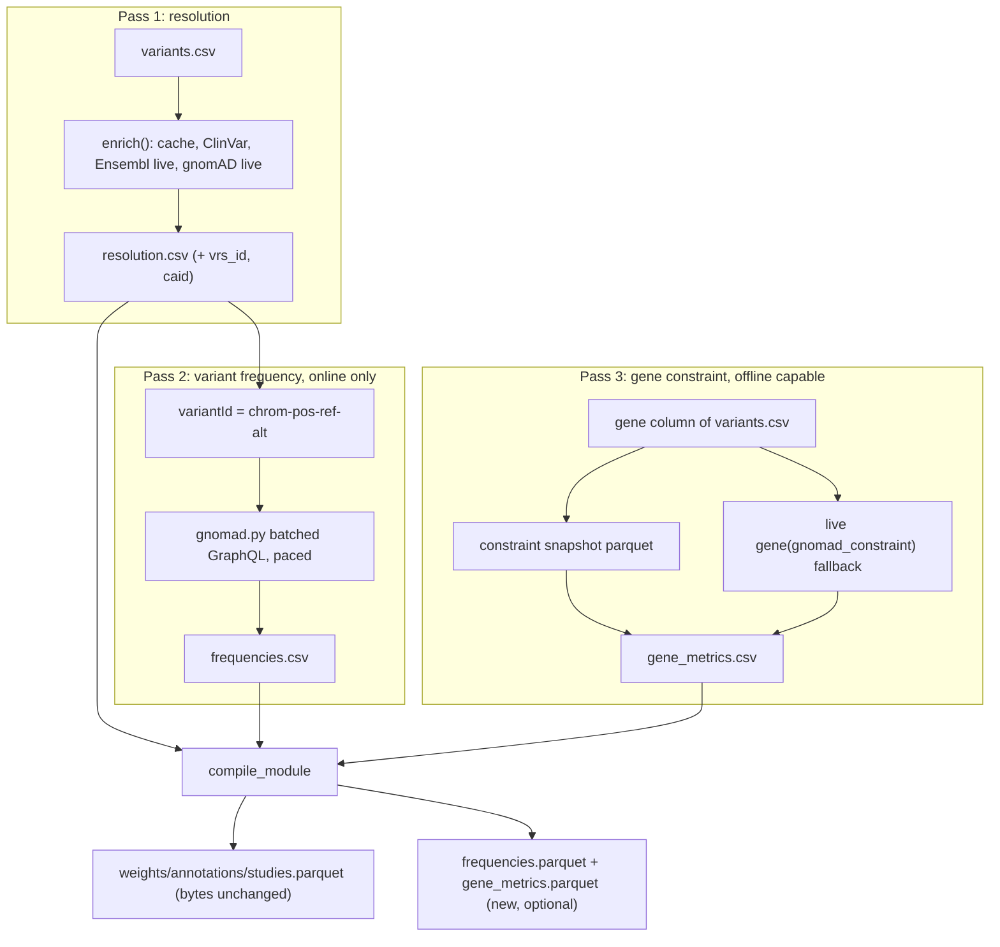

# gnomAD 4.1 in the enricher: frequency, gene constraint, and VRS identity

## What this is

gnomAD enters in three roles, deliberately different in kind:

- **Resolution link (no schema change).** A live gnomAD link appended to the resolver chain, after live Ensembl, stamping `source="gnomad"`. Same pattern as the ClinVar link, same reason for going last. It also captures the VRS id and CAID the API hands back for free.
- **Frequency annotation (variant-level).** A pass that consumes the coordinates in `resolution.csv` and writes `frequencies.csv`: one row per (allele, ancestry group) carrying AC/AN. Closes the `allele_frequency` gap held open at [docs/ROADMAP.md](docs/ROADMAP.md) line 153.
- **Gene constraint (gene-level).** A pass over the module's gene set writing `gene_metrics.csv`: pLI, LOEUF, missense Z and friends. Unlike frequency, this one is small enough to ship **offline** as a snapshot, so it gets the ClinVar treatment (a `[dev]` builder plus a cached snapshot) with the live API as fallback.

Each sidecar is injected, machine-produced, human-overridable, and compiled into its own optional parquet. The three-parquet SNP core is untouched throughout.



## Findings that constrain the design (probed live, not assumed)

- **Rate limit: 10 requests per IP per 60 seconds** (stated on the gnomAD downloads page). A per-variant request is unusable; batching is mandatory. Aliased batches of 20 and 25 `variant(...)` fields in one POST both succeeded; 29 returned `HTTP 400`. So: batch **20** per request, pace at one request per 6 seconds, giving roughly 200 variants/minute.
- **Partial failures do not sink a batch.** A 20-alias batch returned `resolved=17, errors=3`: GraphQL puts per-alias errors in `errors[]` and still returns `data` for the rest. The client must read both, never treat a non-empty `errors[]` as total failure.
- **gnomAD cannot resolve a multi-allelic rsID.** `variant(rsid: "rs334")` returns only `"Multiple variants found, query using variant ID to select one."`; same for `rs11591147`. Single-record rsIDs work (`rs1801133` to `1-11796321-G-A`). `variant_search(query: "rs334")` returns both `11-5227002-T-A` and `11-5227002-T-G`, so that is the fallback for the resolver link. For the frequency pass the problem disappears: it keys on the already-resolved `chrom-pos-ref-alt`.
- **Per-population `af` is not exposed.** Introspection gives `VariantPopulation { id ac an homozygote_count hemizygote_count ac_hom ac_hemi }`, no `af`. Frequency is AC/AN, computed by us. Top-level `exome.af`/`genome.af` do exist and serve as a cross-check in tests.
- **The population list needs filtering, not passing through.** For `11-5227002-T-A`, `joint.populations` returned the ten v4 ancestry groups plus `_XX`/`_XY` sex splits, a bare `""` id equal to the top-level joint AC/AN, and `XX`/`XY` **listed twice**. Sex is a second axis, so the first pass keeps ancestry groups only (mapping `""` to `global`) and imposes an explicit order. Preserving server order would violate the determinism rule.
- **`faf95` is a single value with a named owner:** `joint { faf95 { popmax popmax_population } }` gave `0.0482` / `afr`. It maps onto the row for that group, so no extra column and no overloaded field.
- **No offline snapshot is feasible for frequency.** v4.1 sites VCFs are 58.3 GB (exomes) and 742 GB (genomes). For frequency, gnomAD is the first **online-only** link in the chain. Once `frequencies.csv` is written it is the pin, so offline recompiles stay reproducible.
- **Ensembl REST is not a substitute.** `rest.ensembl.org/variation/human/rs334?pops=1` does return `gnomADe:*`/`gnomADg:*` frequencies, but from an older release (AFR 0.0569 there against 0.0495 in v4 joint). Using it would misstate provenance, so it stays out.

### Gene constraint

- **The live route is complete and cheap.** `gene(gene_symbol:, reference_genome: GRCh38) { gnomad_constraint { ... } }` returns `exp/obs/oe` for lof, mis and syn, `oe_lof_lower/upper` (LOEUF is `oe_lof_upper`), `oe_lof_percentile`, `lof_z/mis_z/syn_z`, `pli`, and `flags`. Verified against BRCA1 (`pli` 5.5e-38, `oe_lof_upper` 0.928, `oe_lof_percentile` 37) and MYH7 (`oe_lof_upper` 0.662, `mis_z` 7.38). A module has tens of genes at most, so this is one or two batched requests.
- **The bulk file is 95.5 MB, not 4.2 MB, and the path is `release/4.1/`, not `release/v4.1/`.** `https://storage.googleapis.com/gcp-public-data--gnomad/release/4.1/constraint/gnomad.v4.1.constraint_metrics.tsv` returns HTTP 200, `content-length: 95546041`, last modified 2024-04-18. (The 4.2 MB figure circulating on dataset-aggregator pages is from an explicitly illustrative demo listing; my first two guessed URLs 404'd, and anonymous bucket listing is disabled on both the GCS and S3 mirrors, so the path came from the UCSC track makedoc and was then verified directly.) Filtered to gene-level rows and a curated column subset it lands in single-digit MB as parquet, which is why offline is viable here and not for frequency.
- **The TSV needs an explicit row-selection rule or the pick is nondeterministic.** It is per-transcript, 55 columns, and mixes RefSeq with Ensembl: A1BG appears as `NM_130786.4` with `gene_id` `1` (an NCBI id, `level` `NA`) **and** as `ENST00000263100` with `gene_id` `ENSG00000121410` (`level` `2`), and **both rows carry `mane_select=true`**. So a naive "first mane_select row wins" gives whichever the file happens to list first. The rule is `mane_select == true` **and** an `ENSG`-shaped `gene_id`, falling back to `canonical == true` on ENSG, else the gene is recorded as unresolved. This is the same MANE-Select canonicalization the identity note asks for, and it is load-bearing for reproducibility, not cosmetic.
- Columns worth carrying: `lof.pLI`, `lof.oe`, `lof.oe_ci.lower`, `lof.oe_ci.upper`, `lof.z_score`, `mis.oe`, `mis.z_score`, `syn.z_score`, `lof.obs`/`lof.exp`, `constraint_flags`, plus `gene`, `gene_id`, `transcript`. The `lof_hc_lc.*` and `mis_pphen.*` families are left out of the first pass.

### GA4GH VRS and ClinGen CAID

These four bullets were rewritten after the VRS dependency and digest claims were **probed against the real `ga4gh.vrs` package**, not assumed. Two earlier assertions (id-instability across spec versions, and a seqrepo requirement for minting) did not survive the probe; the corrected findings drive the "mint, don't merely record" decision below.

- **gnomAD already emits both, and VRS ids round-trip as a lookup key.** `variant(variantId: "11-5227002-T-A")` returns `caid: "CA125138"` and `vrs { _id: "ga4gh:VA.JGrSjQEcYOJ14vlkvm7sIyYSgHfpC5UG", location { _id: "ga4gh:VSL.mX_186hGQYcTlpeYKOMR4wzdmXni4cMh", sequence_id }, state { sequence: "A" } }`. Querying back with `variant(vrsId: "ga4gh:VA.JGrSjQEcYOJ14vlkvm7sIyYSgHfpC5UG")` returns `11-5227002-T-A` / `rs334` / `CA125138`. Same for MTHFR `1-11796321-G-A` (`ga4gh:VA.SOEVGpU16hxYQtJNeRyfq0V-B0rSOGK-`, `CA170990`).
- **The allele (`VA.`) id is stable across VRS 1.x and 2.0; only the *location* id changes.** The earlier draft claimed "the same allele has different VRS ids under 1.x and 2.0." That is false at the allele level and the correction matters. gnomAD's 1.x `VSL.` location becomes a 2.0 `SL.` location with a different digest, but the **top-level `VA.` allele digest is identical** — because the allele is serialized over the location's *content* (refget accession + interbase interval), not the location's id string, and for a substitution that content is spec-version-invariant. Probed directly: `ga4gh.vrs` 2.3.3 computes `ga4gh:VA.JGrSjQEcYOJ14vlkvm7sIyYSgHfpC5UG` for `11-5227002-T-A`, **byte-identical to the id gnomAD's (1.x-shaped) API returns**, with only the location differing (`SL.GyWU…` vs `VSL.mX_18…`). So a `vrs_id` on the allele is a *stable* fact; `vrs_spec` is still stored, but to disambiguate any embedded location id, not because the allele id drifts. (Indels are the exception — see the normalization caveat below.)
- **Minting needs no `seqrepo`; the identification algorithm is stdlib-reproducible.** The earlier "computing it needs `seqrepo`/`biocommons.hgvs`, heavyweight even for the enricher" was the load-bearing objection to minting, and it is wrong for the identification step. Probed footprint: core `ga4gh.vrs` resolves to **14 packages, ~2–3 MB marginal** (pydantic is already ours; no compiled deps); `seqrepo`/`hgvs`/`pysam` live behind the **`[extras]`** marker, which balloons the tree to 47 packages (compiled `pysam`, a multi-GB sequence store, even a full `ipython` stack). And the `VA.` digest is `sha512t24u` over a compact canonical JSON — **reproduced exactly with ~15 lines of pure stdlib** (`hashlib`+`base64`+`json`, no `requests`, no `ga4gh.vrs`), matching gnomAD's id at ~34k ids/sec. So minting is cheap, the coverage hole closes (ClinVar/Ensembl-only variants get a locally-minted id agreeing with gnomAD), and a *validation* pass can run in the compiler tier dep-free. Recording is free; computing turns out to be nearly free too.
- **The one real cost boundary is indel normalization, not identification.** `ga4gh_identify` needs no sequence access; VRS *normalization* (full left/right justification of indels) does — probed: `normalize(data_proxy=None)` raises. For **substitutions this is a no-op**, so their ids are interoperable offline. For **indels** an interoperable id requires normalization against the reference sequence → the `[extras]` (`seqrepo`/`pysam`) path. That path is admitted **only into `enricher[dev]`** (a build-time tool beside `polars`), never the runtime resolver and never format/compiler. gnomAD's own left-alignment and the ClinVar builder's split-and-ACGT-filter already normalize most inputs; the extras path makes indel VAs fully interoperable so the identity is complete, not SNV-only.

## Schema tier: new modules, no new authored field on `VariantRow`

(`VariantRow`'s *authored* surface is unchanged — no new column a human writes. What does change, in the 0.5.0 identity switch below, is how its already-derived, frozen `variant_key` is computed. That is a compiler-managed field, so the DSL and the author are untouched.)

**New `schema/src/just_dna_format/frequency.py`**, modelled on [schema/src/just_dna_format/resolution.py](schema/src/just_dna_format/resolution.py): a standalone `BaseModel` with `extra="forbid"`, deliberately **not** an `AuthoredModel`, because a frequency is a machine-produced reference fact, not an authored annotation (exactly the reasoning already written into `ResolutionRow`'s docstring).

```python
class FrequencyRow(BaseModel):
    variant_key: str          # coordinate-derived key, so it matches post-expansion weights rows
    rsid: Optional[str]
    chrom: Optional[str]; start: Optional[int]; ref: Optional[str]
    alt: Optional[str]        # ONE alt, not resolution.csv's comma-joined `alts`
    population: str           # ancestry group, or "global"
    allele_count: Optional[int]      # AC
    allele_number: Optional[int]     # AN
    homozygote_count: Optional[int]
    faf95: Optional[float]           # only on the popmax group's row
    dataset: str                     # "gnomad_v4.1_joint" — a FACT, not provenance
    source: Optional[str]; status: Optional[str]; fetched_at: Optional[str]  # provenance
```

- `allele_frequency` is a **derived property** (`allele_count / allele_number`), not a stored column. Integers round-trip exactly; a stored float invites CSV formatting drift, which is a P7 idempotency hazard. The parquet materializes it as a real `Float64` so consumers do no arithmetic. `faf95` is the one unavoidable stored float and needs a canonical string format plus a round-trip test.
- `FREQUENCY_FACT_FIELDS` = everything except `source`/`status`/`fetched_at`. `dataset` is inside the set on purpose: a v4.1 number and a v2.1.1 number are different facts.
- `variant_key` is the **coordinate-derived** key (`derive_variant_key(None, chrom, start, ref, alts)`), because a one-to-many rsID is re-keyed on expansion in [compiler/src/just_dna_compiler/resolution.py](compiler/src/just_dna_compiler/resolution.py); an authored-rsid key would fail to line up. The table is standalone anyway, so the compiler does no join, just a coordinate cross-check with a warning.

**Edited [schema/src/just_dna_format/vocab.py](schema/src/just_dna_format/vocab.py):** `RECOMMENDED_ANCESTRY_GROUPS` seeded with gnomAD v4's `afr, ami, amr, asj, eas, fin, mid, nfe, sas, remaining` plus `global`, and `_POPULATION_ORDER` for deterministic emission. Recommended as an **open, seeded** vocabulary in the `RECOMMENDED_AUTHOR_KINDS` idiom rather than a closed `frozenset`, because the table must stay source-independent and TOPMed/ALFA/1000G bring their own labels; `dataset` is what makes a label interpretable. It must **not** reuse `VALID_TRAINING_ANCESTRY` from [schema/src/just_dna_format/pgs.py](schema/src/just_dna_format/pgs.py): those are 1000G superpopulations for PGS calibration, a different axis, and merging them would be the `state` overloading mistake again.

**Edited [schema/src/just_dna_format/integrity.py](schema/src/just_dna_format/integrity.py):** factor the body of `resolution_signature` into a shared fact-hash helper and add `frequency_signature`, keeping both named wrappers. Same rationale as before: a multi-producer table is hashed by facts, not bytes, and stays out of `manifest.inputs`.

**New `schema/src/just_dna_format/gene_metrics.py`** — the gene-level sibling, same standalone-derived-fact shape:

```python
class GeneMetricsRow(BaseModel):
    gene: str                      # HGNC-style symbol, as authored in VariantRow.gene
    gene_id: Optional[str]         # ENSG… — the stable identity behind the mutable symbol
    transcript: Optional[str]      # ENST… the metrics were computed on
    mane_select: Optional[bool]    # whether that transcript is MANE Select
    pli: Optional[float]
    loeuf: Optional[float]         # lof.oe_ci.upper — named for what people call it
    oe_lof: Optional[float]; oe_lof_lower: Optional[float]
    lof_z: Optional[float]; mis_z: Optional[float]; syn_z: Optional[float]
    oe_mis: Optional[float]
    obs_lof: Optional[int]; exp_lof: Optional[float]
    constraint_flags: Optional[str]  # gnomAD's own caveat list, kept verbatim
    dataset: str                     # "gnomad_v4.1_constraint" — a FACT
    source: Optional[str]; status: Optional[str]; fetched_at: Optional[str]  # provenance
```

- Keyed on `gene`, with `gene_id` carried because symbols are aliases that move while ENSG ids do not. The compiler cross-checks the table's genes against the `gene` column of `variants.csv` and warns on a gene the module never mentions.
- `loeuf` is stored under that name rather than `oe_lof_upper`. It is the number clinical readers ask for by name, and the DSL is for humans; `oe_lof` and `oe_lof_lower` sit beside it so the interval is not lost.
- These are floats by nature, unlike AC/AN, so the canonical-formatting-plus-round-trip-test discipline applies to the whole row rather than just `faf95`.

**New `schema/src/just_dna_format/vrs.py` — `derive_vrs_allele_id()`, stdlib-only, the sibling of `derive_variant_key`:** a pure function `(chrom, start, ref, alt, *, build="GRCh38") -> str | None` that returns the `ga4gh:VA.…` allele id for a resolved substitution, computed with `hashlib`+`base64`+`json` (`sha512t24u` over the canonical VRS-2.0 allele serialization) — **no `ga4gh.vrs`, no `requests`, no new dependency in the format tier** (it stays pydantic + cryptography; these are stdlib). It returns `None` for an unresolved (no-coordinate) row and for an indel/MNV, which the format tier cannot normalize offline — those ids are minted upstream in the enricher (below) and passed through, exactly as gnomAD's `variantId` is. Beside it, a small **static `chrom→refget-accession` table** (`REFGET_GRCh38`, the 24 primary contigs + MT), sourced authoritatively from seqrepo's alias metadata and committed as a constant, with an `@integration` test that re-derives it from the public seqrepo REST so a wrong digest can never silently ship (one was caught by hand during the probe). The table is per-build by construction: a refget accession *is* the identity of that build's sequence, so GRCh38 and GRCh37 mint distinct, correctly non-colliding VAs — see the RM15 note below.

**Edited [schema/src/just_dna_format/resolution.py](schema/src/just_dna_format/resolution.py) — VRS and CAID columns, minted not merely recorded:** three optional columns, `vrs_id` (`ga4gh:VA.…`), `vrs_spec` (`"2.0"`), and `caid` (`CA\d+`), with grammar validators. They are populated for **every coordinate-resolved row regardless of source** — locally minted by `derive_vrs_allele_id` for substitutions, minted with normalization in the enricher for indels, and cross-checked against gnomAD's own `vrs._id` where gnomAD knows the variant (the probe confirmed they agree). They stay **out of `RESOLUTION_FACT_FIELDS` this cycle** so no existing `resolution_signature` moves while the columns bed in; the identity switch below is what makes `vrs_id` load-bearing, and it is deliberately a separate, digest-moving step.

**The identity switch — `variant_key` derives from the VA, landing in the current 0.5.0 dev line, pre-publication.** This was decided against the version reality: **0.4 is the published line** (real modules, frozen digests) and is untouched; **0.5.0 was never released**, so it is still the unpublished, in-progress version and the identity change lands there directly — **no extra version bump**, it rides the same 0.5.0 digest re-baseline the alt-carrying `variant_key` change already rode. Why this is legal *now* and did not have to wait for 1.0: `variant_key` is **derived and frozen, never authored** (`_COMPILER_MANAGED_FIELDS`), so changing its derivation touches **no authored schema, no DSL, and no human author** — the human-authorability gate is untouched. It is "major-only" for exactly one reason, that `variant_key` is a column in `weights.parquet`/`annotations.parquet` and so lives in `artifact.digest` (Principles 3/8) — and that gate is *publication*, not the version number. Doing it before any 0.5.0 module ships costs one re-baseline and breaks no published artifact. A resolved substitution keys on its VA; an indel keys on its enricher-minted (normalized) VA; an **unresolved** row (rsid-only or position-only, pre-resolution) has no VA and keeps the current `derive_variant_key` fallback — so VRS-as-primary makes coordinate resolution the *precondition* of a content-addressed identity, not a hard requirement for every row.

**Why this satisfies RM15 rather than violating it.** [docs/ROADMAP.md](docs/ROADMAP.md) parks coordinate-first identity because a bare `chrom:start:ref` is **build-ambiguous** — it "bakes GRCh38 into `variant_key`" — and states it "becomes reconsiderable only once identity can name its build." A VRS VA **names its build**: the refget accession is the exact reference sequence's identity, so different builds mint different, non-colliding VAs. VRS is therefore the identity RM15 was waiting for, not another entry on the parked pile. GRCh38-only minting ships now (matching the current implicit-GRCh38 reality, pinned by `compiler_version`), and RM15's multi-build generalization extends the refget table — the same "GRCh38-now, multi-build-later" split RM15 already applies to one-to-many expansion. The 1.0 tracker's "coordinate-first identity (option C)" row is updated to point here.

**Edited [schema/src/just_dna_format/manifest.py](schema/src/just_dna_format/manifest.py):** new `Frequency` and `GeneMetrics` blocks (`signature`, `sources`, `datasets`, `row_count`, plus `populations` on the former) beside `Resolution`, out of `artifact.digest`. Separate blocks rather than extra fields on `Resolution`, which is about rsID/coordinate resolution only.

## Enricher tier

**New `enricher/src/just_dna_enricher/gnomad.py`** (core, `httpx` + `tenacity`, mirroring [enricher/src/just_dna_enricher/ensembl.py](enricher/src/just_dna_enricher/ensembl.py)):
- `GnomadSettings`: endpoint `https://gnomad.broadinstitute.org/api`, `dataset="gnomad_r4"`, `frequency_set="joint"`, `batch_size=20`, `min_request_interval=6.0`, `timeout`.
- A small pacing gate on a monotonic clock enforcing the 10-per-minute budget. `tenacity` retries transport errors and timeouts, and treats **429** as retryable with `wait_exponential_jitter`; blind retries would burn the same budget, so pacing comes first and retry second.
- `resolve_rsids(rsids) -> dict[str, list[dict]]` for the chain: batched `variant(rsid:)`, and on the exact `"Multiple variants found"` message fall back to `variant_search(query:)` and expand to one locus per allele, with `alts` aggregated in sorted order.
- `fetch_frequencies(variant_ids) -> dict[str, list[dict]]` for the frequency pass: batched `variant(variantId:)` pulling `joint { ac an homozygote_count faf95 { popmax popmax_population } populations { id ac an homozygote_count } }` plus `caid` and `vrs { _id }`, dropping `*_XX`/`*_XY` and deduplicating, mapping `""` to `global`.
- `fetch_gene_constraint(symbols) -> dict[str, dict]` for the gene pass: batched `gene(gene_symbol:, reference_genome: GRCh38) { gene_id symbol mane_select_transcript { ensembl_id } gnomad_constraint { … } }`.

**New `enricher/src/just_dna_enricher/frequencies.py`**, structured like [enricher/src/just_dna_enricher/enrich.py](enricher/src/just_dna_enricher/enrich.py): `enrich_frequencies(spec_dir, *, mode, offline, populations, dataset, write, client) -> FrequencyResult`. Existing/human rows in `frequencies.csv` are authoritative and never clobbered; rows are written sorted by `(variant_key, alt, population_order)`; `strict` raises when a resolved variant gets no frequency, `best_effort` records `status="not_found"`; `offline` makes it a no-op with a warning and zero egress.

**New `enricher/src/just_dna_enricher/gene_metrics.py`** (core): `enrich_gene_metrics(spec_dir, *, mode, offline, constraint_cache, write, client) -> GeneMetricsResult`. Gene set comes from the `gene` column of `variants.csv` (deduplicated in first-occurrence order). Snapshot first, live API second, mirroring how ClinVar sits ahead of live Ensembl, so `--offline` still produces a full table when the snapshot is provisioned. This is the one gnomAD pass that works with zero egress.

**New `enricher/src/just_dna_enricher/constraint_build.py`** (`[dev]`, guarded `polars`, modelled directly on [enricher/src/just_dna_enricher/clinvar_build.py](enricher/src/just_dna_enricher/clinvar_build.py)):
- `download_constraint_tsv(dest, url=...)` — the same streaming `httpx` download with `.part` rename and sha256-while-streaming that `download_clinvar_vcf` uses.
- `build_snapshot(tsv, out_dir)` — stream the 95.5 MB TSV, apply the MANE-Select-on-ENSG selection rule, keep the curated columns, sort by `gene` and write a single `data/gnomad_constraint.parquet` plus a `release.json` recording `source_url`, `source_sha256`, `gene_count`, `builder_version`. Byte-reproducible across rebuilds, same as the ClinVar builder.

**Edited [enricher/src/just_dna_enricher/locations.py](enricher/src/just_dna_enricher/locations.py) / [download.py](enricher/src/just_dna_enricher/download.py) / [upload.py](enricher/src/just_dna_enricher/upload.py):** a third snapshot alongside Ensembl and ClinVar — `CONSTRAINT_SUBDIR`, `default_constraint_cache_dir()`, `resolve_constraint_reference()` on the same precedence ladder, `ensure_constraint_snapshot()` through the existing `_provision_snapshot` body, and `publish_reference_snapshot` reused as-is since the layout matches. The plumbing already generalized to two snapshots when ClinVar landed, so the third is parameterization rather than new machinery.

**Edited [enricher/src/just_dna_enricher/enrich.py](enricher/src/just_dna_enricher/enrich.py):** a fourth chain block after live Ensembl, filling only what everything else missed. It goes **last** for the same reason ClinVar goes after the Ensembl cache: `alts` is in `RESOLUTION_FACT_FIELDS`, so whichever link wins moves `weights.parquet` bytes, and gnomAD reports only alleles observed in gnomAD rather than every dbSNP allele. Last place means no already-compiled module's digest can move. This gets its own test.

**New `enricher/src/just_dna_enricher/vrs.py` (VRS minting, straddling core and `[dev]`):** `mint_vrs(rows) -> None` stamps `vrs_id`/`vrs_spec="2.0"` onto resolved `resolution.csv` rows. Substitutions mint via the format tier's stdlib `derive_vrs_allele_id` (zero egress, zero heavy dep). Indels/MNVs mint via a **guarded `try/except ImportError` on `ga4gh.vrs`** (the one sanctioned inline-import exception): with the `[dev]` extras present it normalizes against `seqrepo` and mints the fully-justified VA; without them it leaves `vrs_id` null and logs, so the core install stays light and a non-dev run simply carries no indel ids. Where gnomAD returned its own `vrs._id`, that is compared to the minted value as a provenance cross-check, never overwriting it. The **source-parquet back-fill** — writing minted VAs into the ClinVar/Ensembl snapshot parquets so a variant only those sources know still carries an id — lives here too, gated on the extras for indels.

**Edited [enricher/src/just_dna_enricher/cli.py](enricher/src/just_dna_enricher/cli.py):** a `frequencies` command (`--dataset`, `--populations`, `--strict/--best-effort`, `--offline`) and a `gene-metrics` command (`--constraint-cache`, `--offline`); a `gnomad constraint build|publish` sub-app in the shape of the existing `clinvar` one; a `vrs mint` command (substitutions always; indels when the `[dev]` extras are installed); `--gnomad/--no-gnomad` on `enrich`; and `--frequencies` / `--gene-metrics` on `enrich-and-compile` so one command produces every sidecar and compiles.

## Compiler tier

**Edited [compiler/src/just_dna_compiler/compiler.py](compiler/src/just_dna_compiler/compiler.py):**
- Load `frequencies.csv` and `gene_metrics.csv` where `resolution.csv` is loaded today (near line 807), via the same `_load_csv_rows`.
- Materialize `frequencies.parquet` (`module, variant_key, rsid, chrom, start, ref, alt, population, allele_count, allele_number, allele_frequency, homozygote_count, faf95, dataset`) and `gene_metrics.parquet` (`module` plus the `GeneMetricsRow` columns), both added to `_OUTPUT_FILES` but **not** to `_INPUT_FILES` (fact-hashed, like `resolution.csv`).
- Record the manifest `Frequency` and `GeneMetrics` blocks; warn when a frequency coordinate matches no resolved variant, or when a gene-metrics row names a gene the module never mentions.
- `reverse_module` emits both CSVs back, dropping the recomputable `allele_frequency` column.
- **Identity switch + VRS verify (0.5.0):** derive `variant_key` from the VA for resolved substitutions and enricher-minted indels, keeping the `derive_variant_key` fallback for unresolved rows — using the format tier's stdlib helper, so the compiler gains **no dependency**. A dep-free **verify pass** recomputes the VA for any row carrying a `vrs_id` and hard-fails a substitution mismatch (deterministic) / warns an indel mismatch (proxy-version-dependent) — the data-integrity check the whole minting story earns. This is the one intended `artifact.digest` move, re-baselined within the unpublished 0.5.0 line.

Deliberately **not** registered in `_TABLE_KINDS`: those are authored DSL tables with `AuthoredModel` semantics, the reserved-namespace guard, duplicate-key checks, and raw-byte input hashing. A derived reference-fact table is a third category and mixing them would blur the line the 0.5 rework just drew.

## Charter check

- **P2 (inject-only):** all fetching stays in the enricher; the compiler reads files. Frequency being online-only does not change that, since the sidecar is the pin; gene constraint is additionally fully offline once its snapshot is provisioned.
- **Goal 2 (tiers):** the format and compiler tiers gain **no dependency** — `derive_vrs_allele_id` and the compiler's verify pass are stdlib (`hashlib`/`base64`/`json`), and the runtime resolver mints substitutions the same way. The enricher's **`[dev]` extra** gains `ga4gh.vrs[extras]` (`seqrepo`/`pysam`/`hgvs`) purely as a **build-time indel-normalization tool**, beside the `polars` already there — never imported on the runtime resolver path, never in format/compiler. This is the deliberate, scoped line the probe drew: identification is stdlib-cheap and universal; normalization is heavy and enricher-`[dev]`-only.
- **P3/P8 (additive) — with one deliberate, legal exception.** The frequency/gene-metrics sidecars and the VRS/CAID columns are additive: optional, outside the fact sets, so no existing `resolution_signature` moves and a module without them compiles byte-identically (an explicit test). The **identity switch is the one intended digest move** — `variant_key`'s derivation changes, so `weights.parquet`/`annotations.parquet` bytes and every `artifact.digest` change. That is major-only under P3/P8 *for a published line*, and it is done precisely where the charter permits it: **while 0.5.0 is unpublished the digest is not yet frozen** (the exemption 0.5.0 already used for the alt-carrying key). 0.4 — the published line — is untouched.
- **Digest:** the new parquets enter `artifact.digest` only for modules that carry them (correct — different content, different identity). The three-parquet **core is touched once, on purpose**, by the identity switch, and re-baselined within the unpublished 0.5.0 line so no published artifact moves. Doing both while the line is unreleased is the cheap moment.
- **P5 (orthogonal axes):** ancestry group, sex, and dataset stay separate, with sex-stratified counts dropped rather than folded into `population`. Variant-level and gene-level facts get separate tables rather than gene metrics repeated on every variant row. VRS id, CAID, and rsid are three cross-references, each its own column, not one overloaded identifier field.
- **P6:** vocabulary as `frozenset` plus validator, no `Enum`/`Literal`.
- **P7:** integer-only stored counts where the source gives integers, explicit population ordering, the deterministic MANE-on-ENSG pick instead of first-row-wins, deterministic sorts, and reverse/recompile round-trip tests.
- **Human-authorable gate:** the human DSL gains nothing to author. `variants.csv` stays as legible as it is; `--populations global` keeps the frequency table to one row per allele; `loeuf` is named the way a reader names it.

## Tests (`enricher/tests/`, `compiler/tests/`, `schema/tests/`)

Fixtures are **real recorded gnomAD payloads** committed under `assets/` (the `rs334` two-allele case, the multi-allele rsID error, a 20-alias batch with partial errors, the BRCA1/MYH7 gene-constraint responses), replayed through `httpx.MockTransport` as the existing Ensembl tests do, plus a small real slice of the constraint TSV including the A1BG double-`mane_select` case, cut the way `assets/clinvar_GRCh38_slice.vcf.gz` was.

- Batching and pacing: N variants produce `ceil(N/20)` requests; the pacing gate honours the interval against an injected clock, without real sleeping.
- Partial-error resilience: a batch with one `"Multiple variants found"` error still yields every other row.
- Ground truth from the payload itself: computed `AC/AN` matches the response's own top-level `exome.af`/`genome.af`; `faf95` lands on the `afr` row for `11-5227002-T-A`.
- Determinism: two runs write byte-identical `frequencies.csv`; the duplicated `XX`/`XY` entries are filtered; population order is pinned.
- Digest safety: the same spec compiled with and without `frequencies.csv` yields identical `weights/annotations/studies.parquet` bytes; and compile to reverse to compile round-trips the table losslessly.
- Chain order: a variant known to both the Ensembl cache and gnomAD keeps `source="cache"` and Ensembl's `alts`.
- **The MANE pick, on the real A1BG rows:** the RefSeq `NM_130786.4` row and the Ensembl `ENST00000263100` row both say `mane_select=true`, and the builder must pick the ENSG one whichever order they appear in. Feed the slice in both orders and assert the same output, which is the test the naive implementation fails.
- Gene metrics agree across routes: the snapshot-built row for BRCA1 matches the live API's `gnomad_constraint` for the same gene within float tolerance, the cross-source check that catches a column-mapping slip.
- Constraint snapshot rebuild is byte-identical (P7), `release.json`'s `built_at` excluded.
- `--offline` performs zero network calls (the existing assertion style in `test_enrich.py`), and gene metrics still fill from a provisioned snapshot while frequency degrades to a warning.
- VRS minting (stdlib, no `ga4gh.vrs` in the format/compiler test env): `derive_vrs_allele_id("11", 5227002, "T", "A")` == `ga4gh:VA.JGrSjQEcYOJ14vlkvm7sIyYSgHfpC5UG`, the exact id gnomAD returns and the id `ga4gh.vrs` 2.3.3 computes — asserted against a small committed table of `(coord → VA)` ground-truth pairs, not a single case. The stdlib helper and the library must agree (an `@integration` cross-check where `ga4gh.vrs` is installed). The `REFGET_GRCh38` table re-derives from seqrepo REST (`@integration`), catching a wrong digest before it ships.
- VRS normalization (`@integration`, `enricher[dev]` extras present): a left-shiftable indel mints the **same** VA whichever equivalent representation is fed in, proving normalization actually runs; a substitution's stdlib id equals the extras-path id.
- VRS round-trips through gnomAD: `vrs_id` for `11-5227002-T-A` round-trips through `variant(vrsId:)` back to the same variant and CAID; the `ga4gh:` and `CA\d+` validators reject malformed values; adding the columns leaves `resolution_signature` unchanged for an existing fixture table.
- Identity switch (compiler/schema): with the switch on, a resolved substitution's `variant_key` equals its VA; an unresolved rsid-/position-only row keeps the `derive_variant_key` fallback (an explicit both-branches test). The compiler verify pass **hard-fails** a tampered `vrs_id` on a substitution and **warns** on an indel mismatch. Demonstrate the digest re-baseline is deterministic: two compiles of the same VA-keyed spec are byte-identical (P7), and 0.4-era fixtures are read without re-keying (the switch is 0.5.0-forward).
- `@pytest.mark.integration`: one live batched request covering `rs1801133` plus `11-5227002-T-A` plus BRCA1 constraint, asserting agreement with the fixtures within tolerance and staying inside the rate limit.

## Docs, in design-cycle order

[docs/USE_CASES.md](docs/USE_CASES.md) (what the missing numbers actually block: offline carrier-frequency context, reproducing an ACMG BA1/BS1 filter against the AF the curator saw, out-of-ancestry caveats, and gene-level triage on a cardio or cancer panel where LOEUF separates a haploinsufficient gene from a tolerant one), then [docs/PROPOSAL_0_5.md](docs/PROPOSAL_0_5.md) (the design threads plus the open questions below and the VRS decision recorded with its reasoning), then [docs/SCHEMAS.md](docs/SCHEMAS.md), [docs/COMPILER.md](docs/COMPILER.md) coverage, [docs/ENRICHER.md](docs/ENRICHER.md) (module map, the fourth link, the two new passes, the three snapshots, rate limits), [docs/CHANGELOG.md](docs/CHANGELOG.md), and [docs/ROADMAP.md](docs/ROADMAP.md) (retire the `allele_frequency` / `af_population` planned-axis bullet in favour of the table; **rewrite the 1.0 "coordinate-first identity" row and the RM15 parking note** — VRS-as-identity is no longer parked, it ships GRCh38-only in 0.5.0 as the build-naming identity RM15's condition allows, with multi-build minting the remaining RM15 extension; add the HGVS-generation deferral; park the frequency-slice snapshot).

## The normalization layer: what this now takes on, and what it still defers

The identity note this grew out of asks for four things. The probe moved the split — VRS minting and indel normalization are now **in**, because the identification step is stdlib-cheap and the normalization dependency is admissible in `enricher[dev]`. What remains out is a tier/scope question, not a preference:

- **VRS ids: in, and minted (not merely recorded).** Substitutions mint from a stdlib helper in the format tier; indels mint with normalization in `enricher[dev]`; gnomAD's own ids are a cross-check, not the source of truth. This is the identity `variant_key` becomes in 0.5.0.
- **Indel normalization (`seqrepo`/`pysam` via `ga4gh.vrs[extras]`): in, but `enricher[dev]` only.** It is a build-time normalization tool, never on the runtime resolver path and never in format/compiler. This is the piece the earlier draft deferred as "heavyweight even for the enricher"; the probe showed it is heavy but cleanly quarantinable to the dev extra, and completeness (indels in the primary key) makes it worth taking.
- **MANE Select canonicalization: in**, but only as far as this work needs it. The gene-metrics builder must pick the MANE Select Ensembl row or its output is nondeterministic, and `mane_select_transcript` is captured. MANE-anchored **consequence strings** are a different feature: `consequence` and `impact` are already documented as planned-but-unbuilt axes in [docs/ROADMAP.md](docs/ROADMAP.md), and building them means picking a transcript per variant, not per gene.
- **`bcftools norm` left-alignment at ingest: still not here.** The `[extras]` normalization is pure-Python (`ga4gh.vrs` + `seqrepo`), so it does **not** reintroduce P1's no-external-execution problem the way shelling out to `bcftools` would. The sidecars stay one ALT per row; the ClinVar builder already splits multi-allelics and filters to ACGT; re-normalization of an upstream VCF stays with whoever produced it. What changes is that we now *verify* the normalization invariant by minting and comparing the VA, rather than only documenting it.
- **`biocommons.hgvs` HGVS-string generation: still deferred.** `ga4gh.vrs[extras]` pulls `hgvs` transitively, but HGVS *generation* as a feature (c./p. strings) is its own roadmap item with its own argument; taking the extras for indel normalization does not commit to shipping HGVS output.

The whole note still becomes a roadmap item so the genuinely deferred half (build-aware multi-build minting under RM15, HGVS generation) is tracked; this plan now takes the identity pieces outright rather than parking them.

## Open questions for review

1. **~~Release cut~~ — settled.** All of it lands in the current **0.5.0** dev line — no extra version bump: 0.4 is the published line (untouched), 0.5.0 was never released, so frequency, gene metrics, the VRS columns, *and* the `variant_key`→VA identity switch all ride 0.5.0's one-time pre-publication digest re-baseline. Adding parquet files and moving identity later is more expensive; the unpublished-digest window is the moment.
2. **Ancestry vocabulary:** open-and-seeded, as recommended above, or closed to gnomAD's ten groups plus `global`.
3. **`allele_frequency` in the CSV:** derived-only, as recommended, or stored alongside AC/AN for legibility at the cost of duplicating one fact in two columns.
4. **Constraint snapshot hosting.** The gene-level parquet should land in single-digit MB. Publish it to its own HF dataset repo like ClinVar (consistent, cache-shaped, needs provisioning), or commit it under `assets/` if it stays under the 5 MB Git LFS threshold (zero provisioning, but reference data inside the repo)? Recommendation: HF, for consistency with the two existing snapshots.
5. **~~VRS fact status~~ — settled to a staged answer.** VRS/CAID columns stay **out of the fact-sets in 0.5.0** (they bed in without moving any `resolution_signature`), while `variant_key` itself derives from the VA in the same release — so the identity moves once, deliberately, in the unpublished window, and the fact-sets move never (they don't need to; the key carries the identity). Promotion of `vrs_id` into `RESOLUTION_FACT_FIELDS` is no longer needed and is dropped as a question. Remaining open sub-question: whether the compiler's verify pass is **hard-fail** (a stored `vrs_id` that doesn't recompute aborts the compile) or **warn-only** — recommend hard-fail for substitutions (deterministic) and warn-only for indels (normalization can legitimately differ by proxy version).

## Adjacent observation (not part of this work)

The compiler's reverse writer at `_write_resolution_csv` lists `fieldnames` without `rsid_alternates`, while the enricher's writer includes it. Since it is provenance and outside `RESOLUTION_FACT_FIELDS`, no digest moves, but the `ambiguous` candidate list would not survive reverse to re-enrich. Worth a test to confirm before treating it as a finding.
